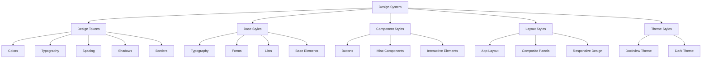
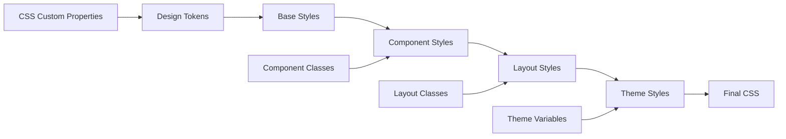

# Design System (`@teskooano/design-system`)

A comprehensive CSS-based design system providing shared styles, design tokens, and component styles for Teskooano applications. Features a cosmic dark theme with consistent spacing, typography, colors, and interactive components.

## 🎯 Purpose

The `@teskooano/design-system` package serves as the foundation for consistent visual design across all Teskooano applications. It provides a comprehensive set of CSS design tokens, base styles, component styles, and layout utilities that ensure visual consistency, accessibility, and maintainability across the entire application ecosystem.

## 🏗️ Architecture

The Design System follows a modular CSS architecture with token-based theming:



## 🚀 Core Features

### 1. Design Tokens

- **Color System**: Comprehensive color palette with semantic naming
- **Typography Scale**: Fluid typography with responsive font sizes
- **Spacing System**: Consistent spacing scale based on 4px units
- **Border Radius**: Consistent border radius values
- **Shadows**: Layered shadow system for depth
- **Transitions**: Standardized transition durations and timing

### 2. Component Styles

- **Button System**: Multiple button variants with consistent states
- **Form Elements**: Styled form inputs and controls
- **Typography**: Comprehensive heading and text styles
- **Interactive States**: Hover, focus, and active states

### 3. Layout System

- **App Layout**: Main application layout styles
- **Composite Panels**: Panel and container styling
- **Responsive Design**: Mobile-first responsive utilities

### 4. Theme Integration

- **Dockview Integration**: Custom Dockview theme with cosmic dark styling
- **Dark Theme**: Comprehensive dark theme implementation
- **CSS Custom Properties**: Token-based theming system

## 🔧 Key Components

### Design Tokens (`tokens.css`)

The foundation of the design system, providing CSS custom properties for all design decisions:

```css
:root {
  /* Color System */
  --color-background: #12121e; /* Deep Space Blue */
  --color-surface-1: #1a1a2e; /* Dark Navy */
  --color-primary: #6c63ff; /* Purple/Blue Accent */

  /* Typography */
  --font-family-base: Inter, system-ui, Avenir, Helvetica, Arial, sans-serif;
  --font-size-base: clamp(0.875rem, 0.5vw + 0.775rem, 1rem);

  /* Spacing */
  --space-unit: 0.25rem; /* 4px base unit */
  --spacing-md: var(--space-4); /* 16px */

  /* Borders */
  --radius-md: 0.5rem; /* 8px */
  --border-width-thin: 1px;
}
```

### Button System (`components/buttons.css`)

Comprehensive button styling with multiple variants:

```css
/* Base Button */
button {
  display: inline-flex;
  align-items: center;
  justify-content: center;
  padding: var(--space-2) var(--space-4);
  font-family: var(--font-family-base);
  border-radius: var(--radius-md);
  transition: all var(--transition-duration-fast) var(--transition-timing-base);
}

/* Button Variants */
.button-primary {
  background-color: var(--color-primary);
}
.button-secondary {
  background-color: var(--color-secondary);
}
.button-outline {
  background-color: transparent;
  border-color: var(--color-primary);
}
.button-ghost {
  background-color: transparent;
  border-color: transparent;
}

/* Button Sizes */
.button-sm {
  padding: var(--space-1) var(--space-2);
  font-size: var(--font-size-small);
}
.button-lg {
  padding: var(--space-3) var(--space-5);
  font-size: var(--font-size-large);
}
```

### Typography System (`base/typography.css`)

Consistent typography with semantic heading hierarchy:

```css
h1 {
  font-size: var(--font-size-6);
}
h2 {
  font-size: var(--font-size-5);
}
h3 {
  font-size: var(--font-size-4);
}
h4 {
  font-size: var(--font-size-3);
}
h5 {
  font-size: var(--font-size-2);
}
h6 {
  font-size: var(--font-size-1);
  text-transform: uppercase;
}

p {
  margin-bottom: var(--spacing-md);
  max-width: 65ch;
}
a {
  color: var(--color-primary);
  transition: color var(--transition-duration-fast);
}
```

## 🔄 Data Flow

The Design System follows a systematic data flow for style application:



### Processing Pipeline

1. **Design Tokens**: CSS custom properties define all design values
2. **Base Styles**: Foundation styles for HTML elements
3. **Component Styles**: Styled components with variants and states
4. **Layout Styles**: Application layout and responsive design
5. **Theme Styles**: Theme-specific overrides and integrations
6. **Final CSS**: Compiled stylesheet ready for application

## 📊 Technical Specifications

### CSS Architecture

```css
/* Token-based Design System */
:root {
  /* Color Tokens */
  --color-primary: #6c63ff;
  --color-primary-hover: #5a52e0;
  --color-primary-active: #4841c2;

  /* Typography Tokens */
  --font-family-base: Inter, system-ui, sans-serif;
  --font-size-base: clamp(0.875rem, 0.5vw + 0.775rem, 1rem);

  /* Spacing Tokens */
  --space-unit: 0.25rem;
  --spacing-md: calc(var(--space-unit) * 4);

  /* Border Tokens */
  --radius-md: 0.5rem;
  --border-width-thin: 1px;
}
```

### Component Structure

```css
/* Component Base */
.component {
  /* Base styles using design tokens */
  padding: var(--spacing-md);
  border-radius: var(--radius-md);
  background-color: var(--color-surface-1);
  color: var(--color-text-primary);
}

/* Component Variants */
.component--primary {
  background-color: var(--color-primary);
}
.component--secondary {
  background-color: var(--color-secondary);
}

/* Component States */
.component:hover {
  background-color: var(--color-surface-2);
}
.component:focus {
  box-shadow: 0 0 0 2px var(--color-primary);
}
```

## 💡 Usage Examples

### Basic Import

```typescript
// Import the complete design system
import "@teskooano/design-system";

// Or import specific parts
import "@teskooano/design-system/styles.css";
import "@teskooano/design-system/tokens.css";
```

### Using Design Tokens

```css
/* Custom component using design tokens */
.my-component {
  background-color: var(--color-surface-1);
  color: var(--color-text-primary);
  padding: var(--spacing-md);
  border-radius: var(--radius-md);
  border: var(--border-width-thin) solid var(--color-border-subtle);
  font-family: var(--font-family-base);
  font-size: var(--font-size-base);
  transition: all var(--transition-duration-fast) var(--transition-timing-base);
}

.my-component:hover {
  background-color: var(--color-surface-2);
  border-color: var(--color-border-strong);
}
```

### Button Usage

```html
<!-- Primary Button -->
<button class="button-primary">Primary Action</button>

<!-- Secondary Button -->
<button class="button-secondary">Secondary Action</button>

<!-- Outline Button -->
<button class="button-outline">Outline Action</button>

<!-- Ghost Button -->
<button class="button-ghost">Ghost Action</button>

<!-- Button Sizes -->
<button class="button-primary button-sm">Small</button>
<button class="button-primary">Default</button>
<button class="button-primary button-lg">Large</button>
```

### Typography Usage

```html
<!-- Heading Hierarchy -->
<h1>Main Heading</h1>
<h2>Section Heading</h2>
<h3>Subsection Heading</h3>

<!-- Body Text -->
<p>This is body text with consistent spacing and typography.</p>

<!-- Links -->
<a href="#">Styled link with hover effects</a>

<!-- Code -->
<code>Inline code with styling</code>
<pre>Code block with proper formatting</pre>
```

### Layout Usage

```html
<!-- App Layout -->
<div class="app-layout">
  <header class="app-header">Header Content</header>
  <main class="app-main">Main Content</main>
  <aside class="app-sidebar">Sidebar Content</aside>
</div>

<!-- Composite Panel -->
<div class="composite-panel">
  <div class="panel-header">Panel Header</div>
  <div class="panel-content">Panel Content</div>
</div>
```

## ⚡ Performance Considerations

### Efficiency

- **CSS Custom Properties**: Efficient token-based theming system
- **Modular Architecture**: Import only needed styles
- **Optimized Selectors**: Efficient CSS selectors for performance
- **Minimal Bundle Size**: Lightweight CSS-only implementation
- **No JavaScript**: Pure CSS implementation for maximum performance

### Quality Metrics

- **Consistency**: Standardized design tokens ensure visual consistency
- **Accessibility**: WCAG-compliant color contrast and focus states
- **Maintainability**: Token-based system enables easy updates
- **Scalability**: Modular architecture supports growth

### Performance Monitoring

- **CSS Bundle Size**: Monitoring of CSS file sizes
- **Render Performance**: Efficient CSS selectors and properties
- **Theme Switching**: Fast theme changes via CSS custom properties
- **Browser Compatibility**: Cross-browser CSS compatibility

## 🔌 Integration Points

### Primary Integration

- **Application Styling**: Core styling for all Teskooano applications
- **Component Libraries**: Foundation for component styling
- **Theme System**: Token-based theming integration

### Secondary Integration

- **Dockview Integration**: Custom Dockview theme styling
- **Responsive Design**: Mobile-first responsive utilities
- **Accessibility**: WCAG compliance and focus management

## 🐛 Debug Features

### Validation

- **CSS Validation**: Valid CSS syntax and properties
- **Token Validation**: Consistent token usage across components
- **Browser Compatibility**: Cross-browser CSS compatibility
- **Accessibility Validation**: WCAG compliance checking

### Monitoring

- **Style Application**: Monitoring of CSS application and specificity
- **Performance Monitoring**: CSS performance and render metrics
- **Theme Consistency**: Monitoring of design token usage
- **Component Styling**: Component style application monitoring

### Debugging Tools

- **CSS Inspector**: Browser dev tools for CSS debugging
- **Token Inspector**: Tools for inspecting design token values
- **Component Debugger**: Component styling debugging tools
- **Theme Debugger**: Theme application debugging tools

## 🔮 Future Enhancements

### Optimization Opportunities

- **Performance Optimization**: Enhanced CSS optimization and minification
- **Bundle Optimization**: Improved CSS bundling and tree-shaking
- **Theme Optimization**: Enhanced theme switching performance
- **Component Optimization**: Optimized component styling strategies

### Potential Improvements

- **Additional Components**: Expanded component library
- **Theme Variants**: Additional theme options and variants
- **CSS-in-JS Integration**: Integration with CSS-in-JS solutions
- **Advanced Debugging**: Enhanced debugging tools and development experience

## 📚 Related Documentation

- [[app/design-system/design-tokens|Design Tokens]] - Core design token definitions and usage
- [[app/design-system/button-system|Button System]] - Button component styles and variants
- [[app/design-system/typography-system|Typography System]] - Typography styles and hierarchy
- [[app/design-system/layout-system|Layout System]] - Layout utilities and responsive design
- [[app/design-system/theme-system|Theme System]] - Theme integration and customization
- [[app/design-system/component-styles|Component Styles]] - Component styling patterns and conventions
