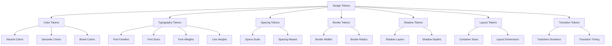
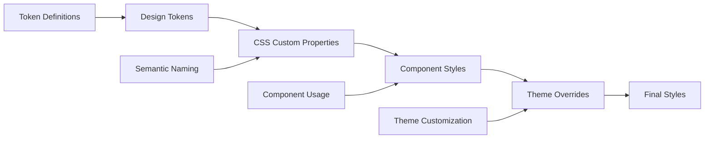

# Design Tokens (`tokens.css`)

The foundational design tokens for the Teskooano design system. Provides CSS custom properties for colors, typography, spacing, borders, shadows, and layout values that ensure consistency across all components and applications.

## 🎯 Purpose

Design tokens serve as the single source of truth for all design decisions in the Teskooano ecosystem. They provide a consistent, maintainable way to define and apply design values across components, ensuring visual consistency and enabling easy theme customization and updates.

## 🏗️ Architecture

The design tokens follow a hierarchical structure with semantic naming:



## 🚀 Core Features

### 1. Color System

- **Neutral Palette**: Background, surface, and text colors
- **Brand Colors**: Primary, secondary, and accent colors
- **Semantic Colors**: Success, warning, error, and info colors
- **State Colors**: Hover, active, and focus states
- **Dockview Integration**: Custom Dockview theme colors

### 2. Typography Scale

- **Font Families**: Base, heading, and monospace fonts
- **Fluid Typography**: Responsive font sizes using clamp()
- **Font Weights**: Light, normal, medium, and bold weights
- **Line Heights**: Optimized line heights for readability

### 3. Spacing System

- **Linear Scale**: 4px-based spacing system
- **Semantic Aliases**: Common spacing use cases
- **Responsive Spacing**: Adaptive spacing values

### 4. Border System

- **Border Widths**: Consistent border thickness values
- **Border Radius**: Rounded corner system
- **Border Colors**: Consistent border color tokens

### 5. Shadow System

- **Layered Shadows**: Multiple shadow depths
- **Semantic Shadows**: Context-appropriate shadow usage

## 🔧 Key Token Categories

### Color Tokens

```css
:root {
  /* Neutral Colors */
  --color-background: #12121e; /* Deep Space Blue */
  --color-surface-1: #1a1a2e; /* Dark Navy */
  --color-surface-2: #2a2a3e; /* Lighter Navy/Grey */
  --color-surface-3: #3a3a4e; /* Even Lighter Surface */
  --color-text-primary: #e0e0fc; /* Light Lavender/White */
  --color-text-secondary: #a0a0cc; /* Muted Lavender */
  --color-text-disabled: #6a6a8a; /* Greyed Out */
  --color-border-strong: #6a6a8a; /* Visible Border */
  --color-border-subtle: #4a4a6a; /* Muted Border */
  --color-border-focus: var(--color-primary); /* Focus Indicator */

  /* Brand Colors */
  --color-primary: #6c63ff; /* Purple/Blue Accent */
  --color-primary-hover: #5a52e0;
  --color-primary-active: #4841c2;
  --color-text-on-primary: #ffffff;

  --color-secondary: #00aaff; /* Blue */
  --color-secondary-hover: #0088cc;
  --color-secondary-active: #006699;
  --color-text-on-secondary: #ffffff;

  --color-accent: #17ead9; /* Teal */
  --color-accent-hover: #12b8ab;
  --color-accent-active: #0d8a7f;
  --color-text-on-accent: #12121e;

  /* Semantic Colors */
  --color-success: #2ecc71;
  --color-warning: #f1c40f;
  --color-error: #e74c3c;
  --color-info: #3498db;
}
```

### Typography Tokens

```css
:root {
  /* Font Families */
  --font-family-base: Inter, system-ui, Avenir, Helvetica, Arial, sans-serif;
  --font-family-heading: var(--font-family-base);
  --font-family-mono: "Courier New", Courier, monospace;

  /* Font Weights */
  --font-weight-light: 300;
  --font-weight-normal: 400;
  --font-weight-medium: 500;
  --font-weight-bold: 700;

  /* Line Heights */
  --line-height-base: 1.6;
  --line-height-heading: 1.3;

  /* Fluid Font Sizes */
  --font-size-1: clamp(0.75rem, 0.5vw + 0.65rem, 0.875rem); /* ~12px - 14px */
  --font-size-2: clamp(0.875rem, 0.5vw + 0.775rem, 1rem); /* ~14px - 16px */
  --font-size-3: clamp(1rem, 0.6vw + 0.88rem, 1.125rem); /* ~16px - 18px */
  --font-size-4: clamp(1.125rem, 0.7vw + 0.975rem, 1.25rem); /* ~18px - 20px */
  --font-size-5: clamp(1.375rem, 1vw + 1.125rem, 1.75rem); /* ~22px - 28px */
  --font-size-6: clamp(1.75rem, 1.5vw + 1.3rem, 2.5rem); /* ~28px - 40px */

  /* Semantic Font Sizes */
  --font-size-base: var(--font-size-2);
  --font-size-small: var(--font-size-1);
  --font-size-medium: var(--font-size-3);
  --font-size-large: var(--font-size-4);
}
```

### Spacing Tokens

```css
:root {
  /* Spacing Scale */
  --space-unit: 0.25rem; /* 4px base unit */
  --space-1: var(--space-unit); /* 4px */
  --space-2: calc(var(--space-unit) * 2); /* 8px */
  --space-3: calc(var(--space-unit) * 3); /* 12px */
  --space-4: calc(var(--space-unit) * 4); /* 16px */
  --space-5: calc(var(--space-unit) * 6); /* 24px */
  --space-6: calc(var(--space-unit) * 8); /* 32px */
  --space-8: calc(var(--space-unit) * 12); /* 48px */
  --space-10: calc(var(--space-unit) * 16); /* 64px */

  /* Semantic Spacing Aliases */
  --spacing-xs: var(--space-1);
  --spacing-sm: var(--space-2);
  --spacing-md: var(--space-4);
  --spacing-lg: var(--space-6);
  --spacing-xl: var(--space-8);
  --spacing-xxl: var(--space-10);
}
```

### Border Tokens

```css
:root {
  /* Border Widths */
  --border-width-thin: 1px;
  --border-width-medium: 2px;
  --border-width-thick: 3px;

  /* Border Radius */
  --radius-none: 0;
  --radius-sm: 0.25rem; /* 4px */
  --radius-md: 0.5rem; /* 8px */
  --radius-lg: 1rem; /* 16px */
  --radius-xl: 1.5rem; /* 24px */
  --radius-full: 9999px; /* Pill shape */
}
```

### Shadow Tokens

```css
:root {
  /* Shadow Layers */
  --shadow-sm: 0 1px 2px 0 rgba(0, 0, 0, 0.15);
  --shadow-md:
    0 4px 6px -1px rgba(0, 0, 0, 0.2), 0 2px 4px -1px rgba(0, 0, 0, 0.12);
  --shadow-lg:
    0 10px 15px -3px rgba(0, 0, 0, 0.25), 0 4px 6px -2px rgba(0, 0, 0, 0.1);
  --shadow-inner: inset 0 2px 4px 0 rgba(0, 0, 0, 0.1);
}
```

### Layout Tokens

```css
:root {
  /* Layout Dimensions */
  --container-padding: var(--spacing-md);
  --toolbar-height: 3.125rem; /* 50px */
  --max-width: 1200px;
}
```

### Transition Tokens

```css
:root {
  /* Transition Durations */
  --transition-duration-fast: 150ms;
  --transition-duration-base: 250ms;
  --transition-duration-slow: 400ms;

  /* Transition Timing */
  --transition-timing-base: ease-in-out;
}
```

## 🔄 Data Flow

The design tokens follow a systematic data flow for style application:



### Processing Pipeline

1. **Design Tokens**: Define all design values as CSS custom properties
2. **CSS Custom Properties**: Make tokens available throughout the CSS cascade
3. **Component Styles**: Components use tokens for consistent styling
4. **Theme Overrides**: Themes can override tokens for customization
5. **Final Styles**: Computed styles applied to elements

## 📊 Technical Specifications

### Token Naming Convention

```css
/* Pattern: --category-subcategory-variant-state */
--color-primary-hover
--font-size-large
--spacing-md
--border-width-thin
--radius-lg
--shadow-md
--transition-duration-fast
```

### Token Categories

```css
/* Color Tokens */
--color-{semantic}-{variant}-{state}

/* Typography Tokens */
--font-{property}-{variant}
--line-height-{variant}

/* Spacing Tokens */
--space-{number}
--spacing-{semantic}

/* Border Tokens */
--border-width-{variant}
--radius-{variant}

/* Shadow Tokens */
--shadow-{variant}

/* Layout Tokens */
--{property}-{variant}

/* Transition Tokens */
--transition-{property}-{variant}
```

## 💡 Usage Examples

### Using Color Tokens

```css
/* Primary Button */
.button-primary {
  background-color: var(--color-primary);
  color: var(--color-text-on-primary);
  border-color: var(--color-primary);
}

.button-primary:hover {
  background-color: var(--color-primary-hover);
  border-color: var(--color-primary-hover);
}

.button-primary:active {
  background-color: var(--color-primary-active);
  border-color: var(--color-primary-active);
}
```

### Using Typography Tokens

```css
/* Heading Styles */
h1 {
  font-family: var(--font-family-heading);
  font-size: var(--font-size-6);
  font-weight: var(--font-weight-bold);
  line-height: var(--line-height-heading);
  color: var(--color-text-primary);
}

/* Body Text */
p {
  font-family: var(--font-family-base);
  font-size: var(--font-size-base);
  line-height: var(--line-height-base);
  color: var(--color-text-primary);
}
```

### Using Spacing Tokens

```css
/* Component Spacing */
.card {
  padding: var(--spacing-md);
  margin-bottom: var(--spacing-lg);
  gap: var(--spacing-sm);
}

/* Layout Spacing */
.container {
  padding: var(--container-padding);
  max-width: var(--max-width);
}
```

### Using Border Tokens

```css
/* Border Styles */
.input {
  border: var(--border-width-thin) solid var(--color-border-subtle);
  border-radius: var(--radius-md);
}

.input:focus {
  border-color: var(--color-border-focus);
  box-shadow: 0 0 0 2px var(--color-primary);
}
```

### Using Shadow Tokens

```css
/* Elevation */
.card {
  box-shadow: var(--shadow-md);
}

.card:hover {
  box-shadow: var(--shadow-lg);
}

.modal {
  box-shadow: var(--shadow-lg);
}
```

### Using Transition Tokens

```css
/* Smooth Transitions */
.button {
  transition:
    background-color var(--transition-duration-fast)
      var(--transition-timing-base),
    border-color var(--transition-duration-fast) var(--transition-timing-base),
    color var(--transition-duration-fast) var(--transition-timing-base);
}
```

## ⚡ Performance Considerations

### Efficiency

- **CSS Custom Properties**: Efficient token-based theming system
- **Computed Values**: Pre-computed spacing and sizing values
- **Minimal Overhead**: Lightweight CSS custom property implementation
- **Browser Optimization**: Native CSS custom property support

### Quality Metrics

- **Consistency**: Standardized token usage across all components
- **Maintainability**: Single source of truth for design values
- **Accessibility**: WCAG-compliant color contrast ratios
- **Scalability**: Token-based system supports design system growth

### Performance Monitoring

- **CSS Performance**: Monitoring of CSS custom property performance
- **Theme Switching**: Fast theme changes via token overrides
- **Bundle Size**: CSS bundle size optimization
- **Browser Compatibility**: Cross-browser CSS custom property support

## 🔌 Integration Points

### Primary Integration

- **Component System**: Foundation for all component styling
- **Theme System**: Token-based theming and customization
- **Layout System**: Consistent spacing and sizing

### Secondary Integration

- **Dockview Integration**: Custom Dockview theme tokens
- **Responsive Design**: Fluid typography and spacing
- **Accessibility**: WCAG-compliant color and contrast tokens

## 🐛 Debug Features

### Validation

- **Token Validation**: Consistent token naming and usage
- **Color Validation**: WCAG compliance and contrast checking
- **CSS Validation**: Valid CSS custom property syntax
- **Browser Compatibility**: Cross-browser token support

### Monitoring

- **Token Usage**: Monitoring of token usage across components
- **Performance Monitoring**: CSS custom property performance
- **Theme Consistency**: Token consistency across themes
- **Color Accessibility**: Color contrast monitoring

### Debugging Tools

- **Token Inspector**: Browser dev tools for token inspection
- **Color Picker**: Color token value inspection
- **Spacing Visualizer**: Spacing token visualization
- **Theme Debugger**: Theme token debugging tools

## 🔮 Future Enhancements

### Optimization Opportunities

- **Performance Optimization**: Enhanced CSS custom property optimization
- **Token Optimization**: Optimized token definitions and usage
- **Theme Optimization**: Improved theme switching performance
- **Bundle Optimization**: CSS bundle size optimization

### Potential Improvements

- **Additional Tokens**: Expanded token library for more design options
- **Token Documentation**: Enhanced token documentation and examples
- **Theme Variants**: Additional theme token sets
- **Advanced Debugging**: Enhanced debugging tools and development experience

## 📚 Related Documentation

- [[app/design-system/design-system|Design System]] - Main design system documentation
- [[app/design-system/button-system|Button System]] - Button component using design tokens
- [[app/design-system/typography-system|Typography System]] - Typography styles using tokens
- [[app/design-system/layout-system|Layout System]] - Layout utilities using tokens
- [[app/design-system/theme-system|Theme System]] - Theme customization using tokens
- [[app/design-system/component-styles|Component Styles]] - Component styling patterns with tokens
