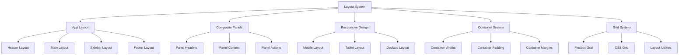
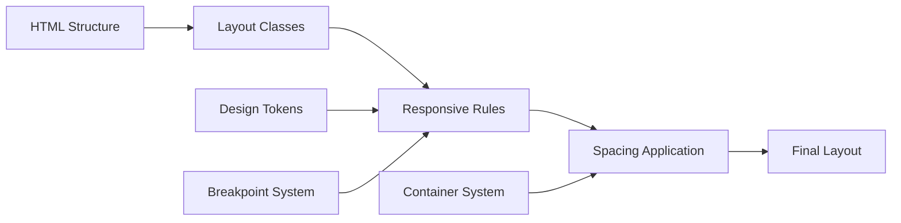

# Layout System (`layout/`)

A comprehensive layout system providing responsive design utilities, app layout patterns, and container management for Teskooano applications. Features mobile-first responsive design, flexible grid systems, and consistent spacing.

## 🎯 Purpose

The Layout System provides the structural foundation for Teskooano applications, ensuring consistent spacing, responsive behavior, and proper content organization. It offers flexible layout patterns, responsive utilities, and container management while maintaining visual consistency across all screen sizes.

## 🏗️ Architecture

The Layout System follows a mobile-first responsive architecture:



## 🚀 Core Features

### 1. App Layout

- **Header Structure**: Consistent header layout and styling
- **Main Content**: Flexible main content area
- **Sidebar Integration**: Collapsible sidebar layout
- **Footer Support**: Footer layout and positioning

### 2. Composite Panels

- **Panel Headers**: Consistent panel header styling
- **Panel Content**: Flexible panel content areas
- **Panel Actions**: Action button positioning
- **Panel States**: Active, inactive, and loading states

### 3. Responsive Design

- **Mobile-First**: Mobile-first responsive approach
- **Breakpoint System**: Consistent breakpoint management
- **Flexible Layouts**: Adaptive layout patterns
- **Touch-Friendly**: Touch-optimized spacing and sizing

### 4. Container System

- **Max Width**: Consistent container max widths
- **Padding**: Standardized container padding
- **Margins**: Consistent margin spacing
- **Centering**: Automatic container centering

## 🔧 Key Components

### App Layout (`layout/app.css`)

```css
/* App Container */
.app-layout {
  display: flex;
  flex-direction: column;
  min-height: 100vh;
  background-color: var(--color-background);
}

/* App Header */
.app-header {
  display: flex;
  align-items: center;
  justify-content: space-between;
  padding: var(--spacing-md) var(--container-padding);
  background-color: var(--color-surface-1);
  border-bottom: var(--border-width-thin) solid var(--color-border-subtle);
  height: var(--toolbar-height);
}

/* App Main */
.app-main {
  display: flex;
  flex: 1;
  overflow: hidden;
}

/* App Sidebar */
.app-sidebar {
  width: 250px;
  background-color: var(--color-surface-1);
  border-right: var(--border-width-thin) solid var(--color-border-subtle);
  transition: transform var(--transition-duration-base)
    var(--transition-timing-base);
}

.app-sidebar.collapsed {
  transform: translateX(-100%);
}

/* App Content */
.app-content {
  flex: 1;
  padding: var(--container-padding);
  overflow-y: auto;
  background-color: var(--color-background);
}

/* App Footer */
.app-footer {
  padding: var(--spacing-md) var(--container-padding);
  background-color: var(--color-surface-1);
  border-top: var(--border-width-thin) solid var(--color-border-subtle);
}
```

### Composite Panels (`layout/composite-panel.css`)

```css
/* Composite Panel */
.composite-panel {
  display: flex;
  flex-direction: column;
  background-color: var(--color-surface-1);
  border: var(--border-width-thin) solid var(--color-border-subtle);
  border-radius: var(--radius-md);
  overflow: hidden;
}

/* Panel Header */
.panel-header {
  display: flex;
  align-items: center;
  justify-content: space-between;
  padding: var(--spacing-md);
  background-color: var(--color-surface-2);
  border-bottom: var(--border-width-thin) solid var(--color-border-subtle);
}

.panel-title {
  font-family: var(--font-family-heading);
  font-size: var(--font-size-medium);
  font-weight: var(--font-weight-medium);
  color: var(--color-text-primary);
  margin: 0;
}

.panel-actions {
  display: flex;
  align-items: center;
  gap: var(--spacing-sm);
}

/* Panel Content */
.panel-content {
  flex: 1;
  padding: var(--spacing-md);
  overflow-y: auto;
}

/* Panel States */
.panel-loading {
  opacity: 0.6;
  pointer-events: none;
}

.panel-error {
  border-color: var(--color-error);
}

.panel-success {
  border-color: var(--color-success);
}
```

### Responsive Design (`layout/responsive.css`)

```css
/* Container System */
.container {
  width: 100%;
  max-width: var(--max-width);
  margin: 0 auto;
  padding: 0 var(--container-padding);
}

.container-sm {
  max-width: 640px;
}

.container-md {
  max-width: 768px;
}

.container-lg {
  max-width: 1024px;
}

.container-xl {
  max-width: 1280px;
}

/* Responsive Grid */
.grid {
  display: grid;
  gap: var(--spacing-md);
}

.grid-cols-1 {
  grid-template-columns: repeat(1, 1fr);
}

.grid-cols-2 {
  grid-template-columns: repeat(2, 1fr);
}

.grid-cols-3 {
  grid-template-columns: repeat(3, 1fr);
}

.grid-cols-4 {
  grid-template-columns: repeat(4, 1fr);
}

/* Flexbox Utilities */
.flex {
  display: flex;
}

.flex-col {
  flex-direction: column;
}

.flex-row {
  flex-direction: row;
}

.items-center {
  align-items: center;
}

.justify-center {
  justify-content: center;
}

.justify-between {
  justify-content: space-between;
}

.justify-around {
  justify-content: space-around;
}

/* Spacing Utilities */
.gap-sm {
  gap: var(--spacing-sm);
}

.gap-md {
  gap: var(--spacing-md);
}

.gap-lg {
  gap: var(--spacing-lg);
}

.p-sm {
  padding: var(--spacing-sm);
}

.p-md {
  padding: var(--spacing-md);
}

.p-lg {
  padding: var(--spacing-lg);
}

.m-sm {
  margin: var(--spacing-sm);
}

.m-md {
  margin: var(--spacing-md);
}

.m-lg {
  margin: var(--spacing-lg);
}

/* Responsive Breakpoints */
@media (min-width: 640px) {
  .sm\:grid-cols-2 {
    grid-template-columns: repeat(2, 1fr);
  }

  .sm\:flex-row {
    flex-direction: row;
  }
}

@media (min-width: 768px) {
  .md\:grid-cols-3 {
    grid-template-columns: repeat(3, 1fr);
  }

  .md\:container-md {
    max-width: 768px;
  }
}

@media (min-width: 1024px) {
  .lg\:grid-cols-4 {
    grid-template-columns: repeat(4, 1fr);
  }

  .lg\:container-lg {
    max-width: 1024px;
  }
}
```

## 🔄 Data Flow

The Layout System follows a systematic data flow for layout application:



### Processing Pipeline

1. **HTML Structure**: Semantic HTML structure receives layout classes
2. **Layout Classes**: Apply layout-specific CSS classes
3. **Responsive Rules**: Apply responsive breakpoint rules
4. **Spacing Application**: Apply spacing and container utilities
5. **Final Layout**: Computed layout styles applied to elements

## 📊 Technical Specifications

### Breakpoint System

```css
/* Breakpoint Variables */
--breakpoint-sm: 640px;
--breakpoint-md: 768px;
--breakpoint-lg: 1024px;
--breakpoint-xl: 1280px;

/* Container Max Widths */
--max-width-sm: 640px;
--max-width-md: 768px;
--max-width-lg: 1024px;
--max-width-xl: 1280px;
```

### Grid System

```css
/* Grid Utilities */
.grid {
  display: grid;
}
.grid-cols-1 {
  grid-template-columns: repeat(1, 1fr);
}
.grid-cols-2 {
  grid-template-columns: repeat(2, 1fr);
}
.grid-cols-3 {
  grid-template-columns: repeat(3, 1fr);
}
.grid-cols-4 {
  grid-template-columns: repeat(4, 1fr);
}

/* Gap Utilities */
.gap-sm {
  gap: var(--spacing-sm);
}
.gap-md {
  gap: var(--spacing-md);
}
.gap-lg {
  gap: var(--spacing-lg);
}
```

### Flexbox System

```css
/* Flexbox Utilities */
.flex {
  display: flex;
}
.flex-col {
  flex-direction: column;
}
.flex-row {
  flex-direction: row;
}
.items-center {
  align-items: center;
}
.justify-center {
  justify-content: center;
}
.justify-between {
  justify-content: space-between;
}
```

## 💡 Usage Examples

### App Layout

```html
<!-- Complete App Layout -->
<div class="app-layout">
  <header class="app-header">
    <div class="header-left">
      <h1 class="app-title">Teskooano</h1>
    </div>
    <div class="header-right">
      <nav class="header-nav">
        <a href="#home">Home</a>
        <a href="#about">About</a>
        <a href="#contact">Contact</a>
      </nav>
    </div>
  </header>

  <main class="app-main">
    <aside class="app-sidebar">
      <nav class="sidebar-nav">
        <a href="#dashboard">Dashboard</a>
        <a href="#projects">Projects</a>
        <a href="#settings">Settings</a>
      </nav>
    </aside>

    <div class="app-content">
      <h2>Main Content</h2>
      <p>Main application content goes here...</p>
    </div>
  </main>

  <footer class="app-footer">
    <p>&copy; 2024 Teskooano. All rights reserved.</p>
  </footer>
</div>
```

### Composite Panels

```html
<!-- Panel with Header and Actions -->
<div class="composite-panel">
  <div class="panel-header">
    <h3 class="panel-title">Panel Title</h3>
    <div class="panel-actions">
      <button class="button-ghost button-sm">Action 1</button>
      <button class="button-primary button-sm">Action 2</button>
    </div>
  </div>

  <div class="panel-content">
    <p>Panel content goes here...</p>
    <p>Additional content with proper spacing...</p>
  </div>
</div>

<!-- Panel with Loading State -->
<div class="composite-panel panel-loading">
  <div class="panel-header">
    <h3 class="panel-title">Loading Panel</h3>
  </div>

  <div class="panel-content">
    <p>Content is loading...</p>
  </div>
</div>
```

### Responsive Grid

```html
<!-- Responsive Grid -->
<div class="container">
  <div class="grid grid-cols-1 md:grid-cols-2 lg:grid-cols-3 gap-md">
    <div class="composite-panel">
      <div class="panel-content">
        <h4>Card 1</h4>
        <p>Content for card 1...</p>
      </div>
    </div>

    <div class="composite-panel">
      <div class="panel-content">
        <h4>Card 2</h4>
        <p>Content for card 2...</p>
      </div>
    </div>

    <div class="composite-panel">
      <div class="panel-content">
        <h4>Card 3</h4>
        <p>Content for card 3...</p>
      </div>
    </div>
  </div>
</div>
```

### Flexbox Layout

```html
<!-- Flexbox Layout -->
<div class="flex flex-col md:flex-row gap-md">
  <div class="flex-1">
    <div class="composite-panel">
      <div class="panel-content">
        <h4>Main Content</h4>
        <p>Main content area with flexible width...</p>
      </div>
    </div>
  </div>

  <div class="flex-shrink-0" style="width: 300px;">
    <div class="composite-panel">
      <div class="panel-content">
        <h4>Sidebar</h4>
        <p>Fixed width sidebar content...</p>
      </div>
    </div>
  </div>
</div>
```

### Container System

```html
<!-- Different Container Sizes -->
<div class="container-sm">
  <h2>Small Container</h2>
  <p>Content for small container...</p>
</div>

<div class="container-md">
  <h2>Medium Container</h2>
  <p>Content for medium container...</p>
</div>

<div class="container-lg">
  <h2>Large Container</h2>
  <p>Content for large container...</p>
</div>
```

### Spacing Utilities

```html
<!-- Spacing Examples -->
<div class="p-md m-lg">
  <h3>Padded and Margined Content</h3>
  <p>This content has medium padding and large margins.</p>
</div>

<div class="flex gap-sm">
  <button class="button-primary">Button 1</button>
  <button class="button-secondary">Button 2</button>
  <button class="button-outline">Button 3</button>
</div>
```

## ⚡ Performance Considerations

### Efficiency

- **CSS-only Implementation**: No JavaScript required for layout
- **Efficient Selectors**: Optimized CSS selectors for performance
- **Flexible Layouts**: CSS Grid and Flexbox for efficient layouts
- **Minimal Overhead**: Lightweight layout implementation

### Quality Metrics

- **Responsiveness**: Consistent behavior across all screen sizes
- **Accessibility**: Proper semantic structure and navigation
- **Maintainability**: Token-based spacing for easy updates
- **Performance**: Efficient CSS rendering and layout

### Performance Monitoring

- **Layout Performance**: CSS layout and rendering performance
- **Responsive Performance**: Breakpoint and media query performance
- **Accessibility Performance**: Screen reader and keyboard navigation
- **Cross-browser Performance**: Consistent behavior across browsers

## 🔌 Integration Points

### Primary Integration

- **Design Tokens**: Uses design system tokens for consistent spacing
- **Component System**: Provides layout foundation for components
- **Typography System**: Integrates with typography for content layout

### Secondary Integration

- **Theme System**: Supports theme customization and overrides
- **Responsive System**: Works with responsive design utilities
- **Accessibility System**: Integrates with accessibility features

## 🐛 Debug Features

### Validation

- **CSS Validation**: Valid CSS syntax and properties
- **Layout Validation**: Proper layout structure and semantics
- **Responsive Validation**: Breakpoint and media query validation
- **Accessibility Validation**: WCAG compliance checking

### Monitoring

- **Layout Usage**: Monitoring of layout pattern usage
- **Performance Monitoring**: CSS performance and render metrics
- **Responsive Monitoring**: Breakpoint usage and effectiveness
- **Accessibility Monitoring**: Layout accessibility compliance

### Debugging Tools

- **CSS Inspector**: Browser dev tools for layout debugging
- **Layout Debugger**: Layout structure and spacing debugging
- **Responsive Debugger**: Breakpoint and media query debugging
- **Accessibility Inspector**: Layout accessibility testing

## 🔮 Future Enhancements

### Optimization Opportunities

- **Performance Optimization**: Enhanced CSS layout optimization
- **Bundle Optimization**: Improved CSS bundling and tree-shaking
- **Layout Optimization**: Enhanced responsive layout strategies
- **Accessibility Optimization**: Improved accessibility features

### Potential Improvements

- **Additional Layouts**: More layout patterns and utilities
- **Advanced Grid**: Enhanced CSS Grid utilities and patterns
- **Layout Components**: Pre-built layout components
- **Advanced Debugging**: Enhanced debugging tools and development experience

## 📚 Related Documentation

- [[app/design-system/design-system|Design System]] - Main design system documentation
- [[app/design-system/design-tokens|Design Tokens]] - Design tokens used by layout system
- [[app/design-system/typography-system|Typography System]] - Typography integration with layout
- [[app/design-system/button-system|Button System]] - Button layout and positioning
- [[app/design-system/theme-system|Theme System]] - Theme customization for layouts
- [[app/design-system/component-styles|Component Styles]] - Component styling patterns with layout
