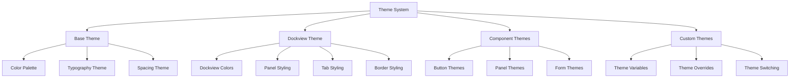
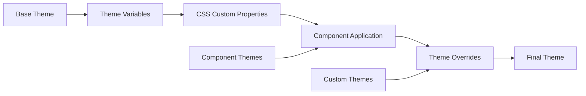

# Theme System (`themes/dockview.css`)

A comprehensive theme system providing dark theme styling and Dockview integration for Teskooano applications. Features cosmic dark theme, Dockview customization, and consistent color theming across all components.

## 🎯 Purpose

The Theme System provides a cohesive visual experience across all Teskooano applications through consistent theming, dark mode support, and specialized component themes. It ensures visual consistency while providing customization options for different application contexts and user preferences.

## 🏗️ Architecture

The Theme System follows a layered architecture with component-specific theming:



## 🚀 Core Features

### 1. Cosmic Dark Theme

- **Deep Space Colors**: Dark blue/purple color palette
- **High Contrast**: Optimized contrast ratios for readability
- **Consistent Styling**: Unified color scheme across components
- **Accessibility**: WCAG-compliant color combinations

### 2. Dockview Integration

- **Custom Dockview Theme**: Specialized Dockview panel styling
- **Panel Colors**: Consistent panel background and border colors
- **Tab Styling**: Custom tab appearance and states
- **Interactive Elements**: Hover, focus, and active states

### 3. Component Theming

- **Button Themes**: Theme-aware button styling
- **Panel Themes**: Consistent panel appearance
- **Form Themes**: Theme-aware form elements
- **Interactive States**: Consistent hover and focus effects

### 4. Theme Customization

- **CSS Custom Properties**: Token-based theme system
- **Theme Variables**: Overrideable theme variables
- **Component Overrides**: Component-specific theme customization
- **Dynamic Theming**: Runtime theme switching support

## 🔧 Key Components

### Base Theme Colors

```css
:root {
  /* Cosmic Dark Theme Colors */
  --color-background: #12121e; /* Deep Space Blue */
  --color-surface-1: #1a1a2e; /* Dark Navy */
  --color-surface-2: #2a2a3e; /* Lighter Navy/Grey */
  --color-surface-3: #3a3a4e; /* Even Lighter Surface */

  /* Text Colors */
  --color-text-primary: #e0e0fc; /* Light Lavender/White */
  --color-text-secondary: #a0a0cc; /* Muted Lavender */
  --color-text-disabled: #6a6a8a; /* Greyed Out */

  /* Border Colors */
  --color-border-strong: #6a6a8a; /* Visible Border */
  --color-border-subtle: #4a4a6a; /* Muted Border */
  --color-border-focus: var(--color-primary); /* Focus Indicator */

  /* Brand Colors */
  --color-primary: #6c63ff; /* Purple/Blue Accent */
  --color-primary-hover: #5a52e0;
  --color-primary-active: #4841c2;
  --color-text-on-primary: #ffffff;

  /* Semantic Colors */
  --color-success: #2ecc71;
  --color-warning: #f1c40f;
  --color-error: #e74c3c;
  --color-info: #3498db;
}
```

### Dockview Theme

```css
:root {
  /* Dockview Cosmic Dark Theme */
  --dv-background-color: #0f0f1a; /* Very dark deep blue/purple */

  /* Panel/Group Backgrounds */
  --dv-group-view-background-color: #1a1a2e; /* Slightly lighter dark blue/purple */
  --dv-tabs-and-actions-container-background-color: #1f1f38; /* Tab bar background */

  /* Tab Background Colors */
  --dv-activegroup-visiblepanel-tab-background-color: #4a4a7f; /* Active tab */
  --dv-activegroup-hiddenpanel-tab-background-color: #2c2c54; /* Inactive tabs in active group */
  --dv-inactivegroup-visiblepanel-tab-background-color: #303050; /* Visible tab in inactive group */
  --dv-inactivegroup-hiddenpanel-tab-background-color: #252540; /* Hidden tabs in inactive group */

  /* Tab Text Colors */
  --dv-activegroup-visiblepanel-tab-color: #e0e0ff; /* Active tab text */
  --dv-activegroup-hiddenpanel-tab-color: #a0a0c0; /* Inactive tab text */
  --dv-inactivegroup-visiblepanel-tab-color: #b0b0d0; /* Visible tab text in inactive group */
  --dv-inactivegroup-hiddenpanel-tab-color: #8080a0; /* Hidden tab text in inactive group */

  /* Borders and Separators */
  --dv-separator-border: 1px solid #3a3a6a; /* Subtle purple border */
  --dv-paneview-header-border-color: #3a3a6a; /* Header border */
  --dv-tab-divider-color: #3a3a6a; /* Tab divider */

  /* Interaction States */
  --dv-paneview-active-outline-color: #7f7fdc; /* Active panel outline */
  --dv-icon-hover-background-color: rgba(127, 127, 220, 0.2); /* Icon hover */
  --dv-active-sash-color: #7f7fdc; /* Active sash */
  --dv-drag-over-background-color: rgba(74, 74, 127, 0.3); /* Drag overlay */
  --dv-drag-over-border-color: #7f7fdc; /* Drag border */

  /* Typography */
  --dv-tabs-and-actions-container-font-size: 0.8rem; /* Tab font size */
  --dv-tabs-and-actions-container-height: 30px; /* Tab bar height */

  /* Icons and Elements */
  --dv-tab-close-icon: url('data:image/svg+xml;utf8,<svg xmlns="http://www.w3.org/2000/svg" fill="%23a0a0c0" viewBox="0 0 12 12"><path d="M9.3 2.7l-6.6 6.6-0.7-0.7 6.6-6.6 0.7 0.7z"/><path d="M2.7 2.7l6.6 6.6-0.7 0.7-6.6-6.6 0.7-0.7z"/></svg>');
  --dv-tabs-container-scrollbar-color: #4a4a7f #1f1f38; /* Scrollbar colors */
  --dv-floating-box-shadow: 0 5px 15px rgba(127, 127, 220, 0.2); /* Floating panel shadow */
}
```

### Component Theme Integration

```css
/* Theme-aware Button Styling */
.button-primary {
  background-color: var(--color-primary);
  color: var(--color-text-on-primary);
  border-color: var(--color-primary);
}

.button-primary:hover {
  background-color: var(--color-primary-hover);
  border-color: var(--color-primary-hover);
}

/* Theme-aware Panel Styling */
.composite-panel {
  background-color: var(--color-surface-1);
  border-color: var(--color-border-subtle);
  color: var(--color-text-primary);
}

.panel-header {
  background-color: var(--color-surface-2);
  border-bottom-color: var(--color-border-subtle);
}

/* Theme-aware Form Styling */
input,
textarea,
select {
  background-color: var(--color-surface-1);
  border-color: var(--color-border-subtle);
  color: var(--color-text-primary);
}

input:focus,
textarea:focus,
select:focus {
  border-color: var(--color-border-focus);
  box-shadow: 0 0 0 2px var(--color-primary);
}
```

## 🔄 Data Flow

The Theme System follows a systematic data flow for theme application:



### Processing Pipeline

1. **Theme Variables**: Define theme colors and values
2. **CSS Custom Properties**: Make theme variables available
3. **Component Application**: Apply theme to components
4. **Theme Overrides**: Apply custom theme overrides
5. **Final Theme**: Computed theme styles applied

## 📊 Technical Specifications

### Theme Structure

```css
/* Theme Variable Pattern */
--color-{category}-{variant}-{state}
--dv-{dockview-property}-{variant}

/* Color Categories */
--color-background    /* Background colors */
--color-surface-{n}   /* Surface colors */
--color-text-{type}  /* Text colors */
--color-border-{type} /* Border colors */
--color-primary      /* Brand colors */
--color-{semantic}   /* Semantic colors */

/* Dockview Properties */
--dv-background-color
--dv-group-view-background-color
--dv-tabs-and-actions-container-background-color
--dv-{state}-tab-background-color
--dv-{state}-tab-color
```

### Theme Customization

```css
/* Custom Theme Override */
:root[data-theme="custom"] {
  --color-background: #0a0a0a;
  --color-primary: #ff6b6b;
  --color-surface-1: #1a1a1a;
  --color-text-primary: #ffffff;
}

/* Component Theme Override */
.custom-component {
  --color-primary: #00ff00;
  --color-surface-1: #2a2a2a;
}
```

## 💡 Usage Examples

### Basic Theme Application

```html
<!-- Theme is automatically applied via CSS custom properties -->
<div class="app-layout">
  <header class="app-header">
    <h1>Application Title</h1>
  </header>

  <main class="app-main">
    <div class="composite-panel">
      <div class="panel-header">
        <h3 class="panel-title">Panel Title</h3>
      </div>
      <div class="panel-content">
        <p>Panel content with theme colors...</p>
        <button class="button-primary">Themed Button</button>
      </div>
    </div>
  </main>
</div>
```

### Dockview Integration

```html
<!-- Dockview automatically uses theme variables -->
<div id="dockview-container">
  <!-- Dockview panels will use theme colors -->
  <div class="dockview-panel">
    <div class="panel-header">Panel 1</div>
    <div class="panel-content">Content 1</div>
  </div>

  <div class="dockview-panel">
    <div class="panel-header">Panel 2</div>
    <div class="panel-content">Content 2</div>
  </div>
</div>
```

### Custom Theme Override

```html
<!-- Apply custom theme -->
<div class="app-layout" data-theme="custom">
  <header class="app-header">
    <h1>Custom Themed Application</h1>
  </header>

  <main class="app-main">
    <div class="composite-panel">
      <div class="panel-content">
        <p>This content uses custom theme colors...</p>
        <button class="button-primary">Custom Themed Button</button>
      </div>
    </div>
  </main>
</div>
```

### Theme-aware Components

```html
<!-- Components automatically adapt to theme -->
<div class="composite-panel">
  <div class="panel-header">
    <h3 class="panel-title">Themed Panel</h3>
    <div class="panel-actions">
      <button class="button-primary">Primary Action</button>
      <button class="button-secondary">Secondary Action</button>
      <button class="button-outline">Outline Action</button>
      <button class="button-ghost">Ghost Action</button>
    </div>
  </div>

  <div class="panel-content">
    <form>
      <div class="form-group">
        <label for="input1">Input Label</label>
        <input type="text" id="input1" placeholder="Themed input..." />
      </div>

      <div class="form-group">
        <label for="textarea1">Textarea Label</label>
        <textarea id="textarea1" placeholder="Themed textarea..."></textarea>
      </div>

      <div class="form-actions">
        <button type="submit" class="button-primary">Submit</button>
        <button type="reset" class="button-ghost">Reset</button>
      </div>
    </form>
  </div>
</div>
```

### Dynamic Theme Switching

```css
/* Theme switching with CSS */
:root[data-theme="light"] {
  --color-background: #ffffff;
  --color-surface-1: #f5f5f5;
  --color-text-primary: #333333;
  --color-primary: #0066cc;
}

:root[data-theme="dark"] {
  --color-background: #12121e;
  --color-surface-1: #1a1a2e;
  --color-text-primary: #e0e0fc;
  --color-primary: #6c63ff;
}
```

```html
<!-- Theme switching example -->
<div class="app-layout" data-theme="dark">
  <header class="app-header">
    <h1>Theme Switching Demo</h1>
    <button onclick="toggleTheme()" class="button-ghost">Toggle Theme</button>
  </header>

  <main class="app-main">
    <div class="composite-panel">
      <div class="panel-content">
        <p>Current theme: <span id="theme-indicator">Dark</span></p>
        <button class="button-primary">Themed Button</button>
      </div>
    </div>
  </main>
</div>

<script>
  function toggleTheme() {
    const root = document.documentElement;
    const currentTheme = root.getAttribute("data-theme");
    const newTheme = currentTheme === "dark" ? "light" : "dark";

    root.setAttribute("data-theme", newTheme);
    document.getElementById("theme-indicator").textContent =
      newTheme === "dark" ? "Dark" : "Light";
  }
</script>
```

## ⚡ Performance Considerations

### Efficiency

- **CSS Custom Properties**: Efficient theme variable system
- **No JavaScript**: Pure CSS theme implementation
- **Minimal Overhead**: Lightweight theme switching
- **Browser Optimization**: Native CSS custom property support

### Quality Metrics

- **Consistency**: Unified theme across all components
- **Accessibility**: WCAG-compliant color contrast
- **Maintainability**: Token-based theme system
- **Performance**: Efficient theme application and switching

### Performance Monitoring

- **Theme Performance**: CSS custom property performance
- **Theme Switching**: Fast theme change performance
- **Color Contrast**: Accessibility compliance monitoring
- **Cross-browser Performance**: Theme consistency across browsers

## 🔌 Integration Points

### Primary Integration

- **Design Tokens**: Foundation for theme variable system
- **Component System**: Theme-aware component styling
- **Dockview Integration**: Specialized Dockview theming

### Secondary Integration

- **Layout System**: Theme-aware layout styling
- **Typography System**: Theme-aware typography
- **Accessibility System**: Theme accessibility compliance

## 🐛 Debug Features

### Validation

- **Theme Validation**: Consistent theme variable usage
- **Color Validation**: WCAG compliance and contrast checking
- **CSS Validation**: Valid CSS custom property syntax
- **Component Validation**: Theme consistency across components

### Monitoring

- **Theme Usage**: Monitoring of theme variable usage
- **Performance Monitoring**: Theme performance metrics
- **Accessibility Monitoring**: Color contrast compliance
- **Cross-browser Monitoring**: Theme consistency across browsers

### Debugging Tools

- **Theme Inspector**: Browser dev tools for theme inspection
- **Color Picker**: Theme color value inspection
- **Contrast Checker**: Color contrast validation
- **Theme Debugger**: Theme application debugging tools

## 🔮 Future Enhancements

### Optimization Opportunities

- **Performance Optimization**: Enhanced theme switching performance
- **Theme Optimization**: Optimized theme variable system
- **Color Optimization**: Improved color palette and contrast
- **Bundle Optimization**: CSS theme bundle optimization

### Potential Improvements

- **Additional Themes**: More theme variants and options
- **Theme Builder**: Interactive theme creation tools
- **Advanced Customization**: Enhanced theme customization options
- **Advanced Debugging**: Enhanced debugging tools and development experience

## 📚 Related Documentation

- [[app/design-system/design-system|Design System]] - Main design system documentation
- [[app/design-system/design-tokens|Design Tokens]] - Design tokens used by theme system
- [[app/design-system/button-system|Button System]] - Theme-aware button styling
- [[app/design-system/typography-system|Typography System]] - Theme-aware typography
- [[app/design-system/layout-system|Layout System]] - Theme-aware layout styling
- [[app/design-system/component-styles|Component Styles]] - Component styling patterns with themes
