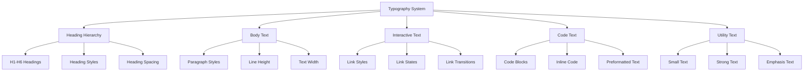
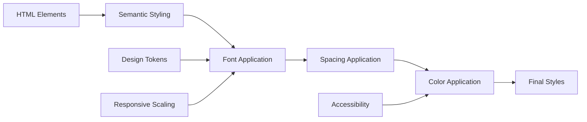

# Typography System (`base/typography.css`)

A comprehensive typography system providing consistent text styling, heading hierarchy, and responsive font scaling for Teskooano applications. Features fluid typography, semantic styling, and optimized readability.

## 🎯 Purpose

The Typography System establishes a consistent text styling foundation across all Teskooano applications. It provides semantic heading hierarchy, responsive font scaling, optimized readability, and accessibility-compliant text styling while maintaining visual consistency with the overall design system.

## 🏗️ Architecture

The Typography System follows a semantic hierarchy with responsive scaling:



## 🚀 Core Features

### 1. Heading Hierarchy

- **Semantic Structure**: H1-H6 with proper hierarchy
- **Responsive Scaling**: Fluid font sizes using clamp()
- **Consistent Spacing**: Standardized margins and line heights
- **Visual Hierarchy**: Clear distinction between heading levels

### 2. Body Text

- **Optimized Readability**: 65-character line width limit
- **Consistent Spacing**: Standardized paragraph margins
- **Line Height**: Optimized line height for readability
- **Font Family**: Consistent font family usage

### 3. Interactive Elements

- **Link Styling**: Consistent link appearance and states
- **Hover Effects**: Subtle hover and focus effects
- **Transitions**: Smooth color transitions
- **Accessibility**: Proper focus indicators

### 4. Code Typography

- **Monospace Font**: Consistent code font family
- **Syntax Highlighting**: Background and border styling
- **Code Blocks**: Proper preformatted text styling
- **Inline Code**: Inline code element styling

## 🔧 Key Components

### Heading Hierarchy

```css
h1,
h2,
h3,
h4,
h5,
h6 {
  font-family: var(--font-family-heading);
  font-weight: var(--font-weight-bold);
  line-height: var(--line-height-heading);
  color: var(--color-text-primary);
  margin-top: var(--spacing-lg);
  margin-bottom: var(--spacing-md);
}

h1 {
  font-size: var(--font-size-6); /* ~28px - 40px */
}

h2 {
  font-size: var(--font-size-5); /* ~22px - 28px */
}

h3 {
  font-size: var(--font-size-4); /* ~18px - 20px */
}

h4 {
  font-size: var(--font-size-3); /* ~16px - 18px */
}

h5 {
  font-size: var(--font-size-2); /* ~14px - 16px */
}

h6 {
  font-size: var(--font-size-1); /* ~12px - 14px */
  text-transform: uppercase;
  letter-spacing: 0.05em;
}
```

### Body Text

```css
p {
  margin-bottom: var(--spacing-md);
  max-width: 65ch; /* Improve readability */
  font-family: var(--font-family-base);
  font-size: var(--font-size-base);
  line-height: var(--line-height-base);
  color: var(--color-text-primary);
}
```

### Interactive Text

```css
a {
  color: var(--color-primary);
  text-decoration: none;
  transition: color var(--transition-duration-fast)
    var(--transition-timing-base);
}

a:hover,
a:focus {
  color: var(--color-primary-hover);
  text-decoration: underline;
}
```

### Text Formatting

```css
strong,
b {
  font-weight: var(--font-weight-bold);
}

em,
i {
  font-style: italic;
}

small {
  font-size: var(--font-size-small);
}
```

### Code Typography

```css
code,
pre,
kbd,
samp {
  font-family: var(--font-family-mono);
  font-size: 0.9em;
  background-color: var(--color-surface-2);
  padding: var(--space-1) var(--space-2);
  border-radius: var(--radius-sm);
  border: var(--border-width-thin) solid var(--color-border-subtle);
}

pre {
  padding: var(--spacing-md);
  overflow-x: auto;
  white-space: pre-wrap; /* Wrap long lines */
}
```

### Dividers

```css
hr {
  border: 0;
  border-top: var(--border-width-thin) solid var(--color-border-subtle);
  margin: var(--spacing-lg) 0;
}
```

## 🔄 Data Flow

The Typography System follows a systematic data flow for text styling:



### Processing Pipeline

1. **HTML Elements**: Semantic HTML elements receive styling
2. **Semantic Styling**: Apply semantic-specific styles
3. **Font Application**: Apply font family, size, and weight
4. **Spacing Application**: Apply margins, padding, and line height
5. **Color Application**: Apply text colors and contrast
6. **Final Styles**: Computed typography styles applied

## 📊 Technical Specifications

### Font Scale

```css
/* Fluid Font Sizes */
--font-size-1: clamp(0.75rem, 0.5vw + 0.65rem, 0.875rem); /* ~12px - 14px */
--font-size-2: clamp(0.875rem, 0.5vw + 0.775rem, 1rem); /* ~14px - 16px */
--font-size-3: clamp(1rem, 0.6vw + 0.88rem, 1.125rem); /* ~16px - 18px */
--font-size-4: clamp(1.125rem, 0.7vw + 0.975rem, 1.25rem); /* ~18px - 20px */
--font-size-5: clamp(1.375rem, 1vw + 1.125rem, 1.75rem); /* ~22px - 28px */
--font-size-6: clamp(1.75rem, 1.5vw + 1.3rem, 2.5rem); /* ~28px - 40px */
```

### Typography Hierarchy

```css
/* Heading Hierarchy */
h1 {
  font-size: var(--font-size-6);
} /* Largest */
h2 {
  font-size: var(--font-size-5);
}
h3 {
  font-size: var(--font-size-4);
}
h4 {
  font-size: var(--font-size-3);
}
h5 {
  font-size: var(--font-size-2);
}
h6 {
  font-size: var(--font-size-1);
} /* Smallest */

/* Body Text */
p {
  font-size: var(--font-size-base);
} /* Default */
small {
  font-size: var(--font-size-small);
} /* Smaller */
```

### Line Height System

```css
/* Line Heights */
--line-height-base: 1.6; /* Body text */
--line-height-heading: 1.3; /* Headings */
```

## 💡 Usage Examples

### Heading Hierarchy

```html
<!-- Proper Heading Hierarchy -->
<article>
  <h1>Main Article Title</h1>
  <p>Article introduction paragraph...</p>

  <h2>Section Heading</h2>
  <p>Section content paragraph...</p>

  <h3>Subsection Heading</h3>
  <p>Subsection content paragraph...</p>

  <h4>Minor Heading</h4>
  <p>Minor section content...</p>
</article>
```

### Body Text

```html
<!-- Paragraph Text -->
<p>
  This is a paragraph with consistent spacing and typography. It uses the base
  font size and line height for optimal readability.
</p>

<p>
  Another paragraph with proper spacing between paragraphs. The max-width
  ensures comfortable reading on all screen sizes.
</p>
```

### Interactive Text

```html
<!-- Links -->
<p>
  This paragraph contains a <a href="#example">link to an example</a>
  that will have proper hover and focus states.
</p>

<!-- Navigation Links -->
<nav>
  <a href="#home">Home</a>
  <a href="#about">About</a>
  <a href="#contact">Contact</a>
</nav>
```

### Text Formatting

```html
<!-- Text Emphasis -->
<p>
  This text contains <strong>strong emphasis</strong> and
  <em>italic emphasis</em> with proper styling.
</p>

<!-- Small Text -->
<p>
  Main content with <small>smaller supporting text</small>
  for additional information.
</p>
```

### Code Typography

```html
<!-- Inline Code -->
<p>
  Use the <code>console.log()</code> function to output messages to the browser
  console.
</p>

<!-- Code Block -->
<pre><code>function example() {
  console.log('Hello, World!');
  return true;
}</code></pre>

<!-- Keyboard Input -->
<p>Press <kbd>Ctrl</kbd> + <kbd>C</kbd> to copy the selected text.</p>
```

### Content Structure

```html
<!-- Article Structure -->
<article>
  <header>
    <h1>Article Title</h1>
    <p class="lead">Article introduction with larger text...</p>
  </header>

  <section>
    <h2>Section Title</h2>
    <p>Section content...</p>

    <h3>Subsection Title</h3>
    <p>Subsection content...</p>

    <blockquote>
      <p>This is a blockquote with proper styling...</p>
    </blockquote>
  </section>

  <footer>
    <p><small>Article footer with smaller text...</small></p>
  </footer>
</article>
```

### Lists

```html
<!-- Unordered List -->
<ul>
  <li>First list item with proper spacing</li>
  <li>Second list item with consistent typography</li>
  <li>Third list item with proper line height</li>
</ul>

<!-- Ordered List -->
<ol>
  <li>First numbered item</li>
  <li>Second numbered item</li>
  <li>Third numbered item</li>
</ol>

<!-- Definition List -->
<dl>
  <dt>Term</dt>
  <dd>Definition with proper spacing and typography</dd>
  <dt>Another Term</dt>
  <dd>Another definition with consistent styling</dd>
</dl>
```

## ⚡ Performance Considerations

### Efficiency

- **CSS-only Implementation**: No JavaScript required for typography
- **Efficient Selectors**: Optimized CSS selectors for performance
- **Fluid Typography**: Responsive font scaling without media queries
- **Minimal Overhead**: Lightweight typography implementation

### Quality Metrics

- **Readability**: Optimized line height and character width
- **Accessibility**: WCAG-compliant color contrast and focus states
- **Consistency**: Standardized typography across all text elements
- **Responsiveness**: Fluid scaling across all screen sizes

### Performance Monitoring

- **Font Loading**: Web font loading performance
- **Render Performance**: CSS rendering and layout performance
- **Accessibility Performance**: Screen reader compatibility
- **Cross-browser Performance**: Consistent behavior across browsers

## 🔌 Integration Points

### Primary Integration

- **Design Tokens**: Uses design system tokens for consistent styling
- **Layout System**: Integrates with layout utilities and spacing
- **Component System**: Provides typography foundation for components

### Secondary Integration

- **Theme System**: Supports theme customization and overrides
- **Accessibility System**: Integrates with accessibility features
- **Responsive System**: Works with responsive design utilities

## 🐛 Debug Features

### Validation

- **CSS Validation**: Valid CSS syntax and properties
- **Accessibility Validation**: WCAG compliance checking
- **Browser Compatibility**: Cross-browser CSS compatibility
- **Typography Validation**: Proper font loading and fallbacks

### Monitoring

- **Typography Usage**: Monitoring of typography element usage
- **Performance Monitoring**: CSS performance and render metrics
- **Accessibility Monitoring**: Screen reader and keyboard navigation
- **Font Loading**: Web font loading performance monitoring

### Debugging Tools

- **CSS Inspector**: Browser dev tools for typography styling
- **Font Inspector**: Font loading and rendering debugging
- **Accessibility Inspector**: Screen reader and keyboard testing
- **Typography Debugger**: Typography debugging tools

## 🔮 Future Enhancements

### Optimization Opportunities

- **Performance Optimization**: Enhanced font loading and rendering
- **Bundle Optimization**: Improved CSS bundling and tree-shaking
- **Typography Optimization**: Enhanced responsive typography
- **Accessibility Optimization**: Improved accessibility features

### Potential Improvements

- **Additional Typography**: More typography variants and utilities
- **Advanced Scaling**: Enhanced responsive typography scaling
- **Font Optimization**: Improved web font loading strategies
- **Advanced Debugging**: Enhanced debugging tools and development experience

## 📚 Related Documentation

- [[app/design-system/design-system|Design System]] - Main design system documentation
- [[app/design-system/design-tokens|Design Tokens]] - Design tokens used by typography system
- [[app/design-system/button-system|Button System]] - Button typography and text styling
- [[app/design-system/layout-system|Layout System]] - Layout utilities for typography positioning
- [[app/design-system/theme-system|Theme System]] - Theme customization for typography
- [[app/design-system/component-styles|Component Styles]] - Component styling patterns with typography
