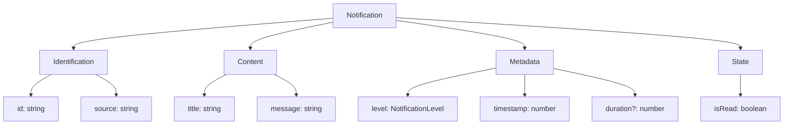

# Notification

Interface defining the structure and properties of a notification in the Open Space engine notification system.

## 🎯 Purpose

The `Notification` interface defines the complete structure and properties of a notification object in the Open Space engine notification system. It provides a standardized way to represent notifications with all necessary metadata including identification, content, severity level, timing, and source tracking.

## 🏗️ Architecture

The `Notification` interface follows a comprehensive data structure design that captures all essential notification metadata:



## 🚀 Core Features

### 1. Unique Identification

- **UUID Generation**: Uses `crypto.randomUUID()` for unique identifiers
- **Source Tracking**: Identifies the module or system that generated the notification
- **Timestamp Tracking**: Unix timestamp for creation time and relative time calculations

### 2. Rich Content Structure

- **Title**: Concise, descriptive heading for the notification
- **Message**: Detailed content providing additional context
- **Severity Levels**: Four distinct levels (info, success, warning, error)

### 3. Flexible Lifecycle Management

- **Auto-Dismissal**: Optional duration-based automatic dismissal
- **Read Status**: Boolean flag for user acknowledgment tracking
- **Permanent Notifications**: Support for notifications that persist until manually dismissed

### 4. Type Safety and Validation

- **TypeScript Interface**: Full type safety with comprehensive property definitions
- **Optional Properties**: Flexible duration property for different notification types
- **Enum-Based Levels**: Type-safe notification level definitions

## 📊 Technical Specifications

### Interface Definition

```typescript
export interface Notification {
  id: string;
  title: string;
  message: string;
  level: NotificationLevel;
  timestamp: number;
  duration?: number;
  isRead: boolean;
  source: string;
}
```

### Property Specifications

### `id: string`

A unique identifier for the notification, generated using `crypto.randomUUID()`.

**Type**: `string`

**Example**: `"550e8400-e29b-41d4-a716-446655440000"`

**Usage**:

```typescript
// Use ID for notification management
notificationManager.removeNotification(notification.id);
notificationManager.markAsRead(notification.id);
```

### `title: string`

The main title or heading of the notification. Should be concise and descriptive.

**Type**: `string`

**Example**: `"System Status"`, `"Data Load Complete"`, `"Critical Error"`

**Usage**:

```typescript
const notification = notificationManager.addNotification({
  title: "Memory Warning",
  message: "Available memory is below 10%",
  level: "warning",
  source: "system-monitor",
});
```

### `message: string`

The detailed message content providing additional context about the notification.

**Type**: `string`

**Example**: `"All systems are operating normally"`, `"Failed to connect to data server"`

**Usage**:

```typescript
const notification = notificationManager.addNotification({
  title: "Connection Lost",
  message:
    "Lost connection to the simulation server. Attempting to reconnect...",
  level: "error",
  source: "network-manager",
});
```

### `level: NotificationLevel`

The severity level of the notification, determining its visual appearance and priority.

**Type**: `NotificationLevel` (union of `"info" | "success" | "warning" | "error"`)

**Values**:

- `"info"`: General information messages
- `"success"`: Successful operations or positive outcomes
- `"warning"`: Cautionary messages requiring attention
- `"error"`: Error conditions requiring immediate attention

**Usage**:

```typescript
// Info notification
notificationManager.addNotification({
  title: "System Update",
  message: "New version available",
  level: "info",
  source: "updater",
});

// Success notification
notificationManager.addNotification({
  title: "Save Complete",
  message: "Simulation state saved successfully",
  level: "success",
  source: "save-manager",
});

// Warning notification
notificationManager.addNotification({
  title: "Low Memory",
  message: "Available memory is below 20%",
  level: "warning",
  source: "system-monitor",
});

// Error notification
notificationManager.addNotification({
  title: "Load Failed",
  message: "Unable to load celestial data",
  level: "error",
  source: "data-loader",
});
```

### `timestamp: number`

The Unix timestamp (in milliseconds) when the notification was created.

**Type**: `number`

**Example**: `1703123456789` (corresponds to December 21, 2023)

**Usage**:

```typescript
// Display relative time
function getRelativeTime(timestamp: number): string {
  const now = Date.now();
  const diff = now - timestamp;
  const seconds = Math.floor(diff / 1000);
  const minutes = Math.floor(seconds / 60);
  const hours = Math.floor(minutes / 60);

  if (seconds < 60) return `${seconds}s ago`;
  if (minutes < 60) return `${minutes}m ago`;
  if (hours < 24) return `${hours}h ago`;
  return new Date(timestamp).toLocaleDateString();
}

// Usage in UI
const relativeTime = getRelativeTime(notification.timestamp);
```

### `duration?: number`

Optional duration in milliseconds before the notification auto-dismisses. If `0`, `undefined`, or not provided, the notification is permanent until manually dismissed.

**Type**: `number | undefined`

**Example**: `5000` (5 seconds), `30000` (30 seconds)

**Usage**:

```typescript
// Temporary notification (auto-dismisses after 5 seconds)
notificationManager.addNotification({
  title: "Quick Update",
  message: "This will disappear automatically",
  level: "info",
  source: "system",
  duration: 5000,
});

// Permanent notification (until manually dismissed)
notificationManager.addNotification({
  title: "Important Notice",
  message: "This requires user attention",
  level: "warning",
  source: "system",
  // No duration property
});
```

### `isRead: boolean`

A flag indicating if the user has dismissed or acknowledged the notification.

**Type**: `boolean`

**Default**: `false` (when notification is created)

**Usage**:

```typescript
// Check if notification is read
if (notification.isRead) {
  console.log("Notification has been acknowledged");
} else {
  console.log("Notification requires attention");
}

// Mark as read
notificationManager.markAsRead(notification.id);
```

### `source: string`

The source module or system that generated the notification. Used for filtering and debugging.

**Type**: `string`

**Example**: `"system-monitor"`, `"data-loader"`, `"network-manager"`, `"physics-engine"`

**Usage**:

```typescript
// Filter notifications by source
const systemNotifications = notifications.filter(
  (n) => n.source === "system-monitor",
);

// Create notification with source tracking
notificationManager.addNotification({
  title: "Physics Update",
  message: "Gravitational calculations completed",
  level: "info",
  source: "physics-engine",
});
```

## 💡 Usage Examples

### Creating Different Types of Notifications

```typescript
import { notificationManager } from "@teskooano/notifications";

// System status notification
const systemNotification = notificationManager.addNotification({
  title: "System Status",
  message: "All systems operational",
  level: "info",
  source: "system-monitor",
  duration: 10000,
});

// Success notification
const successNotification = notificationManager.addNotification({
  title: "Operation Complete",
  message: "Celestial data has been successfully loaded",
  level: "success",
  source: "data-loader",
  duration: 5000,
});

// Warning notification
const warningNotification = notificationManager.addNotification({
  title: "Performance Warning",
  message: "Frame rate is below optimal levels",
  level: "warning",
  source: "performance-monitor",
  duration: 15000,
});

// Error notification (permanent)
const errorNotification = notificationManager.addNotification({
  title: "Critical Error",
  message: "Failed to initialize rendering engine",
  level: "error",
  source: "renderer",
  // No duration - permanent until manually dismissed
});
```

### Notification Processing and Display

```typescript
import { notificationManager } from "@teskooano/notifications";

// Process notifications for display
function processNotifications(notifications: Notification[]) {
  return notifications.map((notification) => ({
    ...notification,
    relativeTime: getRelativeTime(notification.timestamp),
    isExpired:
      notification.duration &&
      Date.now() - notification.timestamp > notification.duration,
    priority: getPriority(notification.level),
  }));
}

function getPriority(level: NotificationLevel): number {
  switch (level) {
    case "error":
      return 4;
    case "warning":
      return 3;
    case "success":
      return 2;
    case "info":
      return 1;
    default:
      return 0;
  }
}

// Subscribe to notifications
notificationManager.notifications$.subscribe((notifications) => {
  const processed = processNotifications(notifications);
  const unread = processed.filter((n) => !n.isRead);
  const errors = processed.filter((n) => n.level === "error");

  console.log(
    `Total: ${processed.length}, Unread: ${unread.length}, Errors: ${errors.length}`,
  );
});
```

### Notification Filtering and Management

```typescript
import { notificationManager } from "@teskooano/notifications";

// Filter notifications by various criteria
function filterNotifications(
  notifications: Notification[],
  filters: {
    level?: NotificationLevel;
    source?: string;
    unreadOnly?: boolean;
    maxAge?: number;
  },
) {
  return notifications.filter((notification) => {
    if (filters.level && notification.level !== filters.level) return false;
    if (filters.source && notification.source !== filters.source) return false;
    if (filters.unreadOnly && notification.isRead) return false;
    if (filters.maxAge && Date.now() - notification.timestamp > filters.maxAge)
      return false;
    return true;
  });
}

// Usage examples
const errorNotifications = filterNotifications(notifications, {
  level: "error",
});
const systemNotifications = filterNotifications(notifications, {
  source: "system-monitor",
});
const unreadNotifications = filterNotifications(notifications, {
  unreadOnly: true,
});
const recentNotifications = filterNotifications(notifications, {
  maxAge: 60000,
}); // Last minute
```

## ⚡ Performance Considerations

### Efficiency

- **Lightweight Structure**: Minimal memory footprint with essential properties only
- **UUID Generation**: Efficient unique identifier generation using crypto.randomUUID()
- **Timestamp Optimization**: Single timestamp field for all time-related calculations
- **Optional Properties**: Duration property is optional to reduce memory usage

### Quality Metrics

- **Type Safety**: Full TypeScript support ensures compile-time validation
- **Consistency**: Standardized structure across all notification types
- **Flexibility**: Optional duration allows for both temporary and permanent notifications
- **Scalability**: Simple structure scales well with large numbers of notifications

### Performance Monitoring

- **Memory Usage**: Minimal object size for efficient storage and transmission
- **Creation Speed**: Fast object creation with minimal overhead
- **Serialization**: Easy JSON serialization for storage and network transmission
- **Validation**: Compile-time type checking reduces runtime errors

## 🔌 Integration Points

### Notification System Integration

- **NotificationManager**: Primary consumer of Notification interface
- **RxJS Observables**: Used in reactive notification state management
- **UI Components**: Consumed by notification display components
- **Storage Systems**: Serialized for persistence and state management

### Application Integration

- **Error Handling**: Used in global error handling systems
- **User Feedback**: Integrated with user interface feedback mechanisms
- **System Monitoring**: Used for system status and health notifications
- **Cross-Module Communication**: Enables communication between different application modules

## 🐛 Debug Features

### Validation

- **Type Safety**: TypeScript interface ensures compile-time validation
- **Required Properties**: All essential properties are required (except duration)
- **Source Tracking**: Source field enables debugging and filtering
- **Timestamp Validation**: Unix timestamp format for consistent time handling

### Monitoring

- **Unique Identification**: UUID enables tracking individual notifications
- **Read Status**: Boolean flag for monitoring user interaction
- **Source Attribution**: Source field for debugging notification origins
- **Duration Tracking**: Optional duration for monitoring auto-dismiss behavior

### Debugging Tools

- **JSON Serialization**: Easy debugging through JSON.stringify()
- **Property Access**: Direct property access for debugging and inspection
- **Type Checking**: TypeScript provides compile-time debugging assistance
- **Console Logging**: Simple structure enables easy console debugging

## 🔮 Future Enhancements

### Optimization Opportunities

- **Performance Optimization**: Further memory optimization and property reduction
- **Memory Optimization**: Advanced memory management strategies for large notification sets
- **Code Optimization**: Additional type safety improvements and validation
- **Architecture Optimization**: Enhanced interface design for better extensibility

### Potential Improvements

- **Rich Content**: Support for HTML or markdown content in messages
- **Priority System**: Numeric priority field for advanced sorting
- **Action Support**: Built-in action buttons or callbacks
- **Grouping**: Support for notification grouping and categorization

## 📚 Related Documentation

- [[app/notifications/NotificationLevel|NotificationLevel]] - Type union for notification severity levels
- [[app/notifications/NotificationManager|NotificationManager]] - Class for managing notification lifecycle
- [[app/notifications/NotificationManager|notificationManager]] - Singleton instance for global access
