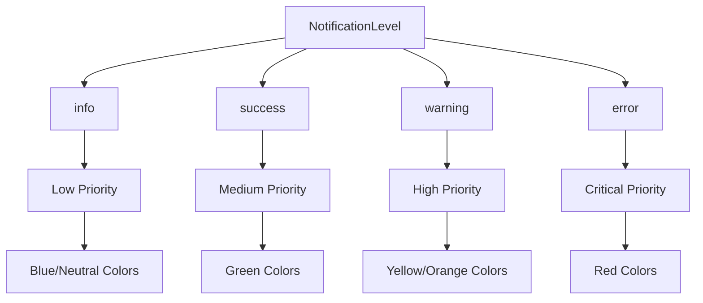

# NotificationLevel

Type union defining the severity levels for notifications in the Open Space engine notification system.

## 🎯 Purpose

The `NotificationLevel` type union defines the four severity levels available for notifications in the Open Space engine. It provides a type-safe way to categorize notifications by their importance and impact, enabling appropriate visual styling, priority handling, and user experience decisions.

## 🏗️ Architecture

The `NotificationLevel` type union follows a hierarchical severity design:



## 🚀 Core Features

### 1. Hierarchical Severity Levels

- **Info**: General information and status updates
- **Success**: Positive outcomes and successful operations
- **Warning**: Cautionary messages requiring attention
- **Error**: Critical issues requiring immediate attention

### 2. Visual and Behavioral Differentiation

- **Color Coding**: Each level has distinct visual characteristics
- **Priority Ordering**: Levels determine notification queue priority
- **Auto-Dismiss Behavior**: Different default durations per level
- **User Interaction**: Varying levels of user acknowledgment required

### 3. Type Safety and Validation

- **TypeScript Union**: Compile-time type checking for level values
- **Enum-Like Behavior**: String literal types with IDE autocomplete
- **Validation Support**: Easy validation of level values
- **Refactoring Safety**: Type-safe refactoring across the codebase

## 📊 Technical Specifications

### Type Definition

```typescript
export type NotificationLevel = "info" | "success" | "warning" | "error";
```

### Level Specifications

### `"info"`

General information messages that provide status updates or non-critical information.

**Usage**: System status updates, progress notifications, general announcements

**Visual Characteristics**:

- Typically displayed with blue or neutral colors
- Lower priority in notification queues
- Often auto-dismiss after a short duration

**Examples**:

```typescript
notificationManager.addNotification({
  title: "System Update",
  message: "New version available for download",
  level: "info",
  source: "updater",
});

notificationManager.addNotification({
  title: "Progress Update",
  message: "Loading celestial data... 75% complete",
  level: "info",
  source: "data-loader",
});
```

### `"success"`

Positive outcomes and successful operations that confirm something has completed successfully.

**Usage**: Successful saves, completed operations, positive confirmations

**Visual Characteristics**:

- Typically displayed with green colors
- Medium priority in notification queues
- Often auto-dismiss after a moderate duration

**Examples**:

```typescript
notificationManager.addNotification({
  title: "Save Complete",
  message: "Simulation state saved successfully",
  level: "success",
  source: "save-manager",
});

notificationManager.addNotification({
  title: "Connection Established",
  message: "Successfully connected to simulation server",
  level: "success",
  source: "network-manager",
});
```

### `"warning"`

Cautionary messages that indicate potential issues or situations requiring attention.

**Usage**: Performance warnings, degraded functionality, attention-required situations

**Visual Characteristics**:

- Typically displayed with yellow or orange colors
- Higher priority in notification queues
- May persist longer or require user acknowledgment

**Examples**:

```typescript
notificationManager.addNotification({
  title: "Performance Warning",
  message: "Frame rate is below optimal levels",
  level: "warning",
  source: "performance-monitor",
});

notificationManager.addNotification({
  title: "Low Memory",
  message: "Available memory is below 20%",
  level: "warning",
  source: "system-monitor",
});
```

### `"error"`

Error conditions that indicate failures or critical issues requiring immediate attention.

**Usage**: Failed operations, critical errors, system failures

**Visual Characteristics**:

- Typically displayed with red colors
- Highest priority in notification queues
- Usually persistent until manually dismissed
- May include error sounds or visual emphasis

**Examples**:

```typescript
notificationManager.addNotification({
  title: "Load Failed",
  message: "Unable to load celestial data from server",
  level: "error",
  source: "data-loader",
});

notificationManager.addNotification({
  title: "Critical Error",
  message: "Rendering engine initialization failed",
  level: "error",
  source: "renderer",
});
```

## 💡 Usage Examples

### Level-Based Filtering

```typescript
import { notificationManager } from "@teskooano/notifications";

// Filter notifications by level
function getNotificationsByLevel(level: NotificationLevel) {
  return notificationManager.notifications$
    .getValue()
    .filter((notification) => notification.level === level);
}

// Get all error notifications
const errorNotifications = getNotificationsByLevel("error");

// Get all warning notifications
const warningNotifications = getNotificationsByLevel("warning");
```

### Priority-Based Sorting

```typescript
import { notificationManager } from "@teskooano/notifications";

// Define priority order
const levelPriority: Record<NotificationLevel, number> = {
  error: 4,
  warning: 3,
  success: 2,
  info: 1,
};

// Sort notifications by priority
function sortNotificationsByPriority(notifications: Notification[]) {
  return notifications.sort(
    (a, b) => levelPriority[b.level] - levelPriority[a.level],
  );
}

// Usage
notificationManager.notifications$.subscribe((notifications) => {
  const sorted = sortNotificationsByPriority(notifications);
  // Display sorted notifications in UI
});
```

### Level-Based Styling

```typescript
// CSS classes based on notification level
function getNotificationClass(level: NotificationLevel): string {
  switch (level) {
    case 'error':
      return 'notification notification--error';
    case 'warning':
      return 'notification notification--warning';
    case 'success':
      return 'notification notification--success';
    case 'info':
      return 'notification notification--info';
    default:
      return 'notification';
  }
}

// Usage in React component
function NotificationItem({ notification }: { notification: Notification }) {
  return (
    <div className={getNotificationClass(notification.level)}>
      <h4>{notification.title}</h4>
      <p>{notification.message}</p>
    </div>
  );
}
```

### Level-Based Auto-Dismiss Behavior

```typescript
import { notificationManager } from "@teskooano/notifications";

// Default durations based on level
const defaultDurations: Record<NotificationLevel, number> = {
  info: 5000, // 5 seconds
  success: 8000, // 8 seconds
  warning: 15000, // 15 seconds
  error: 0, // No auto-dismiss
};

// Create notification with level-appropriate duration
function createNotification(
  title: string,
  message: string,
  level: NotificationLevel,
  source: string,
  customDuration?: number,
) {
  const duration = customDuration ?? defaultDurations[level];

  return notificationManager.addNotification({
    title,
    message,
    level,
    source,
    duration: duration > 0 ? duration : undefined,
  });
}

// Usage
createNotification(
  "System Status",
  "All systems operational",
  "info",
  "system-monitor",
);
createNotification(
  "Save Complete",
  "Data saved successfully",
  "success",
  "save-manager",
);
createNotification(
  "Low Memory",
  "Memory usage is high",
  "warning",
  "system-monitor",
);
createNotification(
  "Critical Error",
  "System failure",
  "error",
  "system-monitor",
);
```

### Level-Based Sound and Visual Effects

```typescript
// Sound effects based on notification level
function playNotificationSound(level: NotificationLevel) {
  const sounds = {
    info: "notification-info.wav",
    success: "notification-success.wav",
    warning: "notification-warning.wav",
    error: "notification-error.wav",
  };

  const audio = new Audio(sounds[level]);
  audio.play().catch(console.error);
}

// Visual effects based on notification level
function addNotificationEffect(level: NotificationLevel) {
  switch (level) {
    case "error":
      // Flash screen or show error overlay
      document.body.classList.add("error-flash");
      setTimeout(() => document.body.classList.remove("error-flash"), 500);
      break;
    case "warning":
      // Subtle pulse effect
      document.body.classList.add("warning-pulse");
      setTimeout(() => document.body.classList.remove("warning-pulse"), 1000);
      break;
    case "success":
      // Success animation
      document.body.classList.add("success-animation");
      setTimeout(
        () => document.body.classList.remove("success-animation"),
        800,
      );
      break;
    case "info":
      // No special effects for info notifications
      break;
  }
}
```

## ⚡ Performance Considerations

### Efficiency

- **Type Safety**: Compile-time type checking eliminates runtime level validation
- **String Literals**: Efficient string literal types with minimal memory overhead
- **Union Types**: Fast type checking and validation
- **IDE Support**: Autocomplete and type checking improve development efficiency

### Quality Metrics

- **Type Safety**: Full TypeScript support ensures compile-time validation
- **Consistency**: Standardized levels across the entire application
- **Maintainability**: Easy to add new levels or modify existing ones
- **Documentation**: Self-documenting through type definitions

### Performance Monitoring

- **Compile-Time Validation**: No runtime overhead for type checking
- **Memory Efficiency**: String literals have minimal memory footprint
- **Fast Comparison**: String comparison is highly optimized
- **Bundle Size**: Minimal impact on bundle size

## 🔌 Integration Points

### Notification System Integration

- **Notification Interface**: Used as the level property in Notification interface
- **NotificationManager**: Consumed by notification management system
- **UI Components**: Used for styling and behavior decisions
- **Filtering Systems**: Used for notification filtering and sorting

### Application Integration

- **Error Handling**: Integrated with global error handling systems
- **User Interface**: Used for visual styling and user experience decisions
- **Logging Systems**: Used for log level categorization
- **Analytics**: Used for notification analytics and reporting

## 🐛 Debug Features

### Validation

- **Type Safety**: TypeScript ensures only valid levels can be used
- **Compile-Time Checking**: Invalid levels are caught at compile time
- **IDE Support**: Autocomplete prevents typos and invalid values
- **Refactoring Safety**: Type-safe refactoring across the codebase

### Monitoring

- **Level Tracking**: Easy to track which levels are used most frequently
- **Usage Analytics**: Simple string values enable easy analytics
- **Debug Logging**: Level values can be easily logged for debugging
- **Performance Monitoring**: Minimal overhead for level checking

### Debugging Tools

- **Type Checking**: TypeScript provides compile-time debugging assistance
- **Console Logging**: Simple string values enable easy console debugging
- **Validation Functions**: Easy to create validation functions for levels
- **Testing Support**: Simple values make testing straightforward

## 🔮 Future Enhancements

### Optimization Opportunities

- **Performance Optimization**: Further type system optimizations
- **Memory Optimization**: Advanced memory management for level handling
- **Code Optimization**: Additional type safety improvements
- **Architecture Optimization**: Enhanced type system design

### Potential Improvements

- **Extended Levels**: Additional severity levels for more granular control
- **Custom Levels**: Support for custom application-specific levels
- **Level Metadata**: Additional metadata for each level
- **Internationalization**: Support for localized level names

## 📚 Related Documentation

- [[app/notifications/Notification|Notification]] - Interface that uses NotificationLevel
- [[app/notifications/NotificationManager|NotificationManager]] - Class that manages notifications with different levels
- [[app/notifications/NotificationManager|notificationManager]] - Singleton instance for global access
