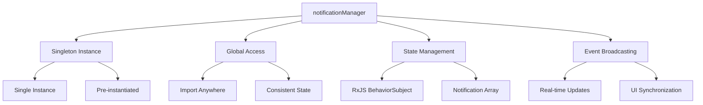

# notificationManager

A singleton instance of the `NotificationManager` class, providing global access to the notification system throughout the Open Space engine.

## 🎯 Purpose

The `notificationManager` is a pre-instantiated singleton that provides convenient global access to the notification system. Instead of creating new `NotificationManager` instances throughout the application, components can import and use this shared instance to ensure consistent notification state across the entire application.

## 🏗️ Architecture

The `notificationManager` follows a singleton pattern architecture for global notification management:



## 🚀 Core Features

### 1. Singleton Pattern Implementation

- **Global Access**: Single instance accessible throughout the application
- **Consistent State**: All components share the same notification state
- **Memory Efficiency**: Single instance reduces memory overhead
- **Simplified API**: No need to pass instances between components

### 2. Reactive State Management

- **RxJS Integration**: Built on BehaviorSubject for reactive updates
- **Real-time Updates**: Automatic UI updates when notifications change
- **State Persistence**: Maintains notification state across component lifecycles
- **Event Broadcasting**: Emits changes to all subscribed components

### 3. Comprehensive Notification Management

- **CRUD Operations**: Create, read, update, and delete notifications
- **Auto-Dismissal**: Configurable timeout-based automatic dismissal
- **Read Status Tracking**: Individual and bulk read status management
- **Source Tracking**: Track notification origins for debugging

### 4. Cross-Module Communication

- **Global Error Handling**: Centralized error notification system
- **System Integration**: Integrates with all application modules
- **Event Coordination**: Coordinates notifications across different systems
- **State Synchronization**: Ensures consistent state across modules

## 📊 Technical Specifications

### Object Definition

```typescript
export const notificationManager = new NotificationManager();
```

### Available Methods

The singleton provides all methods from the `NotificationManager` class:

```typescript
interface NotificationManager {
  addNotification(
    notification: Omit<Notification, "id" | "timestamp" | "isRead">,
  ): Notification;
  updateNotification(id: string, updates: Partial<Notification>): void;
  removeNotification(id: string): void;
  markAsRead(id: string): void;
  markAllAsRead(): void;
  clearAll(): void;
  dispose(): void;
  notifications$: BehaviorSubject<Notification[]>;
}
```

## 💡 Usage Examples

### Basic Import and Usage

```typescript
import { notificationManager } from "@teskooano/notifications";

// Create a notification
const notification = notificationManager.addNotification({
  title: "System Status",
  message: "All systems operational",
  level: "info",
  source: "system-monitor",
});

// Subscribe to notifications
notificationManager.notifications$.subscribe((notifications) => {
  console.log(`Active notifications: ${notifications.length}`);
});
```

### Global Notification Management

```typescript
import { notificationManager } from "@teskooano/notifications";

// Global error handling
function handleGlobalError(error: Error, source: string) {
  notificationManager.addNotification({
    title: "System Error",
    message: error.message,
    level: "error",
    source: source,
  });
}

// Global success notifications
function notifySuccess(title: string, message: string, source: string) {
  notificationManager.addNotification({
    title,
    message,
    level: "success",
    source,
    duration: 5000,
  });
}

// Global warning notifications
function notifyWarning(title: string, message: string, source: string) {
  notificationManager.addNotification({
    title,
    message,
    level: "warning",
    source,
    duration: 10000,
  });
}
```

### Cross-Module Communication

```typescript
// In data-loader module
import { notificationManager } from "@teskooano/notifications";

export class DataLoader {
  async loadCelestialData() {
    try {
      notificationManager.addNotification({
        title: "Loading Data",
        message: "Loading celestial data from server...",
        level: "info",
        source: "data-loader",
      });

      const data = await fetchData();

      notificationManager.addNotification({
        title: "Data Loaded",
        message: "Celestial data loaded successfully",
        level: "success",
        source: "data-loader",
        duration: 5000,
      });

      return data;
    } catch (error) {
      notificationManager.addNotification({
        title: "Load Failed",
        message: `Failed to load data: ${error.message}`,
        level: "error",
        source: "data-loader",
      });
      throw error;
    }
  }
}
```

```typescript
// In physics-engine module
import { notificationManager } from "@teskooano/notifications";

export class PhysicsEngine {
  update() {
    const frameTime = this.calculateFrameTime();

    if (frameTime > 16.67) {
      // Below 60 FPS
      notificationManager.addNotification({
        title: "Performance Warning",
        message: `Frame time: ${frameTime.toFixed(2)}ms (target: 16.67ms)`,
        level: "warning",
        source: "physics-engine",
        duration: 10000,
      });
    }
  }
}
```

### UI Component Integration

```typescript
import { notificationManager } from '@teskooano/notifications';
import { useEffect, useState } from 'react';

function NotificationPanel() {
  const [notifications, setNotifications] = useState([]);

  useEffect(() => {
    const subscription = notificationManager.notifications$.subscribe(
      setNotifications
    );

    return () => subscription.unsubscribe();
  }, []);

  const handleMarkAsRead = (id: string) => {
    notificationManager.markAsRead(id);
  };

  const handleDismiss = (id: string) => {
    notificationManager.removeNotification(id);
  };

  const handleMarkAllAsRead = () => {
    notificationManager.markAllAsRead();
  };

  const handleClearAll = () => {
    notificationManager.clearAll();
  };

  return (
    <div className="notification-panel">
      <div className="notification-header">
        <h3>Notifications ({notifications.filter(n => !n.isRead).length} unread)</h3>
        <div className="notification-actions">
          <button onClick={handleMarkAllAsRead}>Mark All Read</button>
          <button onClick={handleClearAll}>Clear All</button>
        </div>
      </div>

      <div className="notification-list">
        {notifications.map(notification => (
          <div
            key={notification.id}
            className={`notification ${notification.level} ${notification.isRead ? 'read' : 'unread'}`}
          >
            <div className="notification-content">
              <h4>{notification.title}</h4>
              <p>{notification.message}</p>
              <span className="notification-source">{notification.source}</span>
              <span className="notification-time">
                {new Date(notification.timestamp).toLocaleTimeString()}
              </span>
            </div>

            <div className="notification-actions">
              {!notification.isRead && (
                <button onClick={() => handleMarkAsRead(notification.id)}>
                  Mark as Read
                </button>
              )}
              <button onClick={() => handleDismiss(notification.id)}>
                Dismiss
              </button>
            </div>
          </div>
        ))}
      </div>
    </div>
  );
}
```

### Application Lifecycle Management

```typescript
import { notificationManager } from "@teskooano/notifications";

// Application startup
function initializeApplication() {
  notificationManager.addNotification({
    title: "Application Starting",
    message: "Initializing Open Space engine...",
    level: "info",
    source: "application",
    duration: 3000,
  });
}

// Application shutdown
function shutdownApplication() {
  notificationManager.addNotification({
    title: "Application Shutting Down",
    message: "Saving state and cleaning up resources...",
    level: "info",
    source: "application",
    duration: 2000,
  });

  // Clean up notification manager
  setTimeout(() => {
    notificationManager.dispose();
  }, 3000);
}

// Error boundary
function handleApplicationError(error: Error) {
  notificationManager.addNotification({
    title: "Application Error",
    message: `An unexpected error occurred: ${error.message}`,
    level: "error",
    source: "application",
  });
}
```

### Testing with Global Instance

```typescript
import { notificationManager } from "@teskooano/notifications";

describe("Global Notification Manager", () => {
  beforeEach(() => {
    // Clear all notifications before each test
    notificationManager.clearAll();
  });

  afterAll(() => {
    // Clean up after all tests
    notificationManager.dispose();
  });

  it("should maintain state across different modules", () => {
    // Simulate notification from different modules
    const dataLoaderNotification = notificationManager.addNotification({
      title: "Data Loaded",
      message: "Data loaded successfully",
      level: "success",
      source: "data-loader",
    });

    const physicsNotification = notificationManager.addNotification({
      title: "Physics Update",
      message: "Physics calculations complete",
      level: "info",
      source: "physics-engine",
    });

    const notifications = notificationManager.notifications$.getValue();
    expect(notifications).toHaveLength(2);
    expect(notifications[0].source).toBe("data-loader");
    expect(notifications[1].source).toBe("physics-engine");
  });
});
```

## ⚡ Performance Considerations

### Efficiency

- **Singleton Pattern**: Single instance reduces memory overhead and initialization costs
- **RxJS Optimization**: BehaviorSubject provides efficient state management
- **Automatic Cleanup**: Timeouts and resources are automatically managed
- **Global Access**: No need to pass instances around, reducing coupling

### Quality Metrics

- **Consistency**: All parts of the application share the same notification state
- **Reliability**: Single source of truth for notification management
- **Maintainability**: Centralized management simplifies maintenance
- **Scalability**: Efficient handling of large numbers of notifications

### Performance Monitoring

- **Memory Usage**: Single instance reduces memory footprint
- **State Updates**: Efficient reactive updates with minimal re-renders
- **Timeout Management**: Automatic cleanup prevents memory leaks
- **Event Broadcasting**: Optimized event emission to subscribers

## 🔌 Integration Points

### Application Integration

- **Global Error Handling**: Centralized error notification system
- **Cross-Module Communication**: Enables communication between different modules
- **UI Components**: Integrated with notification display components
- **System Monitoring**: Used for system status and health notifications

### Framework Integration

- **RxJS**: Built on BehaviorSubject for reactive programming
- **TypeScript**: Full type safety with comprehensive interfaces
- **React/Vue/Angular**: Compatible with all major frontend frameworks
- **Testing Frameworks**: Easy integration with testing systems

## 🐛 Debug Features

### Validation

- **Type Safety**: Full TypeScript support ensures compile-time validation
- **Source Tracking**: Source field enables debugging notification origins
- **State Inspection**: Access to internal state for debugging purposes
- **Error Handling**: Comprehensive error handling and logging

### Monitoring

- **Notification Tracking**: Easy to track notification lifecycle
- **State Monitoring**: Real-time state monitoring through RxJS
- **Performance Monitoring**: Built-in performance tracking capabilities
- **Usage Analytics**: Simple API enables usage analytics

### Debugging Tools

- **Console Logging**: Easy debugging through console methods
- **State Inspection**: Direct access to notification state
- **Event Tracing**: RxJS provides excellent debugging capabilities
- **Testing Support**: Easy to mock and test singleton behavior

## 🔮 Future Enhancements

### Optimization Opportunities

- **Performance Optimization**: Further RxJS optimizations and state management improvements
- **Memory Optimization**: Advanced memory management strategies
- **Code Optimization**: Additional type safety improvements
- **Architecture Optimization**: Enhanced singleton pattern implementation

### Potential Improvements

- **Persistence**: Support for notification persistence across sessions
- **Advanced Filtering**: More sophisticated notification filtering capabilities
- **Custom Themes**: Support for custom notification themes and styling
- **Analytics**: Built-in notification analytics and reporting

## 📚 Related Documentation

- [[app/notifications/NotificationManager|NotificationManager]] - The class that the singleton instance is based on
- [[app/notifications/Notification|Notification]] - Interface defining notification structure
- [[app/notifications/NotificationLevel|NotificationLevel]] - Type union for notification severity levels
