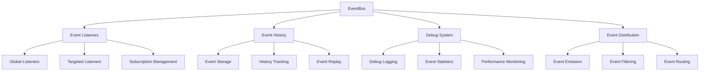
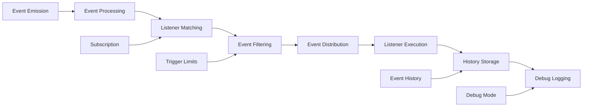

# EventBus

A singleton, type-light event bus for plugins and components. Supports namespacing via source/target, immediate replay of last event, trigger limits, history tracking, and debug logging for comprehensive event management.

## 🎯 Purpose

The EventBus serves as a centralized communication system for plugins and components within the UI plugin system. It provides a lightweight, efficient event management solution with advanced features like namespacing, immediate replay, trigger limits, and comprehensive debugging capabilities for decoupled component communication.

## 🏗️ Architecture

The EventBus follows a singleton pattern with advanced event management features:



## Class Definition

```typescript
export class EventBus {
  private static instance: EventBus;

  private listeners: Map<string, Map<string, EventSubscription>> = new Map();
  private globalListeners: Map<string, EventSubscription> = new Map();
  private lastEvents: Map<string, EventConfig> = new Map();
  private debugMode = false;
  private eventHistory: EventConfig[] = [];
  private maxHistorySize = 100;
  private subscriptionCounter = 0;
}
```

## Properties

### `listeners: Map<string, Map<string, EventSubscription>>`

Map of event types to subscription maps for targeted event handling.

### `globalListeners: Map<string, EventSubscription>`

Map of global listeners that receive all events.

### `lastEvents: Map<string, EventConfig>`

Map of the last emitted event for each event type (for immediate replay).

### `debugMode: boolean`

Whether debug logging is enabled.

### `eventHistory: EventConfig[]`

Array of recent events for debugging and analysis.

### `maxHistorySize: number`

Maximum number of events to keep in history.

## Methods

### `static getInstance(): EventBus`

Gets the singleton instance of the EventBus.

**Returns**: `EventBus` - The singleton instance

**Example**:

```typescript
const eventBus = EventBus.getInstance();
```

### `setDebugMode(enabled: boolean): void`

Enables or disables debug mode for detailed event logging.

**Parameters**:

- `enabled`: `boolean` - Whether to enable debug mode

**Example**:

```typescript
eventBus.setDebugMode(true);
// Now all events will be logged to console
```

### `emit(eventType: string, payload?: any, options?: Partial<EventConfig>): void`

Emits an event to all registered listeners.

**Parameters**:

- `eventType`: `string` - The type of event to emit
- `payload`: `any` - Optional payload data
- `options`: `Partial<EventConfig>` - Optional event configuration

**Example**:

```typescript
// Simple event emission
eventBus.emit("object:selected", { objectId: "earth" });

// Event with source and target
eventBus.emit(
  "camera:focused",
  { objectId: "mars" },
  {
    source: "celestial-info-panel",
    target: "camera-controller",
  },
);

// Event with bubbles
eventBus.emit(
  "system:error",
  { error: "Connection failed" },
  {
    source: "network-manager",
    bubbles: true,
  },
);
```

### `on(eventType: string, listener: EventListener, options?: SubscriptionOptions): () => void`

Registers a listener for a specific event type.

**Parameters**:

- `eventType`: `string` - The event type to listen for
- `listener`: `EventListener` - The callback function
- `options`: `SubscriptionOptions` - Optional subscription options

**Returns**: `() => void` - Unsubscribe function

**Example**:

```typescript
// Basic event listener
const unsubscribe = eventBus.on("object:selected", (event) => {
  console.log("Object selected:", event.payload);
});

// Listener with options
const unsubscribe = eventBus.on(
  "camera:moved",
  (event) => {
    console.log("Camera moved:", event.payload);
  },
  {
    source: "camera-controller",
    immediate: true,
    maxTriggers: 5,
  },
);

// Clean up
unsubscribe();
```

### `onAll(listener: EventListener, options?: SubscriptionOptions): () => void`

Registers a global listener that receives all events.

**Parameters**:

- `listener`: `EventListener` - The callback function
- `options`: `SubscriptionOptions` - Optional subscription options

**Returns**: `() => void` - Unsubscribe function

**Example**:

```typescript
// Global event monitor
const unsubscribe = eventBus.onAll((event) => {
  console.log(`Event: ${event.type}`, event.payload);
});

// Global listener with filtering
const unsubscribe = eventBus.onAll(
  (event) => {
    if (event.source === "error-handler") {
      logError(event.payload);
    }
  },
  {
    maxTriggers: 100,
  },
);
```

### `once(eventType: string, listener: EventListener, options?: SubscriptionOptions): void`

Registers a listener that will only be called once.

**Parameters**:

- `eventType`: `string` - The event type to listen for
- `listener`: `EventListener` - The callback function
- `options`: `SubscriptionOptions` - Optional subscription options

**Example**:

```typescript
// One-time listener
eventBus.once("app:ready", (event) => {
  console.log("Application is ready!");
});

// One-time listener with source filter
eventBus.once(
  "data:loaded",
  (event) => {
    console.log("Data loaded from:", event.source);
  },
  {
    source: "data-manager",
  },
);
```

### `off(eventType: string): void`

Removes all listeners for a specific event type.

**Parameters**:

- `eventType`: `string` - The event type to remove listeners for

**Example**:

```typescript
// Remove all listeners for an event type
eventBus.off("object:selected");
```

### `clear(): void`

Removes all listeners and clears the event history.

**Example**:

```typescript
// Clear all event listeners
eventBus.clear();
```

### `getEventHistory(limit?: number): EventConfig[]`

Gets the recent event history for debugging.

**Parameters**:

- `limit`: `number` - Optional limit on number of events to return

**Returns**: `EventConfig[]` - Array of recent events

**Example**:

```typescript
// Get last 10 events
const recentEvents = eventBus.getEventHistory(10);

// Get all events
const allEvents = eventBus.getEventHistory();
```

### `getStats(): EventBusStats`

Gets statistics about the event bus.

**Returns**: `EventBusStats` - Statistics object

**Example**:

```typescript
const stats = eventBus.getStats();
console.log("Event bus stats:", stats);
```

## Interfaces

### `EventConfig`

Configuration object for events.

```typescript
interface EventConfig {
  type: string;
  payload?: any;
  source?: string;
  target?: string;
  bubbles?: boolean;
  cancelable?: boolean;
  timestamp?: number;
  id?: string;
}
```

### `EventListener`

Function type for event listeners.

```typescript
type EventListener = (event: EventConfig) => void | Promise<void>;
```

### `SubscriptionOptions`

Options for event subscriptions.

```typescript
interface SubscriptionOptions {
  source?: string;
  target?: string;
  immediate?: boolean;
  maxTriggers?: number;
}
```

### `EventSubscription`

Internal subscription object.

```typescript
interface EventSubscription {
  listener: EventListener;
  options: SubscriptionOptions;
  triggerCount: number;
  id: string;
}
```

## Usage Examples

### Basic Event Communication

```typescript
import { EventBus } from "@teskooano/ui-plugin/patterns";

const eventBus = EventBus.getInstance();

// Component A emits events
class CelestialInfoPanel {
  selectObject(objectId: string) {
    eventBus.emit(
      "object:selected",
      {
        objectId,
        timestamp: Date.now(),
      },
      {
        source: "celestial-info-panel",
      },
    );
  }
}

// Component B listens for events
class CameraController {
  constructor() {
    eventBus.on("object:selected", (event) => {
      this.focusOnObject(event.payload.objectId);
    });
  }

  focusOnObject(objectId: string) {
    // Focus camera on object
    eventBus.emit(
      "camera:focused",
      { objectId },
      {
        source: "camera-controller",
      },
    );
  }
}
```

### Event Filtering and Options

```typescript
// Listen only to events from specific source
eventBus.on(
  "data:updated",
  (event) => {
    console.log("Data updated by:", event.source);
  },
  {
    source: "data-manager",
  },
);

// Listen with trigger limit
eventBus.on(
  "error:occurred",
  (event) => {
    console.error("Error:", event.payload);
  },
  {
    maxTriggers: 10, // Only handle first 10 errors
  },
);

// Listen with immediate replay
eventBus.on(
  "app:state",
  (event) => {
    console.log("App state:", event.payload);
  },
  {
    immediate: true, // Get last emitted event immediately
  },
);
```

### Global Event Monitoring

```typescript
// Monitor all events for debugging
eventBus.onAll((event) => {
  console.log(`[${event.timestamp}] ${event.type}:`, {
    source: event.source,
    payload: event.payload,
  });
});

// Monitor specific event patterns
eventBus.onAll(
  (event) => {
    if (event.type.includes("error")) {
      logError(event);
    }
  },
  {
    maxTriggers: 50,
  },
);
```

### Event History and Debugging

```typescript
// Enable debug mode
eventBus.setDebugMode(true);

// Get event statistics
const stats = eventBus.getStats();
console.log("Event bus stats:", {
  totalListeners: stats.listenerCounts,
  globalListeners: stats.globalListeners,
  historySize: stats.eventHistory,
});

// Get recent events
const recentEvents = eventBus.getEventHistory(20);
recentEvents.forEach((event) => {
  console.log(`${event.type} from ${event.source}`);
});
```

### Component Lifecycle Integration

```typescript
class MyComponent {
  private unsubscribers: Array<() => void> = [];

  constructor() {
    // Set up event listeners
    this.unsubscribers.push(
      eventBus.on("object:selected", this.handleObjectSelected.bind(this)),
      eventBus.on("camera:moved", this.handleCameraMoved.bind(this)),
      eventBus.on("system:error", this.handleSystemError.bind(this)),
    );
  }

  private handleObjectSelected(event: EventConfig) {
    // Handle object selection
  }

  private handleCameraMoved(event: EventConfig) {
    // Handle camera movement
  }

  private handleSystemError(event: EventConfig) {
    // Handle system errors
  }

  disconnectedCallback() {
    // Clean up event listeners
    this.unsubscribers.forEach((unsubscribe) => unsubscribe());
  }
}
```

### Error Handling

```typescript
// Global error handling
eventBus.onAll((event) => {
  if (event.type === "error:occurred") {
    // Log error
    console.error("Application error:", event.payload);

    // Show user notification
    showErrorNotification(event.payload.message);

    // Report to error tracking service
    reportError(event.payload);
  }
});

// Component-specific error handling
eventBus.on(
  "data:error",
  (event) => {
    if (event.source === "data-loader") {
      // Handle data loading errors
      showDataError(event.payload);
    }
  },
  {
    maxTriggers: 5, // Limit error handling
  },
);
```

## Performance Characteristics

- **Efficient Lookups**: Uses Map data structures for O(1) event type lookups
- **Memory Management**: Automatic cleanup of expired subscriptions
- **History Limiting**: Configurable history size prevents memory leaks
- **Debug Mode**: Optional detailed logging for development

## Best Practices

1. **Use Source/Target**: Always specify source for events to enable filtering
2. **Clean Up Listeners**: Always unsubscribe from events in component cleanup
3. **Limit Triggers**: Use maxTriggers for error handlers and one-time operations
4. **Enable Debug Mode**: Use debug mode during development for event tracking
5. **Event Naming**: Use consistent naming conventions (domain:action)

## 🔄 Data Flow

The EventBus follows a systematic data flow for event management:



### Processing Pipeline

1. **Event Emission**: Components emit events with type, payload, and options
2. **Event Processing**: EventBus processes event and creates EventConfig
3. **Listener Matching**: Find all listeners registered for the event type
4. **Event Filtering**: Apply source/target filtering and trigger limits
5. **Event Distribution**: Distribute event to matching listeners
6. **Listener Execution**: Execute listener functions with event data
7. **History Storage**: Store event in history for debugging and replay
8. **Debug Logging**: Log event details if debug mode is enabled

## 📊 Technical Specifications

### Interface/Type Definitions

```typescript
interface EventConfig {
  type: string;
  payload?: any;
  source?: string;
  target?: string;
  bubbles?: boolean;
  cancelable?: boolean;
  timestamp?: number;
  id?: string;
}

interface EventListener {
  (event: EventConfig): void | Promise<void>;
}

interface SubscriptionOptions {
  source?: string;
  target?: string;
  immediate?: boolean;
  maxTriggers?: number;
}

interface EventSubscription {
  listener: EventListener;
  options: SubscriptionOptions;
  triggerCount: number;
  id: string;
}

interface EventBusStats {
  listenerCounts: Map<string, number>;
  globalListeners: number;
  eventHistory: number;
  totalEvents: number;
}
```

### Configuration Options

```typescript
interface EventBusConfig {
  enableDebugMode?: boolean;
  maxHistorySize?: number;
  enableEventReplay?: boolean;
  enableStatistics?: boolean;
}
```

## ⚡ Performance Considerations

### Efficiency

- **Efficient Lookups**: Uses Map data structures for O(1) event type lookups
- **Memory Management**: Automatic cleanup of expired subscriptions
- **History Limiting**: Configurable history size prevents memory leaks
- **Debug Mode**: Optional detailed logging for development
- **Event Filtering**: Efficient filtering reduces unnecessary listener calls

### Quality Metrics

- **Accuracy**: Precise event distribution and listener matching
- **Reliability**: Robust error handling and graceful degradation
- **Consistency**: Standardized event behavior across all components
- **Scalability**: Efficient handling of high-frequency events

### Performance Monitoring

- **Event Rate Metrics**: Measurement of event emission and processing rates
- **Memory Usage Monitoring**: Tracking of event history and listener memory usage
- **Error Rate Monitoring**: Monitoring of event processing failures
- **Statistics Tracking**: Real-time monitoring of event bus statistics

## 🔌 Integration Points

### Primary Integration

- **Plugin System**: Integration with plugin communication and state management
- **Component Communication**: Integration with component event handling
- **Debug System**: Integration with development debugging tools

### Secondary Integration

- **State Management**: Integration with reactive state management patterns
- **Error Handling**: Integration with comprehensive error reporting
- **Development Tools**: Integration with development workflow and debugging

## 🐛 Debug Features

### Validation

- **Event Validation**: Comprehensive validation of event data and structure
- **Listener Validation**: Validation of event listeners and subscriptions
- **Subscription Validation**: Validation of subscription options and limits
- **Runtime Validation**: Runtime validation of event processing

### Monitoring

- **Event Monitoring**: Real-time monitoring of event emission and processing
- **Error Monitoring**: Comprehensive error tracking and reporting for event failures
- **Performance Monitoring**: Monitoring of event processing performance metrics
- **Statistics Monitoring**: Monitoring of event bus statistics and usage

### Debugging Tools

- **Debug Mode**: Comprehensive debug mode with detailed event logging
- **Event Inspector**: Tools for inspecting event history and statistics
- **Listener Visualizer**: Visualization of event listeners and subscriptions
- **Event Reporter**: Detailed reporting of event processing operations

## 🔮 Future Enhancements

### Optimization Opportunities

- **Performance Optimization**: Enhanced event processing algorithms and caching
- **Memory Optimization**: Improved memory management for event history and listeners
- **Code Optimization**: Enhanced event distribution strategies and reduced overhead
- **Architecture Optimization**: Improved event management and distribution

### Potential Improvements

- **Event Persistence**: Potential for persistent event storage and replay
- **Advanced Filtering**: Enhanced event filtering and routing capabilities
- **Event Analytics**: Analytics and usage tracking for event patterns
- **Advanced Debugging**: Enhanced debugging tools and development experience

## 📚 Related Documentation

- [[ReactiveState]] - Integrates with EventBus for state management
- [[PluginManager]] - Uses EventBus for plugin communication
- [[Events]] - Predefined event types and payloads
- [[createComponentState]] - Uses EventBus for automatic event handling
- [[Types]] - Type definitions and interfaces for the plugin system
