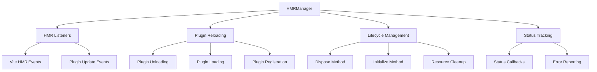
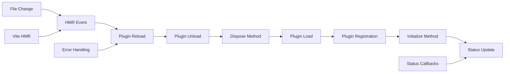

# HMRManager

Handles Hot Module Replacement (HMR) functionality for plugins during development. Manages the reload/unload/dispose lifecycle, ensuring smooth plugin updates without requiring full page reloads.

## 🎯 Purpose

The HMRManager is responsible for managing Hot Module Replacement functionality for plugins during development. It handles the complete lifecycle of plugin reloading, including unloading existing plugins, loading new versions, and managing the dispose/initialize cycle to ensure smooth updates without requiring full page reloads.

## 🏗️ Architecture

The HMRManager follows an event-driven architecture with lifecycle management:



## Class Definition

```typescript
export class HMRManager {
  private pluginLoader: PluginLoader;
  private registrationManager: RegistrationManager;
  private pluginRegistry: Map<string, TeskooanoPlugin>;
  private onPluginStatusChange?: (status: any) => void;
  private onPluginsChanged?: () => void;

  constructor(
    pluginLoader: PluginLoader,
    registrationManager: RegistrationManager,
    pluginRegistry: Map<string, TeskooanoPlugin>,
  );
}
```

## Properties

### `pluginLoader: PluginLoader`

Reference to the PluginLoader for loading updated plugin modules.

### `registrationManager: RegistrationManager`

Reference to the RegistrationManager for unregistering and re-registering plugin contributions.

### `pluginRegistry: Map<string, TeskooanoPlugin>`

Reference to the plugin registry for tracking loaded plugins.

### `onPluginStatusChange?: (status: any) => void`

Optional callback for plugin status changes during HMR operations.

### `onPluginsChanged?: () => void`

Optional callback for when the plugin registry changes.

## Methods

### `setCallbacks(callbacks: { onPluginStatusChange?: (status: any) => void; onPluginsChanged?: () => void }): void`

Sets up callbacks for status changes and plugin updates.

**Parameters**:

- `callbacks.onPluginStatusChange`: `(status: any) => void` - Callback for status updates
- `callbacks.onPluginsChanged`: `() => void` - Callback for plugin registry changes

**Example**:

```typescript
hmrManager.setCallbacks({
  onPluginStatusChange: (status) => {
    console.log(`HMR Status: ${status.type} for plugin ${status.pluginId}`);
  },
  onPluginsChanged: () => {
    console.log("Plugin registry updated");
  },
});
```

### `reloadPlugin(pluginId: string): Promise<void>`

Reloads a plugin by unloading it and then loading it again.

**Parameters**:

- `pluginId`: `string` - The ID of the plugin to reload

**Returns**: `Promise<void>`

**Example**:

```typescript
await hmrManager.reloadPlugin("celestial-info");
```

**Behavior**:

- Emits "reloading" status
- Calls `unloadPlugin` to clean up existing version
- Calls `loadAndRegisterPlugin` to load new version
- Emits "reloaded" status on success
- Emits "reload_error" status on failure

### `unloadPlugin(pluginId: string): Promise<void>`

Unloads a plugin, calling its dispose method and removing all registrations.

**Parameters**:

- `pluginId`: `string` - The ID of the plugin to unload

**Returns**: `Promise<void>`

**Example**:

```typescript
await hmrManager.unloadPlugin("celestial-info");
```

**Behavior**:

- Emits "unloading" status
- Calls plugin's `dispose()` method if present
- Removes all plugin registrations
- Removes plugin from registry
- Emits "unloaded" status

## Internal Methods

### `setupHMRListeners(): void`

Sets up HMR listeners if running in development mode.

**Behavior**:

- Checks for `import.meta.hot` availability
- Listens for `teskooano-plugin-update` events
- Triggers plugin reload when events are received

**Example**:

```typescript
private setupHMRListeners(): void {
  if (import.meta.hot) {
    import.meta.hot.on(
      "teskooano-plugin-update",
      (data: { pluginId: string }) => {
        if (data.pluginId) {
          this.reloadPlugin(data.pluginId);
        }
      }
    );
  }
}
```

### `loadAndRegisterPlugin(pluginId: string): Promise<void>`

Loads and registers a single plugin.

**Parameters**:

- `pluginId`: `string` - The ID of the plugin to load

**Returns**: `Promise<void>`

**Behavior**:

- Uses PluginLoader to load the plugin
- Processes the plugin through RegistrationManager
- Calls plugin's `initialize()` method if present
- Emits status updates throughout the process

## Usage Examples

### Basic HMR Setup

```typescript
import { HMRManager } from "@teskooano/ui-plugin";

const hmrManager = new HMRManager(
  pluginLoader,
  registrationManager,
  pluginRegistry,
);

// Set up callbacks
hmrManager.setCallbacks({
  onPluginStatusChange: (status) => {
    console.log(`HMR: ${status.type} - ${status.pluginId}`);

    switch (status.type) {
      case "reloading":
        showLoadingIndicator(status.pluginId);
        break;
      case "reloaded":
        hideLoadingIndicator(status.pluginId);
        showSuccessMessage(`Plugin ${status.pluginId} reloaded`);
        break;
      case "reload_error":
        hideLoadingIndicator(status.pluginId);
        showErrorMessage(
          `Failed to reload ${status.pluginId}: ${status.error.message}`,
        );
        break;
    }
  },
  onPluginsChanged: () => {
    updatePluginList();
  },
});
```

### Manual Plugin Reloading

```typescript
// Reload a specific plugin
async function reloadPlugin(pluginId: string) {
  try {
    await hmrManager.reloadPlugin(pluginId);
    console.log(`Plugin ${pluginId} reloaded successfully`);
  } catch (error) {
    console.error(`Failed to reload plugin ${pluginId}:`, error);
  }
}

// Unload a plugin
async function unloadPlugin(pluginId: string) {
  try {
    await hmrManager.unloadPlugin(pluginId);
    console.log(`Plugin ${pluginId} unloaded successfully`);
  } catch (error) {
    console.error(`Failed to unload plugin ${pluginId}:`, error);
  }
}
```

### Plugin with Dispose Method

```typescript
// Plugin that properly handles disposal
export const plugin: TeskooanoPlugin = {
  id: "resource-intensive-plugin",
  name: "Resource Intensive Plugin",

  initialize: () => {
    // Set up resources
    this.eventListeners = [
      window.addEventListener("resize", this.handleResize),
      document.addEventListener("keydown", this.handleKeydown),
    ];

    this.intervals = [
      setInterval(this.updateData, 1000),
      setInterval(this.cleanupCache, 5000),
    ];

    this.websocket = new WebSocket("ws://localhost:8080");
    this.websocket.onmessage = this.handleMessage;
  },

  dispose: () => {
    // Clean up resources
    this.eventListeners.forEach((remove) => remove());
    this.intervals.forEach(clearInterval);

    if (this.websocket) {
      this.websocket.close();
    }

    console.log("Plugin resources cleaned up");
  },
};
```

### HMR Status Monitoring

```typescript
// Monitor HMR status for debugging
hmrManager.setCallbacks({
  onPluginStatusChange: (status) => {
    const timestamp = new Date().toISOString();
    console.log(`[${timestamp}] HMR Status:`, {
      type: status.type,
      pluginId: status.pluginId,
      error: status.error?.message,
    });

    // Track HMR performance
    if (status.type === "reloading") {
      this.hmrStartTime = Date.now();
    } else if (status.type === "reloaded") {
      const duration = Date.now() - this.hmrStartTime;
      console.log(`HMR completed in ${duration}ms`);
    }
  },
});
```

## HMR Flow

The HMR process follows this sequence:

1. **File Change Detection**: Vite detects a plugin file change
2. **HMR Event**: Vite sends `teskooano-plugin-update` event
3. **Plugin Reload**: HMRManager receives event and calls `reloadPlugin`
4. **Unload Phase**:
   - Emit "unloading" status
   - Call plugin's `dispose()` method
   - Remove all registrations
   - Remove from plugin registry
   - Emit "unloaded" status
5. **Load Phase**:
   - Emit "registering" status
   - Load new plugin module
   - Register plugin contributions
   - Call plugin's `initialize()` method
   - Emit "registered" status
6. **Completion**: Emit "reloaded" status

## Error Handling

The HMRManager provides comprehensive error handling:

```typescript
// HMR error handling
hmrManager.setCallbacks({
  onPluginStatusChange: (status) => {
    if (status.type === "reload_error") {
      console.error(`HMR failed for plugin ${status.pluginId}:`, status.error);

      // Show user-friendly error message
      showNotification({
        title: "Plugin Reload Failed",
        message: `Failed to reload plugin ${status.pluginId}. Please check the console for details.`,
        type: "error",
      });
    } else if (status.type === "dispose_error") {
      console.error(
        `Dispose failed for plugin ${status.pluginId}:`,
        status.error,
      );
    }
  },
});
```

## Custom Elements Limitation

Due to browser limitations, custom elements cannot be unregistered:

```typescript
// HMR warning for custom elements
if (customElements.get(componentName)) {
  console.warn(
    `[HMR] Custom element '${componentName}' from plugin '${plugin.id}' is already defined. ` +
      `A full page reload may be required to see changes.`,
  );
}
```

## Performance Considerations

- **Fast Reloading**: Only reloads changed plugins, not the entire application
- **Resource Cleanup**: Proper disposal prevents memory leaks
- **Error Recovery**: Continues operation even if individual plugins fail to reload
- **Status Tracking**: Provides detailed status information for debugging

## Development Workflow

1. **Make Changes**: Edit plugin source files
2. **Save File**: Vite detects changes
3. **HMR Trigger**: Vite sends HMR event
4. **Plugin Reload**: HMRManager handles reload
5. **UI Update**: Application reflects changes

## 🔄 Data Flow

The HMRManager follows a systematic data flow for Hot Module Replacement:



### Processing Pipeline

1. **File Change**: Vite detects plugin file change
2. **HMR Event**: Vite sends `teskooano-plugin-update` event
3. **Plugin Reload**: HMRManager receives event and triggers reload
4. **Plugin Unload**: Unload existing plugin version
5. **Dispose Method**: Call plugin's dispose method for cleanup
6. **Plugin Load**: Load new plugin version
7. **Plugin Registration**: Register new plugin contributions
8. **Initialize Method**: Call plugin's initialize method
9. **Status Update**: Emit status updates and completion

## 📊 Technical Specifications

### Interface/Type Definitions

```typescript
interface HMRCallbacks {
  onPluginStatusChange?: (status: PluginRegistrationStatus) => void;
  onPluginsChanged?: () => void;
}

type PluginRegistrationStatus =
  | { type: "reloading"; pluginId: string }
  | { type: "reloaded"; pluginId: string }
  | { type: "reload_error"; pluginId: string; error: Error }
  | { type: "unloading"; pluginId: string }
  | { type: "unloaded"; pluginId: string }
  | { type: "disposing"; pluginId: string }
  | { type: "disposed"; pluginId: string }
  | { type: "dispose_error"; pluginId: string; error: any };

interface TeskooanoPlugin {
  id: string;
  name: string;
  initialize?: (...args: any[]) => void;
  dispose?: () => void;
  // ... other plugin properties
}
```

### Configuration Options

```typescript
interface HMRManagerConfig {
  enableHMR?: boolean;
  enableStatusCallbacks?: boolean;
  enableErrorHandling?: boolean;
  maxReloadRetries?: number;
}
```

## ⚡ Performance Considerations

### Efficiency

- **Fast Reloading**: Only reloads changed plugins, not the entire application
- **Resource Cleanup**: Proper disposal prevents memory leaks
- **Error Recovery**: Continues operation even if individual plugins fail to reload
- **Status Tracking**: Provides detailed status information for debugging
- **Event-Driven**: Efficient event-based architecture for HMR

### Quality Metrics

- **Accuracy**: Precise plugin reloading with proper lifecycle management
- **Reliability**: Robust error handling and graceful degradation
- **Consistency**: Standardized HMR behavior across all plugins
- **Scalability**: Efficient handling of multiple plugin reloads

### Performance Monitoring

- **Reload Time Metrics**: Measurement of plugin reload and HMR times
- **Memory Usage Monitoring**: Tracking of memory usage during reloads
- **Error Rate Monitoring**: Monitoring of HMR failures and errors
- **Status Tracking**: Real-time monitoring of HMR status and progress

## 🔌 Integration Points

### Primary Integration

- **Vite HMR**: Integration with Vite's Hot Module Replacement system
- **PluginLoader**: Uses PluginLoader for loading updated plugin modules
- **RegistrationManager**: Uses RegistrationManager for plugin registration/unregistration

### Secondary Integration

- **Plugin Lifecycle**: Integration with plugin initialize/dispose methods
- **Error Handling**: Integration with comprehensive error reporting
- **Status Management**: Integration with plugin status tracking

## 🐛 Debug Features

### Validation

- **HMR Validation**: Comprehensive validation of HMR events and data
- **Plugin Validation**: Validation of plugin lifecycle methods
- **Status Validation**: Validation of HMR status updates
- **Runtime Validation**: Runtime validation of HMR operations

### Monitoring

- **HMR Status Monitoring**: Real-time monitoring of HMR states and progress
- **Error Monitoring**: Comprehensive error tracking and reporting for HMR failures
- **Performance Monitoring**: Monitoring of HMR performance metrics
- **Lifecycle Monitoring**: Monitoring of plugin lifecycle operations

### Debugging Tools

- **Debug Mode**: Comprehensive debug mode with detailed HMR logging
- **HMR Inspector**: Tools for inspecting HMR state and configuration
- **Lifecycle Visualizer**: Visualization of plugin lifecycle operations
- **Error Reporter**: Detailed error reporting for HMR failures

## 🔮 Future Enhancements

### Optimization Opportunities

- **Performance Optimization**: Enhanced HMR algorithms and faster reloading
- **Memory Optimization**: Improved memory management during HMR operations
- **Code Optimization**: Enhanced HMR strategies and reduced overhead
- **Architecture Optimization**: Improved HMR lifecycle management

### Potential Improvements

- **State Preservation**: Enhanced state preservation during plugin reloads
- **Parallel Reloading**: Potential for parallel reloading of independent plugins
- **HMR Analytics**: Analytics and usage tracking for HMR performance
- **Advanced Debugging**: Enhanced debugging tools and development experience

## 📚 Related Documentation

- [[PluginManager]] - Uses HMRManager for plugin reloading
- [[PluginLoader]] - Loads updated plugin modules
- [[RegistrationManager]] - Handles plugin registration/unregistration
- [[VitePlugin]] - Generates HMR events for plugin updates
- [[TeskooanoPlugin]] - Plugin configuration with dispose method
- [[Types]] - Type definitions and interfaces for the plugin system
