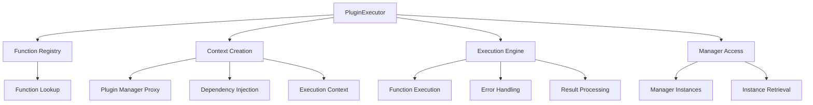
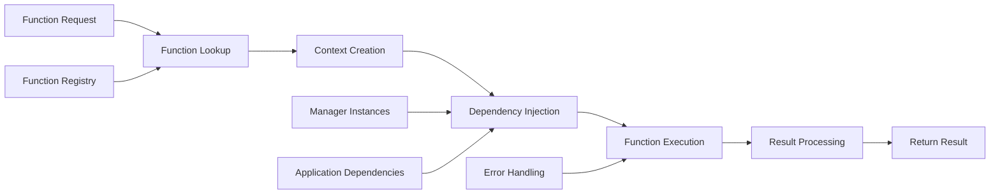

# PluginExecutor

Handles the execution of registered plugin functions with proper context injection and dependency management. Provides a clean interface for executing plugin functions while maintaining encapsulation and preventing circular dependencies.

## 🎯 Purpose

The PluginExecutor is responsible for executing registered plugin functions with proper context injection and dependency management. It provides a clean, encapsulated interface for function execution while maintaining separation of concerns and preventing circular dependencies through a proxy-based architecture.

## 🏗️ Architecture

The PluginExecutor follows a proxy-based architecture with context injection:



## Class Definition

```typescript
export class PluginExecutor {
  private functionRegistry: Map<string, RegisteredItem<FunctionConfig>>;
  private dockviewApi: DockviewApi | null = null;
  private dockviewController: any | null = null;
  private managerInstances: Map<string, { instance: any; pluginId: string }>;
  private registerPlugin: (plugin: TeskooanoPlugin) => void;
  private pluginsChanged$: Observable<void>;
  private getToolbarItemsForTarget: (
    target: ToolbarTarget,
  ) => ToolbarItemConfig[];
  private getToolbarWidgetsForTarget: (
    target: ToolbarTarget,
  ) => ToolbarWidgetConfig[];

  constructor(
    functionRegistry: Map<string, RegisteredItem<FunctionConfig>>,
    managerInstances: Map<string, { instance: any; pluginId: string }>,
    registerPlugin: (plugin: TeskooanoPlugin) => void,
    pluginsChanged$: Observable<void>,
    getToolbarItemsForTarget: (target: ToolbarTarget) => ToolbarItemConfig[],
    getToolbarWidgetsForTarget: (
      target: ToolbarTarget,
    ) => ToolbarWidgetConfig[],
  );
}
```

## Methods

### `setDependencies(deps: { dockviewApi: DockviewApi | null; dockviewController: any | null }): void`

Sets the core application dependencies that are injected into plugin execution contexts.

**Parameters**:

- `deps.dockviewApi`: `DockviewApi | null` - The Dockview API instance
- `deps.dockviewController`: `any | null` - The Dockview controller instance

**Example**:

```typescript
pluginExecutor.setDependencies({
  dockviewApi: dockviewApi,
  dockviewController: dockviewController,
});
```

### `execute<T = any>(functionId: string, args?: any): Promise<T> | T | undefined`

Executes a registered plugin function by ID with proper context injection.

**Parameters**:

- `functionId`: `string` - The ID of the function to execute
- `args`: `any` - Optional arguments to pass to the function

**Returns**: `Promise<T> | T | undefined` - The function result or undefined if not found

**Example**:

```typescript
// Execute a simple function
const result = await pluginExecutor.execute("data:save", { data: myData });

// Execute a function with no arguments
const status = pluginExecutor.execute("system:getStatus");

// Handle undefined result
const result = pluginExecutor.execute("unknown:function");
if (result === undefined) {
  console.log("Function not found");
}
```

**Behavior**:

- Looks up function in the registry
- Creates execution context with plugin manager proxy
- Injects dependencies (dockviewApi, dockviewController)
- Calls the function with context and arguments
- Handles both sync and async functions
- Provides error handling and logging

### `getManagerInstance<T = any>(id: string): T | undefined`

Gets a manager instance by its ID.

**Parameters**:

- `id`: `string` - The manager ID

**Returns**: `T | undefined` - The manager instance or undefined if not found

**Example**:

```typescript
const dataManager =
  pluginExecutor.getManagerInstance<DataManager>("data-manager");
if (dataManager) {
  await dataManager.saveData(myData);
}

const cacheManager =
  pluginExecutor.getManagerInstance<CacheManager>("cache-manager");
if (cacheManager) {
  cacheManager.clear();
}
```

## Internal Methods

### `createPluginManagerProxy(): PluginManagerProxy`

Creates a proxy object that exposes only the necessary plugin manager methods to the execution context.

**Returns**: `PluginManagerProxy` - A limited interface for plugin execution

**Behavior**:

- Prevents circular dependencies
- Encapsulates the executor's role
- Provides safe access to plugin manager functionality

**Example**:

```typescript
private createPluginManagerProxy() {
  return {
    execute: this.execute.bind(this),
    getManagerInstance: this.getManagerInstance.bind(this),
    registerPlugin: this.registerPlugin,
    pluginsChanged$: this.pluginsChanged$,
    getToolbarItemsForTarget: this.getToolbarItemsForTarget,
    getToolbarWidgetsForTarget: this.getToolbarWidgetsForTarget,
  };
}
```

## Usage Examples

### Basic Function Execution

```typescript
import { PluginExecutor } from "@teskooano/ui-plugin";

const pluginExecutor = new PluginExecutor(
  functionRegistry,
  managerInstances,
  registerPlugin,
  pluginsChanged$,
  getToolbarItemsForTarget,
  getToolbarWidgetsForTarget,
);

// Set dependencies
pluginExecutor.setDependencies({
  dockviewApi: dockviewApi,
  dockviewController: dockviewController,
});

// Execute a data operation
const saveResult = await pluginExecutor.execute("data:save", {
  data: { name: "Earth", type: "planet" },
  format: "json",
});

// Execute a system operation
const systemStatus = pluginExecutor.execute("system:getStatus");
console.log("System status:", systemStatus);
```

### Function with Context Usage

```typescript
// Plugin function that uses the execution context
const dataSaveFunction: FunctionConfig = {
  id: "data:save",
  execute: async (context: PluginExecutionContext, args: any) => {
    const { dockviewApi, getManager } = context;

    // Use dockview API
    if (dockviewApi) {
      const panel = dockviewApi.getPanel("data-panel");
      if (panel) {
        panel.api.setTitle("Saving...");
      }
    }

    // Get manager instance
    const dataManager = getManager<DataManager>("data-manager");
    if (dataManager) {
      const result = await dataManager.save(args.data);

      // Update panel title
      if (dockviewApi) {
        const panel = dockviewApi.getPanel("data-panel");
        if (panel) {
          panel.api.setTitle("Data Saved");
        }
      }

      return result;
    }

    throw new Error("Data manager not available");
  },
};
```

### Error Handling

```typescript
// Function execution with error handling
try {
  const result = await pluginExecutor.execute("data:process", {
    input: largeDataSet,
    options: { validate: true },
  });

  if (result) {
    console.log("Processing completed:", result);
  } else {
    console.warn("Function returned no result");
  }
} catch (error) {
  console.error("Function execution failed:", error);

  // Handle specific error types
  if (error.message.includes("validation")) {
    showValidationError(error.message);
  } else if (error.message.includes("timeout")) {
    showTimeoutError();
  } else {
    showGenericError("An unexpected error occurred");
  }
}
```

### Manager Instance Access

```typescript
// Accessing manager instances through the executor
class DataService {
  constructor(private pluginExecutor: PluginExecutor) {}

  async saveData(data: any) {
    const dataManager =
      this.pluginExecutor.getManagerInstance<DataManager>("data-manager");
    if (!dataManager) {
      throw new Error("Data manager not available");
    }

    return await dataManager.save(data);
  }

  async loadData(id: string) {
    const dataManager =
      this.pluginExecutor.getManagerInstance<DataManager>("data-manager");
    if (!dataManager) {
      throw new Error("Data manager not available");
    }

    return await dataManager.load(id);
  }

  clearCache() {
    const cacheManager =
      this.pluginExecutor.getManagerInstance<CacheManager>("cache-manager");
    if (cacheManager) {
      cacheManager.clear();
    }
  }
}
```

### Function Composition

```typescript
// Function that calls other functions
const complexFunction: FunctionConfig = {
  id: "workflow:process",
  execute: async (context: PluginExecutionContext, args: any) => {
    const { executeFunction } = context;

    try {
      // Step 1: Validate data
      const validationResult = await executeFunction(
        "data:validate",
        args.data,
      );
      if (!validationResult.valid) {
        throw new Error(
          "Validation failed: " + validationResult.errors.join(", "),
        );
      }

      // Step 2: Process data
      const processedData = await executeFunction("data:process", {
        data: args.data,
        options: args.options,
      });

      // Step 3: Save data
      const saveResult = await executeFunction("data:save", {
        data: processedData,
        format: "json",
      });

      // Step 4: Notify completion
      await executeFunction("notification:show", {
        message: "Workflow completed successfully",
        type: "success",
      });

      return {
        success: true,
        result: saveResult,
        processedAt: new Date().toISOString(),
      };
    } catch (error) {
      // Notify error
      await executeFunction("notification:show", {
        message: "Workflow failed: " + error.message,
        type: "error",
      });

      throw error;
    }
  },
};
```

## Execution Context

The PluginExecutor creates a comprehensive execution context for plugin functions:

```typescript
interface PluginExecutionContext {
  /** Limited plugin manager interface for function execution */
  pluginManager: PluginManagerProxy;
  /** DockView API for panel management */
  dockviewApi: DockviewApi | null;
  /** DockView controller for advanced panel operations */
  dockviewController: any;
  /** Get a manager instance by ID */
  getManager: <T = any>(id: string) => T | undefined;
  /** Execute another plugin function */
  executeFunction: <T = any>(
    functionId: string,
    args?: any,
  ) => Promise<T> | T | undefined;
}
```

## Error Handling

The PluginExecutor provides comprehensive error handling:

```typescript
// Function not found
const result = pluginExecutor.execute("unknown:function");
if (result === undefined) {
  console.error("Function not found");
}

// Execution error
try {
  await pluginExecutor.execute("data:process", invalidData);
} catch (error) {
  console.error("Function execution failed:", error);
  // Error is logged by the executor
}
```

## Performance Characteristics

- **Efficient Lookups**: Uses Map for O(1) function registry lookups
- **Context Reuse**: Creates execution context once per function call
- **Memory Management**: No persistent state between executions
- **Error Isolation**: Function errors don't affect the executor

## Integration with PluginManager

The PluginExecutor is used internally by the PluginManager:

```typescript
// In PluginManager
public execute<T = any>(functionId: string, args?: any): Promise<T> | T | undefined {
  return this.#pluginExecutor.execute<T>(functionId, args);
}

public getManagerInstance<T = any>(id: string): T | undefined {
  return this.#pluginExecutor.getManagerInstance<T>(id);
}
```

## 🔄 Data Flow

The PluginExecutor follows a systematic data flow for function execution:



### Processing Pipeline

1. **Function Request**: Receive function ID and optional arguments
2. **Function Lookup**: Find function in registry by ID
3. **Context Creation**: Create execution context with plugin manager proxy
4. **Dependency Injection**: Inject application dependencies (dockviewApi, dockviewController)
5. **Function Execution**: Execute function with context and arguments
6. **Result Processing**: Handle function result and errors
7. **Return Result**: Return function result or undefined if not found

## 📊 Technical Specifications

### Interface/Type Definitions

```typescript
interface PluginExecutionContext {
  options?: Record<string, any>;
  pluginManager: PluginManagerProxy;
  dockviewApi: DockviewApi | null;
  dockviewController: any;
  getManager: <T = any>(id: string) => T | undefined;
  executeFunction: <T = any>(
    functionId: string,
    args?: any,
  ) => Promise<T> | T | undefined;
}

interface PluginManagerProxy {
  execute<T = any>(functionId: string, args?: any): Promise<T> | T | undefined;
  getManagerInstance<T = any>(id: string): T | undefined;
  registerPlugin(plugin: TeskooanoPlugin): void;
  pluginsChanged$: Observable<void>;
  getToolbarItemsForTarget(target: ToolbarTarget): ToolbarItemConfig[];
  getToolbarWidgetsForTarget(target: ToolbarTarget): ToolbarWidgetConfig[];
}

interface FunctionConfig {
  id: string;
  execute: PluginFunctionCallerSignature;
  dependencies?: FunctionDependencies;
}
```

### Configuration Options

```typescript
interface PluginExecutorConfig {
  enableContextValidation?: boolean;
  enableDependencyInjection?: boolean;
  enableErrorHandling?: boolean;
  maxExecutionDepth?: number;
}
```

## ⚡ Performance Considerations

### Efficiency

- **Efficient Lookups**: Uses Map for O(1) function registry lookups
- **Context Reuse**: Creates execution context once per function call
- **Memory Management**: No persistent state between executions
- **Error Isolation**: Function errors don't affect the executor
- **Proxy Optimization**: Minimal overhead for proxy-based context creation

### Quality Metrics

- **Accuracy**: Precise function execution with proper context injection
- **Reliability**: Robust error handling and graceful degradation
- **Consistency**: Standardized execution behavior across all functions
- **Scalability**: Efficient handling of complex function dependencies

### Performance Monitoring

- **Execution Time Metrics**: Measurement of function execution times
- **Context Creation Metrics**: Monitoring of context creation overhead
- **Error Rate Monitoring**: Monitoring of function execution failures
- **Memory Usage Monitoring**: Tracking of execution memory consumption

## 🔌 Integration Points

### Primary Integration

- **dockview-core**: Panel management and layout system integration
- **rxjs**: Reactive programming for state management and observables
- **Function Registry**: Integration with registered plugin functions

### Secondary Integration

- **Manager Instances**: Integration with plugin manager instances
- **Error Handling**: Integration with comprehensive error reporting
- **Context Management**: Integration with execution context management

## 🐛 Debug Features

### Validation

- **Function Validation**: Comprehensive validation of function existence and configuration
- **Context Validation**: Validation of execution context and dependencies
- **Dependency Validation**: Validation of injected dependencies
- **Runtime Validation**: Runtime validation of function execution

### Monitoring

- **Execution Status Monitoring**: Real-time monitoring of function execution states
- **Error Monitoring**: Comprehensive error tracking and reporting for execution failures
- **Performance Monitoring**: Monitoring of execution performance metrics
- **Context Monitoring**: Monitoring of execution context and state

### Debugging Tools

- **Debug Mode**: Comprehensive debug mode with detailed logging
- **Execution Inspector**: Tools for inspecting function execution state
- **Context Visualizer**: Visualization of execution context and dependencies
- **Error Reporter**: Detailed error reporting for execution failures

## 🔮 Future Enhancements

### Optimization Opportunities

- **Performance Optimization**: Enhanced execution algorithms and caching
- **Memory Optimization**: Improved memory management during execution
- **Code Optimization**: Enhanced execution strategies and reduced overhead
- **Architecture Optimization**: Improved context management and execution handling

### Potential Improvements

- **Parallel Execution**: Potential for parallel execution of independent functions
- **Enhanced Caching**: Improved caching strategies for execution results
- **Execution Analytics**: Analytics and usage tracking for function execution performance
- **Advanced Debugging**: Enhanced debugging tools and development experience

## 📚 Related Documentation

- [[PluginManager]] - Uses PluginExecutor for function execution
- [[RegistrationManager]] - Registers functions used by PluginExecutor
- [[PluginExecutionContext]] - Context interface for function execution
- [[FunctionConfig]] - Function configuration interface
- [[Types]] - Type definitions and interfaces for the plugin system
