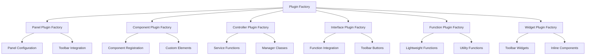
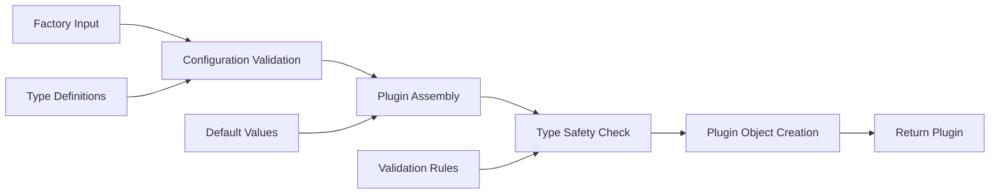

# Plugin Factory Functions

Factory functions for creating different types of Teskooano plugins with minimal boilerplate code. Each factory handles common patterns and configurations, reducing repetition and ensuring consistency across plugin definitions.

## 🎯 Purpose

The Plugin Factory Functions provide a set of utility functions for creating different types of Teskooano plugins with minimal boilerplate code. Each factory handles common patterns and configurations, reducing repetition and ensuring consistency across plugin definitions while providing type safety and validation.

## 🏗️ Architecture

The Plugin Factory Functions follow a factory pattern with specialized creators:



## Available Factories

- **`createPanelPlugin`** - Panel-based plugins with optional toolbar integration
- **`createComponentPlugin`** - Component-only plugins for reusable UI elements
- **`createControllerPlugin`** - Service plugins with functions and optional panels
- **`createInterfacePlugin`** - Function plugins with toolbar button integration
- **`createFunctionPlugin`** - Lightweight function-only plugins
- **`createWidgetPlugin`** - Toolbar widget plugins for inline functionality

## Factory Functions

### `createPanelPlugin(config: PanelPluginConfig): TeskooanoPlugin`

Creates a panel-based plugin with automatic toolbar integration and component registration.

**Parameters**:

- `config`: `PanelPluginConfig` - Configuration object defining the panel plugin

**Returns**: `TeskooanoPlugin` - Complete plugin ready for registration

**Example**:

```typescript
import { createPanelPlugin } from "@teskooano/ui-plugin";

export const plugin = createPanelPlugin({
  id: "celestial-info",
  name: "Celestial Info",
  description: "Display information about celestial objects",
  componentName: "celestial-info-panel",
  panelClass: CelestialInfoPanel,
  defaultTitle: "Celestial Info",
  iconSvg: infoIcon,
  target: "engine-toolbar",
  order: 100,
  tooltipText: "View detailed information about celestial objects",
  tooltipTitle: "Celestial Information",
});
```

**Configuration Options**:

```typescript
interface PanelPluginConfig {
  id: string;
  name: string;
  description: string;
  componentName: string;
  panelClass: any;
  defaultTitle: string;
  iconSvg: string;
  buttonTitle?: string;
  order?: number;
  target?: ToolbarTarget;
  additionalComponents?: ComponentConfig[];
  additionalFunctions?: any[];
  initialPosition?: {
    top: number;
    left: number;
    width: number;
    height: number;
  };
  tooltipText?: string;
  tooltipTitle?: string;
  tooltipIconSvg?: string;
}
```

### `createComponentPlugin(config: ComponentPluginConfig): TeskooanoPlugin`

Creates a component-only plugin that registers custom elements without panels or toolbars.

**Parameters**:

- `config`: `ComponentPluginConfig` - Configuration object defining the component plugin

**Returns**: `TeskooanoPlugin` - Complete plugin with only component registrations

**Example**:

```typescript
import { createComponentPlugin } from "@teskooano/ui-plugin";

export const plugin = createComponentPlugin({
  id: "ui-components",
  name: "UI Components",
  description: "Shared UI component library",
  components: [
    { tagName: "custom-button", componentClass: CustomButton },
    { tagName: "icon-display", componentClass: IconDisplay },
    { tagName: "data-table", componentClass: DataTable },
  ],
  managerClasses: [{ id: "ui-manager", managerClass: UIManager }],
});
```

**Configuration Options**:

```typescript
interface ComponentPluginConfig {
  id: string;
  name: string;
  description: string;
  components: ComponentConfig[];
  managerClasses?: ManagerConfig[];
  version?: string;
  icon?: string;
}
```

### `createControllerPlugin(config: ControllerPluginConfig): TeskooanoPlugin`

Creates a controller plugin that provides services, functions, and optional panels.

**Parameters**:

- `config`: `ControllerPluginConfig` - Configuration object defining the controller plugin

**Returns**: `TeskooanoPlugin` - Complete plugin with functions and optional panels

**Example**:

```typescript
import { createControllerPlugin } from "@teskooano/ui-plugin";

export const plugin = createControllerPlugin({
  id: "data-manager",
  name: "Data Manager",
  description: "Handles data persistence and synchronization",
  functions: [
    {
      id: "data:save",
      execute: async (context, data) => {
        const dataManager = context.getManager("data-manager");
        return await dataManager.save(data);
      },
    },
    {
      id: "data:load",
      execute: async (context, id) => {
        const dataManager = context.getManager("data-manager");
        return await dataManager.load(id);
      },
    },
  ],
  managerClasses: [{ id: "data-cache", managerClass: DataCacheManager }],
  panels: [
    {
      componentName: "data-manager-panel",
      panelClass: DataManagerPanel,
      defaultTitle: "Data Manager",
    },
  ],
});
```

**Configuration Options**:

```typescript
interface ControllerPluginConfig {
  id: string;
  name: string;
  description: string;
  functions: FunctionConfig[];
  panels?: PanelConfig[];
  managerClasses?: ManagerConfig[];
}
```

### `createInterfacePlugin(config: InterfacePluginConfig): TeskooanoPlugin`

Creates an interface plugin that provides functions with toolbar button integration.

**Parameters**:

- `config`: `InterfacePluginConfig` - Configuration object defining the interface plugin

**Returns**: `TeskooanoPlugin` - Complete plugin with functions and toolbar integration

**Example**:

```typescript
import { createInterfacePlugin } from "@teskooano/ui-plugin";

export const plugin = createInterfacePlugin({
  id: "quick-actions",
  name: "Quick Actions",
  description: "Common actions accessible from toolbar",
  functions: [
    {
      id: "action:export",
      execute: async (context) => {
        const data = await context.executeFunction("data:getAll");
        exportToFile(data);
      },
    },
    {
      id: "action:reset",
      execute: async (context) => {
        await context.executeFunction("system:reset");
      },
    },
  ],
  toolbarRegistrations: [
    {
      target: "main-toolbar",
      items: [
        {
          id: "export-btn",
          type: "function",
          functionId: "action:export",
          title: "Export Data",
          iconSvg: exportIcon,
          order: 10,
        },
        {
          id: "reset-btn",
          type: "function",
          functionId: "action:reset",
          title: "Reset System",
          iconSvg: resetIcon,
          order: 20,
        },
      ],
    },
  ],
});
```

**Configuration Options**:

```typescript
interface InterfacePluginConfig {
  id: string;
  name: string;
  description: string;
  functions: FunctionConfig[];
  toolbarRegistrations?: ToolbarRegistration[];
  managerClasses?: ManagerConfig[];
}
```

### `createFunctionPlugin(config: FunctionPluginConfig): TeskooanoPlugin`

Creates a lightweight plugin that only provides functions without any UI components.

**Parameters**:

- `config`: `FunctionPluginConfig` - Basic plugin configuration with functions array

**Returns**: `TeskooanoPlugin` - Complete plugin with only function registrations

**Example**:

```typescript
import { createFunctionPlugin } from "@teskooano/ui-plugin";

export const plugin = createFunctionPlugin({
  id: "math-utils",
  name: "Math Utilities",
  description: "Common mathematical functions",
  functions: [
    {
      id: "math:distance",
      execute: (context, p1, p2) => {
        const dx = p2.x - p1.x;
        const dy = p2.y - p1.y;
        const dz = p2.z - p1.z;
        return Math.sqrt(dx * dx + dy * dy + dz * dz);
      },
    },
    {
      id: "math:angle",
      execute: (context, v1, v2) => {
        const dot = v1.x * v2.x + v1.y * v2.y + v1.z * v2.z;
        const mag1 = Math.sqrt(v1.x * v1.x + v1.y * v1.y + v1.z * v1.z);
        const mag2 = Math.sqrt(v2.x * v2.x + v2.y * v2.y + v2.z * v2.z);
        return Math.acos(dot / (mag1 * mag2));
      },
    },
  ],
});
```

**Configuration Options**:

```typescript
interface FunctionPluginConfig {
  id: string;
  name: string;
  description: string;
  functions: any[];
}
```

### `createWidgetPlugin(config: WidgetPluginConfig): TeskooanoPlugin`

Creates a plugin that provides toolbar widgets without dedicated panels.

**Parameters**:

- `config`: `WidgetPluginConfig` - Configuration with components and toolbar widget definitions

**Returns**: `TeskooanoPlugin` - Complete plugin with widget registrations

**Example**:

```typescript
import { createWidgetPlugin } from "@teskooano/ui-plugin";

export const plugin = createWidgetPlugin({
  id: "status-widgets",
  name: "Status Widgets",
  description: "Real-time status indicators for toolbar",
  components: [
    { tagName: "fps-counter", componentClass: FPSCounter },
    { tagName: "memory-gauge", componentClass: MemoryGauge },
    { tagName: "connection-status", componentClass: ConnectionStatus },
  ],
  toolbarWidgets: [
    {
      id: "fps-widget",
      target: "main-toolbar",
      componentName: "fps-counter",
      order: 10,
    },
    {
      id: "memory-widget",
      target: "main-toolbar",
      componentName: "memory-gauge",
      order: 20,
    },
    {
      id: "connection-widget",
      target: "engine-toolbar",
      componentName: "connection-status",
      order: 30,
    },
  ],
});
```

**Configuration Options**:

```typescript
interface WidgetPluginConfig {
  id: string;
  name: string;
  description: string;
  components: ComponentConfig[];
  toolbarWidgets: ToolbarWidgetConfig[];
}
```

## Usage Examples

### Panel Plugin with Additional Components

```typescript
import { createPanelPlugin } from "@teskooano/ui-plugin";

export const plugin = createPanelPlugin({
  id: "advanced-celestial-info",
  name: "Advanced Celestial Info",
  description:
    "Advanced celestial object information with additional components",
  componentName: "advanced-celestial-info-panel",
  panelClass: AdvancedCelestialInfoPanel,
  defaultTitle: "Advanced Celestial Info",
  iconSvg: advancedInfoIcon,
  target: "engine-toolbar",
  order: 150,
  additionalComponents: [
    { tagName: "celestial-chart", componentClass: CelestialChart },
    { tagName: "orbital-visualizer", componentClass: OrbitalVisualizer },
  ],
  additionalFunctions: [
    {
      id: "celestial:export-chart",
      execute: async (context, chartData) => {
        return exportChart(chartData);
      },
    },
  ],
  tooltipText:
    "Advanced celestial object information with charts and visualizations",
  tooltipTitle: "Advanced Celestial Information",
});
```

### Controller Plugin with Multiple Managers

```typescript
import { createControllerPlugin } from "@teskooano/ui-plugin";

export const plugin = createControllerPlugin({
  id: "simulation-controller",
  name: "Simulation Controller",
  description: "Controls simulation state and physics",
  functions: [
    {
      id: "simulation:start",
      execute: async (context) => {
        const physicsManager = context.getManager("physics-manager");
        const stateManager = context.getManager("state-manager");
        await physicsManager.start();
        stateManager.setSimulationState("running");
      },
    },
    {
      id: "simulation:pause",
      execute: async (context) => {
        const physicsManager = context.getManager("physics-manager");
        const stateManager = context.getManager("state-manager");
        physicsManager.pause();
        stateManager.setSimulationState("paused");
      },
    },
    {
      id: "simulation:reset",
      execute: async (context) => {
        const physicsManager = context.getManager("physics-manager");
        const stateManager = context.getManager("state-manager");
        await physicsManager.reset();
        stateManager.setSimulationState("stopped");
      },
    },
  ],
  managerClasses: [
    { id: "physics-manager", managerClass: PhysicsManager },
    { id: "state-manager", managerClass: StateManager },
    { id: "event-manager", managerClass: EventManager },
  ],
  panels: [
    {
      componentName: "simulation-control-panel",
      panelClass: SimulationControlPanel,
      defaultTitle: "Simulation Controls",
    },
  ],
});
```

### Interface Plugin with Complex Toolbar

```typescript
import { createInterfacePlugin } from "@teskooano/ui-plugin";

export const plugin = createInterfacePlugin({
  id: "data-operations",
  name: "Data Operations",
  description: "Data import, export, and management operations",
  functions: [
    {
      id: "data:import",
      execute: async (context, file) => {
        const data = await parseFile(file);
        await context.executeFunction("data:validate", data);
        await context.executeFunction("data:save", data);
        return { success: true, imported: data.length };
      },
    },
    {
      id: "data:export",
      execute: async (context, format) => {
        const data = await context.executeFunction("data:getAll");
        return exportData(data, format);
      },
    },
    {
      id: "data:clear",
      execute: async (context) => {
        await context.executeFunction("data:clearAll");
        await context.executeFunction("system:reset");
      },
    },
  ],
  toolbarRegistrations: [
    {
      target: "main-toolbar",
      items: [
        {
          id: "import-btn",
          type: "function",
          functionId: "data:import",
          title: "Import Data",
          iconSvg: importIcon,
          order: 10,
          tooltipText: "Import data from file",
          tooltipTitle: "Import Data",
        },
        {
          id: "export-btn",
          type: "function",
          functionId: "data:export",
          title: "Export Data",
          iconSvg: exportIcon,
          order: 20,
          tooltipText: "Export data to file",
          tooltipTitle: "Export Data",
        },
      ],
    },
    {
      target: "engine-toolbar",
      items: [
        {
          id: "clear-btn",
          type: "function",
          functionId: "data:clear",
          title: "Clear All",
          iconSvg: clearIcon,
          order: 100,
          tooltipText: "Clear all data and reset system",
          tooltipTitle: "Clear All Data",
        },
      ],
    },
  ],
});
```

## Benefits of Factory Functions

1. **Reduced Boilerplate**: Eliminates repetitive plugin configuration code
2. **Consistency**: Ensures consistent plugin structure across the application
3. **Type Safety**: Provides TypeScript interfaces for configuration validation
4. **Flexibility**: Supports all plugin types with appropriate defaults
5. **Maintainability**: Centralizes common patterns for easy updates

## Best Practices

1. **Choose Appropriate Factory**: Select the factory that best matches your plugin's purpose
2. **Use Descriptive IDs**: Use clear, namespaced IDs for plugins and functions
3. **Provide Descriptions**: Always include helpful descriptions for plugins
4. **Set Appropriate Order**: Use order values to control toolbar item placement
5. **Include Tooltips**: Provide tooltip text for better user experience

## 🔄 Data Flow

The Plugin Factory Functions follow a systematic data flow for plugin creation:



### Processing Pipeline

1. **Factory Input**: Receive configuration object for specific plugin type
2. **Configuration Validation**: Validate input configuration against type definitions
3. **Plugin Assembly**: Assemble plugin object with provided and default values
4. **Type Safety Check**: Ensure plugin object matches TeskooanoPlugin interface
5. **Plugin Object Creation**: Create complete plugin configuration object
6. **Return Plugin**: Return ready-to-use plugin configuration

## 📊 Technical Specifications

### Interface/Type Definitions

```typescript
interface PanelPluginConfig {
  id: string;
  name: string;
  description: string;
  componentName: string;
  panelClass: any;
  defaultTitle: string;
  iconSvg: string;
  buttonTitle?: string;
  order?: number;
  target?: ToolbarTarget;
  additionalComponents?: ComponentConfig[];
  additionalFunctions?: any[];
  initialPosition?: {
    top: number;
    left: number;
    width: number;
    height: number;
  };
  tooltipText?: string;
  tooltipTitle?: string;
  tooltipIconSvg?: string;
}

interface ComponentPluginConfig {
  id: string;
  name: string;
  description: string;
  components: ComponentConfig[];
  managerClasses?: ManagerConfig[];
  version?: string;
  icon?: string;
}

interface ControllerPluginConfig {
  id: string;
  name: string;
  description: string;
  functions: FunctionConfig[];
  panels?: PanelConfig[];
  managerClasses?: ManagerConfig[];
}
```

### Configuration Options

```typescript
interface PluginFactoryConfig {
  enableTypeValidation?: boolean;
  enableDefaultValues?: boolean;
  enableConfigurationValidation?: boolean;
  strictMode?: boolean;
}
```

## ⚡ Performance Considerations

### Efficiency

- **Reduced Boilerplate**: Eliminates repetitive plugin configuration code
- **Type Safety**: Provides TypeScript interfaces for configuration validation
- **Consistent Patterns**: Ensures consistent plugin structure across the application
- **Default Values**: Provides sensible defaults to reduce configuration overhead
- **Validation**: Built-in validation prevents common configuration errors

### Quality Metrics

- **Accuracy**: Precise plugin creation with proper type validation
- **Reliability**: Robust validation and error handling
- **Consistency**: Standardized plugin structure across all factory functions
- **Scalability**: Efficient handling of complex plugin configurations

### Performance Monitoring

- **Creation Time Metrics**: Measurement of plugin creation and validation times
- **Memory Usage Monitoring**: Tracking of plugin object memory usage
- **Validation Monitoring**: Monitoring of configuration validation performance
- **Error Rate Monitoring**: Monitoring of plugin creation failures

## 🔌 Integration Points

### Primary Integration

- **Plugin System**: Integration with plugin registration and management
- **Type System**: Integration with TypeScript type definitions
- **Configuration Management**: Integration with plugin configuration system

### Secondary Integration

- **Validation System**: Integration with configuration validation
- **Error Handling**: Integration with comprehensive error reporting
- **Development Tools**: Integration with development workflow and debugging

## 🐛 Debug Features

### Validation

- **Configuration Validation**: Comprehensive validation of plugin configurations
- **Type Validation**: Validation of plugin type definitions and interfaces
- **Factory Validation**: Validation of factory function inputs and outputs
- **Runtime Validation**: Runtime validation of created plugin objects

### Monitoring

- **Creation Monitoring**: Real-time monitoring of plugin creation operations
- **Error Monitoring**: Comprehensive error tracking and reporting for creation failures
- **Performance Monitoring**: Monitoring of factory function performance metrics
- **Validation Monitoring**: Monitoring of configuration validation operations

### Debugging Tools

- **Debug Mode**: Comprehensive debug mode with detailed creation logging
- **Configuration Inspector**: Tools for inspecting plugin configurations
- **Validation Reporter**: Detailed reporting of configuration validation
- **Factory Inspector**: Tools for inspecting factory function operations

## 🔮 Future Enhancements

### Optimization Opportunities

- **Performance Optimization**: Enhanced plugin creation algorithms and caching
- **Memory Optimization**: Improved memory management during plugin creation
- **Code Optimization**: Enhanced factory strategies and reduced overhead
- **Architecture Optimization**: Improved plugin creation and validation management

### Potential Improvements

- **Advanced Validation**: Enhanced configuration validation and error reporting
- **Plugin Templates**: Potential for plugin templates and code generation
- **Creation Analytics**: Analytics and usage tracking for plugin creation patterns
- **Advanced Debugging**: Enhanced debugging tools and development experience

## 📚 Related Documentation

- [[TeskooanoPlugin]] - Plugin configuration interface
- [[PanelConfig]] - Panel configuration interface
- [[FunctionConfig]] - Function configuration interface
- [[ComponentConfig]] - Component configuration interface
- [[Types]] - Type definitions and interfaces for the plugin system
