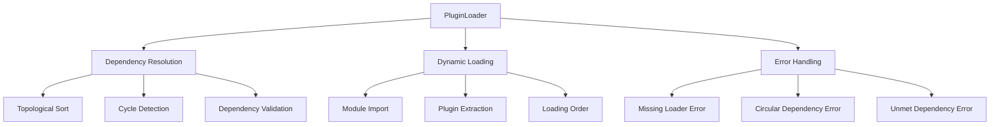
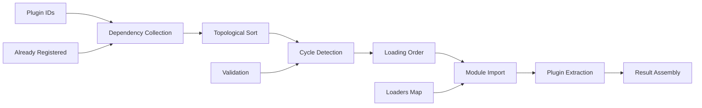

# PluginLoader

Handles the dynamic loading of plugin modules with sophisticated dependency resolution using topological sorting. Ensures plugins are loaded in the correct order based on their dependencies and prevents circular dependency issues.

## 🎯 Purpose

The PluginLoader is responsible for dynamically loading plugin modules with proper dependency resolution. It uses topological sorting algorithms to ensure plugins are loaded in the correct order based on their dependencies, preventing circular dependency issues and ensuring all required dependencies are available before a plugin is loaded.

## 🏗️ Architecture

The PluginLoader follows a dependency-first loading strategy with cycle detection:



## Class Definition

```typescript
export class PluginLoader {
  public async loadPlugins(
    pluginIds: string[],
    alreadyRegistered: Set<string> = new Set(),
  ): Promise<{
    loadedPlugins: Record<string, TeskooanoPlugin>;
    processingOrder: string[];
  }>;
}
```

## Methods

### `loadPlugins(pluginIds: string[], alreadyRegistered?: Set<string>): Promise<LoadResult>`

Loads plugins with proper dependency resolution using topological sorting.

**Parameters**:

- `pluginIds`: `string[]` - Array of plugin IDs to load
- `alreadyRegistered`: `Set<string>` - Set of already registered plugin IDs to avoid reloading

**Returns**: `Promise<LoadResult>` - Object containing loaded plugins and processing order

**Type Definition**:

```typescript
interface LoadResult {
  loadedPlugins: Record<string, TeskooanoPlugin>;
  processingOrder: string[];
}
```

**Example**:

```typescript
const pluginLoader = new PluginLoader();

const result = await pluginLoader.loadPlugins([
  "celestial-info",
  "system-controls",
  "data-manager",
]);

console.log("Loaded plugins:", Object.keys(result.loadedPlugins));
console.log("Processing order:", result.processingOrder);
```

**Behavior**:

- Performs topological sort to resolve dependencies
- Loads plugins in dependency order
- Handles circular dependency detection
- Skips already registered plugins
- Throws descriptive errors for missing loaders or unmet dependencies

## Internal Methods

### `performTopologicalSort(allRequestedIds: Set<string>, context: SortContext): Promise<void>`

Performs the core topological sorting algorithm to resolve plugin dependencies.

**Parameters**:

- `allRequestedIds`: `Set<string>` - All plugin IDs that need to be loaded
- `context`: `SortContext` - Context object containing loaders, registries, and state

**Type Definition**:

```typescript
interface SortContext {
  loaders: Record<string, () => Promise<any>>;
  loadedPlugins: Record<string, TeskooanoPlugin>;
  processingOrder: string[];
  alreadyRegistered: Set<string>;
}
```

**Behavior**:

- Uses depth-first search with cycle detection
- Maintains visited and processing sets to detect circular dependencies
- Resolves dependencies recursively
- Builds processing order based on dependency resolution

## Usage Examples

### Basic Plugin Loading

```typescript
import { PluginLoader } from "@teskooano/ui-plugin";

const pluginLoader = new PluginLoader();

// Load plugins with dependency resolution
const result = await pluginLoader.loadPlugins([
  "data-manager", // Has no dependencies
  "celestial-info", // Depends on data-manager
  "system-controls", // Depends on data-manager
]);

// Plugins are loaded in dependency order
console.log("Processing order:", result.processingOrder);
// Output: ['data-manager', 'celestial-info', 'system-controls']

// Access loaded plugins
Object.entries(result.loadedPlugins).forEach(([id, plugin]) => {
  console.log(`Loaded plugin: ${plugin.name} (${id})`);
});
```

### Handling Already Registered Plugins

```typescript
import { PluginLoader } from "@teskooano/ui-plugin";

const pluginLoader = new PluginLoader();

// Some plugins are already loaded
const alreadyRegistered = new Set(["core-utils", "base-components"]);

// Load additional plugins, skipping already registered ones
const result = await pluginLoader.loadPlugins(
  [
    "core-utils", // Will be skipped (already registered)
    "celestial-info", // Will be loaded
    "system-controls", // Will be loaded
  ],
  alreadyRegistered,
);

// Only new plugins are loaded
console.log("Newly loaded:", Object.keys(result.loadedPlugins));
// Output: ['celestial-info', 'system-controls']
```

### Error Handling

```typescript
import { PluginLoader } from "@teskooano/ui-plugin";

const pluginLoader = new PluginLoader();

try {
  const result = await pluginLoader.loadPlugins([
    "missing-plugin", // This will cause an error
    "valid-plugin",
  ]);
} catch (error) {
  if (error.message.includes("Loader for plugin")) {
    console.error("Plugin loader not found:", error.message);
  } else if (error.message.includes("Circular dependency")) {
    console.error("Circular dependency detected:", error.message);
  } else if (error.message.includes("unmet dependency")) {
    console.error("Missing dependency:", error.message);
  }
}
```

## Dependency Resolution Algorithm

The PluginLoader uses a sophisticated topological sorting algorithm:

### 1. Depth-First Search with Cycle Detection

```typescript
const resolve = async (pluginId: string): Promise<void> => {
  // Check for circular dependencies
  if (processing.has(pluginId)) {
    throw new Error(
      `Circular dependency detected involving plugin: ${pluginId}`,
    );
  }

  // Skip if already visited
  if (visited.has(pluginId)) return;

  // Mark as processing
  processing.add(pluginId);

  // Load the plugin module
  const loader = context.loaders[pluginId];
  if (!loader) {
    throw new Error(`Loader for plugin '${pluginId}' not found.`);
  }

  const module = await loader();
  const plugin = module.plugin as TeskooanoPlugin;
  context.loadedPlugins[pluginId] = plugin;

  // Resolve dependencies recursively
  if (plugin.dependencies) {
    for (const depId of plugin.dependencies) {
      await resolve(depId);
    }
  }

  // Mark as completed
  processing.delete(pluginId);
  visited.add(pluginId);
  context.processingOrder.push(pluginId);
};
```

### 2. Dependency Validation

```typescript
// Check if all dependencies are available
if (plugin.dependencies) {
  for (const depId of plugin.dependencies) {
    if (!allRequestedIds.has(depId) && !context.alreadyRegistered.has(depId)) {
      throw new Error(
        `Plugin '${pluginId}' has an unmet dependency: '${depId}'`,
      );
    }
  }
}
```

## Integration with PluginManager

The PluginLoader is used internally by the PluginManager:

```typescript
// In PluginManager.loadAndRegisterPlugins()
const { loadedPlugins, processingOrder } = await this.#pluginLoader.loadPlugins(
  pluginIds,
  new Set(this.#registries.pluginRegistry.keys()),
);

// Process plugins in dependency order
for (const id of processingOrder) {
  const plugin = loadedPlugins[id];
  if (plugin) {
    this.registerPlugin(plugin);
  }
}
```

## Virtual Module Integration

The PluginLoader relies on the virtual module generated by the Vite plugin:

```typescript
// virtual:teskooano-loaders (generated by Vite plugin)
export const pluginLoaders = {
  "celestial-info": () => import("/path/to/celestial-info/plugin.ts"),
  "system-controls": () => import("/path/to/system-controls/plugin.ts"),
  "data-manager": () => import("/path/to/data-manager/plugin.ts"),
};

// PluginLoader uses these loaders
const loaders = pluginLoaders as Record<string, () => Promise<any>>;
const loader = loaders[pluginId];
const module = await loader();
```

## Performance Characteristics

- **Efficient Dependency Resolution**: O(V + E) time complexity for topological sort
- **Cycle Detection**: Prevents infinite loops with processing set tracking
- **Lazy Loading**: Plugins are loaded only when needed
- **Memory Optimization**: Reuses already registered plugins
- **Error Early**: Fails fast on missing dependencies or circular references

## Error Types

### Missing Loader Error

```
Loader for plugin 'unknown-plugin' not found.
```

### Circular Dependency Error

```
Circular dependency detected involving plugin: plugin-a
```

### Unmet Dependency Error

```
Plugin 'plugin-b' has an unmet dependency: 'missing-plugin'
```

### Load Failure Error

```
Failed to load plugin 'plugin-c': [original error message]
```

## Best Practices

1. **Define Dependencies Clearly**: Always specify plugin dependencies in the plugin configuration
2. **Avoid Circular Dependencies**: Design plugin architecture to prevent circular references
3. **Handle Errors Gracefully**: Implement proper error handling for loading failures
4. **Use Already Registered Set**: Pass already registered plugins to avoid redundant loading
5. **Monitor Processing Order**: Use the processing order to understand dependency resolution

## 🔄 Data Flow

The PluginLoader follows a systematic data flow for dependency resolution and plugin loading:



### Processing Pipeline

1. **Plugin IDs**: Input array of plugin IDs to load
2. **Dependency Collection**: Gather all dependencies for requested plugins
3. **Topological Sort**: Sort plugins by dependency order using DFS algorithm
4. **Cycle Detection**: Detect and prevent circular dependencies
5. **Loading Order**: Determine optimal loading sequence
6. **Module Import**: Dynamically import plugin modules using loaders
7. **Plugin Extraction**: Extract plugin configuration from modules
8. **Result Assembly**: Return loaded plugins and processing order

## 📊 Technical Specifications

### Interface/Type Definitions

```typescript
interface LoadResult {
  loadedPlugins: Record<string, TeskooanoPlugin>;
  processingOrder: string[];
}

interface SortContext {
  loaders: Record<string, () => Promise<any>>;
  loadedPlugins: Record<string, TeskooanoPlugin>;
  processingOrder: string[];
  alreadyRegistered: Set<string>;
}

interface TeskooanoPlugin {
  id: string;
  name: string;
  description?: string;
  dependencies?: string[];
  // ... other plugin properties
}
```

### Configuration Options

```typescript
interface PluginLoaderConfig {
  enableCircularDependencyDetection?: boolean;
  enableDependencyValidation?: boolean;
  maxDependencyDepth?: number;
}
```

## ⚡ Performance Considerations

### Efficiency

- **Efficient Dependency Resolution**: O(V + E) time complexity for topological sort
- **Cycle Detection**: Prevents infinite loops with processing set tracking
- **Lazy Loading**: Plugins are loaded only when needed
- **Memory Optimization**: Reuses already registered plugins
- **Error Early**: Fails fast on missing dependencies or circular references

### Quality Metrics

- **Accuracy**: Precise dependency resolution and loading order
- **Reliability**: Robust cycle detection and error handling
- **Consistency**: Standardized loading behavior across all plugins
- **Scalability**: Efficient handling of complex dependency graphs

### Performance Monitoring

- **Loading Time Metrics**: Measurement of plugin loading and dependency resolution times
- **Dependency Graph Analysis**: Visualization of plugin dependencies and resolution order
- **Memory Usage Monitoring**: Tracking of plugin loading resource consumption
- **Error Rate Monitoring**: Monitoring of loading failures and dependency issues

## 🔌 Integration Points

### Primary Integration

- **PluginManager**: Uses PluginLoader for plugin loading operations
- **Virtual Modules**: Integration with Vite-generated plugin loaders
- **Dynamic Imports**: ES6 dynamic import for module loading

### Secondary Integration

- **Dependency Resolution**: Integration with plugin dependency management
- **Error Handling**: Integration with comprehensive error reporting
- **Development Tools**: Integration with development workflow and debugging

## 🐛 Debug Features

### Validation

- **Dependency Validation**: Validation of plugin dependencies and circular dependency detection
- **Loader Validation**: Validation of plugin loaders and module paths
- **Configuration Validation**: Validation of plugin configuration and structure
- **Runtime Validation**: Runtime validation of plugin loading and extraction

### Monitoring

- **Loading Status Monitoring**: Real-time monitoring of plugin loading states
- **Error Monitoring**: Comprehensive error tracking and reporting for loading failures
- **Performance Monitoring**: Monitoring of loading performance metrics and resource usage
- **Dependency Monitoring**: Monitoring of plugin dependencies and resolution status

### Debugging Tools

- **Debug Mode**: Comprehensive debug mode with detailed logging and state inspection
- **Dependency Visualizer**: Visualization of plugin dependency graphs
- **Loading Inspector**: Tools for inspecting plugin loading state and configuration
- **Error Reporter**: Detailed error reporting for loading failures

## 🔮 Future Enhancements

### Optimization Opportunities

- **Performance Optimization**: Enhanced dependency resolution algorithms and caching
- **Memory Optimization**: Improved memory management during plugin loading
- **Code Optimization**: Enhanced loading strategies and reduced overhead
- **Architecture Optimization**: Improved dependency resolution and loading management

### Potential Improvements

- **Parallel Loading**: Potential for parallel loading of independent plugins
- **Enhanced Caching**: Improved caching strategies for plugin modules
- **Loading Analytics**: Analytics and usage tracking for plugin loading performance
- **Advanced Debugging**: Enhanced debugging tools and development experience

## 📚 Related Documentation

- [[PluginManager]] - Uses PluginLoader for plugin loading
- [[RegistrationManager]] - Processes loaded plugins
- [[HMRManager]] - Uses PluginLoader for plugin reloading
- [[VitePlugin]] - Generates plugin loaders for dynamic import
- [[TeskooanoPlugin]] - Plugin configuration with dependencies
- [[Types]] - Type definitions and interfaces for the plugin system
