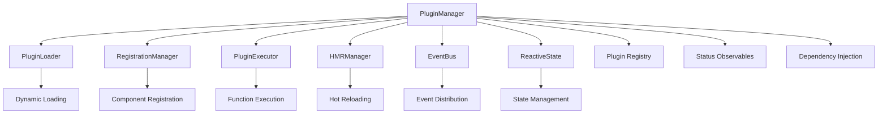
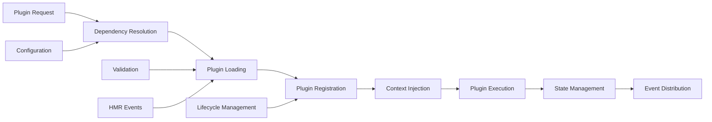

# PluginManager

The main singleton class that orchestrates the entire plugin system, managing plugin lifecycle, registration, execution, and state. Provides a centralized API for loading, registering, and interacting with plugins throughout the Open Space engine.

## 🎯 Purpose

The PluginManager serves as the central orchestrator for the entire UI plugin system. It manages the complete lifecycle of plugins from loading and registration through execution and disposal. As a singleton, it provides a unified interface for all plugin-related operations while maintaining system state and coordinating between different plugin management components.

## 🏗️ Architecture

The PluginManager follows a singleton pattern with delegated responsibilities to specialized manager classes:



## Class Definition

```typescript
class PluginManager implements PluginManagerProxy {
  public readonly pluginStatus$: Observable<PluginRegistrationStatus>;
  public readonly pluginsChanged$: Observable<void>;

  private static instance: PluginManager;
  private #registries: PluginRegistries;
  private #pluginLoader: PluginLoader;
  private #registrationManager: RegistrationManager;
  private #pluginExecutor: PluginExecutor;
  private #hmrManager: HMRManager;
  private #pluginStatusSubject: Subject<PluginRegistrationStatus>;
  private #pluginsChangedSubject: Subject<void>;
}
```

## Properties

### `pluginStatus$: Observable<PluginRegistrationStatus>`

A reactive stream that emits status updates during plugin loading, registration, and lifecycle events.

**Type**: `Observable<PluginRegistrationStatus>`

**Usage**:

```typescript
pluginManager.pluginStatus$.subscribe((status) => {
  switch (status.type) {
    case "loading_started":
      console.log(`Loading plugins: ${status.pluginIds.join(", ")}`);
      break;
    case "registered_plugin":
      console.log(`Plugin ${status.pluginId} registered successfully`);
      break;
    case "load_error":
      console.error(`Failed to load plugin ${status.pluginId}:`, status.error);
      break;
  }
});
```

### `pluginsChanged$: Observable<void>`

A reactive stream that emits when the plugin registry changes (plugins added, removed, or reloaded).

**Type**: `Observable<void>`

**Usage**:

```typescript
pluginManager.pluginsChanged$.subscribe(() => {
  // Update UI to reflect plugin changes
  updatePluginList();
});
```

## Methods

### `static getInstance(): PluginManager`

Gets the singleton instance of the PluginManager. Creates a new instance if none exists.

**Returns**: `PluginManager` - The singleton instance

**Example**:

```typescript
const pluginManager = PluginManager.getInstance();
```

### `setAppDependencies(deps: { dockviewApi: DockviewApi; dockviewController: any }): void`

Sets the core application dependencies that plugins can access through their execution context.

**Parameters**:

- `deps.dockviewApi`: `DockviewApi` - The Dockview API instance
- `deps.dockviewController`: `any` - The Dockview controller instance

**Example**:

```typescript
pluginManager.setAppDependencies({
  dockviewApi: dockviewApi,
  dockviewController: dockviewController,
});
```

**Behavior**:

- Must be called before loading plugins
- Propagates dependencies to all manager instances
- Updates the plugin executor context

### `registerPlugin(plugin: TeskooanoPlugin): void`

Registers a single plugin with the system. This is typically called internally during the loading process.

**Parameters**:

- `plugin`: `TeskooanoPlugin` - The plugin configuration object

**Example**:

```typescript
pluginManager.registerPlugin({
  id: "my-plugin",
  name: "My Plugin",
  panels: [
    /* ... */
  ],
  functions: [
    /* ... */
  ],
});
```

**Behavior**:

- Processes all plugin contributions (panels, functions, toolbar items, etc.)
- Instantiates manager classes
- Defines custom elements
- Calls the plugin's initialize method if present
- Emits status updates

### `loadAndRegisterPlugins(pluginIds: string[], passedArguments?: any): Promise<void>`

Loads and registers multiple plugins with proper dependency resolution.

**Parameters**:

- `pluginIds`: `string[]` - Array of plugin IDs to load
- `passedArguments`: `any` - Optional arguments to pass to plugin initialization

**Returns**: `Promise<void>`

**Example**:

```typescript
await pluginManager.loadAndRegisterPlugins([
  "celestial-info",
  "system-controls",
  "data-manager",
]);
```

**Behavior**:

- Performs topological sort to resolve dependencies
- Loads plugins in dependency order
- Registers each plugin's contributions
- Handles circular dependency detection
- Emits comprehensive status updates

### `reloadPlugin(pluginId: string): Promise<void>`

Reloads a specific plugin (Hot Module Replacement).

**Parameters**:

- `pluginId`: `string` - The ID of the plugin to reload

**Returns**: `Promise<void>`

**Example**:

```typescript
await pluginManager.reloadPlugin("my-plugin");
```

**Behavior**:

- Unloads the existing plugin (calls dispose if present)
- Loads the new version
- Re-registers all contributions
- Maintains plugin state where possible

### `unloadPlugin(pluginId: string): Promise<void>`

Unloads a specific plugin, cleaning up all its resources.

**Parameters**:

- `pluginId`: `string` - The ID of the plugin to unload

**Returns**: `Promise<void>`

**Example**:

```typescript
await pluginManager.unloadPlugin("my-plugin");
```

**Behavior**:

- Calls the plugin's dispose method if present
- Removes all registered contributions
- Cleans up manager instances
- Emits plugins changed event

### `getPlugins(): TeskooanoPlugin[]`

Gets all currently registered plugins.

**Returns**: `TeskooanoPlugin[]` - Array of registered plugin configurations

**Example**:

```typescript
const plugins = pluginManager.getPlugins();
console.log(`Loaded ${plugins.length} plugins`);
```

### `getPanelConfig(componentName: string): PanelConfig | undefined`

Gets the panel configuration for a specific component name.

**Parameters**:

- `componentName`: `string` - The component name to look up

**Returns**: `PanelConfig | undefined` - The panel configuration or undefined if not found

**Example**:

```typescript
const panelConfig = pluginManager.getPanelConfig("celestial-info-panel");
if (panelConfig) {
  console.log(`Panel title: ${panelConfig.defaultTitle}`);
}
```

### `getFunctionConfig(id: string): FunctionConfig | undefined`

Gets the function configuration for a specific function ID.

**Parameters**:

- `id`: `string` - The function ID to look up

**Returns**: `FunctionConfig | undefined` - The function configuration or undefined if not found

**Example**:

```typescript
const funcConfig = pluginManager.getFunctionConfig("data:save");
if (funcConfig) {
  console.log("Function found:", funcConfig.id);
}
```

### `execute<T = any>(functionId: string, args?: any): Promise<T> | T | undefined`

Executes a registered plugin function with proper context injection.

**Parameters**:

- `functionId`: `string` - The ID of the function to execute
- `args`: `any` - Optional arguments to pass to the function

**Returns**: `Promise<T> | T | undefined` - The function result or undefined if not found

**Example**:

```typescript
const result = await pluginManager.execute("data:save", { data: myData });
if (result) {
  console.log("Save successful:", result);
}
```

**Behavior**:

- Creates execution context with plugin manager proxy
- Injects dependencies (dockviewApi, dockviewController)
- Handles both sync and async functions
- Provides error handling and logging

### `getToolbarItemsForTarget(target: ToolbarTarget): ToolbarItemConfig[]`

Gets all toolbar items registered for a specific target.

**Parameters**:

- `target`: `ToolbarTarget` - The toolbar target ('main-toolbar' or 'engine-toolbar')

**Returns**: `ToolbarItemConfig[]` - Array of toolbar item configurations

**Example**:

```typescript
const items = pluginManager.getToolbarItemsForTarget("main-toolbar");
items.forEach((item) => {
  console.log(`Toolbar item: ${item.title} (${item.type})`);
});
```

### `getToolbarWidgetsForTarget(target: ToolbarTarget): ToolbarWidgetConfig[]`

Gets all toolbar widgets registered for a specific target.

**Parameters**:

- `target`: `ToolbarTarget` - The toolbar target

**Returns**: `ToolbarWidgetConfig[]` - Array of toolbar widget configurations

**Example**:

```typescript
const widgets = pluginManager.getToolbarWidgetsForTarget("engine-toolbar");
widgets.forEach((widget) => {
  console.log(`Widget: ${widget.componentName}`);
});
```

### `getManagerInstance<T = any>(id: string): T | undefined`

Gets a manager instance by its ID.

**Parameters**:

- `id`: `string` - The manager ID

**Returns**: `T | undefined` - The manager instance or undefined if not found

**Example**:

```typescript
const dataManager =
  pluginManager.getManagerInstance<DataManager>("data-manager");
if (dataManager) {
  await dataManager.saveData(myData);
}
```

## Usage Patterns

### Application Initialization

```typescript
import { PluginManager } from "@teskooano/ui-plugin";

async function initializeApplication() {
  const pluginManager = PluginManager.getInstance();

  // Set up status monitoring
  pluginManager.pluginStatus$.subscribe((status) => {
    updateLoadingUI(status);
  });

  pluginManager.pluginsChanged$.subscribe(() => {
    updatePluginList();
  });

  // Set dependencies
  pluginManager.setAppDependencies({
    dockviewApi: dockviewApi,
    dockviewController: dockviewController,
  });

  // Load plugins
  const pluginIds = ["core-features", "celestial-info", "system-controls"];
  await pluginManager.loadAndRegisterPlugins(pluginIds);

  console.log("Application initialized with plugins");
}
```

### Dynamic Plugin Loading

```typescript
import { PluginManager } from "@teskooano/ui-plugin";

class PluginLoader {
  private pluginManager = PluginManager.getInstance();

  async loadFeaturePlugin(featureId: string) {
    try {
      await this.pluginManager.loadAndRegisterPlugins([featureId]);
      console.log(`Feature ${featureId} loaded successfully`);
    } catch (error) {
      console.error(`Failed to load feature ${featureId}:`, error);
    }
  }

  async unloadFeaturePlugin(featureId: string) {
    try {
      await this.pluginManager.unloadPlugin(featureId);
      console.log(`Feature ${featureId} unloaded successfully`);
    } catch (error) {
      console.error(`Failed to unload feature ${featureId}:`, error);
    }
  }
}
```

### Function Execution

```typescript
import { PluginManager } from "@teskooano/ui-plugin";

class ActionHandler {
  private pluginManager = PluginManager.getInstance();

  async handleUserAction(actionId: string, data: any) {
    const result = await this.pluginManager.execute(actionId, data);

    if (result) {
      console.log("Action completed:", result);
      return result;
    } else {
      console.warn(`Action ${actionId} not found or failed`);
      return null;
    }
  }

  async saveData(data: any) {
    return this.pluginManager.execute("data:save", { data });
  }

  async loadData(id: string) {
    return this.pluginManager.execute("data:load", { id });
  }
}
```

### Toolbar Integration

```typescript
import { PluginManager } from "@teskooano/ui-plugin";

class ToolbarController {
  private pluginManager = PluginManager.getInstance();

  buildToolbar(target: string) {
    const items = this.pluginManager.getToolbarItemsForTarget(target);
    const widgets = this.pluginManager.getToolbarWidgetsForTarget(target);

    // Render toolbar items
    items.forEach((item) => {
      this.renderToolbarItem(item);
    });

    // Render toolbar widgets
    widgets.forEach((widget) => {
      this.renderToolbarWidget(widget);
    });
  }

  private renderToolbarItem(item: ToolbarItemConfig) {
    const button = document.createElement("button");
    button.textContent = item.title;
    button.onclick = () => this.handleToolbarItemClick(item);
    this.toolbar.appendChild(button);
  }

  private async handleToolbarItemClick(item: ToolbarItemConfig) {
    if (item.type === "function") {
      await this.pluginManager.execute(item.functionId);
    } else if (item.type === "panel") {
      this.openPanel(item.componentName);
    }
  }
}
```

## Error Handling

The PluginManager provides comprehensive error handling:

```typescript
pluginManager.pluginStatus$.subscribe((status) => {
  if (status.type === "load_error") {
    console.error(`Plugin ${status.pluginId} failed to load:`, status.error);
    showErrorNotification(`Failed to load plugin: ${status.pluginId}`);
  } else if (status.type === "dependency_error") {
    console.error(
      `Plugin ${status.pluginId} has unmet dependencies:`,
      status.missingDependencies,
    );
    showErrorNotification(
      `Missing dependencies: ${status.missingDependencies.join(", ")}`,
    );
  }
});
```

## Performance Considerations

- **Singleton Pattern**: Single instance reduces memory overhead
- **Lazy Loading**: Plugins are loaded only when requested
- **Dependency Resolution**: Efficient topological sorting prevents redundant loading
- **Resource Cleanup**: Proper disposal prevents memory leaks
- **HMR Optimization**: Fast plugin reloading during development

## Thread Safety

The PluginManager is designed for single-threaded JavaScript environments. All operations are synchronous or properly handled with Promises for async operations.

## 🔄 Data Flow

The PluginManager follows a systematic data flow for plugin lifecycle management:



### Processing Pipeline

1. **Plugin Request**: Application requests plugin loading with specific IDs
2. **Dependency Resolution**: PluginLoader resolves dependencies using topological sorting
3. **Plugin Loading**: Dynamic import of plugin modules with error handling
4. **Plugin Registration**: RegistrationManager processes all plugin contributions
5. **Context Injection**: Application dependencies injected into plugin context
6. **Plugin Execution**: PluginExecutor handles function calls with proper context
7. **State Management**: ReactiveState tracks plugin state and changes
8. **Event Distribution**: EventBus distributes plugin events throughout system

## 📊 Technical Specifications

### Interface/Type Definitions

```typescript
interface PluginManagerProxy {
  execute<T = any>(functionId: string, args?: any): Promise<T> | T | undefined;
  getManagerInstance<T = any>(id: string): T | undefined;
  registerPlugin(plugin: TeskooanoPlugin): void;
  pluginsChanged$: Observable<void>;
  getToolbarItemsForTarget(target: ToolbarTarget): ToolbarItemConfig[];
  getToolbarWidgetsForTarget(target: ToolbarTarget): ToolbarWidgetConfig[];
}

type PluginRegistrationStatus =
  | { type: "loading_started"; pluginIds: string[] }
  | { type: "registered_plugin"; pluginId: string }
  | { type: "load_error"; pluginId: string; error: Error }
  | {
      type: "dependency_error";
      pluginId: string;
      missingDependencies: string[];
    };
```

### Configuration Options

```typescript
interface PluginManagerConfig {
  enableHMR?: boolean;
  enableDebugMode?: boolean;
  dependencyResolution?: boolean;
  circularDependencyDetection?: boolean;
}
```

## ⚡ Performance Considerations

### Efficiency

- **Singleton Pattern**: Single instance reduces memory overhead and ensures consistency
- **Lazy Loading**: Plugins are loaded only when requested, reducing initial bundle size
- **Dependency Resolution**: Efficient topological sorting prevents redundant loading
- **Resource Cleanup**: Proper disposal prevents memory leaks during plugin unloading
- **HMR Optimization**: Fast plugin reloading during development without full page refresh

### Quality Metrics

- **Accuracy**: Plugin loading and execution with comprehensive error handling
- **Reliability**: Robust dependency resolution and circular dependency detection
- **Consistency**: Standardized plugin lifecycle management across all plugin types
- **Scalability**: Efficient handling of multiple plugins and complex dependency graphs

### Performance Monitoring

- **Plugin Status Tracking**: Real-time monitoring of plugin loading states through observables
- **Dependency Graph Analysis**: Visualization of plugin dependencies and resolution order
- **Memory Usage Monitoring**: Tracking of plugin resource consumption and cleanup
- **Load Time Metrics**: Measurement of plugin loading and initialization times

## 🔌 Integration Points

### Primary Integration

- **dockview-core**: Panel management and layout system integration for UI panels
- **rxjs**: Reactive programming for state management and event distribution
- **Application Context**: Dependency injection for application services and APIs

### Secondary Integration

- **Event System**: Integration with centralized event bus for plugin communication
- **State Management**: Integration with reactive state management patterns
- **Development Tools**: Integration with development workflow and debugging tools

## 🐛 Debug Features

### Validation

- **Plugin Validation**: Comprehensive validation of plugin definitions and configurations
- **Dependency Validation**: Validation of plugin dependencies and circular dependency detection
- **Configuration Validation**: Validation of plugin registry and configuration options
- **Runtime Validation**: Runtime validation of plugin execution and state management

### Monitoring

- **Plugin Status Monitoring**: Real-time monitoring of plugin loading and execution states
- **Error Monitoring**: Comprehensive error tracking and reporting for plugin failures
- **Performance Monitoring**: Monitoring of plugin performance metrics and resource usage
- **Dependency Monitoring**: Monitoring of plugin dependencies and resolution status

### Debugging Tools

- **Debug Mode**: Comprehensive debug mode with detailed logging and state inspection
- **Plugin Inspector**: Tools for inspecting plugin state and configuration
- **Dependency Visualizer**: Visualization of plugin dependency graphs
- **HMR Debugger**: Debugging tools for Hot Module Replacement functionality

## 🔮 Future Enhancements

### Optimization Opportunities

- **Performance Optimization**: Enhanced lazy loading strategies and bundle optimization
- **Memory Optimization**: Improved memory management and resource cleanup
- **Code Optimization**: Enhanced plugin factory functions and reduced boilerplate
- **Architecture Optimization**: Improved plugin lifecycle management and state handling

### Potential Improvements

- **Plugin Marketplace**: Potential for a plugin marketplace or registry system
- **Enhanced HMR**: Improved Hot Module Replacement with better state preservation
- **Plugin Analytics**: Analytics and usage tracking for plugin performance
- **Advanced Debugging**: Enhanced debugging tools and development experience

## 📚 Related Documentation

- [[PluginLoader]] - Handles plugin loading and dependency resolution
- [[RegistrationManager]] - Manages plugin contribution registration
- [[PluginExecutor]] - Executes plugin functions with context injection
- [[HMRManager]] - Handles Hot Module Replacement
- [[EventBus]] - Centralized event system for plugin communication
- [[ReactiveState]] - Reactive state management with computed properties
- [[TeskooanoPlugin]] - Plugin configuration interface
- [[Types]] - Type definitions and interfaces for the plugin system
