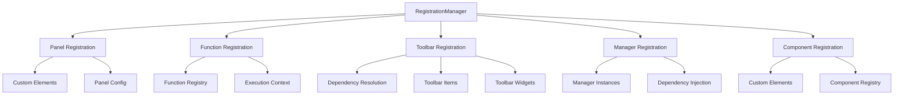
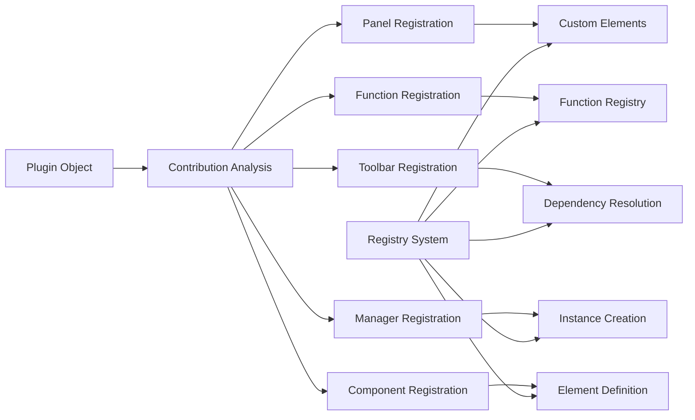

---
aliases:
  [RegistrationManager, Registration Manager, Plugin Registration Manager]
tags: [plugin, registration, manager, contributions, registry]
type: Class
package: "@teskooano/ui-plugin"
dependencies: ["dockview-core"]
devDependencies: ["typescript", "eslint", "prettier"]
classes: ["RegistrationManager"]
functions:
  [
    "setDependencies",
    "processPlugin",
    "unregisterPluginItems",
    "registerPanels",
    "registerFunctions",
    "registerToolbarItems",
    "processPendingToolbarItems",
    "registerManagerClasses",
    "registerComponents",
  ]
events: []
constants: []
types:
  [
    "PluginRegistries",
    "TeskooanoPlugin",
    "PanelConfig",
    "FunctionConfig",
    "ComponentConfig",
    "ManagerConfig",
  ]
status: active
---

# RegistrationManager

Manages the registration of all plugin contributions including panels, functions, toolbar items, manager classes, and custom elements. Handles the complex process of integrating plugin components into the application's registry system.

## 🎯 Purpose

The RegistrationManager is responsible for processing and registering all plugin contributions into the application's registry system. It handles the complex integration of panels, functions, toolbar items, manager classes, and custom elements, ensuring proper dependency resolution and clean registration/unregistration for Hot Module Replacement.

## 🏗️ Architecture

The RegistrationManager follows a registry-based architecture with specialized registration handlers:



## Class Definition

```typescript
export class RegistrationManager {
  #registries: PluginRegistries;
  #dockviewApi: DockviewApi | null = null;

  constructor(registries: PluginRegistries);
  public setDependencies(deps: { dockviewApi: DockviewApi | null }): void;
  public processPlugin(plugin: TeskooanoPlugin): void;
  public unregisterPluginItems(pluginId: string): void;
}
```

## Properties

### `#registries: PluginRegistries`

Private reference to the plugin registries managed by the PluginManager.

**Type**: `PluginRegistries`

**Structure**:

```typescript
type PluginRegistries = {
  pluginRegistry: Map<string, TeskooanoPlugin>;
  panelRegistry: Map<string, RegisteredItem<PanelConfig>>;
  functionRegistry: Map<string, RegisteredItem<FunctionConfig>>;
  toolbarRegistry: Map<ToolbarTarget, RegisteredItem<ToolbarItemConfig>[]>;
  pendingToolbarRegistrations: RegisteredItem<ToolbarRegistration>[];
  managerInstances: Map<string, { instance: any; pluginId: string }>;
  componentRegistry: Map<string, RegisteredItem<ComponentConfig>>;
};
```

### `#dockviewApi: DockviewApi | null`

Private reference to the Dockview API for panel management.

**Type**: `DockviewApi | null`

## Methods

### `setDependencies(deps: { dockviewApi: DockviewApi | null }): void`

Sets the Dockview API dependency for panel management.

**Parameters**:

- `deps.dockviewApi`: `DockviewApi | null` - The Dockview API instance

**Example**:

```typescript
registrationManager.setDependencies({
  dockviewApi: dockviewApi,
});
```

### `processPlugin(plugin: TeskooanoPlugin): void`

Processes and registers all contributions from a single plugin.

**Parameters**:

- `plugin`: `TeskooanoPlugin` - The plugin to register

**Example**:

```typescript
registrationManager.processPlugin({
  id: "my-plugin",
  name: "My Plugin",
  panels: [
    /* ... */
  ],
  functions: [
    /* ... */
  ],
  toolbarRegistrations: [
    /* ... */
  ],
  managerClasses: [
    /* ... */
  ],
  components: [
    /* ... */
  ],
});
```

**Behavior**:

- Registers panels and defines custom elements
- Registers functions
- Processes toolbar items with dependency resolution
- Instantiates manager classes
- Registers custom components

## Internal Methods

### `registerPanels(plugin: TeskooanoPlugin): void`

Registers panel configurations and defines custom elements for panels.

**Behavior**:

- Stores panel configuration in registry
- Defines custom elements using `customElements.define`
- Handles duplicate component name warnings
- Provides HMR warnings for already defined elements

### `registerFunctions(plugin: TeskooanoPlugin): void`

Registers function configurations in the function registry.

**Behavior**:

- Stores function configuration with plugin ID
- Skips already registered functions
- Enables function execution through PluginExecutor

### `registerToolbarItems(plugin: TeskooanoPlugin): void`

Registers toolbar items with dependency resolution for initializer functions.

**Behavior**:

- Adds toolbar registrations to pending list
- Processes pending items to resolve dependencies
- Handles initializer function dependencies
- Sorts items by order property

### `processPendingToolbarItems(): void`

Processes pending toolbar registrations, resolving dependencies for initializer functions.

**Behavior**:

- Checks if all required initializer functions are registered
- Moves satisfied registrations to active registry
- Keeps unsatisfied registrations in pending list
- Sorts items by order property

### `registerManagerClasses(plugin: TeskooanoPlugin): void`

Instantiates manager classes and calls their dependency injection methods.

**Behavior**:

- Creates instances of manager classes
- Calls `setDependencies` if available and dockviewApi is set
- Stores instances with plugin ID tracking
- Handles instantiation errors gracefully

### `registerComponents(plugin: TeskooanoPlugin): void`

Registers custom element components.

**Behavior**:

- Stores component configuration in registry
- Defines custom elements using `customElements.define`
- Skips already defined elements
- Handles definition errors gracefully

### `unregisterPluginItems(pluginId: string): void`

Removes all registrations for a specific plugin (used during HMR and plugin unloading).

**Parameters**:

- `pluginId`: `string` - The ID of the plugin to unregister

**Behavior**:

- Removes panels, functions, and components from registries
- Cleans up toolbar items for all targets
- Removes manager instances
- Enables clean plugin reloading

## Usage Examples

### Plugin Registration

```typescript
import { RegistrationManager } from "@teskooano/ui-plugin";

const registrationManager = new RegistrationManager(registries);

// Set dependencies
registrationManager.setDependencies({
  dockviewApi: dockviewApi,
});

// Register a plugin
const plugin = {
  id: "celestial-info",
  name: "Celestial Info",
  panels: [
    {
      componentName: "celestial-info-panel",
      panelClass: CelestialInfoPanel,
      defaultTitle: "Celestial Info",
    },
  ],
  functions: [
    {
      id: "celestial:focus",
      execute: async (context) => {
        console.log("Focusing on celestial object");
      },
    },
  ],
  toolbarRegistrations: [
    {
      target: "main-toolbar",
      items: [
        {
          id: "celestial-info-btn",
          type: "panel",
          title: "Celestial Info",
          componentName: "celestial-info-panel",
        },
      ],
    },
  ],
  managerClasses: [
    {
      id: "celestial-manager",
      managerClass: CelestialManager,
    },
  ],
  components: [
    {
      tagName: "celestial-display",
      componentClass: CelestialDisplay,
    },
  ],
};

registrationManager.processPlugin(plugin);
```

### Dependency Resolution

```typescript
// Plugin with initializer dependencies
const pluginWithDeps = {
  id: "advanced-feature",
  name: "Advanced Feature",
  functions: [
    {
      id: "advanced:init",
      execute: async (context) => {
        // Initialize advanced features
      },
    },
  ],
  toolbarRegistrations: [
    {
      target: "main-toolbar",
      items: [
        {
          id: "advanced-btn",
          type: "function",
          functionId: "advanced:action",
          dependencies: {
            initializers: ["advanced:init"], // Depends on init function
          },
        },
      ],
    },
  ],
};

// The toolbar item will only be registered after the init function is available
registrationManager.processPlugin(pluginWithDeps);
```

### Plugin Unregistration

```typescript
// Unregister plugin during HMR
registrationManager.unregisterPluginItems("celestial-info");

// All registrations for the plugin are removed:
// - Panel removed from panelRegistry
// - Functions removed from functionRegistry
// - Toolbar items removed from toolbarRegistry
// - Manager instances removed
// - Components removed from componentRegistry
```

## Error Handling

The RegistrationManager provides comprehensive error handling:

```typescript
// Panel registration errors
try {
  customElements.define(componentName, PanelClass);
} catch (error) {
  console.error(
    `Failed to auto-define custom element panel '${componentName}':`,
    error,
  );
}

// Manager instantiation errors
try {
  const instance = new ManagerClass();
  // ... registration logic
} catch (error) {
  console.error(`Failed to instantiate manager '${managerConfig.id}':`, error);
}

// Component definition errors
try {
  customElements.define(
    componentConfig.tagName,
    componentConfig.componentClass,
  );
} catch (error) {
  console.error(
    `Failed to define custom element '${componentConfig.tagName}':`,
    error,
  );
}
```

## HMR Considerations

The RegistrationManager handles Hot Module Replacement gracefully:

```typescript
// HMR warning for already defined custom elements
if (customElements.get(componentName)) {
  console.warn(
    `[HMR] Custom element '${componentName}' from plugin '${plugin.id}' is already defined. ` +
    `A full page reload may be required to see changes.`
  );
}

// Clean unregistration for HMR
public unregisterPluginItems(pluginId: string) {
  // Remove all plugin contributions
  // This enables clean reloading without conflicts
}
```

## Performance Characteristics

- **Efficient Registry Operations**: Uses Map data structures for O(1) lookups
- **Dependency Resolution**: Processes toolbar dependencies incrementally
- **Memory Management**: Proper cleanup during plugin unregistration
- **Error Resilience**: Continues processing even if individual components fail

## 🔄 Data Flow

The RegistrationManager follows a systematic data flow for plugin contribution registration:



### Processing Pipeline

1. **Plugin Object**: Receive plugin configuration with all contributions
2. **Contribution Analysis**: Analyze and categorize plugin contributions
3. **Panel Registration**: Register panels and define custom elements
4. **Function Registration**: Register functions in function registry
5. **Toolbar Registration**: Process toolbar items with dependency resolution
6. **Manager Registration**: Instantiate manager classes with dependency injection
7. **Component Registration**: Register custom elements and components
8. **Registry Integration**: Integrate all contributions into registry system

## 📊 Technical Specifications

### Interface/Type Definitions

```typescript
type PluginRegistries = {
  pluginRegistry: Map<string, TeskooanoPlugin>;
  panelRegistry: Map<string, RegisteredItem<PanelConfig>>;
  functionRegistry: Map<string, RegisteredItem<FunctionConfig>>;
  toolbarRegistry: Map<ToolbarTarget, RegisteredItem<ToolbarItemConfig>[]>;
  pendingToolbarRegistrations: RegisteredItem<ToolbarRegistration>[];
  managerInstances: Map<string, { instance: any; pluginId: string }>;
  componentRegistry: Map<string, RegisteredItem<ComponentConfig>>;
};

interface PanelConfig {
  componentName: string;
  panelClass: any;
  defaultTitle: string;
  defaultParams?: Record<string, any>;
  defaultAddPanelOptions?: Partial<AddPanelOptions>;
}

interface FunctionConfig {
  id: string;
  execute: PluginFunctionCallerSignature;
  dependencies?: FunctionDependencies;
}
```

### Configuration Options

```typescript
interface RegistrationManagerConfig {
  enableCustomElementWarnings?: boolean;
  enableHMRWarnings?: boolean;
  enableDependencyResolution?: boolean;
  maxPendingToolbarItems?: number;
}
```

## ⚡ Performance Considerations

### Efficiency

- **Efficient Registry Operations**: Uses Map data structures for O(1) lookups
- **Dependency Resolution**: Processes toolbar dependencies incrementally
- **Memory Management**: Proper cleanup during plugin unregistration
- **Error Resilience**: Continues processing even if individual components fail
- **Batch Processing**: Processes multiple contributions efficiently

### Quality Metrics

- **Accuracy**: Precise registration of all plugin contributions
- **Reliability**: Robust error handling and graceful degradation
- **Consistency**: Standardized registration behavior across all plugin types
- **Scalability**: Efficient handling of complex plugin configurations

### Performance Monitoring

- **Registration Time Metrics**: Measurement of plugin registration and processing times
- **Registry Size Monitoring**: Tracking of registry size and memory usage
- **Error Rate Monitoring**: Monitoring of registration failures and errors
- **Dependency Resolution Monitoring**: Monitoring of toolbar dependency resolution

## 🔌 Integration Points

### Primary Integration

- **dockview-core**: Panel management and layout system integration
- **Custom Elements API**: Browser custom elements registration
- **Plugin Registry System**: Integration with centralized plugin registries

### Secondary Integration

- **Dependency Resolution**: Integration with toolbar dependency management
- **Error Handling**: Integration with comprehensive error reporting
- **HMR System**: Integration with Hot Module Replacement functionality

## 🐛 Debug Features

### Validation

- **Plugin Validation**: Comprehensive validation of plugin contributions
- **Registry Validation**: Validation of registry state and consistency
- **Dependency Validation**: Validation of toolbar dependencies and resolution
- **Runtime Validation**: Runtime validation of registration and unregistration

### Monitoring

- **Registration Status Monitoring**: Real-time monitoring of registration states
- **Error Monitoring**: Comprehensive error tracking and reporting for registration failures
- **Performance Monitoring**: Monitoring of registration performance metrics
- **Registry Monitoring**: Monitoring of registry state and changes

### Debugging Tools

- **Debug Mode**: Comprehensive debug mode with detailed logging
- **Registry Inspector**: Tools for inspecting registry state and configuration
- **Dependency Visualizer**: Visualization of toolbar dependencies
- **Registration Reporter**: Detailed reporting of registration operations

## 🔮 Future Enhancements

### Optimization Opportunities

- **Performance Optimization**: Enhanced registration algorithms and caching
- **Memory Optimization**: Improved memory management during registration
- **Code Optimization**: Enhanced registration strategies and reduced overhead
- **Architecture Optimization**: Improved registry management and state handling

### Potential Improvements

- **Parallel Registration**: Potential for parallel registration of independent contributions
- **Enhanced Caching**: Improved caching strategies for registration operations
- **Registration Analytics**: Analytics and usage tracking for registration performance
- **Advanced Debugging**: Enhanced debugging tools and development experience

## 📚 Related Documentation

- [[PluginManager]] - Uses RegistrationManager for plugin processing
- [[PluginExecutor]] - Uses registered functions for execution
- [[HMRManager]] - Uses unregistration for plugin reloading
- [[PluginLoader]] - Provides plugins for registration
- [[TeskooanoPlugin]] - Plugin configuration interface
- [[Types]] - Type definitions and interfaces for the plugin system
