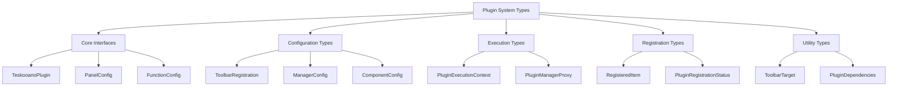
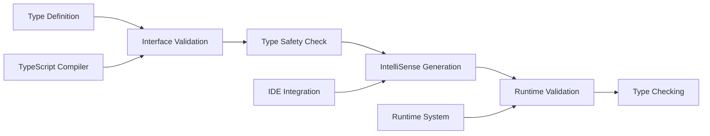

# Plugin System Types

Comprehensive type definitions for the Teskooano UI Plugin System. These types provide type safety, IntelliSense support, and clear interfaces for plugin development.

## 🎯 Purpose

The Plugin System Types provide comprehensive TypeScript type definitions for the entire UI plugin system. These types ensure type safety, provide IntelliSense support, and create clear interfaces for plugin development, enabling developers to build robust, maintainable plugins with full type checking and autocomplete support.

## 🏗️ Architecture

The Plugin System Types follow a hierarchical structure with core interfaces and specialized configurations:



## Core Interfaces

### `TeskooanoPlugin`

The main plugin configuration interface that defines all possible plugin contributions.

```typescript
interface TeskooanoPlugin {
  id: string;
  version?: string;
  name: string;
  description?: string;
  icon?: string;
  dependencies?: string[];
  pluginDependencies?: PluginDependencies;

  panels?: PanelConfig[];
  functions?: FunctionConfig[];
  toolbarRegistrations?: ToolbarRegistration[];
  managerClasses?: ManagerConfig[];
  components?: ComponentConfig[];
  toolbarWidgets?: ToolbarWidgetConfig[];

  initialize?: (...args: any[]) => void;
  dispose?: () => void;
}
```

**Properties**:

- `id`: Unique identifier for the plugin
- `version`: Optional semantic version
- `name`: User-friendly display name
- `description`: Brief description of plugin purpose
- `icon`: Optional icon SVG
- `dependencies`: Array of plugin IDs that must be loaded first
- `pluginDependencies`: More specific dependency configuration
- `panels`: Array of panel configurations
- `functions`: Array of function configurations
- `toolbarRegistrations`: Array of toolbar registrations
- `managerClasses`: Array of manager class configurations
- `components`: Array of component configurations
- `toolbarWidgets`: Array of toolbar widget configurations
- `initialize`: Optional initialization function
- `dispose`: Optional cleanup function

### `PanelConfig`

Configuration for Dockview panels.

```typescript
interface PanelConfig {
  componentName: string;
  panelClass:
    | ({ new (): IContentRenderer } & Partial<CustomElementConstructor>)
    | CustomElementConstructor;
  defaultTitle: string;
  defaultParams?: Record<string, any>;
  defaultAddPanelOptions?: Partial<AddPanelOptions>;
}
```

**Properties**:

- `componentName`: Unique identifier for the panel type
- `panelClass`: Class implementing the panel content
- `defaultTitle`: Default title shown in panel header
- `defaultParams`: Optional default parameters
- `defaultAddPanelOptions`: Optional default panel options

### `FunctionConfig`

Configuration for plugin functions.

```typescript
interface FunctionConfig {
  id: string;
  execute: PluginFunctionCallerSignature;
  dependencies?: FunctionDependencies;
}
```

**Properties**:

- `id`: Unique identifier for the function
- `execute`: Function implementation
- `dependencies`: Optional dependency requirements

### `ComponentConfig`

Configuration for custom elements.

```typescript
interface ComponentConfig {
  tagName: string;
  componentClass: CustomElementConstructor;
}
```

**Properties**:

- `tagName`: HTML tag name for the custom element
- `componentClass`: Class implementing the custom element

### `ManagerConfig`

Configuration for manager/service classes.

```typescript
interface ManagerConfig {
  id: string;
  managerClass: { new (...args: any[]): any };
}
```

**Properties**:

- `id`: Unique identifier for the manager
- `managerClass`: Class constructor for the manager

## Toolbar Types

### `ToolbarRegistration`

Configuration for toolbar item registrations.

```typescript
interface ToolbarRegistration {
  target: ToolbarTarget;
  items?: ToolbarItemDefinition[];
  widgets?: ToolbarWidgetConfig[];
}
```

**Properties**:

- `target`: Target toolbar identifier
- `items`: Array of toolbar item definitions
- `widgets`: Array of toolbar widget configurations

### `ToolbarItemConfig`

Base configuration for toolbar items.

```typescript
interface BaseToolbarItemConfig {
  id: string;
  target: ToolbarTarget;
  title?: string;
  iconSvg?: string;
  order?: number;
  tooltipText?: string;
  tooltipTitle?: string;
  tooltipIconSvg?: string;
  shortcut?: string;
  dependencies?: PluginDependencies;
}
```

### `PanelToolbarItemConfig`

Configuration for panel toolbar items.

```typescript
interface PanelToolbarItemConfig extends BaseToolbarItemConfig {
  type: "panel";
  componentName: string;
  panelTitle?: string;
  behaviour?: "toggle" | "create";
  initialPosition?: {
    top: number;
    left: number;
    width: number;
    height: number;
  };
}
```

### `FunctionToolbarItemConfig`

Configuration for function toolbar items.

```typescript
interface FunctionToolbarItemConfig extends BaseToolbarItemConfig {
  type: "function";
  functionId: string;
}
```

### `ToggleToolbarItemConfig`

Configuration for toggle toolbar items.

```typescript
interface ToggleToolbarItemConfig extends BaseToolbarItemConfig {
  type: "toggle";
  getState: () => boolean;
  onToggle: (currentState: boolean) => void;
}
```

### `ToolbarWidgetConfig`

Configuration for toolbar widgets.

```typescript
interface ToolbarWidgetConfig {
  id: string;
  target: string;
  componentName: string;
  order?: number;
  params?: Record<string, any>;
}
```

## Execution Context

### `PluginExecutionContext`

Context object passed to plugin functions during execution.

```typescript
interface PluginExecutionContext {
  options?: Record<string, any>;
  pluginManager: PluginManagerProxy;
  dockviewApi: DockviewApi | null;
  dockviewController: any;
  getManager: <T = any>(id: string) => T | undefined;
  executeFunction: <T = any>(
    functionId: string,
    args?: any,
  ) => Promise<T> | T | undefined;
}
```

**Properties**:

- `options`: Optional execution options
- `pluginManager`: Limited plugin manager interface
- `dockviewApi`: Dockview API instance
- `dockviewController`: Dockview controller instance
- `getManager`: Function to get manager instances
- `executeFunction`: Function to execute other plugin functions

### `PluginManagerProxy`

Limited interface exposed to plugin execution context.

```typescript
interface PluginManagerProxy {
  execute<T = any>(functionId: string, args?: any): Promise<T> | T | undefined;
  getManagerInstance<T = any>(id: string): T | undefined;
  registerPlugin(plugin: TeskooanoPlugin): void;
  pluginsChanged$: Observable<void>;
  getToolbarItemsForTarget(target: ToolbarTarget): ToolbarItemConfig[];
  getToolbarWidgetsForTarget(target: ToolbarTarget): ToolbarWidgetConfig[];
}
```

## Dependency Types

### `PluginDependencies`

Configuration for plugin dependencies.

```typescript
interface PluginDependencies {
  plugins?: string[];
  functions?: string[];
  initializers?: string[];
}
```

**Properties**:

- `plugins`: Array of plugin IDs that must be loaded first
- `functions`: Array of function IDs that must be registered
- `initializers`: Array of initializer function IDs that must be executed

### `FunctionDependencies`

Configuration for function dependencies.

```typescript
interface FunctionDependencies {
  dockView?: {
    api?: boolean;
    controller?: boolean;
  };
}
```

## Registration Types

### `RegisteredItem<T>`

Wrapper type for registered plugin items.

```typescript
type RegisteredItem<T> = T & { pluginId: string };
```

### `PluginRegistrationStatus`

Union type for plugin registration status updates.

```typescript
type PluginRegistrationStatus =
  | { type: "loading_started"; pluginIds: string[] }
  | { type: "loading_plugin"; pluginId: string }
  | { type: "loaded_plugin"; pluginId: string }
  | { type: "load_error"; pluginId: string; error: Error }
  | { type: "registration_started"; pluginIds: string[] }
  | { type: "registering_plugin"; pluginId: string }
  | { type: "registered_plugin"; pluginId: string }
  | { type: "register_error"; pluginId: string; error: Error }
  | { type: "init_error"; pluginId: string; error: Error }
  | { type: "disposing"; pluginId: string }
  | { type: "disposed"; pluginId: string }
  | { type: "dispose_error"; pluginId: string; error: any }
  | { type: "unloading"; pluginId: string }
  | { type: "unloaded"; pluginId: string }
  | {
      type: "dependency_error";
      pluginId: string;
      missingDependencies: string[];
    }
  | {
      type: "loading_complete";
      successfullyRegistered: string[];
      failed: string[];
      notFound: string[];
    };
```

## Utility Types

### `ToolbarTarget`

Union type for toolbar targets.

```typescript
type ToolbarTarget = "main-toolbar" | "engine-toolbar";
```

### `ToolbarItemDefinition`

Toolbar item definition without target.

```typescript
type ToolbarItemDefinition =
  | Omit<PanelToolbarItemConfig, "target">
  | Omit<FunctionToolbarItemConfig, "target">
  | Omit<ToggleToolbarItemConfig, "target">;
```

### `PluginFunctionCallerSignature`

Function signature for plugin function execution.

```typescript
type PluginFunctionCallerSignature = (
  context: PluginExecutionContext,
  args?: any,
) => any;
```

## Configuration Types

### `PluginLoadConfig`

Configuration for dynamically loading a plugin.

```typescript
interface PluginLoadConfig {
  path: string;
  exportName?: string;
}
```

### `ComponentLoadConfig`

Configuration for dynamically loading a component.

```typescript
interface ComponentLoadConfig {
  path: string;
  className: string;
  isCustomElement?: boolean;
  _configPath?: string;
}
```

### `PluginRegistryConfig`

Map of plugin IDs to their loading configuration.

```typescript
type PluginRegistryConfig = Record<string, PluginLoadConfig>;
```

### `ComponentRegistryConfig`

Map of component tag names to their loading configuration.

```typescript
type ComponentRegistryConfig = Record<string, ComponentLoadConfig>;
```

## Usage Examples

### Basic Plugin Definition

```typescript
import type { TeskooanoPlugin } from "@teskooano/ui-plugin";

const plugin: TeskooanoPlugin = {
  id: "my-plugin",
  name: "My Plugin",
  description: "A useful plugin",
  panels: [
    {
      componentName: "my-panel",
      panelClass: MyPanel,
      defaultTitle: "My Panel",
    },
  ],
  functions: [
    {
      id: "my:action",
      execute: async (context) => {
        console.log("Action executed");
      },
    },
  ],
};
```

### Function with Dependencies

```typescript
const functionConfig: FunctionConfig = {
  id: "data:save",
  execute: async (context: PluginExecutionContext, data: any) => {
    const dataManager = context.getManager<DataManager>("data-manager");
    if (!dataManager) {
      throw new Error("Data manager not available");
    }
    return await dataManager.save(data);
  },
  dependencies: {
    dockView: {
      api: true,
      controller: false,
    },
  },
};
```

### Toolbar Registration

```typescript
const toolbarRegistration: ToolbarRegistration = {
  target: "main-toolbar",
  items: [
    {
      id: "my-action-btn",
      type: "function",
      functionId: "my:action",
      title: "My Action",
      iconSvg: actionIcon,
      order: 10,
      tooltipText: "Execute my action",
      tooltipTitle: "My Action",
    },
  ],
};
```

## Type Safety Benefits

1. **IntelliSense Support**: Full autocomplete and type checking
2. **Compile-time Validation**: Catch errors before runtime
3. **Refactoring Safety**: Rename operations update all references
4. **Documentation**: Types serve as inline documentation
5. **API Consistency**: Ensures consistent plugin interfaces

## 🔄 Data Flow

The Plugin System Types follow a systematic data flow for type definitions:



### Processing Pipeline

1. **Type Definition**: Define TypeScript interfaces and types
2. **Interface Validation**: Validate interface structure and relationships
3. **Type Safety Check**: Ensure type safety and consistency
4. **IntelliSense Generation**: Generate autocomplete and documentation
5. **Runtime Validation**: Validate types at runtime where applicable
6. **Type Checking**: Compile-time type checking and error detection

## 📊 Technical Specifications

### Interface/Type Definitions

```typescript
interface TeskooanoPlugin {
  id: string;
  version?: string;
  name: string;
  description?: string;
  icon?: string;
  dependencies?: string[];
  pluginDependencies?: PluginDependencies;
  panels?: PanelConfig[];
  functions?: FunctionConfig[];
  toolbarRegistrations?: ToolbarRegistration[];
  managerClasses?: ManagerConfig[];
  components?: ComponentConfig[];
  toolbarWidgets?: ToolbarWidgetConfig[];
  initialize?: (...args: any[]) => void;
  dispose?: () => void;
}

interface PluginExecutionContext {
  options?: Record<string, any>;
  pluginManager: PluginManagerProxy;
  dockviewApi: DockviewApi | null;
  dockviewController: any;
  getManager: <T = any>(id: string) => T | undefined;
  executeFunction: <T = any>(
    functionId: string,
    args?: any,
  ) => Promise<T> | T | undefined;
}

type PluginRegistrationStatus =
  | { type: "loading_started"; pluginIds: string[] }
  | { type: "registered_plugin"; pluginId: string }
  | { type: "load_error"; pluginId: string; error: Error }
  | {
      type: "dependency_error";
      pluginId: string;
      missingDependencies: string[];
    };
```

### Configuration Options

```typescript
interface TypeSystemConfig {
  enableStrictMode?: boolean;
  enableRuntimeValidation?: boolean;
  enableIntelliSense?: boolean;
  enableTypeChecking?: boolean;
}
```

## ⚡ Performance Considerations

### Efficiency

- **Type Safety**: Compile-time type checking prevents runtime errors
- **IntelliSense Support**: Full autocomplete and documentation support
- **Refactoring Safety**: Rename operations update all references automatically
- **API Consistency**: Ensures consistent plugin interfaces across the system
- **Documentation**: Types serve as inline documentation for developers

### Quality Metrics

- **Accuracy**: Precise type definitions with comprehensive coverage
- **Reliability**: Robust type checking and validation
- **Consistency**: Standardized type definitions across all interfaces
- **Scalability**: Efficient handling of complex type hierarchies

### Performance Monitoring

- **Compilation Time Metrics**: Measurement of TypeScript compilation times
- **Type Checking Metrics**: Monitoring of type checking performance
- **IntelliSense Metrics**: Monitoring of IDE autocomplete performance
- **Error Detection Metrics**: Monitoring of type error detection accuracy

## 🔌 Integration Points

### Primary Integration

- **TypeScript Compiler**: Integration with TypeScript type system
- **IDE Support**: Integration with IDE autocomplete and documentation
- **Plugin System**: Integration with plugin registration and management

### Secondary Integration

- **Runtime Validation**: Integration with runtime type validation
- **Error Handling**: Integration with comprehensive error reporting
- **Development Tools**: Integration with development workflow and debugging

## 🐛 Debug Features

### Validation

- **Type Validation**: Comprehensive validation of type definitions
- **Interface Validation**: Validation of interface structure and relationships
- **Consistency Validation**: Validation of type consistency across the system
- **Runtime Validation**: Runtime validation of type compliance

### Monitoring

- **Type Usage Monitoring**: Real-time monitoring of type usage patterns
- **Error Monitoring**: Comprehensive error tracking and reporting for type errors
- **Performance Monitoring**: Monitoring of type system performance metrics
- **Compilation Monitoring**: Monitoring of TypeScript compilation performance

### Debugging Tools

- **Type Inspector**: Tools for inspecting type definitions and relationships
- **Error Reporter**: Detailed reporting of type errors and warnings
- **IntelliSense Debugger**: Debugging tools for IDE autocomplete issues
- **Type Visualizer**: Visualization of type hierarchies and relationships

## 🔮 Future Enhancements

### Optimization Opportunities

- **Performance Optimization**: Enhanced type checking algorithms and caching
- **Memory Optimization**: Improved memory management for type definitions
- **Code Optimization**: Enhanced type system strategies and reduced overhead
- **Architecture Optimization**: Improved type management and validation

### Potential Improvements

- **Advanced Types**: Enhanced type definitions with more sophisticated features
- **Type Inference**: Improved type inference and automatic type detection
- **Type Analytics**: Analytics and usage tracking for type patterns
- **Advanced Debugging**: Enhanced debugging tools and development experience

## 📚 Related Documentation

- [[PluginManager]] - Uses these types for plugin management
- [[RegistrationManager]] - Uses these types for plugin registration
- [[PluginExecutor]] - Uses these types for function execution
- [[PluginFactory]] - Uses these types for plugin creation
- [[PluginLoader]] - Uses these types for plugin loading
- [[HMRManager]] - Uses these types for Hot Module Replacement
