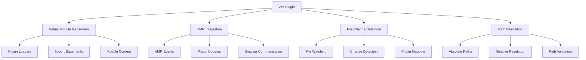
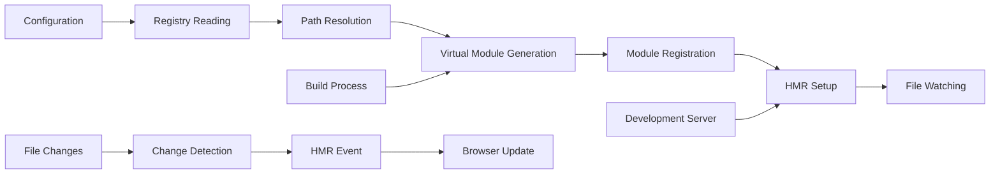

# Teskooano UI Vite Plugin

A Vite plugin that provides build-time integration for the Teskooano UI Plugin System. Generates virtual modules for plugin loading, handles Hot Module Replacement, and enables configuration-driven plugin management.

## 🎯 Purpose

The Teskooano UI Vite Plugin provides seamless build-time integration for the UI plugin system. It generates virtual modules for dynamic plugin loading, handles Hot Module Replacement for development, and enables configuration-driven plugin management, ensuring efficient plugin loading and development workflow.

## 🏗️ Architecture

The Vite Plugin follows a virtual module architecture with HMR integration:



## Plugin Definition

```typescript
export function teskooanoUiPlugin(options: TeskooanoUiPluginOptions): Plugin;
```

## Configuration

### `TeskooanoUiPluginOptions`

Configuration interface for the Vite plugin.

```typescript
interface TeskooanoUiPluginOptions {
  pluginRegistryPaths: string[];
}
```

**Properties**:

- `pluginRegistryPaths`: Array of absolute paths to plugin registry configuration files

## Usage

### Basic Configuration

```typescript
// vite.config.ts
import { defineConfig } from "vite";
import { teskooanoUiPlugin } from "@teskooano/ui-plugin/vite.js";
import path from "path";

export default defineConfig({
  plugins: [
    teskooanoUiPlugin({
      pluginRegistryPaths: [
        path.resolve(__dirname, "src/config/corePlugins.ts"),
        path.resolve(__dirname, "src/config/featurePlugins.ts"),
      ],
    }),
  ],
});
```

### Plugin Registry Configuration

```typescript
// src/config/corePlugins.ts
import type { PluginRegistryConfig } from "@teskooano/ui-plugin";

export const pluginConfig: PluginRegistryConfig = {
  "celestial-info": {
    path: "../plugins/celestial-info/plugin.ts",
  },
  "system-controls": {
    path: "../plugins/system-controls/plugin.ts",
  },
  "data-manager": {
    path: "../plugins/data-manager/plugin.ts",
  },
};
```

```typescript
// src/config/featurePlugins.ts
import type { PluginRegistryConfig } from "@teskooano/ui-plugin";

export const pluginConfig: PluginRegistryConfig = {
  "advanced-visualization": {
    path: "../plugins/advanced-visualization/plugin.ts",
  },
  "export-tools": {
    path: "../plugins/export-tools/plugin.ts",
  },
};
```

## Generated Virtual Modules

### `virtual:teskooano-loaders`

The plugin generates a virtual module containing plugin loaders.

**Generated Code**:

```typescript
// virtual:teskooano-loaders
export const pluginLoaders = {
  "celestial-info": () =>
    import("/absolute/path/to/plugins/celestial-info/plugin.ts"),
  "system-controls": () =>
    import("/absolute/path/to/plugins/system-controls/plugin.ts"),
  "data-manager": () =>
    import("/absolute/path/to/plugins/data-manager/plugin.ts"),
  "advanced-visualization": () =>
    import("/absolute/path/to/plugins/advanced-visualization/plugin.ts"),
  "export-tools": () =>
    import("/absolute/path/to/plugins/export-tools/plugin.ts"),
};
```

**Usage**:

```typescript
import { pluginLoaders } from "virtual:teskooano-loaders";

// Load a plugin
const pluginModule = await pluginLoaders["celestial-info"]();
const plugin = pluginModule.plugin;
```

## Hot Module Replacement

The plugin provides HMR support for plugin development.

### HMR Event

When a plugin file is changed, the plugin sends a custom HMR event:

```typescript
// HMR event sent to browser
{
  event: 'teskooano-plugin-update',
  data: { pluginId: 'celestial-info' }
}
```

### HMR Integration

```typescript
// In PluginManager
if (import.meta.hot) {
  import.meta.hot.on("teskooano-plugin-update", (data) => {
    if (data.pluginId) {
      pluginManager.reloadPlugin(data.pluginId);
    }
  });
}
```

## Plugin Methods

### `resolveId(id: string)`

Resolves virtual module IDs.

**Parameters**:

- `id`: `string` - Module ID to resolve

**Returns**: `string | undefined` - Resolved module ID or undefined

**Behavior**:

- Resolves `virtual:teskooano-loaders` to the virtual module
- Returns undefined for other module IDs

### `load(id: string)`

Loads virtual module content.

**Parameters**:

- `id`: `string` - Module ID to load

**Returns**: `string | undefined` - Module content or undefined

**Behavior**:

- Generates plugin loaders for `virtual:teskooano-loaders`
- Reads plugin registry configuration files
- Converts relative paths to absolute paths
- Generates import statements for each plugin

### `handleHotUpdate({ file, server })`

Handles Hot Module Replacement for plugin files.

**Parameters**:

- `file`: `string` - Path to the changed file
- `server`: `ViteDevServer` - Vite development server instance

**Returns**: `void`

**Behavior**:

- Detects changes to plugin files
- Sends HMR event to browser
- Triggers plugin reload

## File Change Detection

The plugin tracks plugin files and their corresponding plugin IDs:

```typescript
// Internal file-to-plugin mapping
const fileToPluginMap = new Map<string, string>();
fileToPluginMap.set("/path/to/plugin.ts", "plugin-id");
```

## Path Resolution

The plugin handles path resolution for plugin modules:

```typescript
// Convert relative paths to absolute paths
const absolutePath = path.resolve(configPath, relativePath);

// Generate import statement
const importStatement = `() => import('${absolutePath}')`;
```

## Error Handling

The plugin provides comprehensive error handling:

```typescript
// Missing plugin registry file
if (!fs.existsSync(registryPath)) {
  throw new Error(`Plugin registry file not found: ${registryPath}`);
}

// Invalid plugin registry format
if (!pluginConfig || typeof pluginConfig !== "object") {
  throw new Error(`Invalid plugin registry format in ${registryPath}`);
}

// Missing plugin path
if (!pluginConfig[pluginId]?.path) {
  throw new Error(`Missing path for plugin '${pluginId}' in ${registryPath}`);
}
```

## Development Workflow

1. **Configure Plugin**: Add plugin registry paths to Vite config
2. **Create Registry**: Define plugin registry configuration files
3. **Develop Plugins**: Create plugin modules with proper exports
4. **Hot Reload**: Save plugin files to trigger HMR
5. **Build**: Vite generates optimized plugin loaders

## Build Integration

The plugin integrates seamlessly with Vite's build process:

- **Development**: Generates dynamic import loaders
- **Production**: Optimizes plugin loading with code splitting
- **HMR**: Provides fast plugin reloading during development

## Performance Characteristics

- **Lazy Loading**: Plugins are loaded only when needed
- **Code Splitting**: Automatic code splitting for plugin modules
- **HMR Efficiency**: Fast plugin reloading without full page refresh
- **Build Optimization**: Optimized plugin loading in production

## Best Practices

1. **Use Absolute Paths**: Always use absolute paths in Vite config
2. **Organize Registries**: Group related plugins in separate registry files
3. **Consistent Naming**: Use consistent plugin ID naming conventions
4. **Error Handling**: Handle plugin loading errors gracefully
5. **Development Setup**: Enable HMR for efficient plugin development

## Troubleshooting

### Common Issues

**Plugin not found**:

```
Error: Loader for plugin 'unknown-plugin' not found.
```

_Solution_: Ensure plugin is registered in plugin registry configuration

**Invalid registry format**:

```
Error: Invalid plugin registry format in /path/to/registry.ts
```

_Solution_: Check registry file exports proper PluginRegistryConfig

**Missing plugin path**:

```
Error: Missing path for plugin 'my-plugin' in /path/to/registry.ts
```

_Solution_: Ensure plugin configuration includes path property

### Debug Mode

Enable debug logging to troubleshoot issues:

```typescript
// In vite.config.ts
export default defineConfig({
  plugins: [
    teskooanoUiPlugin({
      pluginRegistryPaths: [path.resolve(__dirname, "src/config/plugins.ts")],
    }),
  ],
  define: {
    __TESKOOANO_DEBUG__: true,
  },
});
```

## 🔄 Data Flow

The Vite Plugin follows a systematic data flow for build-time integration:



### Processing Pipeline

1. **Configuration**: Receive plugin registry paths from Vite config
2. **Registry Reading**: Read and parse plugin registry configuration files
3. **Path Resolution**: Convert relative paths to absolute paths
4. **Virtual Module Generation**: Generate virtual module content with plugin loaders
5. **Module Registration**: Register virtual module with Vite
6. **HMR Setup**: Set up Hot Module Replacement for plugin files
7. **File Watching**: Watch plugin files for changes
8. **Change Detection**: Detect changes and trigger HMR events

## 📊 Technical Specifications

### Interface/Type Definitions

```typescript
interface TeskooanoUiPluginOptions {
  pluginRegistryPaths: string[];
}

interface PluginRegistryConfig {
  [pluginId: string]: PluginLoadConfig;
}

interface PluginLoadConfig {
  path: string;
  exportName?: string;
}

interface VitePluginConfig {
  enableHMR?: boolean;
  enableVirtualModules?: boolean;
  enableFileWatching?: boolean;
  enablePathResolution?: boolean;
}
```

### Configuration Options

```typescript
interface VitePluginAdvancedOptions extends TeskooanoUiPluginOptions {
  enableDebugMode?: boolean;
  enablePathValidation?: boolean;
  enableHMROptimization?: boolean;
  maxFileWatchers?: number;
}
```

## ⚡ Performance Considerations

### Efficiency

- **Lazy Loading**: Plugins are loaded only when needed
- **Code Splitting**: Automatic code splitting for plugin modules
- **HMR Efficiency**: Fast plugin reloading without full page refresh
- **Build Optimization**: Optimized plugin loading in production
- **Virtual Modules**: Efficient virtual module generation and management

### Quality Metrics

- **Accuracy**: Precise plugin loading and HMR functionality
- **Reliability**: Robust error handling and graceful degradation
- **Consistency**: Standardized build behavior across all plugins
- **Scalability**: Efficient handling of large plugin configurations

### Performance Monitoring

- **Build Time Metrics**: Measurement of build and HMR times
- **Memory Usage Monitoring**: Tracking of virtual module memory usage
- **File Watching Metrics**: Monitoring of file watching performance
- **HMR Performance**: Monitoring of Hot Module Replacement performance

## 🔌 Integration Points

### Primary Integration

- **Vite Build System**: Integration with Vite's build and development server
- **Plugin System**: Integration with plugin loading and management
- **HMR System**: Integration with Hot Module Replacement functionality

### Secondary Integration

- **File System**: Integration with file watching and change detection
- **Error Handling**: Integration with comprehensive error reporting
- **Development Tools**: Integration with development workflow and debugging

## 🐛 Debug Features

### Validation

- **Configuration Validation**: Comprehensive validation of plugin registry configurations
- **Path Validation**: Validation of plugin file paths and existence
- **Module Validation**: Validation of virtual module generation
- **Runtime Validation**: Runtime validation of plugin loading

### Monitoring

- **Build Monitoring**: Real-time monitoring of build and HMR operations
- **Error Monitoring**: Comprehensive error tracking and reporting for build failures
- **Performance Monitoring**: Monitoring of build performance metrics
- **File Watching Monitoring**: Monitoring of file watching operations

### Debugging Tools

- **Debug Mode**: Comprehensive debug mode with detailed build logging
- **Build Inspector**: Tools for inspecting build configuration and virtual modules
- **HMR Debugger**: Debugging tools for Hot Module Replacement issues
- **Path Resolver**: Tools for debugging path resolution problems

## 🔮 Future Enhancements

### Optimization Opportunities

- **Performance Optimization**: Enhanced build algorithms and caching
- **Memory Optimization**: Improved memory management for virtual modules
- **Code Optimization**: Enhanced build strategies and reduced overhead
- **Architecture Optimization**: Improved build integration and HMR management

### Potential Improvements

- **Advanced Caching**: Enhanced caching strategies for build operations
- **Parallel Processing**: Potential for parallel plugin processing
- **Build Analytics**: Analytics and usage tracking for build performance
- **Advanced Debugging**: Enhanced debugging tools and development experience

## 📚 Related Documentation

- [[PluginManager]] - Uses generated plugin loaders
- [[PluginLoader]] - Loads plugins using generated loaders
- [[HMRManager]] - Handles HMR events from Vite plugin
- [[PluginRegistryConfig]] - Configuration interface for plugin registries
- [[Types]] - Type definitions and interfaces for the plugin system
