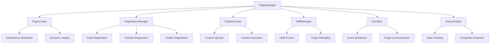
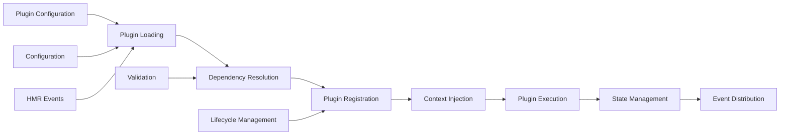

# UI Plugin System (`@teskooano/ui-plugin`)

A comprehensive plugin architecture for building extensible UI features in the Open Space engine. Provides dynamic loading, registration, and management of UI components, panels, functions, and toolbar items through a configuration-driven system with Hot Module Replacement support.

## 🎯 Purpose

The `@teskooano/ui-plugin` package serves as the foundation of the Open Space engine's modular UI architecture. It enables developers to create self-contained plugins that can register panels, functions, toolbar items, and custom components without modifying the core application code. The system supports dynamic loading, dependency resolution, and Hot Module Replacement for an optimal development experience.

## 🏗️ Architecture

The UI Plugin System follows a modular, event-driven architecture that enables dynamic plugin loading and management with comprehensive lifecycle support.



## 🚀 Core Features

### 1. Plugin Management

- **Configuration-Driven Architecture**: Enable/disable features through Vite plugin configuration
- **Dynamic Plugin Loading**: Load plugin modules on demand with proper dependency resolution
- **Hot Module Replacement**: Automatic plugin reloading during development
- **Singleton Management**: Centralized plugin state through the PluginManager singleton

### 2. Plugin Types

- **Panel Plugins**: UI panels with optional toolbar integration
- **Function Plugins**: Standalone functions and actions
- **Component Plugins**: Reusable custom elements
- **Controller Plugins**: Service classes and background managers
- **Interface Plugins**: Functions with toolbar button integration
- **Widget Plugins**: Inline toolbar components

### 3. Modern Patterns

- **Reactive State Management**: Automatic state tracking with computed properties
- **Event-Driven Communication**: Decoupled component communication
- **Typed Event Registry**: Type-safe event system with payload validation
- **Factory Functions**: Simplified plugin creation patterns
- **Dependency Management**: Automatic resolution of plugin dependencies with circular dependency detection

## 🔄 Data Flow

The UI Plugin System follows a systematic data flow for plugin lifecycle management:



### Processing Pipeline

1. **Configuration**: Plugin definitions are loaded from registry configuration
2. **Loading**: Plugin modules are dynamically imported with dependency resolution
3. **Registration**: Plugin contributions are registered with the appropriate managers
4. **Context Injection**: Application dependencies are injected into plugin context
5. **Execution**: Plugin functions are executed with proper error handling
6. **State Management**: Plugin state is tracked and managed reactively
7. **Event Distribution**: Events are distributed through the centralized event bus

## 📊 Technical Specifications

### Interface/Type Definitions

```typescript
interface TeskooanoPlugin {
  id: string;
  name: string;
  description: string;
  version?: string;
  panels?: PanelPlugin[];
  functions?: FunctionPlugin[];
  components?: ComponentPlugin[];
  controllers?: ControllerPlugin[];
  toolbarRegistrations?: ToolbarRegistration[];
}

interface PluginConfig {
  id: string;
  path: string;
  enabled?: boolean;
  dependencies?: string[];
}

interface PluginRegistryConfig {
  [pluginId: string]: PluginConfig;
}

interface PluginStatus {
  pluginId: string;
  status: "loading" | "loaded" | "error" | "unloaded";
  error?: Error;
  dependencies?: string[];
}
```

### Configuration Options

```typescript
interface PluginManagerConfig {
  pluginRegistryPaths: string[];
  enableHMR?: boolean;
  enableDebugMode?: boolean;
  dependencyResolution?: boolean;
  circularDependencyDetection?: boolean;
}
```

## 💡 Usage Examples

### Basic Plugin Definition

```typescript
import type { TeskooanoPlugin } from "@teskooano/ui-plugin";

export const plugin: TeskooanoPlugin = {
  id: "my-feature",
  name: "My Feature",
  description: "A useful feature for the application",
  panels: [
    {
      componentName: "my-feature-panel",
      panelClass: MyFeaturePanel,
      defaultTitle: "My Feature",
    },
  ],
  functions: [
    {
      id: "my-feature:action",
      execute: async (context) => {
        console.log("Action executed!");
      },
    },
  ],
  toolbarRegistrations: [
    {
      target: "main-toolbar",
      items: [
        {
          id: "my-feature-btn",
          type: "panel",
          title: "Open My Feature",
          componentName: "my-feature-panel",
        },
      ],
    },
  ],
};
```

### Using Factory Functions

```typescript
import { createPanelPlugin } from "@teskooano/ui-plugin";

export const plugin = createPanelPlugin({
  id: "celestial-info",
  name: "Celestial Info",
  description: "Display information about celestial objects",
  componentName: "celestial-info-panel",
  panelClass: CelestialInfoPanel,
  defaultTitle: "Celestial Info",
  iconSvg: infoIcon,
  target: "engine-toolbar",
  order: 100,
});
```

### Reactive State Management

```typescript
import { ReactiveState, EventBus, Events } from "@teskooano/ui-plugin/patterns";

export class MyComponent extends HTMLElement {
  private state = new ReactiveState({
    selectedObject: null,
    isLoading: false,
  });

  constructor() {
    super();

    // Add computed properties
    this.state.computed("hasSelection", {
      deps: ["selectedObject"],
      compute: (selectedObject) => selectedObject !== null,
    });

    // Listen for events
    EventBus.getInstance().on(Events.OBJECT_SELECTED, (event) => {
      this.state.set("selectedObject", event.payload.object);
    });

    // Watch for state changes
    this.state.watch("hasSelection", (hasSelection) => {
      this.updateUI(hasSelection);
    });
  }
}
```

### Application Integration

```typescript
import { PluginManager } from "@teskooano/ui-plugin";

async function initializeApp() {
  const pluginManager = PluginManager.getInstance();

  // Set dependencies
  pluginManager.setAppDependencies({
    dockviewApi: dockviewApi,
    dockviewController: dockviewController,
  });

  // Load plugins
  await pluginManager.loadAndRegisterPlugins([
    "celestial-info",
    "system-controls",
    "data-manager",
  ]);

  // Subscribe to plugin status
  pluginManager.pluginStatus$.subscribe((status) => {
    console.log(`Plugin ${status.pluginId}: ${status.status}`);
  });
}
```

## Configuration

### Vite Plugin Configuration

```typescript
// vite.config.ts
import { teskooanoUiPlugin } from "@teskooano/ui-plugin/vite.js";
import path from "path";

export default defineConfig({
  plugins: [
    teskooanoUiPlugin({
      pluginRegistryPaths: [
        path.resolve(__dirname, "src/config/corePlugins.ts"),
        path.resolve(__dirname, "src/config/featurePlugins.ts"),
      ],
    }),
  ],
});
```

### Plugin Registry Configuration

```typescript
// src/config/corePlugins.ts
import type { PluginRegistryConfig } from "@teskooano/ui-plugin";

export const pluginConfig: PluginRegistryConfig = {
  "celestial-info": {
    path: "../plugins/celestial-info/plugin.ts",
  },
  "system-controls": {
    path: "../plugins/system-controls/plugin.ts",
  },
};
```

## Performance Characteristics

- **Lazy Loading**: Plugins are loaded only when needed
- **Dependency Optimization**: Automatic dependency resolution prevents redundant loading
- **Memory Management**: Proper cleanup and disposal of plugin resources
- **HMR Efficiency**: Fast plugin reloading during development
- **Bundle Splitting**: Automatic code splitting for plugin modules

## Development Workflow

### Creating a New Plugin

1. **Define Plugin Structure**:

   ```typescript
   export const plugin: TeskooanoPlugin = {
     id: "my-plugin",
     name: "My Plugin",
     // ... configuration
   };
   ```

2. **Register in Configuration**:

   ```typescript
   // Add to plugin registry
   'my-plugin': {
     path: '../plugins/my-plugin/plugin.ts'
   }
   ```

3. **Load in Application**:
   ```typescript
   await pluginManager.loadAndRegisterPlugins(["my-plugin"]);
   ```

### Hot Module Replacement

During development, when you save a plugin file:

1. Vite detects the change
2. Sends HMR event to the browser
3. PluginManager automatically unloads the old version
4. Loads and registers the new version
5. Calls dispose() on old plugin and initialize() on new plugin

## Testing

```typescript
import { PluginManager } from "@teskooano/ui-plugin";

describe("Plugin System", () => {
  let pluginManager: PluginManager;

  beforeEach(() => {
    pluginManager = PluginManager.getInstance();
  });

  it("should load and register plugins", async () => {
    await pluginManager.loadAndRegisterPlugins(["test-plugin"]);

    const plugins = pluginManager.getPlugins();
    expect(plugins).toHaveLength(1);
    expect(plugins[0].id).toBe("test-plugin");
  });
});
```

## ⚡ Performance Considerations

### Efficiency

- **Lazy Loading**: Plugins are loaded only when needed, reducing initial bundle size
- **Dependency Optimization**: Automatic dependency resolution prevents redundant loading
- **Memory Management**: Proper cleanup and disposal of plugin resources
- **Bundle Splitting**: Automatic code splitting for plugin modules
- **HMR Efficiency**: Fast plugin reloading during development without full page refresh

### Quality Metrics

- **Accuracy**: Plugin loading and execution with proper error handling
- **Reliability**: Robust dependency resolution and circular dependency detection
- **Consistency**: Standardized plugin lifecycle management across all plugin types
- **Scalability**: Efficient handling of multiple plugins and complex dependency graphs

### Performance Monitoring

- **Plugin Status Tracking**: Real-time monitoring of plugin loading states
- **Dependency Graph Analysis**: Visualization of plugin dependencies
- **Memory Usage Monitoring**: Tracking of plugin resource consumption
- **Load Time Metrics**: Measurement of plugin loading and initialization times

## 🔌 Integration Points

### Primary Integration

- **dockview-core**: Panel management and layout system integration
- **Vite Build System**: Seamless build-time integration with virtual modules and HMR
- **Application Context**: Dependency injection for application services and APIs

### Secondary Integration

- **Event System**: Integration with centralized event bus for plugin communication
- **State Management**: Integration with reactive state management patterns
- **Development Tools**: Integration with development workflow and debugging tools

## 🐛 Debug Features

### Validation

- **Plugin Validation**: Comprehensive validation of plugin definitions and configurations
- **Dependency Validation**: Validation of plugin dependencies and circular dependency detection
- **Configuration Validation**: Validation of plugin registry and configuration options
- **Runtime Validation**: Runtime validation of plugin execution and state management

### Monitoring

- **Plugin Status Monitoring**: Real-time monitoring of plugin loading and execution states
- **Error Monitoring**: Comprehensive error tracking and reporting for plugin failures
- **Performance Monitoring**: Monitoring of plugin performance metrics and resource usage
- **Dependency Monitoring**: Monitoring of plugin dependencies and resolution status

### Debugging Tools

- **Debug Mode**: Comprehensive debug mode with detailed logging and state inspection
- **Plugin Inspector**: Tools for inspecting plugin state and configuration
- **Dependency Visualizer**: Visualization of plugin dependency graphs
- **HMR Debugger**: Debugging tools for Hot Module Replacement functionality

## 🔮 Future Enhancements

### Optimization Opportunities

- **Performance Optimization**: Enhanced lazy loading strategies and bundle optimization
- **Memory Optimization**: Improved memory management and resource cleanup
- **Code Optimization**: Enhanced plugin factory functions and reduced boilerplate
- **Architecture Optimization**: Improved plugin lifecycle management and state handling

### Potential Improvements

- **Plugin Marketplace**: Potential for a plugin marketplace or registry system
- **Enhanced HMR**: Improved Hot Module Replacement with better state preservation
- **Plugin Analytics**: Analytics and usage tracking for plugin performance
- **Advanced Debugging**: Enhanced debugging tools and development experience

## Dependencies

### Core Dependencies

- **dockview-core**: Panel management and layout system
- **rxjs**: Reactive programming for state management

### Development Dependencies

- **typescript**: Type safety and modern JavaScript features
- **vite**: Build tool integration and HMR support
- **eslint**: Code quality and consistency
- **prettier**: Code formatting and style consistency

## 📚 Related Documentation

- [[PluginManager]] - Main singleton class managing plugin lifecycle and state
- [[PluginLoader]] - Handles dynamic loading and dependency resolution
- [[RegistrationManager]] - Manages registration of plugin contributions
- [[PluginExecutor]] - Executes plugin functions with proper context injection
- [[HMRManager]] - Handles Hot Module Replacement for development
- [[EventBus]] - Centralized event system for plugin communication
- [[ReactiveState]] - Reactive state management with computed properties
- [[PluginFactory]] - Factory functions for simplified plugin creation
- [[Types]] - Type definitions and interfaces for the plugin system
- [[VitePlugin]] - Vite plugin integration for build-time functionality
