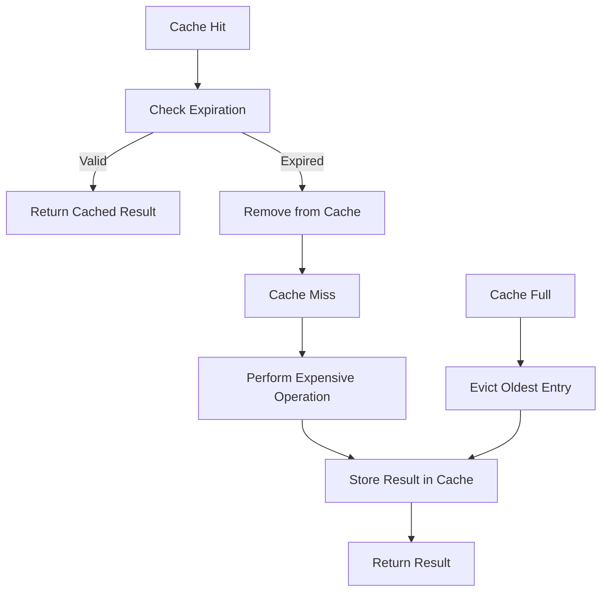
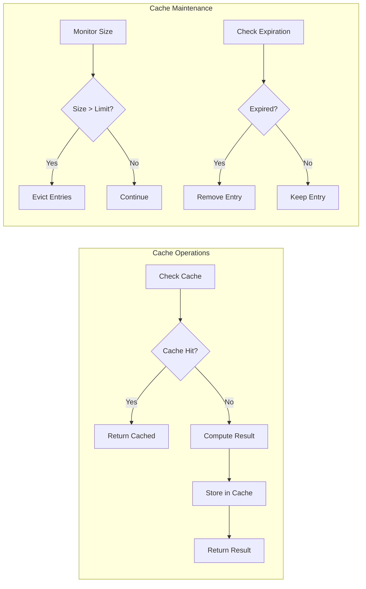

# Caching Pattern

The Caching Pattern is extensively used throughout the Teskooano renderer system to optimize performance by storing and reusing expensive computation results, reducing redundant calculations and improving overall system responsiveness.

## 🎯 Purpose

The Caching Pattern provides:

- **Performance Optimization**: Avoids redundant expensive calculations
- **Memory Efficiency**: Intelligent cache management and cleanup
- **Response Time Improvement**: Faster access to frequently used data
- **Resource Conservation**: Reduces CPU and GPU usage
- **Scalability**: Enables systems to handle larger datasets efficiently

## 🏗️ Pattern Structure

### Core Components

**Cache Manager**
Central coordinator for cache operations and lifecycle management.

**Key Characteristics:**

- **Cache Configuration**: Manages cache size, expiration, and policies
- **Memory Management**: Monitors and controls cache memory usage
- **Performance Monitoring**: Tracks cache hit rates and performance metrics
- **Cleanup Coordination**: Manages cache cleanup and invalidation

**Cache Store**
Data structure that stores cached results with metadata.

**Key Features:**

- **Efficient Storage**: Optimized data structures for fast access
- **Metadata Tracking**: Stores timestamps, access counts, and other metadata
- **Expiration Management**: Automatic expiration of stale cache entries
- **Size Management**: Limits cache size to prevent memory issues

**Cache Policy**
Rules that govern cache behavior and lifecycle.

**Key Features:**

- **Expiration Rules**: When cache entries should be invalidated
- **Eviction Policies**: How to remove entries when cache is full
- **Update Strategies**: When and how to update cached data
- **Performance Tuning**: Adjustable parameters for different use cases

## 📦 Caching Examples

### Label Attribute Caching

The celestial label system caches attribute values to prevent unnecessary DOM updates.

**Cache Structure:**

```typescript
private labelCache = new Map<string, {
  lastDistance: string;
  lastSpeed: string;
  lastVisible: boolean;
  lastPosition?: THREE.Vector3;
}>();
```

**Attribute Update with Caching:**

```typescript
// Only update attributes if values have changed
if (cache.lastDistance !== formattedDistance) {
  label.element.setAttribute("data-distance-formatted", formattedDistance);
  cache.lastDistance = formattedDistance;
}

if (cache.lastSpeed !== formattedSpeed) {
  label.element.setAttribute("data-speed-formatted", formattedSpeed);
  cache.lastSpeed = formattedSpeed;
}

if (cache.lastVisible !== visible) {
  label.element.toggleAttribute("visible", visible);
  cache.lastVisible = visible;
}
```

**Position Caching:**

```typescript
// Only update position if it has moved significantly
const cache = this.labelCache.get(objectId)!;
if (!cache.lastPosition || !cache.lastPosition.equals(newLabelPosition)) {
  label.position.copy(newLabelPosition);
  cache.lastPosition = newLabelPosition.clone();
}
```

### Occlusion Result Caching

The occlusion detection system caches raycasting results to avoid redundant calculations.

**Cache Structure:**

```typescript
private occlusionResults: Map<string, { result: boolean; timestamp: number }> = new Map();
```

**Occlusion Check with Caching:**

```typescript
protected isLabelOccludedOptimized(
  labelId: string,
  labelPosition: OSVector3,
  camera: THREE.PerspectiveCamera,
  objectManager: ObjectManager,
  labelObjectId: string
): boolean {
  // Check cache first
  const cached = this.occlusionResults.get(labelId);
  const now = Date.now();
  if (cached && now - cached.timestamp < this.occlusionConfig.cacheDuration) {
    return cached.result;
  }

  // Perform expensive raycasting if not cached
  const result = this.performOcclusionTest(
    labelPosition.toThreeJS(),
    camera,
    objectManager,
    labelObjectId
  );

  // Cache the result
  this.occlusionResults.set(labelId, { result, timestamp: now });
  return result;
}
```

### Web Component Value Caching

Web components cache attribute values to prevent unnecessary DOM updates.

**Cache Structure:**

```typescript
private lastValues = {
  name: "",
  distance: "",
  speed: "",
};
```

**Value Update with Caching:**

```typescript
private updateName(name: string) {
  if (this.lastValues.name !== name) {
    this.nameSpan.textContent = name;
    this.lastValues.name = name;
  }
}

private updateDistance(distance: string) {
  if (this.lastValues.distance !== distance) {
    if (distance) {
      this.distanceSpan.textContent = `⎊ ${distance}`;
      this.distanceSpan.style.display = "inline";
    } else {
      this.distanceSpan.style.display = "none";
    }
    this.lastValues.distance = distance;
  }
}
```

### Vector Object Pooling

The system reuses vector objects to reduce garbage collection pressure.

**Pre-allocated Vectors:**

```typescript
// Pre-allocated vectors for performance in calculateLabelPosition
private _tempPos1 = new THREE.Vector3();
private _tempPos2 = new THREE.Vector3();

// Pre-allocated vectors for performance in occlusion testing
private _tempVector3_1 = new THREE.Vector3();
private _tempVector3_2 = new THREE.Vector3();
private _tempVector3_3 = new THREE.Vector3();
```

**Vector Reuse:**

```typescript
private calculateLabelPosition(
  object: RenderableCelestialObject,
  parentMesh: THREE.Object3D,
  objectManager?: ObjectManager
): THREE.Vector3 {
  // Use pre-allocated vector _tempPos1
  const worldPosition = this._tempPos1;
  worldPosition.set(0, 0, 0); // Reset for reuse
  parentMesh.getWorldPosition(worldPosition);

  // Use pre-allocated vector _tempPos2 for the final return value
  return this._tempPos2
    .copy(worldPosition)
    .add(new THREE.Vector3(0, visualRadius * 1.5, 0));
}
```

## 🔄 Cache Lifecycle

### Cache Entry Lifecycle



### Cache Management Flow



## 🎨 Pattern Benefits

### Performance

- **Reduced Computation**: Avoids redundant expensive calculations
- **Faster Access**: Quick retrieval of frequently used data
- **Lower Latency**: Improved response times for user interactions
- **Resource Efficiency**: Reduces CPU and GPU usage

### Memory Management

- **Intelligent Cleanup**: Automatic removal of stale cache entries
- **Size Control**: Prevents unlimited cache growth
- **Memory Monitoring**: Tracks and controls cache memory usage
- **Garbage Collection**: Reduces pressure on garbage collector

### Scalability

- **Larger Datasets**: Enables handling of more complex scenes
- **Better Performance**: Maintains performance as system complexity increases
- **Configurable Limits**: Adjustable cache sizes for different environments
- **Resource Optimization**: Efficient use of available memory

## 🚀 Implementation Guidelines

### Generic Cache Implementation

```typescript
interface CacheEntry<T> {
  value: T;
  timestamp: number;
  accessCount: number;
  lastAccessed: number;
}

class Cache<T> {
  private cache = new Map<string, CacheEntry<T>>();
  private maxSize: number;
  private maxAge: number;
  private cleanupInterval: number;

  constructor(maxSize = 1000, maxAge = 60000, cleanupInterval = 30000) {
    this.maxSize = maxSize;
    this.maxAge = maxAge;
    this.cleanupInterval = cleanupInterval;
    this.startCleanup();
  }

  get(key: string): T | null {
    const entry = this.cache.get(key);
    if (!entry) return null;

    const age = Date.now() - entry.timestamp;
    if (age > this.maxAge) {
      this.cache.delete(key);
      return null;
    }

    // Update access metadata
    entry.accessCount++;
    entry.lastAccessed = Date.now();
    return entry.value;
  }

  set(key: string, value: T): void {
    if (this.cache.size >= this.maxSize) {
      this.evictOldest();
    }

    this.cache.set(key, {
      value,
      timestamp: Date.now(),
      accessCount: 1,
      lastAccessed: Date.now(),
    });
  }

  has(key: string): boolean {
    return this.cache.has(key) && this.isValid(key);
  }

  delete(key: string): boolean {
    return this.cache.delete(key);
  }

  clear(): void {
    this.cache.clear();
  }

  private isValid(key: string): boolean {
    const entry = this.cache.get(key);
    if (!entry) return false;

    const age = Date.now() - entry.timestamp;
    return age <= this.maxAge;
  }

  private evictOldest(): void {
    let oldestKey: string | null = null;
    let oldestTime = Date.now();

    for (const [key, entry] of this.cache) {
      if (entry.lastAccessed < oldestTime) {
        oldestTime = entry.lastAccessed;
        oldestKey = key;
      }
    }

    if (oldestKey) {
      this.cache.delete(oldestKey);
    }
  }

  private startCleanup(): void {
    setInterval(() => {
      const now = Date.now();
      for (const [key, entry] of this.cache) {
        if (now - entry.timestamp > this.maxAge) {
          this.cache.delete(key);
        }
      }
    }, this.cleanupInterval);
  }

  getStats() {
    return {
      size: this.cache.size,
      maxSize: this.maxSize,
      hitRate: this.calculateHitRate(),
    };
  }

  private calculateHitRate(): number {
    // Implementation depends on tracking hits/misses
    return 0.0;
  }
}
```

### Specialized Cache Implementations

#### Timestamp-based Cache

```typescript
class TimestampCache<T> {
  private cache = new Map<string, { value: T; timestamp: number }>();
  private maxAge: number;

  constructor(maxAge: number) {
    this.maxAge = maxAge;
  }

  get(key: string): T | null {
    const entry = this.cache.get(key);
    if (!entry) return null;

    const age = Date.now() - entry.timestamp;
    if (age > this.maxAge) {
      this.cache.delete(key);
      return null;
    }

    return entry.value;
  }

  set(key: string, value: T): void {
    this.cache.set(key, { value, timestamp: Date.now() });
  }
}
```

#### LRU Cache (Least Recently Used)

```typescript
class LRUCache<T> {
  private cache = new Map<string, T>();
  private maxSize: number;

  constructor(maxSize: number) {
    this.maxSize = maxSize;
  }

  get(key: string): T | null {
    if (!this.cache.has(key)) return null;

    // Move to end (most recently used)
    const value = this.cache.get(key)!;
    this.cache.delete(key);
    this.cache.set(key, value);
    return value;
  }

  set(key: string, value: T): void {
    if (this.cache.has(key)) {
      this.cache.delete(key);
    } else if (this.cache.size >= this.maxSize) {
      // Remove least recently used (first item)
      const firstKey = this.cache.keys().next().value;
      this.cache.delete(firstKey);
    }

    this.cache.set(key, value);
  }
}
```

#### Object Pool

```typescript
class ObjectPool<T> {
  private pool: T[] = [];
  private factory: () => T;
  private reset: (obj: T) => void;

  constructor(factory: () => T, reset: (obj: T) => void, initialSize = 10) {
    this.factory = factory;
    this.reset = reset;

    // Pre-populate pool
    for (let i = 0; i < initialSize; i++) {
      this.pool.push(factory());
    }
  }

  acquire(): T {
    return this.pool.pop() || this.factory();
  }

  release(obj: T): void {
    this.reset(obj);
    this.pool.push(obj);
  }

  get size(): number {
    return this.pool.length;
  }
}

// Usage example for Vector3 pool
const vectorPool = new ObjectPool<THREE.Vector3>(
  () => new THREE.Vector3(),
  (vector) => vector.set(0, 0, 0),
);

const vector = vectorPool.acquire();
// Use vector...
vectorPool.release(vector);
```

### Cache Configuration

```typescript
interface CacheConfig {
  maxSize: number;
  maxAge: number;
  cleanupInterval: number;
  evictionPolicy: "lru" | "fifo" | "timestamp";
}

class CacheManager {
  private caches = new Map<string, Cache<any>>();
  private configs = new Map<string, CacheConfig>();

  createCache<T>(name: string, config: CacheConfig): Cache<T> {
    const cache = new Cache<T>(
      config.maxSize,
      config.maxAge,
      config.cleanupInterval,
    );
    this.caches.set(name, cache);
    this.configs.set(name, config);
    return cache;
  }

  getCache<T>(name: string): Cache<T> | null {
    return this.caches.get(name) || null;
  }

  clearCache(name: string): void {
    const cache = this.caches.get(name);
    if (cache) {
      cache.clear();
    }
  }

  getStats(): Record<string, any> {
    const stats: Record<string, any> = {};
    for (const [name, cache] of this.caches) {
      stats[name] = cache.getStats();
    }
    return stats;
  }
}
```

## 🔗 Related Patterns

- **[[Performance Pattern]]**: Caching is a key performance optimization technique
- **[[Memory Management Pattern]]**: Intelligent cache management and cleanup
- **[[Observer Pattern]]**: Cache invalidation based on state changes
- **[[Strategy Pattern]]**: Different caching strategies for different use cases
- **[[Factory Pattern]]**: Object pools and cache factories

## 🎯 Performance Considerations

### Cache Optimization

- **Appropriate Size**: Balance memory usage with performance benefits
- **Expiration Policies**: Choose appropriate expiration times for different data types
- **Eviction Strategies**: Use appropriate eviction policies (LRU, FIFO, etc.)
- **Memory Monitoring**: Track cache memory usage and adjust accordingly

### Memory Management

- **Size Limits**: Prevent unlimited cache growth
- **Automatic Cleanup**: Remove stale entries automatically
- **Memory Pressure**: Respond to memory pressure by reducing cache size
- **Garbage Collection**: Minimize garbage collection pressure

### Cache Invalidation

- **Timing**: Invalidate cache entries at appropriate times
- **Granularity**: Choose appropriate granularity for cache invalidation
- **Consistency**: Ensure cache consistency with underlying data
- **Performance**: Make invalidation operations efficient

---

_The Caching Pattern provides the performance optimization foundation that makes the Teskooano renderer system responsive and efficient._
