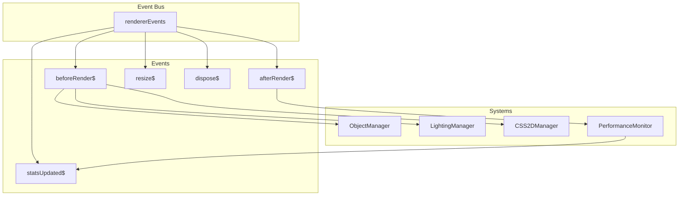

# Event Bus Pattern

Centralized RxJS event bus for renderer internals that promotes loose coupling between systems and enables reactive programming throughout the Teskooano renderer architecture.

## 🎯 Purpose

The Event Bus Pattern provides:

- **Loose Coupling**: Systems communicate without direct dependencies
- **Reactive Programming**: Event-driven architecture with RxJS streams
- **Centralized Communication**: Single point for inter-system messaging
- **Performance Monitoring**: Built-in performance and statistics tracking
- **Lifecycle Management**: Coordinated system initialization and cleanup

## 🏗️ Pattern Structure

### Core Components

**Event Bus**
Central RxJS-based event system that manages all inter-system communication.

**Key Characteristics:**

- **Subject-based**: Uses RxJS Subjects for event emission and subscription
- **Type-safe**: TypeScript integration for event payloads
- **Performance-aware**: Built-in performance monitoring and optimization
- **Lifecycle-aware**: Coordinates system initialization and cleanup

**Event Streams**
Specialized streams for different types of system communication.

**Key Features:**

- **Render Events**: beforeRender$, afterRender$ for animation loop coordination
- **System Events**: resize$, dispose$ for system lifecycle management
- **Performance Events**: statsUpdated$, performanceOptimizationChanged$ for monitoring
- **Custom Events**: Extensible system for domain-specific events

## 📦 Event Streams

### Render Lifecycle Events

**beforeRender$**
Emitted at the start of each render frame with timing information.

```typescript
interface BeforeRenderEvent {
  delta: number; // Time since last frame
  elapsed: number; // Total elapsed time
  frameCount: number; // Current frame number
}
```

**afterRender$**
Emitted after render completion with performance metrics.

```typescript
interface AfterRenderEvent {
  renderTime: number; // Time spent rendering
  frameTime: number; // Total frame time
  fps: number; // Current FPS
}
```

### System Lifecycle Events

**resize$**
Emitted when the renderer canvas is resized.

```typescript
interface ResizeEvent {
  width: number;
  height: number;
  aspectRatio: number;
}
```

**dispose$**
Emitted when the renderer is being disposed.

```typescript
interface DisposeEvent {
  reason: "user" | "error" | "cleanup";
  timestamp: number;
}
```

### Performance Events

**statsUpdated$**
Emitted when performance statistics are updated.

```typescript
interface StatsUpdatedEvent {
  memory: {
    used: number;
    total: number;
    percentage: number;
  };
  performance: {
    fps: number;
    frameTime: number;
    renderTime: number;
  };
  objects: {
    total: number;
    visible: number;
    culled: number;
  };
}
```

**performanceOptimizationChanged$**
Emitted when performance optimization settings change.

```typescript
interface PerformanceOptimizationEvent {
  lodEnabled: boolean;
  occlusionEnabled: boolean;
  shadowQuality: "low" | "medium" | "high";
  maxLights: number;
}
```

## 🔄 Event Flow

### Render Loop Integration

```mermaid
sequenceDiagram
  participant Loop as AnimationLoop
  participant Bus as rendererEvents
  participant Systems as Managers
  participant Stats as PerformanceMonitor

  Loop->>Bus: beforeRender$ {delta, elapsed}
  Bus-->>Systems: Subscriptions fire
  Systems->>Loop: onRender callbacks
  Loop->>Bus: afterRender$ {renderTime, fps}
  Bus-->>Stats: Performance data
  Stats->>Bus: statsUpdated$
```

### System Coordination



## 🎨 Pattern Benefits

### Loose Coupling

- **No Direct Dependencies**: Systems don't need to know about each other
- **Easy Testing**: Systems can be tested in isolation
- **Flexible Architecture**: Easy to add or remove systems
- **Clear Interfaces**: Well-defined event contracts

### Performance

- **Efficient Communication**: RxJS optimized for high-frequency events
- **Built-in Monitoring**: Performance tracking without overhead
- **Optimization Triggers**: Automatic performance optimization
- **Resource Management**: Coordinated resource cleanup

### Maintainability

- **Centralized Logic**: All inter-system communication in one place
- **Type Safety**: TypeScript integration prevents errors
- **Debugging**: Easy to trace event flow and system interactions
- **Documentation**: Self-documenting through event types

## 🚀 Implementation Guidelines

### Event Bus Setup

```typescript
class RendererEventBus {
  // Render lifecycle events
  public readonly beforeRender$ = new Subject<BeforeRenderEvent>();
  public readonly afterRender$ = new Subject<AfterRenderEvent>();

  // System lifecycle events
  public readonly resize$ = new Subject<ResizeEvent>();
  public readonly dispose$ = new Subject<DisposeEvent>();

  // Performance events
  public readonly statsUpdated$ = new Subject<StatsUpdatedEvent>();
  public readonly performanceOptimizationChanged$ =
    new Subject<PerformanceOptimizationEvent>();

  // Custom events
  private customEvents = new Map<string, Subject<any>>();

  emitBeforeRender(event: BeforeRenderEvent): void {
    this.beforeRender$.next(event);
  }

  emitAfterRender(event: AfterRenderEvent): void {
    this.afterRender$.next(event);
  }

  emitResize(event: ResizeEvent): void {
    this.resize$.next(event);
  }

  emitDispose(event: DisposeEvent): void {
    this.dispose$.next(event);
  }

  emitStatsUpdated(event: StatsUpdatedEvent): void {
    this.statsUpdated$.next(event);
  }

  emitPerformanceOptimizationChanged(
    event: PerformanceOptimizationEvent,
  ): void {
    this.performanceOptimizationChanged$.next(event);
  }

  // Custom event management
  createCustomEvent<T>(name: string): Subject<T> {
    if (!this.customEvents.has(name)) {
      this.customEvents.set(name, new Subject<T>());
    }
    return this.customEvents.get(name)!;
  }

  getCustomEvent<T>(name: string): Subject<T> | undefined {
    return this.customEvents.get(name);
  }
}
```

### System Integration

```typescript
class ObjectManager {
  constructor(private eventBus: RendererEventBus) {
    // Subscribe to render events
    this.eventBus.beforeRender$.subscribe((event) => {
      this.updateObjects(event.delta);
    });

    // Subscribe to system events
    this.eventBus.dispose$.subscribe(() => {
      this.cleanup();
    });
  }

  private updateObjects(delta: number): void {
    // Update object positions and states
  }

  private cleanup(): void {
    // Clean up resources
  }
}
```

### Performance Monitoring

```typescript
class PerformanceMonitor {
  private stats: StatsUpdatedEvent = {
    memory: { used: 0, total: 0, percentage: 0 },
    performance: { fps: 0, frameTime: 0, renderTime: 0 },
    objects: { total: 0, visible: 0, culled: 0 },
  };

  constructor(private eventBus: RendererEventBus) {
    // Subscribe to render events for performance tracking
    this.eventBus.afterRender$.subscribe((event) => {
      this.updateStats(event);
      this.eventBus.emitStatsUpdated(this.stats);
    });
  }

  private updateStats(event: AfterRenderEvent): void {
    this.stats.performance.fps = event.fps;
    this.stats.performance.frameTime = event.frameTime;
    this.stats.performance.renderTime = event.renderTime;

    // Update memory stats
    this.stats.memory.used = this.getMemoryUsage();
    this.stats.memory.total = this.getTotalMemory();
    this.stats.memory.percentage =
      (this.stats.memory.used / this.stats.memory.total) * 100;
  }
}
```

## 🔗 Related Patterns

- **[[architecture/Observer Pattern|Observer Pattern]]**: Event Bus implements the Observer pattern with RxJS
- **[[architecture/Manager Pattern|Manager Pattern]]**: Systems that subscribe to events are often managers
- **[[architecture/Performance Pattern|Performance Pattern]]**: Built-in performance monitoring and optimization
- **[[architecture/Strategy Pattern|Strategy Pattern]]**: Performance optimization strategies triggered by events

## 🎯 Performance Considerations

### Event Efficiency

- **Subject Optimization**: Use appropriate RxJS operators for performance
- **Memory Management**: Proper subscription cleanup to prevent memory leaks
- **Event Filtering**: Filter events to reduce unnecessary processing
- **Batch Processing**: Group related events for efficiency

### Monitoring Overhead

- **Minimal Impact**: Performance monitoring adds minimal overhead
- **Configurable**: Can be disabled in production if needed
- **Efficient Collection**: Optimized data collection and reporting
- **Smart Sampling**: Sample performance data at appropriate intervals

---

_The Event Bus Pattern provides the reactive communication backbone that makes the Teskooano renderer system loosely coupled, performant, and maintainable._
