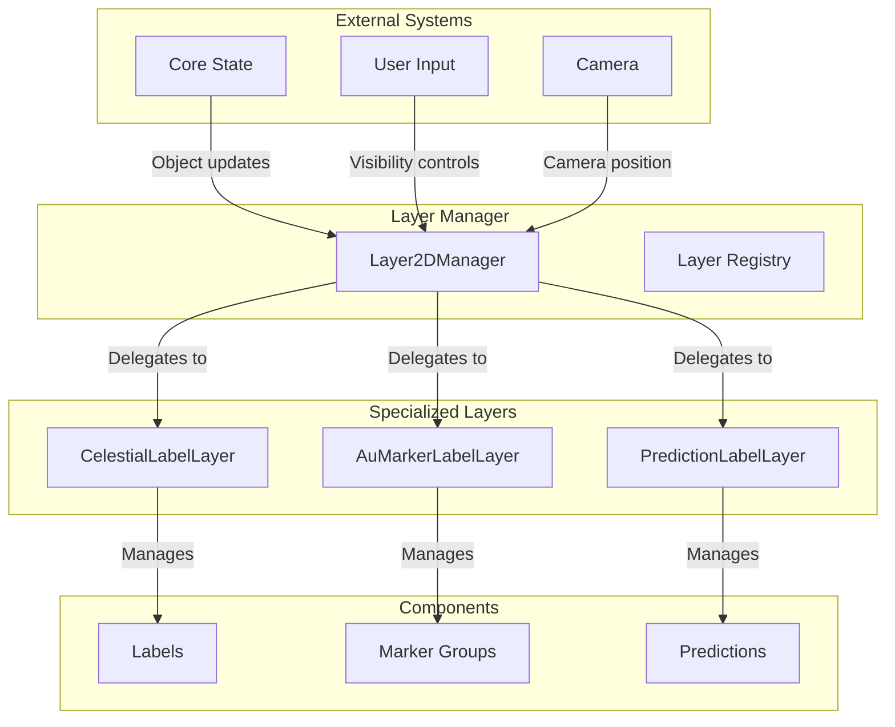
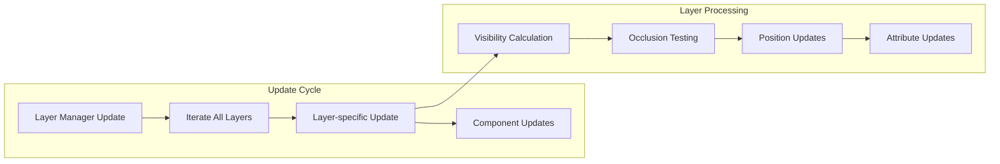

# Layer Pattern

The Layer Pattern is a fundamental architectural pattern used throughout the Teskooano renderer system to organize complex functionality into distinct, specialized layers with clear responsibilities and interfaces.

## 🎯 Purpose

The Layer Pattern provides:

- **Separation of Concerns**: Each layer handles a specific aspect of functionality
- **Modularity**: Layers can be developed, tested, and maintained independently
- **Extensibility**: New layers can be added without affecting existing ones
- **Performance Optimization**: Layers can be optimized independently
- **Clear Interfaces**: Well-defined boundaries between different system aspects

## 🏗️ Pattern Structure

### Core Components

**Base Layer**
An abstract base class that defines the common interface and shared functionality.

**Key Characteristics:**

- **Common Interface**: Defines methods all layers must implement
- **Shared Functionality**: Provides common utilities and patterns
- **Lifecycle Management**: Handles creation, updates, and disposal
- **Resource Management**: Manages layer-specific resources

**Specialized Layers**
Concrete implementations that handle specific types of functionality.

**Key Features:**

- **Single Responsibility**: Each layer handles one specific domain
- **Specialized Logic**: Implements domain-specific algorithms
- **Performance Optimization**: Optimized for specific use cases
- **Independent State**: Maintains its own state and configuration

**Layer Manager**
Coordinates multiple layers and provides a unified interface.

**Key Features:**

- **Layer Registry**: Manages registration and retrieval of layers
- **Update Coordination**: Coordinates updates across all layers
- **Resource Sharing**: Manages shared resources between layers
- **Lifecycle Management**: Handles layer creation and disposal

## 📦 Layer Examples

### CSS2D Label System

The CSS2D label system uses the Layer Pattern to organize different types of labels.

**Base Layer:**

```typescript
abstract class BaseLabelLayer {
  protected elements: Map<string, CSS2DObject> = new Map();
  public isVisible: boolean = true;
  protected scene?: THREE.Scene;

  public abstract getRequiredComponents(): UIRegistryComponent[];
  public abstract update(
    camera: THREE.PerspectiveCamera,
    objectManager: ObjectManager,
  ): void;

  public setVisibility(visible: boolean): void {
    this.isVisible = visible;
    this.elements.forEach((element) => {
      element.visible = visible;
    });
  }

  public removeElement(id: string): void {
    const element = this.elements.get(id);
    if (element) {
      element.removeFromParent();
      this.elements.delete(id);
    }
  }

  public clear(): void {
    this.elements.forEach((element) => {
      element.removeFromParent();
    });
    this.elements.clear();
  }
}
```

**Specialized Layers:**

#### CelestialLabelLayer

Handles labels for celestial bodies with complex visibility rules.

**Key Features:**

- **Type-specific Visibility**: Different rules for planets, stars, moons, etc.
- **Distance Calculation**: Surface-to-surface distance calculations
- **Occlusion Detection**: Advanced occlusion testing with caching
- **Performance Caching**: Caches attribute and position updates

**Implementation:**

```typescript
class CelestialLabelLayer extends BaseLabelLayer {
  private visibilityConfig: Required<LabelVisibilityConfig>;
  private labelCache = new Map<
    string,
    {
      lastDistance: string;
      lastSpeed: string;
      lastVisible: boolean;
      lastPosition?: THREE.Vector3;
    }
  >();

  public override getRequiredComponents(): UIRegistryComponent[] {
    return [
      {
        tagName: CELESTIAL_LABEL_TAG,
        componentClass: CelestialLabelComponent,
      },
    ];
  }

  public override update(
    camera: THREE.PerspectiveCamera,
    objectManager: ObjectManager,
  ): void {
    // Complex visibility logic with type-specific rules
    // Distance and speed formatting
    // Occlusion detection
    // Performance caching
  }
}
```

#### AuMarkerLabelLayer

Handles AU distance marker labels with group-based management.

**Key Features:**

- **Group Management**: Manages AU marker groups from AuMarkerManager
- **Distance-based Visibility**: Simple distance culling for performance
- **Occlusion Detection**: Raycasting-based occlusion testing
- **Cardinal Positioning**: Labels positioned at cardinal directions

**Implementation:**

```typescript
class AuMarkerLabelLayer extends BaseLabelLayer {
  private managedGroups: Map<number, THREE.Group> = new Map();

  public override getRequiredComponents(): UIRegistryComponent[] {
    return [
      {
        tagName: AuMarkerLabelComponent.TAG_NAME,
        componentClass: AuMarkerLabelComponent,
      },
    ];
  }

  public override update(
    camera: THREE.PerspectiveCamera,
    objectManager: ObjectManager,
  ): void {
    // Group-based visibility management
    // Distance-based culling
    // Occlusion detection
  }
}
```

#### PredictionLabelLayer

Handles trajectory prediction labels with time-based visibility.

**Key Features:**

- **Time Categories**: Short-term, medium-term, long-term predictions
- **Velocity Scaling**: Visibility thresholds scale with object velocity
- **Time-based Styling**: Color-coded styling based on prediction time
- **Object Radius Checking**: Prevents labels inside celestial objects

**Implementation:**

```typescript
class PredictionLabelLayer extends BaseLabelLayer {
  private activePredictionObject: THREE.Object3D | null = null;
  private activeObjectVelocity: number = 0;
  private activeObjectRadius: number = 0;

  public override getRequiredComponents(): UIRegistryComponent[] {
    return [
      {
        tagName: PREDICTION_LABEL_TAG,
        componentClass: PredictionLabel,
      },
    ];
  }

  public override update(
    camera: THREE.PerspectiveCamera,
    objectManager: ObjectManager,
  ): void {
    // Velocity-based visibility thresholds
    // Time-based visibility rules
    // Object radius checking
    // Occlusion detection
  }
}
```

**Layer Manager:**

```typescript
class Layer2DManager {
  private renderer: CSS2DRenderer;
  private layers: Map<CSS2DLayerType, BaseLabelLayer> = new Map();

  public registerLayer(layerType: CSS2DLayerType, layer: BaseLabelLayer): void {
    if (this.layers.has(layerType)) {
      console.warn(
        `Layer for type ${layerType} already registered. Overwriting.`,
      );
      this.layers.get(layerType)?.clear();
    }
    this.layers.set(layerType, layer);

    // Register components required by the layer
    layer.getRequiredComponents().forEach(({ tagName, componentClass }) => {
      if (!customElements.get(tagName)) {
        customElements.define(tagName, componentClass);
      }
    });
  }

  public update(
    camera: THREE.PerspectiveCamera,
    objectManager: ObjectManager,
  ): void {
    this.layers.forEach((layer) => layer.update(camera, objectManager));
  }

  public render(camera: THREE.PerspectiveCamera): void {
    this.renderer.render(this.scene, camera);
  }
}
```

### Rendering Layer System

The rendering system uses layers for different aspects of 3D rendering.

**Layer Types:**

- **Scene Layer**: Core Three.js scene management
- **Lighting Layer**: Light source management and calculations
- **Object Layer**: Celestial object rendering and management
- **Effects Layer**: Post-processing and visual effects
- **UI Layer**: 2D overlays and user interface elements

## 🔄 Data Flow

### Layer Coordination



### Layer Update Flow



## 🎨 Pattern Benefits

### Modularity

- **Independent Development**: Layers can be developed separately
- **Specialized Optimization**: Each layer optimized for its domain
- **Clear Boundaries**: Well-defined interfaces between layers
- **Easy Testing**: Layers can be tested in isolation

### Performance

- **Selective Updates**: Only update layers that need updates
- **Specialized Algorithms**: Each layer uses optimal algorithms
- **Resource Management**: Efficient resource usage per layer
- **Caching**: Layer-specific caching and optimization

### Extensibility

- **Easy Addition**: New layers can be added without affecting others
- **Plugin Architecture**: Layers can be loaded dynamically
- **Configuration**: Each layer can be configured independently
- **Feature Isolation**: New features isolated to specific layers

## 🚀 Implementation Guidelines

### Base Layer Design

```typescript
abstract class BaseLayer<T> {
  protected elements = new Map<string, T>();
  public isVisible: boolean = true;
  protected scene?: THREE.Scene;

  abstract getRequiredComponents(): UIRegistryComponent[];
  abstract update(
    camera: THREE.PerspectiveCamera,
    objectManager: ObjectManager,
  ): void;

  public setVisibility(visible: boolean): void {
    this.isVisible = visible;
    this.updateVisibility(visible);
  }

  protected updateVisibility(visible: boolean): void {
    // Default implementation
  }

  public addElement(id: string, element: T): void {
    this.elements.set(id, element);
  }

  public removeElement(id: string): void {
    const element = this.elements.get(id);
    if (element) {
      this.disposeElement(element);
      this.elements.delete(id);
    }
  }

  public clear(): void {
    this.elements.forEach((element) => {
      this.disposeElement(element);
    });
    this.elements.clear();
  }

  protected abstract disposeElement(element: T): void;
}
```

### Layer Manager Implementation

```typescript
class LayerManager<T extends BaseLayer<any>> {
  private layers = new Map<string, T>();
  private layerTypes = new Map<string, new (...args: any[]) => T>();

  registerLayerType(type: string, layerClass: new (...args: any[]) => T): void {
    this.layerTypes.set(type, layerClass);
  }

  createLayer(type: string, ...args: any[]): T {
    const LayerClass = this.layerTypes.get(type);
    if (!LayerClass) {
      throw new Error(`Unknown layer type: ${type}`);
    }

    const layer = new LayerClass(...args);
    this.layers.set(type, layer);
    return layer;
  }

  getLayer(type: string): T | undefined {
    return this.layers.get(type);
  }

  update(camera: THREE.PerspectiveCamera, objectManager: ObjectManager): void {
    this.layers.forEach((layer) => {
      if (layer.isVisible) {
        layer.update(camera, objectManager);
      }
    });
  }

  dispose(): void {
    this.layers.forEach((layer) => {
      layer.clear();
    });
    this.layers.clear();
  }
}
```

### Layer Factory

```typescript
class LayerFactory {
  static createLabelLayer(
    type: "celestial" | "au-marker" | "prediction",
    scene: THREE.Scene,
  ): BaseLabelLayer {
    switch (type) {
      case "celestial":
        return new CelestialLabelLayer(scene);
      case "au-marker":
        return new AuMarkerLabelLayer(scene);
      case "prediction":
        return new PredictionLabelLayer(scene);
      default:
        throw new Error(`Unknown label layer type: ${type}`);
    }
  }
}
```

## 🔗 Related Patterns

- **[[Manager Pattern]]**: Layer managers often implement the Manager pattern
- **[[Strategy Pattern]]**: Layers can use different strategies for their functionality
- **[[Factory Pattern]]**: Layer factories for creating specialized layers
- **[[Template Method Pattern]]**: Base layers define common structure
- **[[Observer Pattern]]**: Layers observe state changes and update accordingly

## 🎯 Performance Considerations

### Layer Optimization

- **Selective Updates**: Only update layers that need updates
- **Update Frequency**: Different layers can have different update frequencies
- **Caching**: Layer-specific caching for expensive calculations
- **Lazy Loading**: Load layer resources only when needed

### Resource Management

- **Shared Resources**: Share common resources between layers
- **Memory Management**: Efficient memory usage per layer
- **Disposal**: Proper cleanup of layer-specific resources
- **Resource Pooling**: Pool resources within layers

### Scalability

- **Layer Limits**: Set reasonable limits on layer counts
- **Update Prioritization**: Prioritize critical layers over cosmetic ones
- **LOD Integration**: Use Level of Detail to reduce layer complexity
- **Spatial Partitioning**: Use spatial data structures for large numbers of elements

---

_The Layer Pattern provides the organizational structure that makes complex systems like the CSS2D label system modular, maintainable, and performant._
