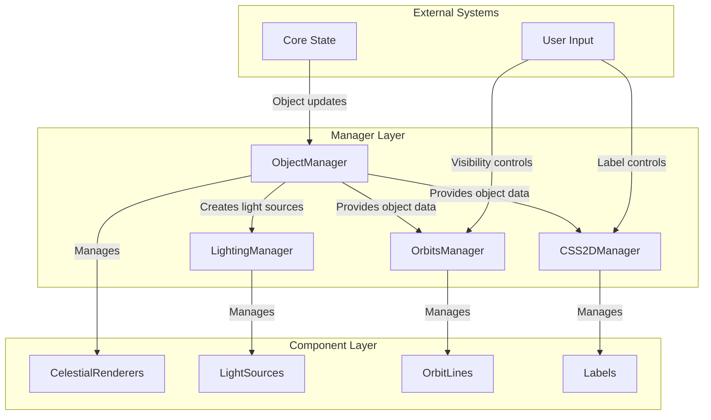
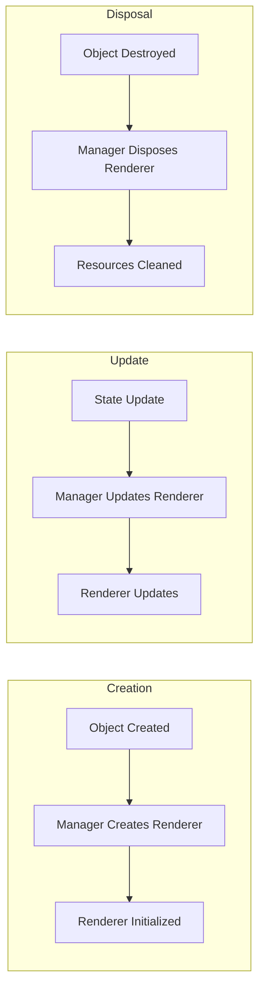

# Manager Pattern

The Manager Pattern is a fundamental architectural pattern used throughout the Teskooano renderer system to coordinate complex subsystems and manage their lifecycles.

## 🎯 Purpose

The Manager Pattern provides:

- **Centralized Coordination**: Single point of control for related functionality
- **Lifecycle Management**: Handles creation, updates, and disposal of components
- **Resource Management**: Manages memory, performance, and system resources
- **API Facade**: Provides clean interface to complex subsystems

## 🏗️ Pattern Structure

### Core Components

**Manager Class**
A specialized class that orchestrates a specific domain of functionality.

**Key Characteristics:**

- **Single Responsibility**: Each manager handles one specific domain
- **Lifecycle Control**: Manages creation, updates, and disposal of components
- **Resource Coordination**: Coordinates between multiple sub-components
- **State Management**: Maintains internal state for its domain

**Component Registry**
A collection of managed components with efficient lookup and lifecycle management.

**Key Features:**

- **Fast Lookup**: Efficient component retrieval by ID or type
- **Lifecycle Tracking**: Monitors component creation and destruction
- **Memory Management**: Automatic cleanup of unused components
- **Batch Operations**: Efficient bulk operations on multiple components

## 📦 Manager Examples

### ObjectManager

Manages all celestial object renderers and their lifecycles.

**Responsibilities:**

- Creates and disposes of celestial object renderers
- Coordinates with LightingManager for light source creation
- Manages renderer caching to prevent recreation
- Synchronizes with physics state updates

**Key Methods:**

```typescript
class ObjectManager {
  addObject(object: RenderableCelestialObject): void;
  removeObject(objectId: string): void;
  update(): void;
  createLightSource(star: RenderableCelestialObject): LightSourceComponent;
  dispose(): void;
}
```

### LightingManager

Manages all light sources in the scene.

**Responsibilities:**

- Registers and unregisters light source components
- Provides efficient light source queries for renderers
- Manages light source lifecycle and updates
- Optimizes light source calculations

**Key Methods:**

```typescript
class LightingManager {
  registerLightSource(lightSource: LightSourceComponent): void;
  unregisterLightSource(lightSource: LightSourceComponent): void;
  getInfluentialLights(
    position: OSVector3,
    maxLights?: number,
  ): LightSourceComponent[];
  clear(): void;
}
```

### OrbitsManager

Manages orbital visualization for all celestial objects.

**Responsibilities:**

- Switches between Ideal and N-Body visualization strategies
- Manages trail and prediction visualization
- Coordinates with physics engine changes
- Handles orbital data updates

**Key Methods:**

```typescript
class OrbitsManager {
  update(): void;
  setVisibility(visible: boolean): void;
  highlightVisualization(objectId: string, highlighted: boolean): void;
  setPredictionDuration(duration: number): void;
  dispose(): void;
}
```

### CSS2DManager

Manages all 2D labels and text overlays.

**Responsibilities:**

- Creates and manages CSS2D labels
- Handles label occlusion behind celestial objects
- Manages distance-based and LOD-based visibility
- Coordinates label positioning and updates

**Key Methods:**

```typescript
class CSS2DManager {
  addLabel(label: CSS2DLabel): void;
  removeLabel(labelId: string): void;
  update(): void;
  setOcclusionEnabled(enabled: boolean): void;
  setVisibilityDistance(distance: number): void;
  dispose(): void;
}
```

## 🔄 Data Flow

### Manager Coordination



### Lifecycle Management



## 🎨 Pattern Benefits

### Centralized Control

- **Single Point of Coordination**: Each manager handles one domain
- **Consistent Interface**: Standardized methods across all managers
- **Easier Debugging**: Clear responsibility boundaries
- **Simplified Testing**: Managers can be tested in isolation

### Resource Management

- **Automatic Cleanup**: Managers handle component disposal
- **Memory Optimization**: Efficient resource allocation and deallocation
- **Performance Monitoring**: Track performance within each domain
- **Error Handling**: Centralized error handling for each domain

### Scalability

- **Modular Design**: Easy to add new managers for new domains
- **Independent Operation**: Managers can operate independently
- **Efficient Updates**: Only update components that need updates
- **Batch Operations**: Efficient bulk operations on multiple components

## 🚀 Implementation Guidelines

### Manager Structure

```typescript
abstract class BaseManager<T> {
  protected components = new Map<string, T>();

  abstract createComponent(id: string, data: any): T;
  abstract updateComponent(component: T, data: any): void;
  abstract disposeComponent(component: T): void;

  addComponent(id: string, data: any): void {
    const component = this.createComponent(id, data);
    this.components.set(id, component);
  }

  removeComponent(id: string): void {
    const component = this.components.get(id);
    if (component) {
      this.disposeComponent(component);
      this.components.delete(id);
    }
  }

  update(): void {
    for (const component of this.components.values()) {
      this.updateComponent(component, data);
    }
  }

  dispose(): void {
    for (const component of this.components.values()) {
      this.disposeComponent(component);
    }
    this.components.clear();
  }
}
```

### Component Registry Pattern

```typescript
class ComponentRegistry<T> {
  private components = new Map<string, T>();
  private factories = new Map<string, ComponentFactory<T>>();

  registerFactory(type: string, factory: ComponentFactory<T>): void {
    this.factories.set(type, factory);
  }

  createComponent(type: string, id: string, data: any): T {
    const factory = this.factories.get(type);
    if (!factory) {
      throw new Error(`No factory registered for type: ${type}`);
    }

    const component = factory.create(id, data);
    this.components.set(id, component);
    return component;
  }

  getComponent(id: string): T | undefined {
    return this.components.get(id);
  }

  removeComponent(id: string): void {
    const component = this.components.get(id);
    if (component) {
      // Dispose component
      this.components.delete(id);
    }
  }
}
```

## 🔗 Related Patterns

- **[[Factory Pattern]]**: Managers often use factories to create components
- **[[Registry Pattern]]**: Component registries for efficient lookup
- **[[Observer Pattern]]**: Managers observe state changes and update components
- **[[Strategy Pattern]]**: Managers can switch between different strategies
- **[[Facade Pattern]]**: Managers provide simplified interface to complex subsystems

## 🎯 Performance Considerations

### Efficient Updates

- **Change Detection**: Only update components that have changed
- **Batch Operations**: Group related operations for efficiency
- **Lazy Updates**: Defer updates until necessary
- **Update Prioritization**: Prioritize critical updates over cosmetic ones

### Memory Management

- **Component Pooling**: Reuse component instances when possible
- **Automatic Cleanup**: Ensure proper disposal of unused components
- **Memory Monitoring**: Track memory usage within each manager
- **Garbage Collection**: Minimize garbage collection pressure

### Scalability

- **Component Limits**: Set reasonable limits on component counts
- **Update Throttling**: Throttle updates for performance
- **LOD Integration**: Use Level of Detail to reduce update frequency
- **Spatial Partitioning**: Use spatial data structures for large numbers of components

---

_The Manager Pattern provides the organizational backbone that makes the Teskooano renderer system modular, maintainable, and performant._
