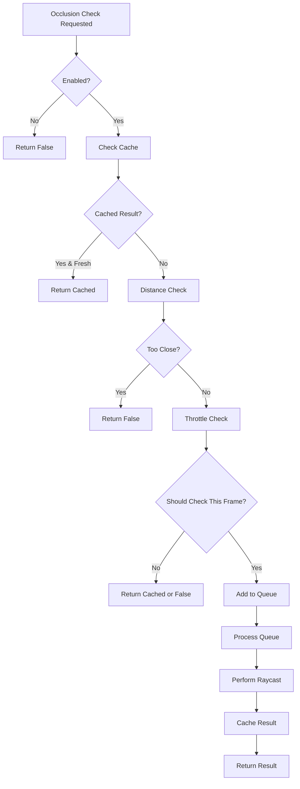
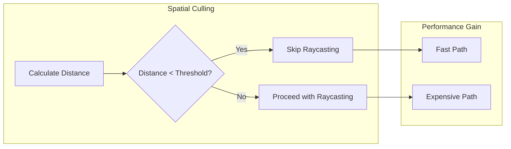

---
aliases:
  [Occlusion Detection Pattern, occlusion, visibility, raycasting, performance]
tags:
  [
    architecture,
    pattern,
    occlusion,
    visibility,
    raycasting,
    performance,
    labels,
  ]
type: pattern
status: active
---

# Occlusion Detection Pattern

The Occlusion Detection Pattern is a sophisticated performance-optimized system used throughout the Teskooano renderer to determine when UI elements should be hidden behind celestial objects, providing realistic visibility management with minimal performance impact.

## 🎯 Purpose

The Occlusion Detection Pattern provides:

- **Realistic Visibility**: UI elements disappear when hidden behind celestial objects
- **Performance Optimization**: Efficient raycasting with caching and throttling
- **Spatial Culling**: Quick distance checks before expensive operations
- **Configurable Behavior**: Adjustable parameters for different performance targets
- **Memory Efficiency**: Intelligent caching and resource management

## 🏗️ Pattern Structure

### Core Components

**Occlusion Manager**
Central coordinator for occlusion detection operations.

**Key Characteristics:**

- **Configuration Management**: Manages occlusion parameters and settings
- **Performance Monitoring**: Tracks occlusion performance metrics
- **Resource Coordination**: Manages shared resources and caching
- **Strategy Selection**: Chooses appropriate occlusion strategies

**Raycasting Engine**
Core raycasting implementation with optimization features.

**Key Features:**

- **Spatial Culling**: Quick distance checks before raycasting
- **Object Filtering**: Intelligent filtering of occluding objects
- **Error Handling**: Graceful fallback for raycasting failures
- **Performance Optimization**: Optimized raycasting algorithms

**Caching System**
Intelligent caching of occlusion results for performance.

**Key Features:**

- **Result Storage**: Caches occlusion results with timestamps
- **Cache Management**: Automatic cache cleanup and invalidation
- **Memory Efficiency**: Efficient memory usage for cached results
- **Performance Gain**: Avoids redundant raycasting calculations

**Throttling System**
Controls the frequency and intensity of occlusion checks.

**Key Features:**

- **Check Frequency**: Configurable frequency for occlusion tests
- **Frame Limiting**: Limits occlusion tests per frame
- **Queue Processing**: Queues tests for processing when frequency allows
- **Performance Protection**: Prevents performance impact from excessive checks

## 📦 Occlusion Examples

### BaseLabelLayer Occlusion System

The base layer provides a sophisticated occlusion detection system used by all label layers.

**Configuration:**

```typescript
public occlusionConfig = {
  checkFrequency: 60,           // Check every 60 frames
  maxTestsPerFrame: 3,          // Max occlusion tests per frame
  cacheDuration: 2000,          // Cache results for 2 seconds
  nearbyDistanceThreshold: 50,  // Skip tests for nearby labels
  enabled: true,                // Master occlusion toggle
  useWasmOptimization: true,    // Future WASM optimization
};
```

**Optimized Occlusion Checking:**

```typescript
protected isLabelOccludedOptimized(
  labelId: string,
  labelPosition: OSVector3,
  camera: THREE.PerspectiveCamera,
  objectManager: ObjectManager,
  labelObjectId: string
): boolean {
  // Check if occlusion is enabled
  if (!this.occlusionConfig.enabled) {
    return false;
  }

  // Check cache first
  const cached = this.occlusionResults.get(labelId);
  const now = Date.now();
  if (cached && now - cached.timestamp < this.occlusionConfig.cacheDuration) {
    return cached.result;
  }

  // Spatial culling: quick distance check
  const cameraPosition = this._tempVector3_1;
  camera.getWorldPosition(cameraPosition);
  const labelPosThree = labelPosition.toThreeJS();
  const distance = cameraPosition.distanceTo(labelPosThree);

  // If label is very close to camera, it's unlikely to be occluded
  if (distance < this.occlusionConfig.nearbyDistanceThreshold) {
    this.occlusionResults.set(labelId, { result: false, timestamp: now });
    return false;
  }

  // Throttling: only check a limited number of labels per frame
  this.occlusionCheckCounter++;
  const shouldCheckThisFrame =
    this.occlusionCheckCounter % this.occlusionConfig.checkFrequency === 0;

  if (!shouldCheckThisFrame) {
    return cached ? cached.result : false;
  }

  // Add to queue for processing
  if (!this.labelCheckQueue.includes(labelId)) {
    this.labelCheckQueue.push(labelId);
  }

  // Process queue up to the limit
  let testsPerformed = 0;
  while (
    this.labelCheckQueue.length > 0 &&
    testsPerformed < this.occlusionConfig.maxTestsPerFrame
  ) {
    const queuedLabelId = this.labelCheckQueue.shift()!;
    if (queuedLabelId === labelId) {
      const result = this.performOcclusionTest(
        labelPosThree,
        camera,
        objectManager,
        labelObjectId
      );
      this.occlusionResults.set(labelId, { result, timestamp: now });
      return result;
    }
    testsPerformed++;
  }

  return cached ? cached.result : false;
}
```

**Raycasting Implementation:**

```typescript
private performOcclusionTest(
  labelPosition: THREE.Vector3,
  camera: THREE.PerspectiveCamera,
  objectManager: ObjectManager,
  labelObjectId: string
): boolean {
  // Get camera world position
  const cameraPosition = this._tempVector3_1;
  camera.getWorldPosition(cameraPosition);

  // Calculate direction from camera to label
  const direction = this._tempVector3_2
    .copy(labelPosition)
    .sub(cameraPosition)
    .normalize();
  const distance = cameraPosition.distanceTo(labelPosition);

  // Set up the raycaster
  this.raycaster.set(cameraPosition, direction);
  this.raycaster.far = distance - 0.1;
  this.raycaster.camera = camera;

  // Get all celestial objects for intersection testing
  const allObjects = objectManager.getLatestRenderableObjects();
  const intersectableObjects: THREE.Object3D[] = [];

  Object.keys(allObjects).forEach((objectId) => {
    // Skip the object this label belongs to
    if (labelObjectId && objectId === labelObjectId) return;

    const mesh = objectManager.getObject(objectId);
    if (mesh && mesh.visible && mesh.matrixWorld) {
      // Only test against objects that are reasonably close to the ray path
      const objectPosition = this._tempVector3_3.copy(mesh.position);
      if (objectPosition) {
        const rayToObjectDistance = this._tempVector3_1
          .copy(cameraPosition)
          .add(this._tempVector3_2.clone().multiplyScalar(distance * 0.5))
          .distanceTo(objectPosition);

        // Only include objects that could realistically block this ray
        if (rayToObjectDistance < distance * 0.5) {
          intersectableObjects.push(mesh);
          mesh.traverse((child) => {
            if (
              child &&
              child !== mesh &&
              child.matrixWorld &&
              (child.type === "Mesh" || child.type === "LOD" || child.type === "Sprite")
            ) {
              intersectableObjects.push(child);
            }
          });
        }
      }
    }
  });

  try {
    const intersections = this.raycaster.intersectObjects(
      intersectableObjects,
      false
    );
    return intersections.length > 0;
  } catch (error) {
    console.warn("Occlusion test failed:", error);
    return false;
  }
}
```

### CelestialLabelLayer Occlusion

Specialized occlusion for celestial labels with type-specific considerations.

**Implementation:**

```typescript
// Apply occlusion checking if the label would otherwise be visible
if (visible && this.isVisible) {
  const labelWorldPosition = new THREE.Vector3();
  label.getWorldPosition(labelWorldPosition);

  const labelId = `celestial_${objectId}`;

  const isOccluded = this.isLabelOccludedOptimized(
    labelId,
    OSVector3.fromThreeJS(labelWorldPosition),
    camera,
    objectManager,
    objectId,
  );

  if (isOccluded) {
    visible = false;
  }
}
```

### AuMarkerLabelLayer Occlusion

Simplified occlusion for AU markers with group-based management.

**Implementation:**

```typescript
// Perform raycast from camera to marker's position
const markerPosition = group.position.clone();
raycaster.set(cameraPosition, markerPosition.sub(cameraPosition).normalize());

// Get all rendered meshes from the ObjectManager
const allRenderedMeshes = objectManager.getAllRenderedMeshes();

// Filter out AU marker meshes and ensure valid occluders
const occluders = allRenderedMeshes.filter(
  (mesh) =>
    mesh instanceof THREE.Mesh &&
    mesh.visible &&
    mesh.matrixWorld !== null &&
    !mesh.name.startsWith("au-marker-label"),
);

const intersects = raycaster.intersectObjects(occluders, true);

// If intersection is closer than marker, it's occluded
if (
  intersects.length > 0 &&
  intersects[0].distance < cameraPosition.distanceTo(group.position)
) {
  visible = false;
}
```

## 🔄 Occlusion Algorithm Flow

### Complete Occlusion Flow



### Spatial Culling Flow



## 🎨 Pattern Benefits

### Performance

- **Spatial Culling**: Quick distance checks avoid expensive raycasting
- **Result Caching**: Caches results to avoid redundant calculations
- **Throttling**: Limits occlusion checks to prevent performance impact
- **Queue Processing**: Efficient batch processing of occlusion tests

### Accuracy

- **Radius-aware Occlusion**: Uses actual object radius for sphere-based occlusion
- **Per-object LOD Filtering**: Only LOD0 objects can cause occlusion
- **Spatial Optimization**: Only tests objects near the ray path
- **Error Handling**: Graceful fallback for raycasting failures

### Flexibility

- **Configurable Parameters**: Adjustable thresholds and frequencies
- **Selective Enabling**: Can be enabled/disabled per layer
- **Performance Tuning**: Fine-tune for different performance targets
- **Extensible Design**: Easy to add new occlusion strategies

## 🚀 Implementation Guidelines

### Occlusion Configuration

```typescript
interface OcclusionConfig {
  checkFrequency: number; // Frames between checks
  maxTestsPerFrame: number; // Max tests per frame
  cacheDuration: number; // Cache validity duration
  nearbyDistanceThreshold: number; // Distance threshold for culling
  enabled: boolean; // Master toggle
  useWasmOptimization: boolean; // Future optimization
}

class OcclusionManager {
  private config: OcclusionConfig;
  private cache = new Map<string, { result: boolean; timestamp: number }>();
  private queue: string[] = [];
  private counter = 0;

  constructor(config: Partial<OcclusionConfig> = {}) {
    this.config = {
      checkFrequency: 60,
      maxTestsPerFrame: 3,
      cacheDuration: 2000,
      nearbyDistanceThreshold: 50,
      enabled: true,
      useWasmOptimization: true,
      ...config,
    };
  }

  checkOcclusion(
    id: string,
    position: THREE.Vector3,
    camera: THREE.PerspectiveCamera,
    objects: THREE.Object3D[],
  ): boolean {
    // Implementation follows the pattern above
  }
}
```

### Raycasting Optimization

```typescript
class OptimizedRaycaster {
  private raycaster = new THREE.Raycaster();
  private tempVectors = {
    cameraPosition: new THREE.Vector3(),
    direction: new THREE.Vector3(),
    objectPosition: new THREE.Vector3(),
  };

  setupRaycaster(
    camera: THREE.PerspectiveCamera,
    targetPosition: THREE.Vector3,
  ): void {
    camera.getWorldPosition(this.tempVectors.cameraPosition);

    this.tempVectors.direction
      .copy(targetPosition)
      .sub(this.tempVectors.cameraPosition)
      .normalize();

    const distance = this.tempVectors.cameraPosition.distanceTo(targetPosition);

    this.raycaster.set(
      this.tempVectors.cameraPosition,
      this.tempVectors.direction,
    );
    this.raycaster.far = distance - 0.1;
    this.raycaster.camera = camera;
  }

  filterObjects(
    objects: THREE.Object3D[],
    cameraPosition: THREE.Vector3,
    maxDistance: number,
  ): THREE.Object3D[] {
    return objects.filter((obj) => {
      if (!obj.visible || !obj.matrixWorld) return false;

      obj.getWorldPosition(this.tempVectors.objectPosition);
      const distance = cameraPosition.distanceTo(
        this.tempVectors.objectPosition,
      );

      return distance < maxDistance;
    });
  }
}
```

### Caching System

```typescript
class OcclusionCache {
  private cache = new Map<string, { result: boolean; timestamp: number }>();
  private maxSize: number;
  private cleanupInterval: number;

  constructor(maxSize = 1000, cleanupInterval = 60000) {
    this.maxSize = maxSize;
    this.cleanupInterval = cleanupInterval;
    this.startCleanup();
  }

  get(id: string, maxAge: number): boolean | null {
    const cached = this.cache.get(id);
    if (!cached) return null;

    const age = Date.now() - cached.timestamp;
    if (age > maxAge) {
      this.cache.delete(id);
      return null;
    }

    return cached.result;
  }

  set(id: string, result: boolean): void {
    if (this.cache.size >= this.maxSize) {
      this.evictOldest();
    }

    this.cache.set(id, { result, timestamp: Date.now() });
  }

  private evictOldest(): void {
    let oldestId: string | null = null;
    let oldestTime = Date.now();

    for (const [id, { timestamp }] of this.cache) {
      if (timestamp < oldestTime) {
        oldestTime = timestamp;
        oldestId = id;
      }
    }

    if (oldestId) {
      this.cache.delete(oldestId);
    }
  }

  private startCleanup(): void {
    setInterval(() => {
      const now = Date.now();
      for (const [id, { timestamp }] of this.cache) {
        if (now - timestamp > this.cleanupInterval) {
          this.cache.delete(id);
        }
      }
    }, this.cleanupInterval);
  }
}
```

## 🔗 Related Patterns

- **[[architecture/Layer Pattern|Layer Pattern]]**: Occlusion detection is implemented within layers
- **[[architecture/Caching Pattern|Caching Pattern]]**: Result caching for performance optimization
- **[[architecture/Strategy Pattern|Strategy Pattern]]**: Different occlusion strategies for different use cases
- **[[architecture/Observer Pattern|Observer Pattern]]**: Occlusion results trigger visibility updates
- **[[architecture/Performance Pattern|Performance Pattern]]**: Performance optimization techniques

## 🎯 Performance Considerations

### Optimization Techniques

- **Spatial Culling**: Quick distance checks before expensive raycasting
- **Result Caching**: Cache occlusion results to avoid redundant calculations
- **Throttling**: Limit occlusion checks to prevent performance impact
- **Queue Processing**: Efficient batch processing of occlusion tests

### Memory Management

- **Cache Size Limits**: Prevent unlimited cache growth
- **Automatic Cleanup**: Remove stale cache entries
- **Object Pooling**: Reuse vector objects for calculations
- **Efficient Data Structures**: Use appropriate data structures for performance

### Scalability

- **Configurable Limits**: Adjustable thresholds for different performance targets
- **LOD Integration**: Use Level of Detail to reduce occlusion complexity
- **Spatial Partitioning**: Use spatial data structures for large numbers of objects
- **Parallel Processing**: Consider Web Workers for heavy occlusion calculations

---

_The Occlusion Detection Pattern provides the sophisticated visibility management that makes the Teskooano renderer system both realistic and performant._
