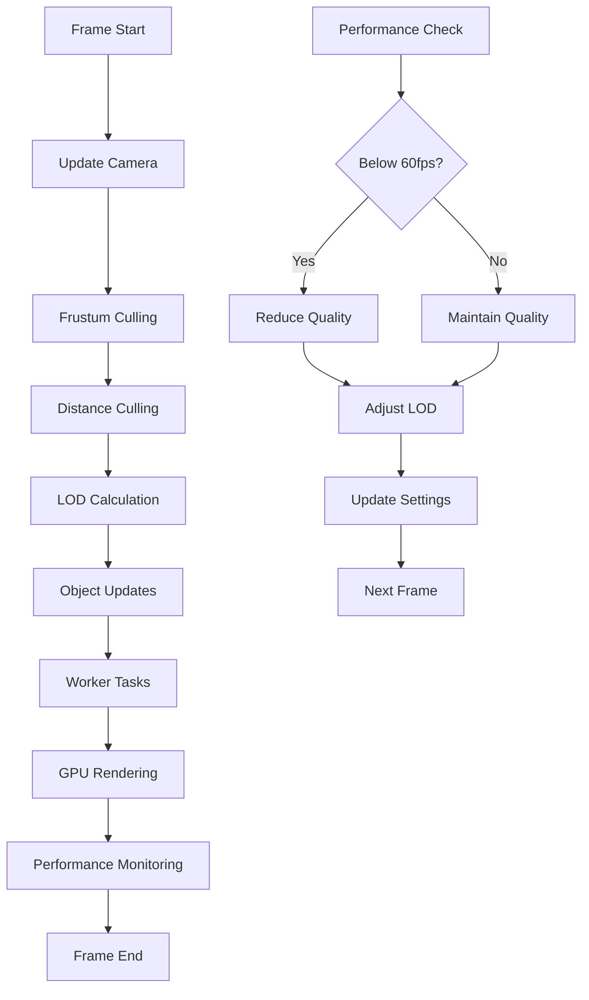
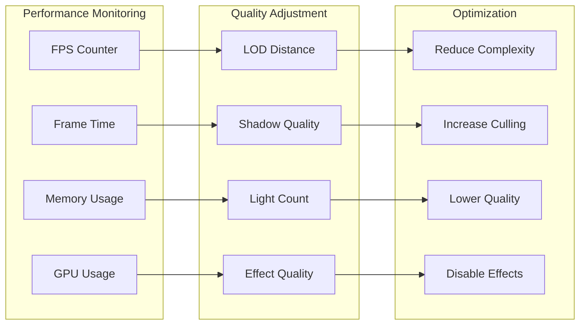

# Performance Pattern

Comprehensive performance optimization strategies to maintain 60fps rendering in large-scale astronomical scenes with thousands of celestial objects.

## 🎯 Purpose

The Performance Pattern provides:

- **60fps Target**: Maintains smooth 60fps rendering under all conditions
- **Scalability**: Handles scenes with thousands of celestial objects
- **Adaptive Quality**: Automatically adjusts quality based on performance
- **Resource Efficiency**: Optimizes CPU, GPU, and memory usage
- **User Experience**: Ensures responsive interaction and smooth animations

## 🏗️ Pattern Structure

### Core Strategies

**Level of Detail (LOD) System**
Distance-based complexity reduction that adjusts object detail based on camera distance.

**Key Features:**

- **Multi-level LOD**: 3-4 levels of detail per object type
- **Distance-based Switching**: Automatic LOD transitions
- **Performance Scaling**: Reduces complexity at distance
- **Quality Preservation**: Maintains visual quality when close

**Spatial Culling**
Efficient visibility determination to avoid rendering off-screen objects.

**Key Features:**

- **Frustum Culling**: Only render objects in camera view
- **Distance Gates**: Skip objects beyond maximum render distance
- **Occlusion Culling**: Skip objects hidden behind others
- **Hierarchical Culling**: Efficient culling of object groups

**Web Worker Integration**
Offloads expensive calculations to background threads.

**Key Features:**

- **Trail Calculations**: Historical trajectory computation
- **Prediction Generation**: Future trajectory prediction
- **Physics Simulation**: N-body calculations
- **Data Processing**: Large dataset processing

**Object Pooling**
Reuses objects to reduce garbage collection pressure.

**Key Features:**

- **Vector Pooling**: Reuse THREE.Vector3 objects
- **Buffer Pooling**: Reuse geometry buffers
- **Material Pooling**: Reuse material instances
- **Memory Efficiency**: Reduces allocation overhead

## 📦 Performance Strategies

### Level of Detail (LOD) System

**LOD Levels:**

- **Level 0 (High Detail)**: Full geometry, complex shaders, all effects
- **Level 1 (Medium Detail)**: Simplified geometry, basic shaders
- **Level 2 (Low Detail)**: Minimal geometry, simple materials
- **Level 3 (Billboard)**: 2D sprite representation

**Implementation:**

```typescript
class LODManager {
  private lodLevels = new Map<string, LODLevel[]>();

  getLODLevel(
    object: RenderableCelestialObject,
    cameraDistance: number,
  ): LODLevel {
    const levels = this.lodLevels.get(object.type);
    if (!levels) return LODLevel.High;

    for (const level of levels) {
      if (cameraDistance <= level.maxDistance) {
        return level;
      }
    }

    return LODLevel.Billboard;
  }

  updateLOD(object: RenderableCelestialObject, cameraDistance: number): void {
    const newLevel = this.getLODLevel(object, cameraDistance);
    const currentLevel = object.currentLOD;

    if (newLevel !== currentLevel) {
      this.switchLOD(object, newLevel);
    }
  }
}
```

### Spatial Culling System

**Frustum Culling:**

```typescript
class FrustumCuller {
  private frustum = new THREE.Frustum();
  private cameraMatrix = new THREE.Matrix4();

  isVisible(object: THREE.Object3D, camera: THREE.Camera): boolean {
    this.cameraMatrix.multiplyMatrices(
      camera.projectionMatrix,
      camera.matrixWorldInverse,
    );
    this.frustum.setFromProjectionMatrix(this.cameraMatrix);

    return this.frustum.intersectsObject(object);
  }

  cullObjects(
    objects: THREE.Object3D[],
    camera: THREE.Camera,
  ): THREE.Object3D[] {
    return objects.filter((object) => this.isVisible(object, camera));
  }
}
```

**Distance Gates:**

```typescript
class DistanceCuller {
  private maxRenderDistance = 1000; // AU

  isWithinRenderDistance(
    object: RenderableCelestialObject,
    camera: THREE.Camera,
  ): boolean {
    const distance = this.calculateDistance(object, camera);
    return distance <= this.maxRenderDistance;
  }

  private calculateDistance(
    object: RenderableCelestialObject,
    camera: THREE.Camera,
  ): number {
    const objectPosition = object.position;
    const cameraPosition = camera.position;
    return objectPosition.distanceTo(cameraPosition);
  }
}
```

### Web Worker Integration

**Trail Calculation Worker:**

```typescript
// trail-worker.ts
self.onmessage = function (e) {
  const { objectData, timeSteps, physicsEngine } = e.data;

  const trails = calculateTrails(objectData, timeSteps, physicsEngine);

  self.postMessage({
    type: "trails-calculated",
    trails: trails,
  });
};

function calculateTrails(
  objects: any[],
  timeSteps: number,
  physicsEngine: string,
) {
  // Expensive trail calculation
  return trails;
}
```

**Main Thread Integration:**

```typescript
class TrailManager {
  private worker: Worker;
  private pendingCalculations = new Map<string, Promise<any>>();

  constructor() {
    this.worker = new Worker("trail-worker.js");
    this.worker.onmessage = this.handleWorkerMessage.bind(this);
  }

  calculateTrails(objects: RenderableCelestialObject[]): Promise<TrailData[]> {
    const calculationId = this.generateId();

    const promise = new Promise<TrailData[]>((resolve) => {
      this.pendingCalculations.set(calculationId, resolve);
    });

    this.worker.postMessage({
      id: calculationId,
      objects: objects.map((obj) => this.serializeObject(obj)),
      timeSteps: 1000,
      physicsEngine: "nbody",
    });

    return promise;
  }

  private handleWorkerMessage(e: MessageEvent) {
    const { id, trails } = e.data;
    const resolve = this.pendingCalculations.get(id);

    if (resolve) {
      resolve(trails);
      this.pendingCalculations.delete(id);
    }
  }
}
```

### Object Pooling System

**Vector Pool:**

```typescript
class Vector3Pool {
  private pool: THREE.Vector3[] = [];
  private maxSize = 1000;

  acquire(): THREE.Vector3 {
    return this.pool.pop() || new THREE.Vector3();
  }

  release(vector: THREE.Vector3): void {
    if (this.pool.length < this.maxSize) {
      vector.set(0, 0, 0);
      this.pool.push(vector);
    }
  }

  get size(): number {
    return this.pool.length;
  }
}
```

**Buffer Pool:**

```typescript
class BufferPool {
  private geometryPool = new Map<string, THREE.BufferGeometry[]>();
  private materialPool = new Map<string, THREE.Material[]>();

  acquireGeometry(type: string): THREE.BufferGeometry {
    const pool = this.geometryPool.get(type) || [];
    return pool.pop() || this.createGeometry(type);
  }

  releaseGeometry(type: string, geometry: THREE.BufferGeometry): void {
    if (!this.geometryPool.has(type)) {
      this.geometryPool.set(type, []);
    }

    const pool = this.geometryPool.get(type)!;
    if (pool.length < 50) {
      // Limit pool size
      pool.push(geometry);
    }
  }

  private createGeometry(type: string): THREE.BufferGeometry {
    switch (type) {
      case "sphere":
        return new THREE.SphereGeometry(1, 32, 32);
      case "plane":
        return new THREE.PlaneGeometry(1, 1);
      default:
        return new THREE.BufferGeometry();
    }
  }
}
```

## 🔄 Performance Flow

### Frame Rendering Pipeline



### Adaptive Quality System



## 🎨 Pattern Benefits

### Performance

- **60fps Target**: Maintains smooth rendering under all conditions
- **Scalable**: Handles thousands of objects efficiently
- **Adaptive**: Automatically adjusts quality based on performance
- **Efficient**: Optimizes resource usage across all systems

### User Experience

- **Smooth Interaction**: Responsive camera controls and object selection
- **Visual Quality**: Maintains high quality when performance allows
- **Stable Performance**: Consistent frame rates across different scenes
- **Progressive Enhancement**: Gracefully degrades quality when needed

### Resource Management

- **Memory Efficiency**: Object pooling reduces garbage collection
- **CPU Optimization**: Web workers offload expensive calculations
- **GPU Optimization**: Efficient rendering with LOD and culling
- **Network Efficiency**: Optimized data loading and processing

## 🚀 Implementation Guidelines

### Performance Monitoring

```typescript
class PerformanceMonitor {
  private fpsCounter = new FPSCounter();
  private frameTimeTracker = new FrameTimeTracker();
  private memoryMonitor = new MemoryMonitor();

  update(): void {
    const fps = this.fpsCounter.getFPS();
    const frameTime = this.frameTimeTracker.getFrameTime();
    const memoryUsage = this.memoryMonitor.getUsage();

    if (fps < 55) {
      // Below target FPS
      this.triggerQualityReduction();
    } else if (fps > 65) {
      // Above target FPS
      this.triggerQualityIncrease();
    }
  }

  private triggerQualityReduction(): void {
    // Increase LOD distances
    // Reduce shadow quality
    // Limit light count
    // Disable expensive effects
  }

  private triggerQualityIncrease(): void {
    // Decrease LOD distances
    // Increase shadow quality
    // Allow more lights
    // Enable effects
  }
}
```

### Adaptive LOD System

```typescript
class AdaptiveLODManager {
  private baseLODDistances = new Map<string, number[]>();
  private currentMultiplier = 1.0;

  updateLODDistances(performanceRatio: number): void {
    // Adjust LOD distances based on performance
    this.currentMultiplier = Math.max(0.5, Math.min(2.0, performanceRatio));

    for (const [objectType, distances] of this.baseLODDistances) {
      const adjustedDistances = distances.map(
        (d) => d * this.currentMultiplier,
      );
      this.updateObjectTypeLOD(objectType, adjustedDistances);
    }
  }

  private updateObjectTypeLOD(objectType: string, distances: number[]): void {
    // Update LOD distances for specific object type
  }
}
```

### Performance Budget System

```typescript
class PerformanceBudget {
  private budgets = {
    frameTime: 16.67, // 60fps target
    memoryUsage: 512 * 1024 * 1024, // 512MB
    gpuMemory: 256 * 1024 * 1024, // 256MB
    drawCalls: 1000,
    triangles: 1000000,
  };

  checkBudget(metrics: PerformanceMetrics): boolean {
    return (
      metrics.frameTime <= this.budgets.frameTime &&
      metrics.memoryUsage <= this.budgets.memoryUsage &&
      metrics.gpuMemory <= this.budgets.gpuMemory &&
      metrics.drawCalls <= this.budgets.drawCalls &&
      metrics.triangles <= this.budgets.triangles
    );
  }

  adjustBudget(metrics: PerformanceMetrics): void {
    if (metrics.frameTime > this.budgets.frameTime) {
      this.reduceFrameTimeBudget();
    }

    if (metrics.memoryUsage > this.budgets.memoryUsage) {
      this.reduceMemoryBudget();
    }
  }
}
```

## 🔗 Related Patterns

- **[[architecture/Caching Pattern|Caching Pattern]]**: Object pooling and result caching
- **[[architecture/LOD Pattern|LOD Pattern]]**: Level of detail management
- **[[architecture/Occlusion Detection Pattern|Occlusion Detection Pattern]]**: Visibility optimization
- **[[architecture/Strategy Pattern|Strategy Pattern]]**: Performance strategy selection
- **[[architecture/Event Bus Pattern|Event Bus Pattern]]**: Performance event coordination

## 🎯 Performance Considerations

### Optimization Techniques

- **Early Culling**: Cull objects as early as possible in the pipeline
- **LOD Transitions**: Smooth LOD transitions to avoid visual artifacts
- **Worker Utilization**: Maximize Web Worker usage for expensive calculations
- **Memory Management**: Aggressive object pooling and cleanup

### Monitoring and Adjustment

- **Real-time Monitoring**: Continuous performance monitoring
- **Adaptive Quality**: Automatic quality adjustment based on performance
- **Performance Budgets**: Set and enforce performance budgets
- **User Preferences**: Allow users to override automatic adjustments

### Scalability

- **Object Limits**: Set reasonable limits on object counts
- **Distance Scaling**: Scale performance with scene size
- **Quality Scaling**: Scale quality with available resources
- **Progressive Loading**: Load objects progressively as needed

---

_The Performance Pattern provides the optimization foundation that makes the Teskooano renderer system capable of handling large-scale astronomical scenes while maintaining smooth 60fps performance._
