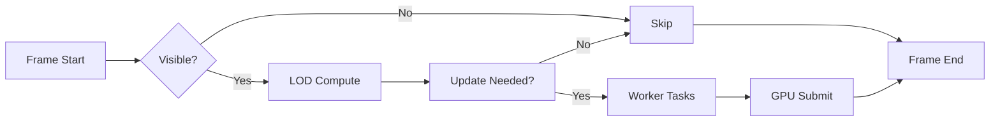

# Performance Pattern

Key mechanisms to maintain 60fps rendering in a large-scale scene.

## Strategies

- LOD System: distance-based complexity reduction
- Spatial Culling: frustum checks and distance gates
- Web Workers: trails and predictions off main thread
- Object Pooling: vectors, buffers (see [[Caching Pattern]])

## Flow (Mermaid)

