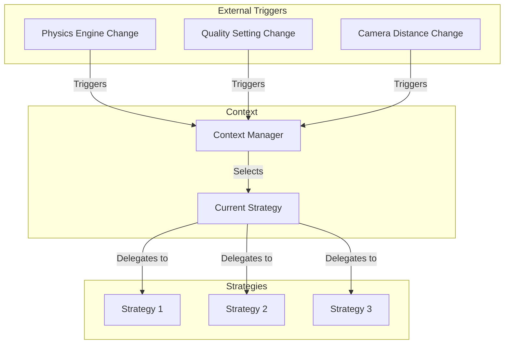
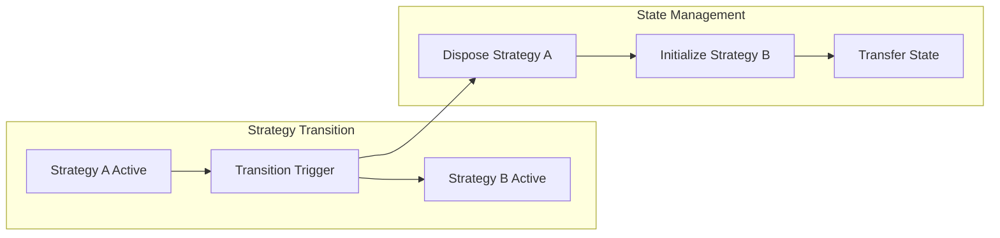

# Strategy Pattern

The Strategy Pattern is extensively used in the Teskooano renderer system to provide flexible, interchangeable algorithms for different rendering scenarios and physics modes.

## 🎯 Purpose

The Strategy Pattern enables:

- **Algorithm Selection**: Switch between different rendering algorithms at runtime
- **Mode Flexibility**: Support different physics engines and visualization modes
- **Extensibility**: Easy addition of new rendering strategies
- **Clean Separation**: Isolate different algorithms from each other

## 🏗️ Pattern Structure

### Core Components

**Strategy Interface**
Defines the contract that all strategies must implement.

**Key Characteristics:**

- **Common Interface**: All strategies implement the same methods
- **Interchangeable**: Strategies can be swapped at runtime
- **Isolated**: Each strategy is independent of others
- **Testable**: Strategies can be tested in isolation

**Context Class**
The class that uses strategies and manages strategy selection.

**Key Features:**

- **Strategy Management**: Holds and manages the current strategy
- **Strategy Switching**: Handles switching between different strategies
- **Delegation**: Delegates operations to the current strategy
- **State Management**: Manages state transitions between strategies

**Concrete Strategies**
Specific implementations of the strategy interface.

**Key Features:**

- **Specialized Logic**: Each strategy implements specific algorithms
- **Optimized Performance**: Tailored for specific use cases
- **Independent State**: Each strategy maintains its own state
- **Resource Management**: Handles strategy-specific resources

## 📦 Strategy Examples

### OrbitsManager - Visualization Strategies

The OrbitsManager uses the Strategy Pattern to switch between different orbital visualization modes.

**Strategy Interface:**

```typescript
interface OrbitalVisualizationStrategy {
  update(objects: RenderableCelestialObject[]): void;
  addObject(object: RenderableCelestialObject): void;
  removeObject(objectId: string): void;
  setVisibility(visible: boolean): void;
  dispose(): void;
}
```

**Concrete Strategies:**

#### IdealStrategy

Renders perfect elliptical orbits based on Kepler's laws.

**Key Features:**

- **Static Calculations**: Uses orbital parameters for ellipse generation
- **Minimal Overhead**: No physics simulation required
- **Perfect Orbits**: Shows idealized orbital paths
- **Performance Optimized**: Fast rendering with minimal computation

**Implementation:**

```typescript
class IdealStrategy implements OrbitalVisualizationStrategy {
  private orbitLines = new Map<string, THREE.Line>();
  private orbitCalculator = new OrbitCalculator();

  update(objects: RenderableCelestialObject[]): void {
    for (const object of objects) {
      if (object.orbitalParameters) {
        const vertices = this.orbitCalculator.generateEllipse(
          object.orbitalParameters,
        );
        this.updateOrbitLine(object.id, vertices);
      }
    }
  }

  private updateOrbitLine(objectId: string, vertices: THREE.Vector3[]): void {
    // Update or create orbit line
  }
}
```

#### NBodyStrategy

Renders historical trails and predicted trajectories for N-body physics.

**Key Features:**

- **Historical Trails**: Shows where objects have been
- **Prediction Lines**: Shows calculated future trajectories
- **Web Worker Integration**: Offloads heavy calculations
- **Dynamic Updates**: Updates as objects move

**Implementation:**

```typescript
class NBodyStrategy implements OrbitalVisualizationStrategy {
  private trailManager: TrailManager;
  private predictionManager: PredictionManager;

  constructor() {
    this.trailManager = new TrailManager();
    this.predictionManager = new PredictionManager();
  }

  update(objects: RenderableCelestialObject[]): void {
    this.trailManager.update(objects);
    this.predictionManager.update(objects);
  }
}
```

**Context Class:**

```typescript
class OrbitsManager {
  private currentStrategy: OrbitalVisualizationStrategy;
  private idealStrategy: IdealStrategy;
  private nBodyStrategy: NBodyStrategy;

  constructor(rendererStateAdapter: RendererStateAdapter) {
    this.idealStrategy = new IdealStrategy();
    this.nBodyStrategy = new NBodyStrategy();
    this.currentStrategy = this.idealStrategy;

    // Subscribe to physics engine changes
    rendererStateAdapter.$visualSettings.subscribe((settings) => {
      this.switchStrategy(settings.physicsEngine);
    });
  }

  private switchStrategy(physicsEngine: PhysicsEngine): void {
    const newStrategy =
      physicsEngine === PhysicsEngine.IDEAL
        ? this.idealStrategy
        : this.nBodyStrategy;

    if (this.currentStrategy !== newStrategy) {
      this.currentStrategy.dispose();
      this.currentStrategy = newStrategy;
    }
  }

  update(): void {
    this.currentStrategy.update(this.objects);
  }
}
```

### LOD Strategies - Detail Management

Different strategies for managing Level of Detail based on camera distance.

**Strategy Interface:**

```typescript
interface LODStrategy {
  getLODLevels(
    object: RenderableCelestialObject,
    cameraDistance: number,
  ): LODLevel[];
  shouldShowObject(
    object: RenderableCelestialObject,
    cameraDistance: number,
  ): boolean;
  getUpdateFrequency(
    object: RenderableCelestialObject,
    cameraDistance: number,
  ): number;
}
```

**Concrete Strategies:**

#### PerformanceLODStrategy

Optimized for maximum performance with minimal detail.

**Features:**

- **Aggressive Culling**: Hides objects at greater distances
- **Reduced Detail**: Uses minimal LOD levels
- **Low Update Frequency**: Updates objects less frequently
- **Memory Optimized**: Minimal resource usage

#### QualityLODStrategy

Optimized for maximum visual quality.

**Features:**

- **Extended Visibility**: Objects visible at greater distances
- **High Detail**: Uses maximum LOD levels
- **High Update Frequency**: Updates objects frequently
- **Resource Intensive**: Higher memory and processing usage

### Billboard Strategies - Distant Object Representation

Different strategies for rendering distant objects as billboards.

**Strategy Interface:**

```typescript
interface BillboardStrategy {
  shouldUseBillboard(
    object: RenderableCelestialObject,
    cameraDistance: number,
  ): boolean;
  createBillboard(object: RenderableCelestialObject): THREE.Sprite;
  updateBillboard(
    billboard: THREE.Sprite,
    object: RenderableCelestialObject,
  ): void;
}
```

**Concrete Strategies:**

#### DistanceBillboardStrategy

Uses billboards based purely on camera distance.

**Features:**

- **Simple Logic**: Distance-based billboard activation
- **Performance Focused**: Fast distance calculations
- **Consistent Behavior**: Predictable billboard transitions

#### LODBillboardStrategy

Uses billboards based on Level of Detail system.

**Features:**

- **LOD Integration**: Integrates with LOD system
- **Object-Aware**: Considers object type and size
- **Smooth Transitions**: Gradual transitions between LOD levels

## 🔄 Strategy Switching

### Runtime Strategy Selection



### Strategy State Management



## 🎨 Pattern Benefits

### Flexibility

- **Runtime Switching**: Change strategies without restarting
- **Algorithm Selection**: Choose best algorithm for current conditions
- **Mode Support**: Support multiple rendering modes
- **Extensibility**: Easy to add new strategies

### Maintainability

- **Clean Separation**: Each strategy is isolated
- **Single Responsibility**: Each strategy has one purpose
- **Easy Testing**: Strategies can be tested independently
- **Clear Interfaces**: Well-defined contracts between components

### Performance

- **Optimized Algorithms**: Each strategy optimized for its use case
- **Resource Management**: Efficient resource usage per strategy
- **Lazy Loading**: Strategies loaded only when needed
- **Caching**: Strategy-specific caching and optimization

## 🚀 Implementation Guidelines

### Strategy Interface Design

```typescript
interface RenderStrategy {
  // Core methods
  initialize(): void;
  update(data: any): void;
  dispose(): void;

  // Configuration
  setConfiguration(config: StrategyConfig): void;
  getConfiguration(): StrategyConfig;

  // State management
  getState(): StrategyState;
  setState(state: StrategyState): void;

  // Performance
  getPerformanceMetrics(): PerformanceMetrics;
}
```

### Context Class Implementation

```typescript
class StrategyContext<T extends RenderStrategy> {
  private strategies = new Map<string, T>();
  private currentStrategy: T | null = null;
  private currentStrategyKey: string | null = null;

  registerStrategy(key: string, strategy: T): void {
    this.strategies.set(key, strategy);
  }

  switchStrategy(key: string): void {
    const newStrategy = this.strategies.get(key);
    if (!newStrategy) {
      throw new Error(`Strategy not found: ${key}`);
    }

    if (this.currentStrategy && this.currentStrategy !== newStrategy) {
      this.currentStrategy.dispose();
    }

    this.currentStrategy = newStrategy;
    this.currentStrategyKey = key;
    this.currentStrategy.initialize();
  }

  update(data: any): void {
    if (this.currentStrategy) {
      this.currentStrategy.update(data);
    }
  }

  dispose(): void {
    if (this.currentStrategy) {
      this.currentStrategy.dispose();
    }
    this.strategies.clear();
  }
}
```

### Strategy Factory

```typescript
class StrategyFactory {
  static createOrbitalStrategy(
    type: "ideal" | "nbody",
  ): OrbitalVisualizationStrategy {
    switch (type) {
      case "ideal":
        return new IdealStrategy();
      case "nbody":
        return new NBodyStrategy();
      default:
        throw new Error(`Unknown orbital strategy type: ${type}`);
    }
  }

  static createLODStrategy(type: "performance" | "quality"): LODStrategy {
    switch (type) {
      case "performance":
        return new PerformanceLODStrategy();
      case "quality":
        return new QualityLODStrategy();
      default:
        throw new Error(`Unknown LOD strategy type: ${type}`);
    }
  }
}
```

## 🔗 Related Patterns

- **[[Manager Pattern]]**: Context classes often implement the Manager pattern
- **[[Factory Pattern]]**: Strategy factories for creating strategies
- **[[State Pattern]]**: Similar to Strategy but focuses on state transitions
- **[[Template Method Pattern]]**: Base classes can define strategy structure
- **[[Observer Pattern]]**: Strategies can observe state changes

## 🎯 Performance Considerations

### Strategy Switching

- **Efficient Transitions**: Minimize overhead when switching strategies
- **State Preservation**: Preserve relevant state during transitions
- **Resource Cleanup**: Proper cleanup of strategy-specific resources
- **Lazy Initialization**: Initialize strategies only when needed

### Strategy Optimization

- **Algorithm Efficiency**: Optimize each strategy for its specific use case
- **Memory Management**: Efficient memory usage per strategy
- **Caching**: Strategy-specific caching and optimization
- **Update Frequency**: Adjust update frequency based on strategy type

### Resource Management

- **Shared Resources**: Share common resources between strategies
- **Resource Pooling**: Pool strategy-specific resources
- **Memory Monitoring**: Track memory usage per strategy
- **Garbage Collection**: Minimize garbage collection pressure

---

_The Strategy Pattern provides the flexibility and extensibility that makes the Teskooano renderer system adaptable to different rendering scenarios and performance requirements._
