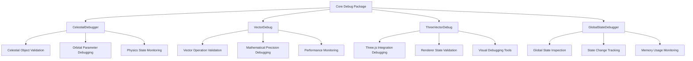

# Core Debug (`@teskooano/core-debug`)

Debug utilities and helpers for the Teskooano engine, providing comprehensive debugging capabilities for vectors, global state, and celestial parameters.

## 🎯 Purpose

The `@teskooano/core-debug` package provides essential debugging utilities for the Teskooano engine. It offers specialized debuggers for celestial objects, vector operations, Three.js integration, and global state management, enabling developers to diagnose issues, validate calculations, and monitor system behavior during development and testing.

## 🏗️ Architecture

The core-debug package follows a modular architecture with specialized debugger classes:



## 🚀 Core Features

### 1. Celestial Object Debugging

- **Celestial Parameter Validation**: Comprehensive validation of orbital parameters and celestial object properties
- **Physics State Monitoring**: Real-time monitoring of physics calculations and state changes
- **Orbital Mechanics Debugging**: Specialized tools for debugging orbital mechanics calculations

### 2. Vector Operation Debugging

- **Mathematical Precision**: Validation of vector operations with precision checking
- **Performance Monitoring**: Monitoring of vector operation performance and memory usage
- **Error Detection**: Automatic detection of mathematical errors and inconsistencies

### 3. Three.js Integration Debugging

- **Renderer State Validation**: Validation of Three.js renderer state and configuration
- **Visual Debugging Tools**: Tools for visualizing debug information in the 3D scene
- **Integration Monitoring**: Monitoring of Three.js integration and performance

### 4. Global State Management

- **State Inspection**: Comprehensive inspection of global application state
- **Change Tracking**: Tracking of state changes and their sources
- **Memory Monitoring**: Monitoring of memory usage and potential leaks

## 📚 Documentation Structure

### Core Debuggers

- **CelestialDebugger** - Debugging utilities for celestial objects and orbital mechanics
- **VectorDebug** - Vector operation validation and mathematical precision debugging
- **ThreeVectorDebug** - Three.js-specific vector debugging and visualization
- **GlobalStateDebugger** - Global state inspection and monitoring utilities

## 🔄 Quick Navigation

### By Debug Category

- **Celestial Debugging**: [[CelestialDebugger]] - Orbital mechanics and celestial object validation
- **Vector Debugging**: [[VectorDebug]], [[ThreeVectorDebug]] - Mathematical and visual vector debugging
- **State Debugging**: [[GlobalStateDebugger]] - Global state inspection and monitoring

### By Integration Type

- **Core Math Integration**: [[core/core-math/core-math|@teskooano/core-math]] - Mathematical debugging utilities
- **Three.js Integration**: [[threejs-renderers/threejs/threejs|@teskooano/renderer-threejs]] - Renderer debugging tools
- **Physics Integration**: [[core/core-physics/core-physics|@teskooano/core-physics]] - Physics system debugging

## 🚀 Getting Started

1. Start with [[CelestialDebugger]] for celestial object debugging
2. Explore [[VectorDebug]] for mathematical precision validation
3. Check out [[ThreeVectorDebug]] for Three.js integration debugging
4. Use [[GlobalStateDebugger]] for comprehensive state monitoring

## Dependencies

### Core Dependencies

- **@teskooano/core-math** - Mathematical utilities and vector operations for debugging

### Development Dependencies

- **typescript** - Type safety and modern JavaScript features
- **vitest** - Testing framework with browser support
- **@vitest/browser** - Browser testing capabilities
- **@playwright/test** - End-to-end testing
- **eslint** - Code quality and consistency

## 💡 Usage Examples

### Basic Celestial Debugging

```typescript
import { CelestialDebugger } from "@teskooano/core-debug";

// Create debugger instance
const celestialDebugger = new CelestialDebugger();

// Validate celestial object parameters
const isValid = celestialDebugger.validateCelestialObject(celestialObject);
console.log("Celestial object valid:", isValid);

// Monitor physics state changes
celestialDebugger.monitorPhysicsState(physicsState);
```

### Vector Operation Debugging

```typescript
import { VectorDebug } from "@teskooano/core-debug";

// Create vector debugger
const vectorDebug = new VectorDebug();

// Validate vector operations
const result = vectorDebug.validateVectorOperation(vector1, vector2, operation);
console.log("Vector operation result:", result);

// Check mathematical precision
const precision = vectorDebug.checkPrecision(vector, expectedPrecision);
console.log("Precision check:", precision);
```

### Three.js Integration Debugging

```typescript
import { ThreeVectorDebug } from "@teskooano/core-debug";

// Create Three.js debugger
const threeDebug = new ThreeVectorDebug();

// Debug Three.js vector operations
threeDebug.debugThreeVector(threeVector, operation);

// Validate renderer state
const rendererValid = threeDebug.validateRendererState(renderer);
console.log("Renderer state valid:", rendererValid);
```

## ⚡ Performance Considerations

### Efficiency

- **Minimal Overhead**: Debug utilities are designed to have minimal performance impact
- **Conditional Execution**: Debug features can be disabled in production builds
- **Memory Management**: Efficient memory usage with automatic cleanup
- **Lazy Loading**: Debug utilities are loaded only when needed

### Quality Metrics

- **Accuracy**: High accuracy in detecting mathematical errors and inconsistencies
- **Reliability**: Reliable debugging information and validation results
- **Consistency**: Consistent behavior across different debugging scenarios
- **Scalability**: Scales well with large numbers of objects and operations

### Performance Monitoring

- **Debug Overhead**: Monitoring of debug operation performance impact
- **Memory Usage**: Tracking of memory usage by debug utilities
- **Validation Speed**: Monitoring of validation operation speed
- **Optimization Strategies**: Strategies for optimizing debug performance

## 🔌 Integration Points

### Primary Integration

- **Core Math Package**: Integration with mathematical utilities for precision debugging
- **Three.js Renderer**: Integration with Three.js for visual debugging
- **Physics System**: Integration with physics calculations for validation
- **State Management**: Integration with global state for monitoring

### Secondary Integration

- **Development Tools**: Integration with development and testing tools
- **Logging Systems**: Integration with logging and monitoring systems
- **Performance Profilers**: Integration with performance profiling tools
- **Error Reporting**: Integration with error reporting and tracking systems

## 🐛 Debug Features

### Validation

- **Input Validation**: Comprehensive validation of debug inputs and parameters
- **Output Validation**: Validation of debug outputs and results
- **State Validation**: Validation of system state and consistency
- **Configuration Validation**: Validation of debug configuration and settings

### Monitoring

- **Performance Monitoring**: Real-time monitoring of system performance
- **Error Monitoring**: Monitoring and detection of errors and inconsistencies
- **Usage Monitoring**: Monitoring of debug utility usage and effectiveness
- **Health Monitoring**: Monitoring of system health and stability

### Debugging Tools

- **Debug Mode**: Comprehensive debug mode with detailed logging
- **Logging**: Extensive logging capabilities for debugging information
- **Tracing**: Detailed tracing of operations and state changes
- **Profiling**: Performance profiling and analysis tools

## 🔮 Future Enhancements

### Optimization Opportunities

- **Performance Optimization**: Further optimization of debug operation performance
- **Memory Optimization**: Enhanced memory management and cleanup
- **Code Optimization**: Code optimization for better maintainability
- **Architecture Optimization**: Architectural improvements for better scalability

### Potential Improvements

- **Enhanced Visualization**: Improved visual debugging tools and interfaces
- **Integration Enhancement**: Better integration with development tools
- **API Enhancement**: Enhanced API for more flexible debugging
- **User Experience**: Improved developer experience and usability

## 📚 Related Documentation

- [[core/core-math/core-math|@teskooano/core-math]] - Mathematical utilities used by debug tools
- [[core/core-physics/core-physics|@teskooano/core-physics]] - Physics system debugging integration
- [[core/core-state/core-state|@teskooano/core-state]] - State management debugging utilities
- [[threejs-renderers/threejs/threejs|@teskooano/renderer-threejs]] - Three.js renderer debugging tools
