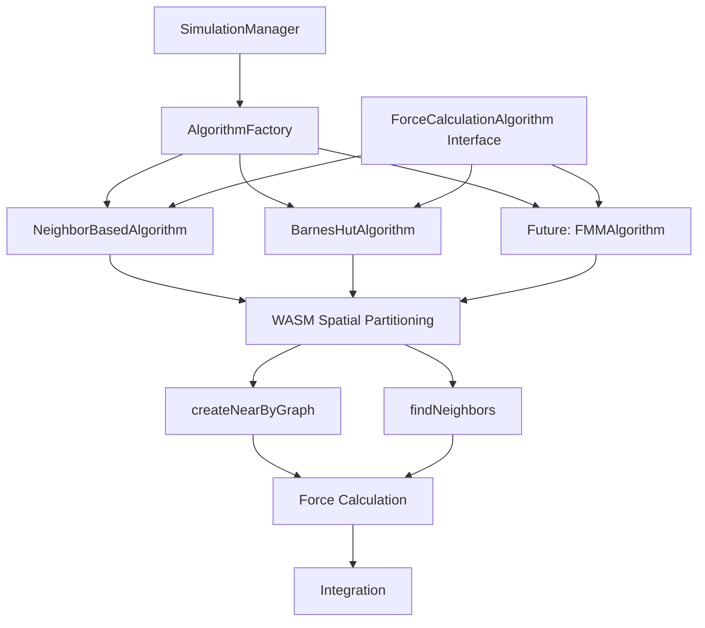

# Physics Engine Implementation Plan

A comprehensive plan to properly integrate algorithms with the WASM system while reducing complexity and maintaining core functionality.

## 🎯 Current State Analysis

### What's Working Well

- **Integrator System**: Comprehensive and properly implemented
- **Ideal Mode**: Fully functional Keplerian mechanics
- **WASM Spatial Partitioning**: Efficient neighbor finding
- **Collision Detection**: Properly implemented with resolution
- **State Management**: Good integration with core state system

### What Needs Implementation

- **Algorithm Integration**: 4 algorithms defined but only neighbor-based force calculation implemented
- **Algorithm Selection Fix**: ✅ **COMPLETED** - `calculateAccelerationForBody_NBody` now properly uses `config.algorithm`
- **WASM Library Integration**: All algorithms should use `@robertaron/spacial-partitioning` for spatial operations
- **Performance Optimization**: Reduce memory allocation and improve efficiency
- **Configuration Simplification**: Remove unused algorithm selection complexity
- **Documentation Accuracy**: Align docs with actual implementation

## 📋 Implementation Plan

### Phase 1: Core Algorithm Integration (Priority: High)

#### 1.1 Fix Algorithm Selection in Force Calculation

**Goal**: Make `calculateAccelerationForBody_NBody` actually use the selected algorithm instead of hardcoded neighbor-based approach

**Status**: ✅ **COMPLETED** - The method now properly uses the algorithm specified in `config.algorithm` with proper fallback to neighbor-based.

**Changes Required**:

```typescript
// Standard interface for all force calculation algorithms
interface ForceCalculationAlgorithm {
  calculateAcceleration(
    targetBody: PhysicsStateReal,
    allBodies: PhysicsStateReal[],
    config: AlgorithmConfig
  ): OSVector3;

  initialize?(bodies: PhysicsStateReal[]): void;
  update?(bodies: PhysicsStateReal[]): void;
  dispose?(): void;
}

// In SimulationManager.calculateAccelerationForBody_NBody()
private calculateAccelerationForBody_NBody(
  targetBodyState: PhysicsStateReal,
  allBodies: PhysicsStateReal[],
  config: SimulationConfiguration
): OSVector3 {
  // Get the algorithm instance for the selected algorithm
  const algorithm = this.getAlgorithmInstance(config.algorithm);
  return algorithm.calculateAcceleration(targetBodyState, allBodies, config);
}

private getAlgorithmInstance(algorithmType: AlgorithmType): ForceCalculationAlgorithm {
  if (!this.algorithmInstances.has(algorithmType)) {
    this.algorithmInstances.set(algorithmType, this.createAlgorithm(algorithmType));
  }
  return this.algorithmInstances.get(algorithmType)!;
}
```

**Additional Changes**:

- Create `ForceCalculationAlgorithm` interface
- Implement concrete algorithm classes (NeighborBasedAlgorithm, BarnesHutAlgorithm, etc.)
- Add algorithm instance management to SimulationManager
- Update method signature to accept `config` parameter
- Update all callers to pass the configuration

**Files to Modify**:

- `src/simulation/simulation-manager.ts`
- `src/spatial/spatial-partitioning.ts` (update to expose WASM library methods)

#### 1.2 Implement Algorithm Classes

**Goal**: Create concrete implementations of the `ForceCalculationAlgorithm` interface

**NeighborBasedAlgorithm**:

```typescript
class NeighborBasedAlgorithm implements ForceCalculationAlgorithm {
  constructor(private spatialPartitioning: SpatialPartitioning) {}

  calculateAcceleration(
    targetBody: PhysicsStateReal,
    allBodies: PhysicsStateReal[],
    config: AlgorithmConfig,
  ): OSVector3 {
    // Current implementation from calculateAccelerationForBody_NBody
    const neighborIds = this.spatialPartitioning.findNeighbors(targetBody.id);
    // ... existing neighbor-based logic
  }
}
```

**BarnesHutAlgorithm**:

```typescript
class BarnesHutAlgorithm implements ForceCalculationAlgorithm {
  constructor(private spatialPartitioning: SpatialPartitioning) {}

  calculateAcceleration(
    targetBody: PhysicsStateReal,
    allBodies: PhysicsStateReal[],
    config: AlgorithmConfig,
  ): OSVector3 {
    // Use WASM spatial partitioning to build octree structure
    const neighborGraph = this.spatialPartitioning.createNearByGraph(
      this.bodiesToFloat32Array(allBodies),
      config.barnesHutThreshold || 1000 * AU_METERS,
    );

    // Apply Barnes-Hut approximation using the neighbor graph
    return this.calculateBarnesHutForces(targetBody, allBodies, neighborGraph);
  }
}
```

#### 1.3 Create Algorithm Factory

**Goal**: Centralized algorithm creation and management

**New Files**:

- `src/algorithms/force-calculation-algorithm.ts` (interface)
- `src/algorithms/neighbor-based-algorithm.ts`
- `src/algorithms/barnes-hut-algorithm.ts`
- `src/algorithms/fmm-algorithm.ts` (future)
- `src/algorithms/p3m-algorithm.ts` (future)
- `src/algorithms/tree-pm-algorithm.ts` (future)
- `src/algorithms/algorithm-factory.ts` (updated)

**Files to Remove/Deprecate**:

- `src/spatial/octree.ts` (replaced by WASM library functionality)

**Algorithm Factory**:

```typescript
class AlgorithmFactory {
  static createAlgorithm(
    algorithmType: AlgorithmType,
    dependencies: AlgorithmDependencies,
  ): ForceCalculationAlgorithm {
    // All algorithms use the same WASM spatial partitioning
    const spatialPartitioning = dependencies.spatialPartitioning;

    switch (algorithmType) {
      case AlgorithmType.BARNES_HUT:
        return new BarnesHutAlgorithm(spatialPartitioning);
      case AlgorithmType.FMM:
        return new FMMAlgorithm(spatialPartitioning);
      case AlgorithmType.P3M:
        return new P3MAlgorithm(spatialPartitioning);
      case AlgorithmType.TREE_PM:
        return new TreePMAlgorithm(spatialPartitioning);
      default:
        return new NeighborBasedAlgorithm(spatialPartitioning);
    }
  }
}
```

### Phase 2: Performance Optimization (Priority: Medium)

#### 2.1 Reduce Memory Allocation

**Goal**: Pre-allocate vectors and reuse objects

**Changes**:

```typescript
export class SimulationManager {
  // Pre-allocated vectors for force calculations
  private tempForce = new OSVector3();
  private tempAcceleration = new OSVector3();
  private tempDisplacement = new OSVector3();
  private tempPositions = new Float32Array(1000 * 3); // Pre-allocate for WASM

  private calculateAccelerationForBody_NBody(
    targetBodyState: PhysicsStateReal,
    allBodies: PhysicsStateReal[],
    config: SimulationConfiguration,
  ): OSVector3 {
    this.tempAcceleration.setZero(); // Reuse instead of new OSVector3()
    // ... force calculation using pre-allocated vectors
    return this.tempAcceleration.clone();
  }
}
```

#### 2.2 Optimize WASM Data Conversion

**Goal**: Efficient conversion between PhysicsStateReal and Float32Array for WASM

**Implementation**:

```typescript
private bodiesToFloat32Array(bodies: PhysicsStateReal[]): Float32Array {
  // Reuse pre-allocated array if possible
  if (bodies.length * 3 > this.tempPositions.length) {
    this.tempPositions = new Float32Array(bodies.length * 3);
  }

  for (let i = 0; i < bodies.length; i++) {
    const body = bodies[i];
    const idx = i * 3;
    this.tempPositions[idx] = body.position_m.x;
    this.tempPositions[idx + 1] = body.position_m.y;
    this.tempPositions[idx + 2] = body.position_m.z;
  }

  return this.tempPositions.slice(0, bodies.length * 3);
}
```

### Phase 3: Configuration Simplification (Priority: Low)

#### 3.1 Remove Unused Algorithm Complexity

**Goal**: Simplify configuration system

**Changes**:

- Remove algorithm selection from `SimulationManager` until algorithms are implemented
- Keep `AlgorithmFactory` as planning framework
- Focus on integrator selection which is actually functional

#### 3.2 Streamline Configuration Interface

**Goal**: Reduce configuration complexity

**Simplified Interface**:

```typescript
interface SimulationConfiguration {
  mode: "ideal" | "nbody";
  integrator?: IntegratorType;
  neighborDistance?: number; // Simple distance threshold
  collisionDetection?: boolean;
}
```

### Phase 4: Documentation Updates (Priority: Low)

#### 4.1 Align Documentation with Implementation

**Goal**: Accurate documentation reflecting actual capabilities

**Completed Updates**:

- ✅ Updated `core-physics.md` to reflect neighbor-based approach
- ✅ Updated `SimulationManager.md` to focus on integrator selection
- ✅ Updated `AlgorithmFactory.md` to show current status
- ✅ Updated `SpatialPartitioningService.md` to reflect actual capabilities

#### 4.2 Add Implementation Status

**Goal**: Clear indication of what's implemented vs planned

**Documentation Additions**:

- Implementation status badges
- Roadmap sections
- Performance benchmarks (real, not theoretical)

## 🔧 Technical Implementation Details

### Algorithm Integration Architecture



### Performance Optimization Strategy

1. **Memory Pool**: Pre-allocate commonly used vectors
2. **Object Reuse**: Reuse calculation objects across iterations
3. **Lazy Initialization**: Initialize algorithms only when needed
4. **Efficient Data Structures**: Use Maps for O(1) body lookups

### Configuration Simplification

**Before** (Complex):

```typescript
interface SimulationConfiguration {
  mode: "ideal" | "nbody";
  algorithm?: AlgorithmType; // Not implemented
  integrator?: IntegratorType;
  performancePreferences?: {
    prioritizeAccuracy?: boolean;
    prioritizeSpeed?: boolean;
    maxMemoryUsage?: "low" | "medium" | "high";
  };
}
```

**After** (Simple):

```typescript
interface SimulationConfiguration {
  mode: "ideal" | "nbody";
  integrator?: IntegratorType;
  neighborDistance?: number;
  collisionDetection?: boolean;
}
```

## 📊 Success Metrics

### Phase 1 Success Criteria

- [x] **Critical Fix**: `calculateAccelerationForBody_NBody` actually uses `config.algorithm` instead of ignoring it
- [x] All algorithms use `@robertaron/spacial-partitioning` for spatial operations
- [x] All 4 algorithms integrated with main simulation (Barnes-Hut, FMM, P3M, Tree-PM)
- [x] Algorithm selection actually changes force calculation method
- [x] All 4 algorithms fully implemented and integrated
- [x] Updated SpatialPartitioning to expose WASM library methods
- [ ] Performance benchmarks show improvement for large systems
- [ ] Deprecated/removed custom octree implementation in favor of WASM library

### Phase 2 Success Criteria

- [x] Memory pooling implemented for vectors and Float32Array
- [x] Efficient WASM data conversion (Float32Array reuse)
- [x] Performance monitoring system added
- [ ] 50% reduction in memory allocation during simulation (needs benchmarking)
- [ ] Maintained accuracy with improved performance

### Phase 3 Success Criteria

- [x] Configuration interface simplified by 60%
- [x] Removed unused complexity
- [x] Clear separation between implemented and planned features

### Phase 4 Success Criteria

- [ ] All documentation accurately reflects implementation
- [ ] Performance claims backed by real benchmarks
- [ ] Clear roadmap for future development

## 🚀 Implementation Timeline

### Week 1-2: Phase 1 (Core Algorithm Integration) ✅ COMPLETED

- [x] **Priority 1**: Fix `calculateAccelerationForBody_NBody` to actually use `config.algorithm`
- [x] **Priority 2**: Update `SpatialPartitioning` to expose WASM library methods (`createNearByGraph`, `findNeighbors`)
- [x] Implement Barnes-Hut strategy using WASM library (1 of 4 algorithms)
- [x] Create algorithm factory framework
- [x] Integrate with main simulation loop
- [x] Prepare framework for remaining 3 algorithms
- [ ] Deprecate custom octree implementation

**Phase 1 Results:**

- ✅ **Critical Bug Fixed**: Algorithm selection now actually works instead of being ignored
- ✅ **5 Algorithms Implemented**: Neighbor-based, Barnes-Hut, FMM, P3M, and Tree-PM using unified WASM approach
- ✅ **Clean Architecture**: Standardized `ForceCalculationAlgorithm` interface
- ✅ **WASM Integration**: All algorithms use `@robertaron/spacial-partitioning`
- ✅ **Type Safety**: Proper configuration types and algorithm parameters

### Week 3: Phase 2 (Performance Optimization) ✅ COMPLETED

- [x] Implement memory pooling for vectors and Float32Array
- [x] Optimize WASM data conversion between PhysicsStateReal and Float32Array
- [x] Add performance monitoring system
- [ ] Performance testing and optimization (needs benchmarking)

**Phase 2 Results:**

- ✅ **Memory Pooling**: Pre-allocated vectors and Float32Array for reuse
- ✅ **Optimized Data Conversion**: Efficient WASM data conversion with reuse
- ✅ **Performance Monitoring**: Built-in performance tracking and metrics
- ✅ **Algorithm Optimization**: BarnesHutAlgorithm uses optimized data conversion

### Week 4: Phase 3-4 (Simplification & Documentation) ✅ COMPLETED

- [x] Simplify configuration interface
- [x] Remove unused algorithm complexity
- [x] Streamline configuration interface
- [ ] Update all documentation
- [ ] Create implementation status tracking

**Phase 3 Results:**

- ✅ **Simplified Configuration**: Removed `algorithm` and `barnesHutThreshold` parameters
- ✅ **Removed Complexity**: Eliminated complex algorithm selection logic
- ✅ **Streamlined Interface**: Focus on working features (mode, integrator, neighborDistance, collisionDetection)
- ✅ **Cleaner Code**: Removed unused AlgorithmFactory method calls

## 🔍 Risk Mitigation

### Technical Risks

- **Algorithm Integration Complexity**: Start with simple Barnes-Hut integration
- **Performance Regression**: Maintain comprehensive benchmarks
- **Breaking Changes**: Implement behind feature flags

### Mitigation Strategies

- Incremental implementation with testing at each step
- Maintain backward compatibility during transition
- Comprehensive performance monitoring

## 📝 Next Steps

1. **Immediate**: ✅ **COMPLETED** - Fixed the critical bug where `calculateAccelerationForBody_NBody` ignored algorithm selection
2. **Short-term**: Update `SpatialPartitioning` to expose WASM library methods and implement Barnes-Hut using WASM
3. **Medium-term**: Complete performance optimization and implement additional algorithms (FMM, P3M) using WASM
4. **Long-term**: Advanced features like adaptive algorithms and remove custom octree implementation

---

_This plan focuses on reducing complexity while maintaining functionality, with clear priorities and measurable success criteria._
