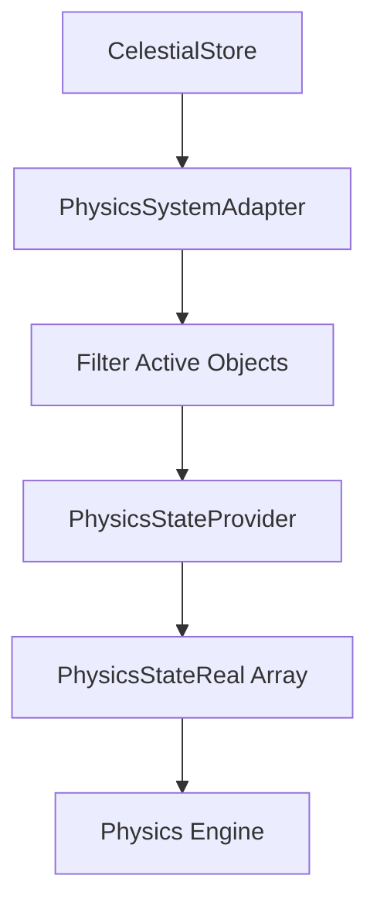
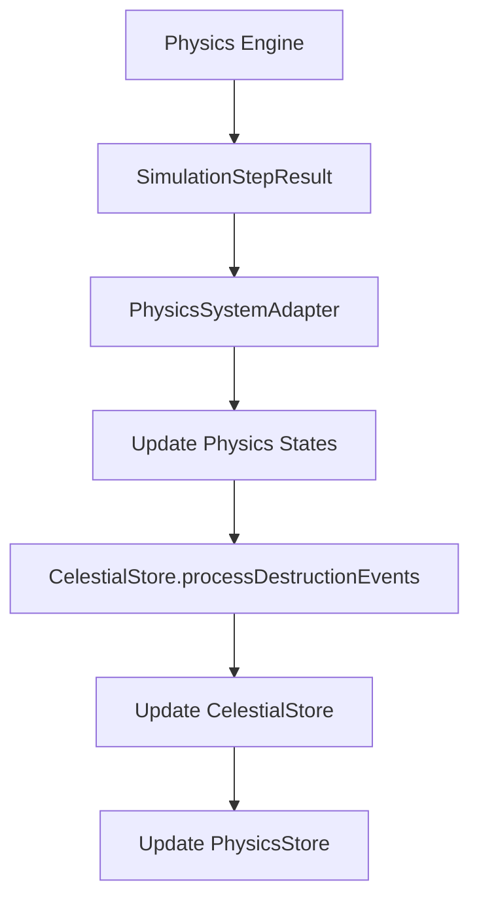

---
aliases:
  [
    PhysicsSystemAdapter,
    physics-adapter,
    simulation-bridge,
    physics-integration,
  ]
tags: [core, state, adapter, singleton, physics, simulation, bridge]
type: Class
package: "@teskooano/core-state"
name: PhysicsSystemAdapter
dependencies: ["@teskooano/data-types", "@teskooano/core-physics", "rxjs"]
classes: []
functions: []
constants: []
types:
  [
    "CelestialObject",
    "PhysicsStateReal",
    "SimulationStepResult",
    "OrbitalParameters",
    "CelestialStatus",
    "CelestialType",
  ]
status: active
---

# PhysicsSystemAdapter

Singleton adapter bridging between core state management and the physics engine, handling data preparation and result processing with centralized destruction event handling.

**Location**: `src/adapters/PhysicsSystemAdapter.ts`

## 🎯 Purpose

The `PhysicsSystemAdapter` serves as a crucial bridge between the application's core state and the physics engine:

- **Data Preparation**: Converts celestial objects to physics bodies for simulation
- **Result Processing**: Updates state from physics engine simulation results
- **Destruction Handling**: Delegates destruction processing to CelestialStore for consistency
- **State Synchronization**: Maintains consistency between physics and game state
- **Performance Optimization**: Efficient batch processing and state updates
- **Code Reuse**: Eliminates duplicate destruction logic through shared utilities

## 🏗️ Architecture

### Singleton Pattern

Uses singleton pattern to ensure single adapter instance across the application:

```typescript
export class PhysicsSystemAdapter {
  private static instance: PhysicsSystemAdapter;

  public static getInstance(): PhysicsSystemAdapter {
    if (!PhysicsSystemAdapter.instance) {
      PhysicsSystemAdapter.instance = new PhysicsSystemAdapter();
    }
    return PhysicsSystemAdapter.instance;
  }
}
```

### Bridge Pattern

Acts as a bridge between two different interfaces:

- **Core State**: `CelestialObject` data structures
- **Physics Engine**: `PhysicsStateReal` data structures

### Shared Utilities Integration

Uses shared utilities to eliminate code duplication:

```typescript
// Uses shared filtering utilities
import { filterActiveCelestialObjects } from "../utils";

// Delegates destruction processing to CelestialStore
const updatedObjectsMap = celestialStore.processDestructionEvents(destroyedIds);
```

## 🔧 Core Methods

### Physics Data Preparation

```typescript
// Get physics bodies for simulation
getPhysicsBodies(): PhysicsStateReal[];

// Get reactive physics bodies stream
getPhysicsBodies$(): Observable<PhysicsStateReal[]>;

// Get reactive active objects stream
getPhysicsActiveObjects$(): Observable<Record<string, CelestialObject>>;

// Get snapshot of celestial objects
getCelestialObjectsSnapshot(): Record<string, CelestialObject>;

// Get snapshot of active celestial objects
getActiveCelestialObjectsSnapshot(): Record<string, CelestialObject>;

// Get snapshot of orbital parameters
getOrbitalParametersSnapshot(): Map<string, OrbitalParameters>;
```

### Simulation Result Processing

```typescript
// Update state from simulation results
updateStateFromResult(result: SimulationStepResult): void;
```

## 📊 Data Flow

### Physics Data Preparation Flow



### Result Processing Flow



## 🔄 Processing Algorithms

### Physics Bodies Preparation

```typescript
public getPhysicsBodies(): PhysicsStateReal[] {
  return PhysicsStateProvider.getPhysicsStates();
}
```

**Note**: The implementation now delegates to `PhysicsStateProvider.getPhysicsStates()` for consistency and performance.

### Reactive Methods

```typescript
public getPhysicsBodies$(): Observable<PhysicsStateReal[]> {
  return PhysicsStateProvider.physicsStates$;
}

public getPhysicsActiveObjects$(): Observable<Record<string, CelestialObject>> {
  return PhysicsStateProvider.physicsActiveObjects$;
}
```

**Note**: These methods delegate to `PhysicsStateProvider`'s reactive streams for consistency and performance.

### State Update from Results

```typescript
public updateStateFromResult(result: SimulationStepResult): void {
  const currentCelestialObjects = celestialStore.getObjects();
  const newCelestialObjectsMap: Record<string, CelestialObject> = {
    ...currentCelestialObjects,
  };

  this.updatePhysicsStates(result, newCelestialObjectsMap);

  // Convert destroyed IDs to strings and use CelestialStore's destruction processing
  const destroyedIds = Array.from(result.destroyedIds).map((id: any) => String(id));
  const updatedObjectsMap = celestialStore.processDestructionEvents(destroyedIds);

  celestialStore.setAllObjects(updatedObjectsMap);
  physicsStore.updateAccelerationVectors(result.accelerations);
}
```

### Physics State Updates

```typescript
private updatePhysicsStates(
  result: SimulationStepResult,
  newCelestialObjectsMap: Record<string, CelestialObject>
): void {
  result.states.forEach((updatedState) => {
    const id = updatedState.id;
    const existingObject = newCelestialObjectsMap[id];
    if (existingObject) {
      PhysicsStateProvider.updateCacheWithSimulationResult(id, updatedState);
    } else {
      console.warn(
        `[PhysicsSystemAdapter] Received updated state for object ID: ${id}, which was not found in the current celestial objects map.`
      );
    }
  });
}
```

### Active Objects Snapshot

```typescript
public getActiveCelestialObjectsSnapshot(): Record<string, CelestialObject> {
  return filterActiveCelestialObjects(this.getCelestialObjectsSnapshot());
}
```

## 🚀 Usage Examples

### Basic Physics Integration

```typescript
import { physicsSystemAdapter } from "@teskooano/core-state";

// Get physics bodies for simulation
const physicsBodies = physicsSystemAdapter.getPhysicsBodies();

// Run physics simulation (external)
const simulationResult = await runPhysicsSimulation(physicsBodies);

// Update state with results
physicsSystemAdapter.updateStateFromResult(simulationResult);
```

### Reactive Physics Integration

```typescript
// Subscribe to physics bodies changes
physicsSystemAdapter.getPhysicsBodies$().subscribe((bodies) => {
  console.log("Physics bodies updated:", bodies.length);
});

// Subscribe to active objects changes
physicsSystemAdapter.getPhysicsActiveObjects$().subscribe((objects) => {
  console.log("Active objects:", Object.keys(objects).length);
});
```

### Simulation Loop Integration

```typescript
// In simulation loop
function simulationStep() {
  // Get current physics state
  const bodies = physicsSystemAdapter.getPhysicsBodies();

  // Run physics step
  const result = physicsEngine.step(bodies, deltaTime);

  // Update state with results (destruction processing handled by CelestialStore)
  physicsSystemAdapter.updateStateFromResult(result);

  // Continue loop
  requestAnimationFrame(simulationStep);
}
```

### State Snapshots

```typescript
// Get current state snapshot
const celestialObjects = physicsSystemAdapter.getCelestialObjectsSnapshot();
const activeObjects = physicsSystemAdapter.getActiveCelestialObjectsSnapshot();
const orbitalParams = physicsSystemAdapter.getOrbitalParametersSnapshot();

// Use for analysis or debugging
console.log("All objects:", Object.keys(celestialObjects).length);
console.log("Active objects:", Object.keys(activeObjects).length);
console.log("Objects with orbits:", orbitalParams.size);
```

### Error Handling

```typescript
try {
  const bodies = physicsSystemAdapter.getPhysicsBodies();
  const result = await physicsEngine.simulate(bodies);
  physicsSystemAdapter.updateStateFromResult(result);
} catch (error) {
  console.error("Physics simulation failed:", error);
  // Handle error appropriately
}
```

## 🎯 Performance Optimizations

### Efficient Filtering

- **Status Filtering**: Only processes active objects
- **Physics Filtering**: Skips objects with `ignorePhysics` flag
- **Batch Processing**: Processes all objects in single operation
- **Shared Utilities**: Uses shared filtering for consistency

### State Updates

- **Immutable Updates**: Creates new state objects for updates
- **Bulk Updates**: Updates all objects in single store operation
- **Cache Management**: Updates physics state cache efficiently
- **Centralized Destruction**: Uses CelestialStore for destruction processing

### Memory Management

- **Snapshot Creation**: Efficient shallow copies for snapshots
- **Result Processing**: Processes results without unnecessary allocations
- **Error Handling**: Graceful handling of missing objects
- **Code Reuse**: Eliminates duplicate logic through shared utilities

## 🔗 Integration Points

### With Physics Engine

- Provides `PhysicsStateReal` array for simulation
- Processes `SimulationStepResult` from engine
- Handles physics-specific data structures

### With Core State

- Reads from `celestialStore` for object data
- Updates `celestialStore` with simulation results
- Updates `physicsStore` with acceleration vectors
- Delegates destruction processing to `celestialStore`

### With PhysicsStateProvider

- Uses provider for physics state calculations
- Updates provider cache with simulation results
- Maintains cache consistency

### With Shared Utilities

- Uses shared filtering utilities for consistency
- Eliminates duplicate destruction logic
- Maintains consistent behavior across application

## 🔗 Related Components

- [[CelestialStore]] - Source of celestial object data and destruction processing
- [[PhysicsStore]] - Stores acceleration vectors
- [[PhysicsStateProvider]] - Manages physics state calculations
- [[SimulationStateService]] - Controls simulation configuration
- [[StoreFilters]] - Shared filtering utilities
- [[CelestialUtils]] - Shared event dispatching utilities

## 📚 Architecture Patterns

- **Singleton Pattern**: Ensures single adapter instance
- **Bridge Pattern**: Connects different data structures
- **Adapter Pattern**: Adapts between interfaces
- **Batch Processing Pattern**: Efficient bulk operations
- **Shared Utilities Pattern**: Eliminates code duplication

## 🔄 Recent Improvements

### Code Duplication Elimination

- **Removed Duplicate Logic**: Eliminated private `processDestructionEvents` method
- **Centralized Destruction**: Now uses `CelestialStore.processDestructionEvents()`
- **Shared Utilities**: Uses shared filtering and event dispatching utilities
- **Consistent Behavior**: Ensures consistent destruction handling across application

### Enhanced Functionality

- **Active Objects Snapshot**: Added `getActiveCelestialObjectsSnapshot()` method
- **Improved Type Safety**: Better type handling for destroyed IDs
- **Cleaner Architecture**: Simplified adapter responsibilities
- **Better Error Handling**: More robust error handling and logging

---

_The PhysicsSystemAdapter provides efficient bridging between core state management and the physics engine with centralized destruction event handling and elimination of code duplication._
