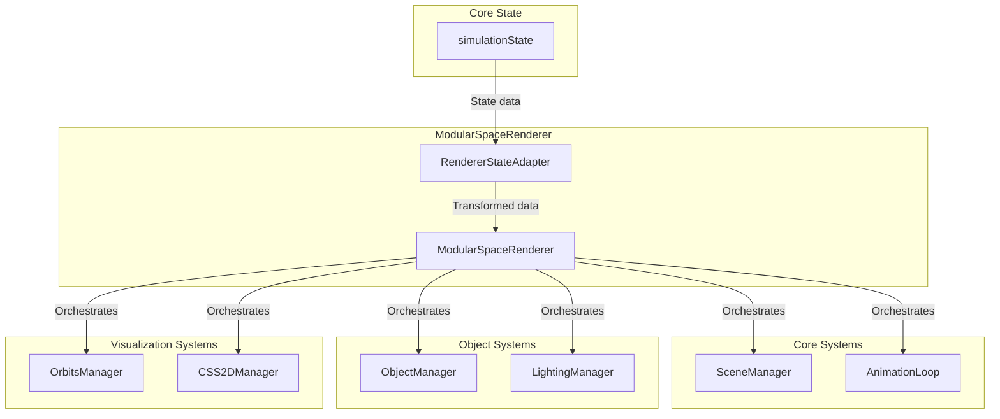

---
aliases:
  [
    Renderer Architecture,
    ThreeJS Renderer System,
    Renderer Index,
    Architecture Overview,
  ]
tags: [architecture, renderer, threejs, system, overview, index]
type: Index
package: "@teskooano/renderer-system"
name: "Teskooano Renderer Architecture"
version: "1.0.0"
dependencies: []
devDependencies: []
classes: []
functions: []
events: []
constants: []
types: []
status: active
---

# Teskooano Renderer Architecture Index

A comprehensive guide to the Teskooano renderer system architecture, showing how all components interconnect and work together to provide high-performance 3D space simulation rendering.

## 🏗️ System Overview

The Teskooano renderer is built on a modular, package-based architecture using Three.js. Each package has a specific responsibility and communicates with others through well-defined interfaces.

### Core Principles

- **Modularity**: Each renderer package handles a specific aspect of rendering
- **Separation of Concerns**: Clear boundaries between different rendering responsibilities
- **Performance**: Optimized for real-time 3D space simulation
- **Extensibility**: Easy to add new rendering features

## 📦 Package Architecture

### Core Infrastructure

- **[[threejs-core/threejs-core|Three.js Core]]** - Foundational Three.js scene and animation management
- **[[threejs-celestial/threejs-celestial|Three.js Celestial]]** - Base classes and interfaces for celestial object rendering
- **[[threejs-lighting/threejs-lighting|Three.js Lighting]]** - Dynamic lighting system for stars and celestial bodies

### Specialized Renderers

- **[[threejs-objects/threejs-objects|Three.js Objects]]** - Main object management and mesh creation
- **[[threejs-orbits/threejs-orbits|Three.js Orbits]]** - Orbital path visualization (Keplerian and N-body) with optimized rendering pipeline
- **[[threejs-labels/threejs-labels|Three.js Labels]]** - 2D label rendering and occlusion
- **[[threejs-background/threejs-background|Three.js Background]]** - Space background and star field rendering

### Support Systems

- **[[threejs-camera/threejs-camera|Three.js Camera]]** - Camera management and controls
- **[[threejs-controls/threejs-controls|Three.js Controls]]** - User interaction and input handling
- **[[threejs-helpers/threejs-helpers|Three.js Helpers]]** - Utility functions and debugging tools

### Main Orchestrator

- **[[threejs/ModularSpaceRenderer|Modular Space Renderer]]** - Central orchestrator that coordinates all systems

## 🔄 Data Flow Architecture

### Main Rendering Pipeline

### Component Lifecycle

1. **State Management**: Core state provides celestial object data
2. **Object Creation**: ObjectManager creates meshes and renderers
3. **Lighting Setup**: LightingManager registers star light sources
4. **Rendering**: AnimationLoop drives the render cycle
5. **Visualization**: Orbits, labels, and effects are rendered

## 🎯 Architecture Patterns

### Core Patterns

- **[[Manager Pattern]]** - How managers coordinate different systems
- **[[Strategy Pattern]]** - How different rendering strategies are selected
- **Factory Pattern** - How objects and renderers are created
- **Observer Pattern** - How systems communicate via events

### Design Patterns Used

- **Orchestrator Pattern**: ModularSpaceRenderer coordinates all systems
- **Adapter Pattern**: RendererStateAdapter bridges core state and renderers
- **Registry Pattern**: Component registries for efficient lookup
- **Template Method Pattern**: Base classes define algorithm structure
- **Component Pattern**: Wrapping complex objects with simpler interfaces

## 🔧 System Integration

### Key Integration Points

- **[[Renderer State Adapter]]** - Bridges core state with renderer systems
- **[[Modular Space Renderer]]** - Main orchestrator component
- **[[Animation Loop]]** - Drives the entire rendering pipeline

### Inter-Package Communication

- **Event-Driven**: Systems communicate through RxJS observables
- **Interface-Based**: Well-defined interfaces between packages
- **Dependency Injection**: Clean dependency management
- **State Synchronization**: Automatic state synchronization across systems

## 🎨 Rendering Features

### Celestial Objects

- **Stars**: Main sequence, giants, remnants with dynamic lighting
- **Planets**: Terrestrial, gas giants, ice giants with procedural surfaces
- **Small Bodies**: Asteroids, comets, moons with particle systems
- **Rings**: Complex ring systems with realistic scattering

### Visualization Systems

- **Orbital Paths**: Keplerian ellipses and N-body trajectories
- **Distance Markers**: AU measurements and scale indicators
- **Object Labels**: Names and information with occlusion
- **Background**: Star fields and space environments

### Performance Features

- **Level of Detail**: Distance-based detail reduction
- **Billboard System**: Sprite-based distant object representation
- **Web Worker Integration**: Background processing for heavy calculations
- **Memory Management**: Efficient resource allocation and cleanup
- **Optimized Architecture**: Clean, modular structure with eliminated duplicate code

## 🚀 Performance Architecture

### Optimization Strategies

- **LOD System**: Level of Detail reduces rendering overhead
- **Spatial Culling**: Only render objects in camera view
- **Batch Operations**: Group related operations for efficiency
- **Resource Pooling**: Reuse objects to minimize allocations

### Web Worker Integration

- **Trail Processing**: Historical trail simplification and smoothing
- **Trajectory Prediction**: Future path calculation
- **Data Serialization**: Efficient data transfer between threads
- **Background Processing**: Keep main thread responsive

### Memory Management

- **Automatic Cleanup**: Proper disposal of unused resources
- **Circular Buffers**: Efficient position history storage
- **Material Caching**: Shared materials across similar objects
- **Texture Management**: Efficient texture loading and disposal
- **Code Deduplication**: Eliminated duplicate files and redundant code paths

## 🔍 Debug and Development

### Debug Features

- **Performance Monitoring**: Real-time performance metrics
- **Visual Debugging**: Debug helpers and visualization tools
- **Memory Tracking**: Memory usage monitoring
- **Error Handling**: Comprehensive error tracking and reporting

### Development Tools

- **Architecture Documentation**: Comprehensive system documentation following standardized templates
- **Type Safety**: Full TypeScript support with strict typing
- **Testing Support**: Unit and integration testing capabilities
- **Hot Reloading**: Development-time hot reloading support
- **Code Quality**: Consistent documentation standards and clean architecture

## 📚 Documentation Structure

### Core Infrastructure

- **[[threejs-core/threejs-core|Three.js Core]]** - Foundational Three.js scene and animation management
- **[[threejs-celestial/threejs-celestial|Three.js Celestial]]** - Base classes and interfaces for celestial object rendering
- **[[threejs-lighting/threejs-lighting|Three.js Lighting]]** - Dynamic lighting system for stars and celestial bodies

### Specialized Renderers

- **[[threejs-objects/threejs-objects|Three.js Objects]]** - Main object management and mesh creation
- **[[threejs-orbits/threejs-orbits|Three.js Orbits]]** - Orbital path visualization (Keplerian and N-body) with optimized rendering pipeline
- **[[threejs-labels/threejs-labels|Three.js Labels]]** - 2D label rendering and occlusion
- **[[threejs-background/threejs-background|Three.js Background]]** - Space background and star field rendering

### Support Systems

- **[[threejs-camera/threejs-camera|Three.js Camera]]** - Camera management and controls
- **[[threejs-controls/threejs-controls|Three.js Controls]]** - User interaction and input handling
- **[[threejs-helpers/threejs-helpers|Three.js Helpers]]** - Utility functions and debugging tools

### Main Orchestrator

- **[[threejs/ModularSpaceRenderer|Modular Space Renderer]]** - Central orchestrator that coordinates all systems

## 🔄 Quick Navigation

### By Component Type

- **Core Systems**: [[threejs-core/threejs-core|Three.js Core]], [[threejs-celestial/threejs-celestial|Three.js Celestial]], [[threejs-lighting/threejs-lighting|Three.js Lighting]]
- **Rendering**: [[threejs-objects/threejs-objects|Three.js Objects]], [[threejs-orbits/threejs-orbits|Three.js Orbits]], [[threejs-labels/threejs-labels|Three.js Labels]], [[threejs-background/threejs-background|Three.js Background]]
- **Support**: [[threejs-camera/threejs-camera|Three.js Camera]], [[threejs-controls/threejs-controls|Three.js Controls]], [[threejs-helpers/threejs-helpers|Three.js Helpers]]
- **Orchestration**: [[threejs/ModularSpaceRenderer|Modular Space Renderer]]

### By Architecture Pattern

- **Manager Pattern**: [[threejs-objects/threejs-objects|Three.js Objects]], [[threejs-orbits/threejs-orbits|Three.js Orbits]], [[threejs-lighting/threejs-lighting|Three.js Lighting]]
- **Strategy Pattern**: [[threejs-orbits/threejs-orbits|Three.js Orbits]], [[threejs-celestial/threejs-celestial|Three.js Celestial]]
- **Factory Pattern**: [[threejs-objects/threejs-objects|Three.js Objects]], [[threejs-celestial/threejs-celestial|Three.js Celestial]]
- **Observer Pattern**: [[threejs-core/threejs-core|Three.js Core]], [[threejs/ModularSpaceRenderer|Modular Space Renderer]]

## 🚀 Getting Started

### Learning Path

1. **Start with [[threejs-core/threejs-core|Three.js Core]]** to understand the foundation
2. **Explore [[threejs-celestial/threejs-celestial|Three.js Celestial]]** for the base rendering architecture
3. **Dive into [[threejs-objects/threejs-objects|Three.js Objects]]** to see how everything comes together
4. **Check out [[threejs-orbits/threejs-orbits|Three.js Orbits]]** for advanced visualization features
5. **Understand [[threejs/ModularSpaceRenderer|Modular Space Renderer]]** as the central orchestrator

### Key Concepts

- **Manager Pattern**: How systems are organized and coordinated
- **Strategy Pattern**: How different algorithms are selected
- **State Management**: How data flows through the system
- **Performance Optimization**: How the system maintains high performance
- **Code Quality**: How the system maintains clean, maintainable code

## Dependencies

### Core Dependencies

- **[[core/core-state/core-state|Core State]]** - Central state management for simulation data
- **[[core/core-physics/core-physics|Core Physics]]** - Physics calculations and orbital mechanics
- **[[core/core-math/core-math|Core Math]]** - Mathematical utilities and vector operations
- **[[data/data-types/data-types|Data Types]]** - Type definitions for celestial objects
- **three** - Three.js 3D graphics library
- **rxjs** - Reactive programming for state management

### Development Dependencies

- **typescript** - Type safety and modern JavaScript features
- **vitest** - Testing framework with browser support
- **@vitest/browser** - Browser testing capabilities
- **@playwright/test** - End-to-end testing
- **eslint** - Code quality and consistency

## 🔮 Recent Improvements

### Architecture Optimization

- **Code Deduplication**: Eliminated duplicate files and redundant code paths across all renderer packages
- **Documentation Standardization**: Implemented comprehensive documentation templates for consistency
- **Package Cleanup**: Streamlined package structure with clear separation of concerns
- **Performance Enhancement**: Optimized rendering pipeline with reduced memory footprint

### Quality Improvements

- **Template Compliance**: All documentation now follows standardized agent documentation templates
- **Dependency Management**: Accurate dependency tracking and documentation
- **Export Optimization**: Clean, well-organized export structures
- **Maintainability**: Improved code organization and reduced complexity

## 🔗 Related Documentation

### Architecture Guides

- **[[Manager Pattern]]** - Detailed explanation of the Manager pattern
- **[[Strategy Pattern]]** - How strategies provide flexibility
- **[[Factory Pattern]]** - Object creation patterns
- **[[Observer Pattern]]** - Event-driven communication

### Component Documentation

- **[[Celestial Objects]]** - Types and rendering of celestial bodies
- **[[Orbital Systems]]** - Trajectory visualization and physics
- **[[Lighting System]]** - Dynamic lighting and shadows
- **[[User Interface]]** - Labels, controls, and interaction

### Performance Guides

- **[[Performance Optimization]]** - Techniques for maintaining high performance
- **[[Memory Management]]** - Efficient resource management
- **[[Web Worker Integration]]** - Background processing strategies
- **[[LOD System]]** - Level of Detail implementation

---

_This index provides a comprehensive overview of the Teskooano renderer architecture. Each linked document contains detailed information about specific components and patterns._
