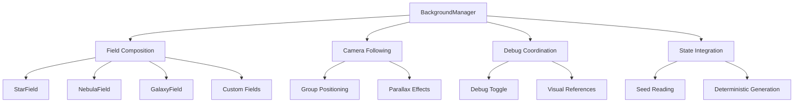
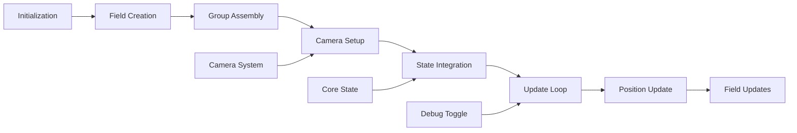

# BackgroundManager

Central orchestrator that composes multiple background field layers (stars, nebulae, galaxies) with camera following, parallax effects, and deterministic seeding for consistent visual experiences.

## 🎯 Purpose

The `BackgroundManager` serves as the central coordination hub for the background rendering system. It composes multiple field layers, manages camera position following, coordinates debug visualization, and integrates with core state for deterministic seeding. The manager ensures proper layering, parallax effects, and seamless integration with the main rendering pipeline.

## 🏗️ Architecture

The BackgroundManager follows a composition pattern that orchestrates multiple field layers under a camera-following group.



## 🚀 Core Features

### 1. Field Composition

- **Default Fields**: Creates StarField and NebulaField at construction
- **Optional Fields**: GalaxyField can be added optionally
- **Custom Fields**: Supports adding custom field implementations
- **Field Management**: Registers and manages all field layers

### 2. Camera Following

- **Group Positioning**: Parents all layers under a group that follows camera position
- **Seamless Movement**: Background moves with camera for immersive experience
- **Parallax Support**: Enables parallax effects through field configuration
- **Depth Management**: Proper positioning at base distance with z-fighting prevention

### 3. Debug System

- **Debug Mode**: Toggle debug visuals for development and testing
- **Visual References**: Overlays depth reference visuals for debugging
- **Field Propagation**: Applies debug mode to all registered fields
- **Development Tools**: Provides comprehensive debugging capabilities

### 4. State Integration

- **Seed Reading**: Reads deterministic seeds from core state
- **System Consistency**: Keeps backgrounds deterministic per system
- **State Synchronization**: Responds to system state changes
- **Configuration Management**: Uses state-based configuration

## 🔧 Key Methods

### `addField(field: Field)`

**Purpose**: Registers and adds a custom field to the background composition.

```typescript
addField(field: Field): void
```

**Parameters**:

- `field` - Field implementation to add to the composition

**Process**:

1. **Field Registration**: Registers the field in the internal field list
2. **Group Addition**: Adds the field's group to the main background group
3. **Debug Propagation**: Applies current debug state to the new field
4. **State Integration**: Integrates field with state management if applicable

### `toggleDebug()`

**Purpose**: Toggles debug mode and propagates debug state to all fields.

```typescript
toggleDebug(): void
```

**Process**:

1. **Debug State Toggle**: Toggles internal debug state
2. **Field Propagation**: Calls toggleDebug on all registered fields
3. **Visual References**: Shows/hides depth reference overlays
4. **Material Updates**: Updates materials for debug visibility

### `setCamera(camera: THREE.Camera)`

**Purpose**: Sets the camera reference for position following and parallax calculations.

```typescript
setCamera(camera: THREE.Camera): void
```

**Parameters**:

- `camera` - Three.js camera to follow

**Process**:

1. **Camera Reference**: Stores camera reference for position following
2. **Field Updates**: Updates camera reference in all fields
3. **Position Calculation**: Enables camera position following
4. **Parallax Setup**: Configures parallax effects based on camera

### `update(deltaTime: number)`

**Purpose**: Updates background position and all field animations.

```typescript
update(deltaTime: number): void
```

**Parameters**:

- `deltaTime` - Time delta for animation updates

**Process**:

1. **Position Update**: Positions group at camera position
2. **Field Updates**: Calls update on all registered fields
3. **Parallax Calculation**: Applies parallax effects
4. **Animation Updates**: Updates time-based animations

## 🔄 Data Flow

The BackgroundManager follows a systematic data flow for managing background rendering:



### Processing Pipeline

1. **Initialization**: Creates default StarField and NebulaField
2. **Field Creation**: Generates field instances with proper configuration
3. **Group Assembly**: Parents all fields under main background group
4. **Camera Setup**: Sets up camera following and parallax
5. **State Integration**: Reads seeds and integrates with core state
6. **Update Loop**: Continuous update cycle for animations
7. **Position Update**: Updates group position based on camera
8. **Field Updates**: Propagates updates to all fields

## 📊 Technical Specifications

### Interface Definition

```typescript
interface BackgroundManager {
  addField(field: Field): void;
  toggleDebug(): void;
  setCamera(camera: THREE.Camera): void;
  getGroup(): THREE.Group;
  update(deltaTime: number): void;
  dispose(): void;
}
```

### Field Interface

```typescript
abstract class Field {
  public object: THREE.Object3D;
  public isDebugMode: boolean;
  protected options: FieldOptions;

  abstract update(deltaTime: number, camera?: THREE.PerspectiveCamera): void;
  abstract toggleDebug(debug: boolean): void;
  abstract dispose(): void;
}
```

## 💡 Usage Examples

### Basic Setup

```typescript
import { BackgroundManager } from "@teskooano/renderer-threejs-background";

const backgroundManager = new BackgroundManager();
backgroundManager.setCamera(camera);

// Add to scene
scene.add(backgroundManager.getGroup());

// Update in render loop
function renderLoop() {
  backgroundManager.update(deltaTime);
  renderer.render(scene, camera);
}
```

### Custom Field Integration

```typescript
import {
  BackgroundManager,
  StarField,
} from "@teskooano/renderer-threejs-background";

const backgroundManager = new BackgroundManager();

// Add custom star field
const customStarField = new StarField({
  density: 0.8,
  parallaxStrength: 0.5,
  colorGradient: ["#ffffff", "#87ceeb"],
});

backgroundManager.addField(customStarField);
```

### Debug Mode Usage

```typescript
// Toggle debug mode
backgroundManager.toggleDebug();

// Debug mode provides:
// - Bright materials for visibility
// - Depth reference overlays
// - Layer separation visualization
```

## ⚡ Performance Considerations

### Efficiency

- **Group Management**: Efficient Three.js group composition
- **Field Optimization**: Optimized field update cycles
- **Camera Following**: Efficient camera position calculations
- **Debug Overhead**: Minimal performance impact in debug mode

### Quality Metrics

- **Visual Quality**: High-quality background composition
- **Performance**: Maintains 60 FPS with complex backgrounds
- **Consistency**: Deterministic rendering ensures reproducible results
- **Scalability**: Efficient rendering regardless of field count

### Performance Monitoring

- **Update Performance**: Tracks update cycle performance
- **Memory Usage**: Monitors field composition memory usage
- **Camera Performance**: Tracks camera following performance
- **Debug Performance**: Monitors debug mode performance impact

## 🔌 Integration Points

### Core State Integration

- **Seed Management**: Reads deterministic seeds from core state
- **System Synchronization**: Backgrounds match system generation
- **State Updates**: Responds to system state changes
- **Configuration**: Uses state-based configuration

### Three.js Integration

- **Scene Management**: Properly integrates with Three.js scene graph
- **Camera System**: Follows camera position for seamless movement
- **Group Composition**: Uses Three.js groups for efficient rendering
- **Material System**: Coordinates material updates across fields

### Field System Integration

- **Field Interface**: Implements common Field interface
- **Field Management**: Manages multiple field instances
- **Debug Coordination**: Coordinates debug state across fields
- **Update Propagation**: Propagates updates to all fields

## 🐛 Debug Features

### Validation

- **Field Validation**: Ensures all fields are properly initialized
- **Camera Validation**: Validates camera integration
- **State Validation**: Checks seed and state integration
- **Group Validation**: Ensures proper group composition

### Monitoring

- **Performance Monitoring**: Tracks update performance
- **Memory Monitoring**: Monitors field composition memory usage
- **Camera Monitoring**: Tracks camera following performance
- **Debug Monitoring**: Monitors debug mode performance impact

### Debugging Tools

- **Debug Mode**: Toggle debug visualization for development
- **Visual References**: Depth reference overlays for debugging
- **Field Inspection**: Individual field debugging capabilities
- **State Inspection**: Access to internal state for debugging

## 🔮 Future Enhancements

### Optimization Opportunities

- **Performance Optimization**: Further group management optimizations
- **Memory Optimization**: Advanced field caching and memory management
- **Code Optimization**: Additional algorithmic improvements for field management
- **Architecture Optimization**: Enhanced modular architecture and field system

### Potential Improvements

- **Advanced Parallax**: More sophisticated parallax effects and depth simulation
- **Dynamic Fields**: Real-time field addition and removal
- **Advanced Debugging**: Enhanced debug visualization and inspection tools
- **Custom Field Support**: Extensible field system for custom background elements

## 📚 Related Documentation

- [[Field]] - Abstract base class for all background field types
- [[StarField]] - Layered star backdrop rendering
- [[NebulaField]] - Volumetric nebula rendering with shaders
- [[@teskooano/core-state]] - State management for deterministic seeding
- [[@teskooano/core-math]] - Mathematical utilities for positioning and calculations
