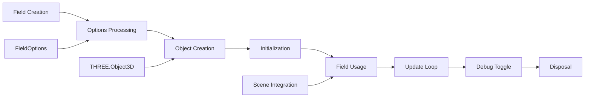

# Field

Abstract base class for all environmental background fields (star fields, nebulae, galaxies) that defines the common interface for updating, disposing, and managing debug states in the background rendering system.

## 🎯 Purpose

The `Field` class serves as the abstract base class for all background field types in the threejs-background package. It defines the common interface that all field implementations must follow, ensuring consistency in how fields are managed, updated, and debugged. This abstract class provides the foundation for the modular field-based architecture that allows easy extension with new background effect types.

## 🏗️ Architecture

The Field class follows an abstract base class pattern that defines the contract for all background field implementations.

```mermaid
graph TD
    A[Field - Abstract Base] --> B[Common Properties]
    A --> C[Abstract Methods]
    A --> D[Constructor Logic]

    B --> E[object: THREE.Object3D]
    B --> F[isDebugMode: boolean]
    B --> G[options: FieldOptions]

    C --> H[update()]
    C --> I[toggleDebug()]
    C --> J[dispose()]

    D --> K[Group Creation]
    D --> L[Name Assignment]
    D --> M[Options Storage]

    N[StarField] --> A
    O[NebulaField] --> A
    P[GalaxyField] --> A
    Q[Custom Fields] --> A
```

## 🚀 Core Features

### 1. Common Interface

- **Standardized Methods**: All fields implement the same core methods
- **Consistent Behavior**: Uniform update, debug, and disposal patterns
- **Type Safety**: Abstract methods ensure all implementations are complete
- **Extensibility**: Easy to add new field types by extending this base class

### 2. Object Management

- **Three.js Integration**: Manages a THREE.Object3D for scene integration
- **Group Organization**: Creates a THREE.Group for field organization
- **Name Assignment**: Optional naming for debugging and identification
- **Scene Integration**: Proper integration with Three.js scene graph

### 3. Debug System

- **Debug State Tracking**: Maintains debug mode state
- **Debug Interface**: Defines debug toggle method for all fields
- **Development Support**: Enables consistent debugging across all field types
- **Visual Inspection**: Provides foundation for debug visualization

### 4. Resource Management

- **Disposal Interface**: Defines cleanup method for all fields
- **Memory Management**: Ensures proper resource cleanup
- **Lifecycle Management**: Handles field creation and destruction
- **Resource Safety**: Prevents memory leaks through proper disposal

## 🔧 Key Methods

### Constructor

**Purpose**: Initializes the base field with common properties and Three.js object.

```typescript
constructor(options: FieldOptions)
```

**Parameters**:

- `options` - Configuration options for the field

**Process**:

1. **Options Storage**: Stores field options for later use
2. **Group Creation**: Creates a THREE.Group for the field
3. **Name Assignment**: Sets object name if provided in options
4. **Initialization**: Prepares field for use

### `update(deltaTime: number, camera?: THREE.PerspectiveCamera)`

**Purpose**: Updates the field's state (abstract method to be implemented by subclasses).

```typescript
abstract update(deltaTime: number, camera?: THREE.PerspectiveCamera): void
```

**Parameters**:

- `deltaTime` - Time delta for animation updates
- `camera` - Optional camera reference for effects like parallax

**Implementation**: Must be implemented by concrete field classes

### `toggleDebug(debug: boolean)`

**Purpose**: Toggles debug visualization for the field (abstract method to be implemented by subclasses).

```typescript
abstract toggleDebug(debug: boolean): void
```

**Parameters**:

- `debug` - Boolean flag to enable or disable debug mode

**Implementation**: Must be implemented by concrete field classes

### `dispose()`

**Purpose**: Cleans up field resources (abstract method to be implemented by subclasses).

```typescript
abstract dispose(): void
```

**Implementation**: Must be implemented by concrete field classes

## 🔄 Data Flow

The Field class follows a systematic data flow for field lifecycle management:



### Processing Pipeline

1. **Field Creation**: Constructor called with options
2. **Options Processing**: Field options are stored and processed
3. **Object Creation**: THREE.Group is created for the field
4. **Initialization**: Field is prepared for use
5. **Field Usage**: Field is added to scene and used
6. **Update Loop**: Field is updated each frame
7. **Debug Toggle**: Debug mode can be toggled as needed
8. **Disposal**: Field resources are cleaned up when no longer needed

## 📊 Technical Specifications

### Interface Definition

```typescript
export interface FieldOptions {
  name?: string;
}

export abstract class Field {
  public object: THREE.Object3D;
  public isDebugMode: boolean = false;
  protected options: FieldOptions;

  constructor(options: FieldOptions);
  abstract update(deltaTime: number, camera?: THREE.PerspectiveCamera): void;
  abstract toggleDebug(debug: boolean): void;
  abstract dispose(): void;
}
```

### Field Options

```typescript
interface FieldOptions {
  name?: string; // Optional name for the field object
}
```

## 💡 Usage Examples

### Creating a Custom Field

```typescript
import { Field, FieldOptions } from "@teskooano/renderer-threejs-background";
import * as THREE from "three";

class CustomField extends Field {
  constructor(options: FieldOptions) {
    super(options);

    // Create custom field implementation
    const geometry = new THREE.SphereGeometry(100, 32, 32);
    const material = new THREE.MeshBasicMaterial({ color: 0xff0000 });
    const mesh = new THREE.Mesh(geometry, material);

    this.object.add(mesh);
  }

  update(deltaTime: number, camera?: THREE.PerspectiveCamera): void {
    // Implement custom update logic
    this.object.rotation.y += deltaTime * 0.001;
  }

  toggleDebug(debug: boolean): void {
    this.isDebugMode = debug;
    // Implement custom debug visualization
    if (debug) {
      // Show debug visuals
    } else {
      // Hide debug visuals
    }
  }

  dispose(): void {
    // Clean up custom resources
    this.object.children.forEach((child) => {
      if (child instanceof THREE.Mesh) {
        child.geometry.dispose();
        (child.material as THREE.Material).dispose();
      }
    });
  }
}
```

### Using Fields with BackgroundManager

```typescript
import {
  BackgroundManager,
  Field,
} from "@teskooano/renderer-threejs-background";

const backgroundManager = new BackgroundManager(scene, camera);

// Add custom field
const customField = new CustomField({ name: "custom-background" });
backgroundManager.addField(customField);

// Fields are automatically updated and managed
```

## ⚡ Performance Considerations

### Efficiency

- **Abstract Base Class**: Minimal overhead from base class
- **Object Reuse**: Reuses THREE.Object3D for efficient scene integration
- **Method Dispatch**: Efficient virtual method calls
- **Memory Management**: Proper resource cleanup through disposal

### Quality Metrics

- **Type Safety**: Compile-time checking of field implementations
- **Consistency**: Uniform interface across all field types
- **Extensibility**: Easy to add new field types
- **Maintainability**: Clear separation of concerns

### Performance Monitoring

- **Method Performance**: Tracks abstract method implementation performance
- **Memory Usage**: Monitors field object memory usage
- **Update Performance**: Tracks field update cycle performance
- **Debug Performance**: Monitors debug mode performance impact

## 🔌 Integration Points

### Three.js Integration

- **Object3D**: Uses THREE.Object3D for scene integration
- **Group Management**: Creates THREE.Group for organization
- **Scene Graph**: Properly integrates with Three.js scene graph
- **Material System**: Coordinates with Three.js material system

### Background Manager Integration

- **Field Interface**: Implements interface expected by BackgroundManager
- **Update Propagation**: Receives updates from BackgroundManager
- **Debug Coordination**: Coordinates debug state with manager
- **Resource Management**: Integrates with manager's resource lifecycle

### Field System Integration

- **Base Class**: Serves as foundation for all field types
- **Interface Contract**: Defines contract for field implementations
- **Common Properties**: Provides shared properties and behavior
- **Extension Point**: Enables easy extension with new field types

## 🐛 Debug Features

### Validation

- **Abstract Method Validation**: Ensures all abstract methods are implemented
- **Options Validation**: Validates field options during construction
- **Object Validation**: Ensures proper Three.js object creation
- **Interface Validation**: Validates field interface compliance

### Monitoring

- **Performance Monitoring**: Tracks field performance metrics
- **Memory Monitoring**: Monitors field memory usage
- **Update Monitoring**: Tracks field update performance
- **Debug Monitoring**: Monitors debug mode performance impact

### Debugging Tools

- **Debug State**: Tracks debug mode state
- **Object Inspection**: Access to Three.js object for debugging
- **Options Inspection**: Access to field options for debugging
- **Lifecycle Tracking**: Tracks field lifecycle for debugging

## 🔮 Future Enhancements

### Optimization Opportunities

- **Performance Optimization**: Further base class optimizations
- **Memory Optimization**: Advanced memory management strategies
- **Code Optimization**: Additional algorithmic improvements
- **Architecture Optimization**: Enhanced modular architecture

### Potential Improvements

- **Advanced Debugging**: Enhanced debug visualization and inspection tools
- **Dynamic Fields**: Real-time field creation and modification
- **Advanced Interfaces**: More sophisticated field interfaces
- **Custom Field Support**: Enhanced support for custom field types

## 📚 Related Documentation

- [[BackgroundManager]] - Central orchestrator for background rendering
- [[StarField]] - Concrete implementation of Field for star rendering
- [[NebulaField]] - Concrete implementation of Field for nebula rendering
- [[@teskooano/core-math]] - Mathematical utilities for positioning and calculations
