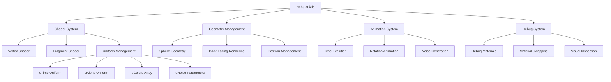
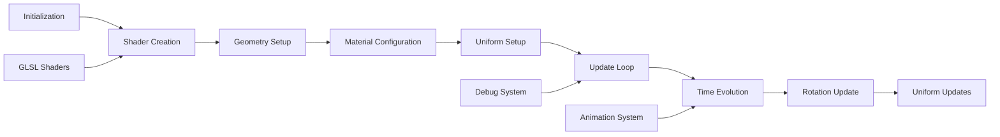

# NebulaField

Shader-driven volumetric nebula rendered on a large back-facing sphere with slow rotation, time-evolving noise, and configurable color palettes for creating immersive space environments.

## 🎯 Purpose

The `NebulaField` creates volumetric nebula effects using custom GLSL shaders rendered on a large sphere geometry. It provides time-evolving noise patterns, slow rotation animation, and configurable color palettes to create realistic and immersive nebula backgrounds. The field uses shader-based rendering for high-quality volumetric effects with efficient performance.

## 🏗️ Architecture

The NebulaField follows a shader-based architecture with time-evolving noise and rotation effects.



## 🚀 Core Features

### 1. Shader-Driven Rendering

- **Custom GLSL Shaders**: Vertex and fragment shaders for volumetric effects
- **Uniform Management**: Comprehensive uniform system for shader parameters
- **Time Evolution**: Time-based noise evolution for dynamic effects
- **Noise Generation**: Procedural noise for realistic nebula patterns

### 2. Volumetric Effects

- **Sphere Geometry**: Large back-facing sphere for volumetric rendering
- **Back-Facing Rendering**: Proper rendering order for depth layering
- **Z-Fighting Prevention**: Tiny random offset to avoid z-fighting
- **Depth Management**: Proper depth testing and blending

### 3. Animation System

- **Slow Rotation**: Configurable rotation speed for subtle movement
- **Time Increment**: Continuous time evolution for dynamic effects
- **Noise Evolution**: Time-based noise pattern changes
- **Smooth Animation**: Seamless animation loops

### 4. Color and Visual Management

- **Color Palettes**: Configurable color arrays for nebula appearance
- **Alpha Blending**: Proper transparency and blending
- **Visual Quality**: High-quality volumetric rendering
- **Debug Visualization**: Debug materials for development

## 🔧 Key Methods

### `update(deltaTime: number, camera?: THREE.PerspectiveCamera)`

**Purpose**: Updates nebula animation, rotation, and time evolution.

```typescript
update(deltaTime: number, camera?: THREE.PerspectiveCamera): void
```

**Parameters**:

- `deltaTime` - Time delta for animation updates
- `camera` - Optional camera reference (not used in current implementation)

**Process**:

1. **Time Evolution**: Increments time uniform for noise evolution
2. **Rotation Update**: Updates rotation based on rotation speed
3. **Uniform Updates**: Updates shader uniforms with new values
4. **Animation Sync**: Synchronizes animation with frame rate

### `toggleDebug(debug: boolean)`

**Purpose**: Toggles debug mode with material swapping for visibility testing.

```typescript
toggleDebug(debug: boolean): void
```

**Parameters**:

- `debug` - Boolean flag to enable or disable debug mode

**Process**:

1. **Debug State Toggle**: Toggles internal debug state
2. **Material Swapping**: Swaps between normal and debug materials
3. **Bright Material**: Applies bright material for visibility
4. **Material Restoration**: Stores and restores original material

### `dispose()`

**Purpose**: Cleans up resources and disposes of nebula geometry and materials.

```typescript
dispose(): void
```

**Process**:

1. **Geometry Cleanup**: Disposes of Three.js sphere geometry
2. **Material Cleanup**: Disposes of materials and shaders
3. **Memory Cleanup**: Cleans up allocated memory
4. **Resource Disposal**: Properly disposes of all resources

## 🔄 Data Flow

The NebulaField follows a systematic data flow for shader-based rendering:



### Processing Pipeline

1. **Initialization**: Creates NebulaField with configuration
2. **Shader Creation**: Loads and compiles GLSL shaders
3. **Geometry Setup**: Creates large sphere geometry
4. **Material Configuration**: Sets up shader material
5. **Uniform Setup**: Initializes shader uniforms
6. **Update Loop**: Continuous update cycle for animations
7. **Time Evolution**: Updates time uniform for noise evolution
8. **Rotation Update**: Updates rotation animation
9. **Uniform Updates**: Updates all shader uniforms

## 📊 Technical Specifications

### Interface Definition

```typescript
class NebulaField extends Field {
  update(deltaTime: number, camera?: THREE.PerspectiveCamera): void;
  toggleDebug(debug: boolean): void;
  dispose(): void;
}
```

### Shader Uniforms

```typescript
interface NebulaUniforms {
  uTime: number; // Time evolution for noise
  uAlpha: number; // Transparency/opacity
  uColors: number[]; // Color palette array
  uNoiseScale: number; // Noise scale factor
  uNoiseOctaves: number; // Number of noise octaves
  uNoiseSeed: number; // Noise seed for variation
  uRotationSpeed: number; // Rotation animation speed
}
```

### Configuration Options

```typescript
interface NebulaFieldConfig {
  baseDistance: number;
  rotationSpeed: number;
  colors: string[];
  noiseScale: number;
  noiseOctaves: number;
  noiseSeed?: number;
  alpha: number;
}
```

## 💡 Usage Examples

### Basic Nebula Creation

```typescript
import { NebulaField } from "@teskooano/renderer-threejs-background";

const nebulaField = new NebulaField({
  baseDistance: 1000,
  rotationSpeed: 0.001,
  colors: ["#ff69b4", "#9370db", "#4169e1"],
  noiseScale: 0.5,
  noiseOctaves: 4,
  alpha: 0.3,
});

// Add to scene
scene.add(nebulaField.getGroup());
```

### Custom Configuration

```typescript
const customNebula = new NebulaField({
  baseDistance: 2000,
  rotationSpeed: 0.002,
  colors: ["#ff1493", "#8a2be2", "#0000ff", "#00bfff"],
  noiseScale: 0.8,
  noiseOctaves: 6,
  noiseSeed: 12345,
  alpha: 0.5,
});
```

### Debug Mode Usage

```typescript
// Toggle debug mode for development
nebulaField.toggleDebug();

// Debug mode provides:
// - Bright material for visibility
// - Enhanced contrast for testing
// - Material inspection capabilities
```

## ⚡ Performance Considerations

### Efficiency

- **Shader Rendering**: Uses efficient GPU-based shader rendering
- **Geometry Optimization**: Optimized sphere geometry for performance
- **Uniform Updates**: Efficient uniform update cycles
- **Memory Management**: Efficient memory usage for shader data

### Quality Metrics

- **Visual Quality**: High-quality volumetric rendering with shaders
- **Performance**: Maintains 60 FPS with complex nebula effects
- **Consistency**: Deterministic rendering ensures reproducible results
- **Scalability**: Efficient rendering regardless of complexity

### Performance Monitoring

- **Shader Performance**: Tracks shader rendering performance
- **Memory Usage**: Monitors shader and geometry memory usage
- **Update Performance**: Tracks update cycle performance
- **Animation Performance**: Monitors animation and rotation performance

## 🔌 Integration Points

### Three.js Integration

- **Shader System**: Uses Three.js ShaderMaterial for custom rendering
- **Geometry System**: Integrates with Three.js sphere geometry
- **Material System**: Integrates with Three.js material system
- **Scene Management**: Properly integrates with Three.js scene graph

### Field System Integration

- **Field Interface**: Implements common Field interface
- **Background Manager**: Integrates with BackgroundManager
- **Debug Coordination**: Coordinates debug state with manager
- **Update Propagation**: Receives updates from manager

### Shader Integration

- **GLSL Shaders**: Custom vertex and fragment shaders
- **Uniform System**: Comprehensive uniform management
- **Noise Generation**: Procedural noise for realistic effects
- **Time Evolution**: Time-based animation system

## 🐛 Debug Features

### Validation

- **Shader Validation**: Ensures shaders compile correctly
- **Geometry Validation**: Validates sphere geometry creation
- **Uniform Validation**: Validates uniform setup and values
- **Configuration Validation**: Checks configuration parameters

### Monitoring

- **Performance Monitoring**: Tracks shader rendering performance
- **Memory Monitoring**: Monitors shader and geometry memory usage
- **Update Monitoring**: Tracks update cycle performance
- **Animation Monitoring**: Monitors animation and rotation performance

### Debugging Tools

- **Debug Mode**: Toggle debug visualization for development
- **Material Swapping**: Bright materials for visibility testing
- **Uniform Inspection**: Access to shader uniforms for debugging
- **Visual References**: Debug materials for development

## 🔮 Future Enhancements

### Optimization Opportunities

- **Performance Optimization**: Further shader optimizations and GPU improvements
- **Memory Optimization**: Advanced shader data caching and management
- **Code Optimization**: Additional algorithmic improvements for noise generation
- **Architecture Optimization**: Enhanced modular architecture and shader system

### Potential Improvements

- **Advanced Shaders**: More sophisticated volumetric effects and atmospheric rendering
- **Dynamic Colors**: Real-time color palette modification
- **Advanced Noise**: Enhanced noise algorithms and patterns
- **Custom Shaders**: Extensible shader system for custom effects

## 📚 Related Documentation

- [[Field]] - Abstract base class for all background field types
- [[BackgroundManager]] - Central orchestrator for background rendering
- [[StarField]] - Layered star backdrop rendering
- [[@teskooano/core-math]] - Mathematical utilities for positioning and calculations
