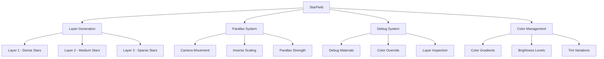
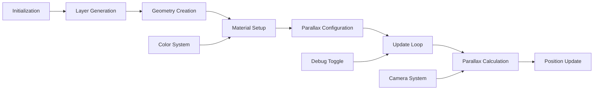

# StarField

Layered star backdrop built from multiple `THREE.Points` layers with color gradients, parallax support, and configurable density levels for creating immersive star field backgrounds.

## 🎯 Purpose

The `StarField` creates a multi-layered star backdrop using Three.js Points geometry. It generates multiple star layers with different densities, brightness levels, and color tints to create depth and visual richness. The field supports parallax effects through inverse camera movement and provides debug visualization for development and testing.

## 🏗️ Architecture

The StarField follows a layered composition architecture with multiple star point layers and parallax effects.



## 🚀 Core Features

### 1. Multi-Layer Star System

- **Multiple Layers**: Creates multiple star layers with different densities
- **Density Variation**: Each layer has configurable star density
- **Brightness Levels**: Different brightness levels for visual depth
- **Color Tints**: Configurable color tints for each layer

### 2. Parallax Effects

- **Inverse Camera Movement**: Stars move opposite to camera movement
- **Parallax Strength**: Configurable parallax scaling factor
- **Depth Simulation**: Creates illusion of depth through parallax
- **Smooth Movement**: Seamless parallax animation

### 3. Color and Visual Management

- **Color Gradients**: Support for color gradients across layers
- **Brightness Control**: Configurable brightness levels
- **Tint Variations**: Different color tints for visual variety
- **Visual Quality**: High-quality star rendering with proper blending

### 4. Debug and Development Tools

- **Debug Mode**: Toggle debug visualization for development
- **Color Override**: Debug recolors each layer with solid colors
- **Layer Inspection**: Individual layer debugging capabilities
- **Visual References**: Debug materials for visibility testing

## 🔧 Key Methods

### `update(deltaTime: number, camera?: THREE.PerspectiveCamera)`

**Purpose**: Updates star field animations and parallax effects.

```typescript
update(deltaTime: number, camera?: THREE.PerspectiveCamera): void
```

**Parameters**:

- `deltaTime` - Time delta for animation updates
- `camera` - Optional camera reference for parallax calculations

**Process**:

1. **Parallax Calculation**: Calculates parallax movement based on camera
2. **Layer Updates**: Updates position of all star layers
3. **Animation Updates**: Updates time-based animations
4. **Position Synchronization**: Synchronizes layer positions

### `toggleDebug(debug: boolean)`

**Purpose**: Toggles debug mode with color overrides for layer inspection.

```typescript
toggleDebug(debug: boolean): void
```

**Parameters**:

- `debug` - Boolean flag to enable or disable debug mode

**Process**:

1. **Debug State Toggle**: Toggles internal debug state
2. **Material Swapping**: Swaps materials for debug visibility
3. **Color Override**: Applies solid colors to each layer
4. **Layer Inspection**: Enables individual layer debugging

### `dispose()`

**Purpose**: Cleans up resources and disposes of star field geometry.

```typescript
dispose(): void
```

**Process**:

1. **Geometry Cleanup**: Disposes of Three.js geometries
2. **Material Cleanup**: Disposes of materials and textures
3. **Memory Cleanup**: Cleans up allocated memory
4. **Resource Disposal**: Properly disposes of all resources

## 🔄 Data Flow

The StarField follows a systematic data flow for creating and updating star layers:



### Processing Pipeline

1. **Initialization**: Creates StarField with configuration
2. **Layer Generation**: Generates multiple star layers
3. **Geometry Creation**: Creates Three.js Points geometries
4. **Material Setup**: Sets up materials and colors
5. **Parallax Configuration**: Configures parallax effects
6. **Update Loop**: Continuous update cycle for animations
7. **Parallax Calculation**: Calculates parallax movement
8. **Position Update**: Updates layer positions

## 📊 Technical Specifications

### Interface Definition

```typescript
class StarField extends Field {
  update(deltaTime: number, camera?: THREE.PerspectiveCamera): void;
  toggleDebug(debug: boolean): void;
  dispose(): void;
}
```

### Configuration Options

```typescript
interface StarFieldConfig {
  layers: {
    density: number;
    brightness: number;
    colorTint: string;
    parallaxStrength: number;
  }[];
  baseDistance: number;
  seed?: string;
}
```

## 💡 Usage Examples

### Basic Star Field Creation

```typescript
import { StarField } from "@teskooano/renderer-threejs-background";

const starField = new StarField({
  layers: [
    {
      density: 0.8,
      brightness: 1.0,
      colorTint: "#ffffff",
      parallaxStrength: 0.1,
    },
    {
      density: 0.5,
      brightness: 0.7,
      colorTint: "#87ceeb",
      parallaxStrength: 0.3,
    },
    {
      density: 0.2,
      brightness: 0.4,
      colorTint: "#4169e1",
      parallaxStrength: 0.5,
    },
  ],
  baseDistance: 1000,
});

// Add to scene
scene.add(starField.getGroup());
```

### Custom Configuration

```typescript
const customStarField = new StarField({
  layers: [
    {
      density: 0.9,
      brightness: 1.2,
      colorTint: "#ffff00",
      parallaxStrength: 0.05,
    },
    {
      density: 0.6,
      brightness: 0.8,
      colorTint: "#ff69b4",
      parallaxStrength: 0.2,
    },
    {
      density: 0.3,
      brightness: 0.5,
      colorTint: "#9370db",
      parallaxStrength: 0.4,
    },
  ],
  baseDistance: 2000,
  seed: "custom-star-seed",
});
```

### Debug Mode Usage

```typescript
// Toggle debug mode for development
starField.toggleDebug();

// Debug mode provides:
// - Solid colors for each layer
// - Enhanced visibility for testing
// - Layer separation visualization
```

## ⚡ Performance Considerations

### Efficiency

- **Points Geometry**: Uses efficient Three.js Points geometry
- **Layer Optimization**: Optimized layer rendering and updates
- **Parallax Calculation**: Efficient parallax movement calculations
- **Memory Management**: Efficient memory usage for star data

### Quality Metrics

- **Visual Quality**: High-quality star rendering with proper blending
- **Performance**: Maintains 60 FPS with complex star fields
- **Consistency**: Deterministic rendering ensures reproducible results
- **Scalability**: Efficient rendering regardless of star count

### Performance Monitoring

- **Render Performance**: Tracks star field rendering performance
- **Memory Usage**: Monitors star data memory consumption
- **Update Performance**: Tracks update cycle performance
- **Parallax Performance**: Monitors parallax calculation performance

## 🔌 Integration Points

### Three.js Integration

- **Points Geometry**: Uses Three.js Points for efficient star rendering
- **Material System**: Integrates with Three.js material system
- **Scene Management**: Properly integrates with Three.js scene graph
- **Camera System**: Responds to camera movement for parallax

### Field System Integration

- **Field Interface**: Implements common Field interface
- **Background Manager**: Integrates with BackgroundManager
- **Debug Coordination**: Coordinates debug state with manager
- **Update Propagation**: Receives updates from manager

### Rendering Integration

- **Render Order**: Integrates with render order system
- **Depth Management**: Proper depth testing and blending
- **Performance**: Optimized for background rendering
- **Visual Quality**: High-quality rendering with proper blending

## 🐛 Debug Features

### Validation

- **Layer Validation**: Ensures all layers are properly initialized
- **Geometry Validation**: Validates Three.js geometry creation
- **Material Validation**: Validates material setup and configuration
- **Configuration Validation**: Checks configuration parameters

### Monitoring

- **Performance Monitoring**: Tracks rendering performance
- **Memory Monitoring**: Monitors star data memory usage
- **Update Monitoring**: Tracks update cycle performance
- **Parallax Monitoring**: Monitors parallax calculation performance

### Debugging Tools

- **Debug Mode**: Toggle debug visualization for development
- **Color Override**: Solid colors for layer inspection
- **Layer Inspection**: Individual layer debugging capabilities
- **Visual References**: Debug materials for visibility testing

## 🔮 Future Enhancements

### Optimization Opportunities

- **Performance Optimization**: Further geometry and rendering optimizations
- **Memory Optimization**: Advanced star data caching and management
- **Code Optimization**: Additional algorithmic improvements for star generation
- **Architecture Optimization**: Enhanced modular architecture and layer system

### Potential Improvements

- **Advanced Parallax**: More sophisticated parallax effects and depth simulation
- **Dynamic Stars**: Real-time star generation and modification
- **Advanced Colors**: Enhanced color systems and gradient support
- **Custom Layers**: Extensible layer system for custom star effects

## 📚 Related Documentation

- [[Field]] - Abstract base class for all background field types
- [[BackgroundManager]] - Central orchestrator for background rendering
- [[NebulaField]] - Volumetric nebula rendering with shaders
- [[@teskooano/core-math]] - Mathematical utilities for positioning and calculations
