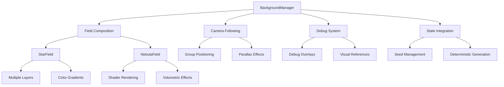
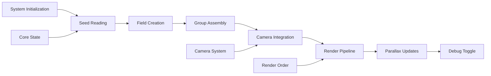

# Three.js Background (`@teskooano/renderer-threejs-background`)

Comprehensive space backdrop rendering system that creates immersive star fields, nebulae, and galaxies with parallax effects and deterministic seeding for consistent visual experiences.

## 🎯 Purpose

The `@teskooano/renderer-threejs-background` package provides a layered background rendering system for space environments. It creates multiple field layers (stars, nebulae, galaxies) with parallax effects, deterministic seeding from core state, and debug visualization capabilities. The system renders early in the render pipeline with low render order to ensure proper depth layering behind the main scene.

## 🏗️ Architecture

The background rendering system follows a layered composition architecture with camera-following groups and field-based rendering.



## 🚀 Core Features

### 1. Layered Field System

- **StarField**: Multiple layered star backdrops with color gradients and parallax
- **NebulaField**: Shader-driven volumetric nebulae with time-evolving noise
- **Field Base Class**: Abstract base class for creating custom field types
- **Field Composition**: Modular system for adding custom background layers

### 2. Parallax and Camera Integration

- **Camera Following**: Background group follows camera position for seamless movement
- **Parallax Effects**: Inverse camera movement scaled by parallax strength
- **Depth Layering**: Proper render order management for visual depth
- **Position Management**: Automatic positioning at base distance with z-fighting prevention

### 3. Deterministic Rendering

- **Seed Integration**: Reads seeds from core state for consistent backgrounds per system
- **Reproducible Results**: Same seed always produces identical background layout
- **State Synchronization**: Backgrounds stay consistent with system generation
- **Performance Optimization**: Efficient generation and caching of background elements

### 4. Debug and Development Tools

- **Debug Mode**: Toggle debug visuals for development and testing
- **Visual References**: Depth reference overlays for debugging
- **Material Swapping**: Debug materials for visibility testing
- **Layer Inspection**: Individual layer debugging capabilities

## 🔧 Key Components

### `BackgroundManager`

**Purpose**: Central orchestrator that composes multiple background field layers and manages camera following.

**Key Responsibilities:**

- Field composition and management
- Camera position following
- Debug mode coordination
- State integration for deterministic seeding

### `StarField`

**Purpose**: Creates layered star backdrops with multiple density levels and color gradients.

**Key Responsibilities:**

- Multiple star layer generation
- Parallax effect implementation
- Color gradient management
- Debug visualization support

### `NebulaField`

**Purpose**: Renders volumetric nebulae using shader-driven effects with time evolution.

**Key Responsibilities:**

- Shader-based volumetric rendering
- Time-evolving noise effects
- Slow rotation animation
- Debug material swapping

### `Field`

**Purpose**: Abstract base class that defines the common interface for all background field types.

**Key Responsibilities:**

- Common interface definition
- Object management and scene integration
- Debug state tracking
- Resource lifecycle management

## 🔄 Data Flow

The background rendering system follows a systematic data flow for creating and updating background elements:



### Processing Pipeline

1. **System Initialization**: BackgroundManager creates default fields
2. **Seed Reading**: Reads deterministic seeds from core state
3. **Field Creation**: Generates StarField and NebulaField
4. **Group Assembly**: Parents all layers under camera-following group
5. **Camera Integration**: Sets up camera position following
6. **Render Pipeline**: Integrates with render order system
7. **Parallax Updates**: Applies parallax effects during camera movement
8. **Debug Toggle**: Enables/disables debug visualization

## 📊 Technical Specifications

### Interface Definitions

```typescript
interface BackgroundManager {
  addField(field: Field): void;
  toggleDebug(): void;
  setCamera(camera: THREE.Camera): void;
  getGroup(): THREE.Group;
  update(deltaTime: number): void;
  dispose(): void;
}

abstract class Field {
  public object: THREE.Object3D;
  public isDebugMode: boolean;
  protected options: FieldOptions;

  abstract update(deltaTime: number, camera?: THREE.PerspectiveCamera): void;
  abstract toggleDebug(debug: boolean): void;
  abstract dispose(): void;
}
```

### Render Order Configuration

```typescript
interface RenderOrderConfig {
  background: {
    range: [-1000, -800];
    priority: "early";
    depthTest: true;
    depthWrite: false;
  };
}
```

## 💡 Usage Examples

### Basic Background Setup

```typescript
import { BackgroundManager } from "@teskooano/renderer-threejs-background";

const backgroundManager = new BackgroundManager();
backgroundManager.setCamera(camera);

// Add to scene
scene.add(backgroundManager.getGroup());

// Update in render loop
function renderLoop() {
  backgroundManager.update(deltaTime);
  renderer.render(scene, camera);
}
```

### Custom Field Integration

```typescript
import {
  BackgroundManager,
  Field,
  FieldOptions,
} from "@teskooano/renderer-threejs-background";
import * as THREE from "three";

// Create custom field by extending Field
class CustomField extends Field {
  constructor(options: FieldOptions) {
    super(options);
    // Custom field implementation
  }

  update(deltaTime: number, camera?: THREE.PerspectiveCamera): void {
    // Custom update logic
  }

  toggleDebug(debug: boolean): void {
    this.isDebugMode = debug;
    // Custom debug logic
  }

  dispose(): void {
    // Custom cleanup logic
  }
}

const backgroundManager = new BackgroundManager(scene, camera);
const customField = new CustomField({ name: "custom-background" });
backgroundManager.addField(customField);
```

### Debug Mode Usage

```typescript
// Toggle debug mode for development
backgroundManager.toggleDebug();

// Debug mode provides:
// - Bright materials for visibility
// - Depth reference overlays
// - Layer separation visualization
```

## ⚡ Performance Considerations

### Efficiency

- **Shader Optimization**: NebulaField uses efficient shader-based rendering
- **Layer Caching**: StarField caches generated layers for reuse
- **Parallax Optimization**: Efficient camera position calculations
- **Abstract Base Class**: Minimal overhead from Field base class

### Quality Metrics

- **Visual Quality**: High-quality star fields and volumetric effects
- **Performance**: Maintains 60 FPS with complex background scenes
- **Consistency**: Deterministic rendering ensures reproducible results
- **Scalability**: Efficient rendering regardless of field complexity

### Performance Monitoring

- **Render Time**: Tracks background rendering performance
- **Memory Usage**: Monitors field generation memory consumption
- **Update Frequency**: Optimizes update cycles for smooth animation
- **Debug Overhead**: Minimal performance impact in debug mode

## 🔌 Integration Points

### Core State Integration

- **Seed Management**: Reads deterministic seeds from core state
- **System Synchronization**: Backgrounds match system generation
- **State Updates**: Responds to system state changes
- **Configuration**: Uses state-based configuration

### Three.js Integration

- **Render Order**: Integrates with RenderOrderManager for proper layering
- **Camera System**: Follows camera position for seamless movement
- **Scene Management**: Properly integrates with Three.js scene graph
- **Material System**: Uses Three.js materials and shaders

### Renderer Integration

- **Early Rendering**: Renders early in pipeline with low render order
- **Depth Management**: Proper depth testing and writing configuration
- **Performance**: Optimized for background rendering performance
- **Visual Quality**: High-quality rendering with proper blending

## 🐛 Debug Features

### Validation

- **Field Validation**: Ensures all fields are properly initialized
- **Camera Validation**: Validates camera integration
- **State Validation**: Checks seed and state integration
- **Render Order Validation**: Ensures proper render order configuration

### Monitoring

- **Performance Monitoring**: Tracks rendering performance
- **Memory Monitoring**: Monitors field generation memory usage
- **Update Monitoring**: Tracks update cycle performance
- **Debug Monitoring**: Monitors debug mode performance impact

### Debugging Tools

- **Debug Mode**: Toggle debug visualization for development
- **Visual References**: Depth reference overlays for debugging
- **Layer Inspection**: Individual field debugging capabilities
- **Material Swapping**: Debug materials for visibility testing

## 🔮 Future Enhancements

### Optimization Opportunities

- **Performance Optimization**: Further shader optimizations and instancing improvements
- **Memory Optimization**: Advanced caching strategies and memory management
- **Code Optimization**: Additional algorithmic improvements for field generation
- **Architecture Optimization**: Enhanced modular architecture and field system

### Potential Improvements

- **Advanced Parallax**: More sophisticated parallax effects and depth simulation
- **Dynamic Fields**: Real-time field generation and modification
- **Advanced Shaders**: Enhanced volumetric effects and atmospheric rendering
- **Custom Field Types**: Additional field types like galaxy fields or asteroid fields

## Dependencies

### Core Dependencies

- **three**: Three.js rendering engine and 3D graphics library

### Development Dependencies

- **typescript**: Type safety and modern JavaScript features
- **vitest**: Testing framework with browser support
- **@vitest/browser**: Browser testing capabilities
- **@playwright/test**: End-to-end testing
- **eslint**: Code quality and consistency

## 📚 Documentation Structure

### Core Components

- [[BackgroundManager]] - Central orchestrator for background rendering
- [[StarField]] - Layered star backdrop rendering
- [[NebulaField]] - Volumetric nebula rendering with shaders
- [[Field]] - Abstract base class for all background field types

## 🔄 Quick Navigation

### By Component Type

- **Manager Classes**: [[BackgroundManager]]
- **Field Classes**: [[StarField]], [[NebulaField]]
- **Base Classes**: [[Field]]

### By Architecture Pattern

- **Composition Pattern**: [[BackgroundManager]] composes multiple fields
- **Field Pattern**: All fields implement common Field interface
- **Debug Pattern**: Debug mode with visual reference overlays

## 🚀 Getting Started

1. Start with [[BackgroundManager]] to understand the main orchestrator
2. Explore [[Field]] to understand the base interface for all field types
3. Check out [[StarField]] for basic star rendering concepts
4. Review [[NebulaField]] for advanced shader-based rendering

## 📚 Related Documentation

- [[@teskooano/renderer-threejs-core]] - RenderOrderManager for render order management
- [[@teskooano/core-state]] - State management for deterministic seeding
- [[@teskooano/core-math]] - Mathematical utilities for positioning and calculations
