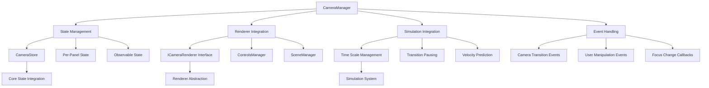
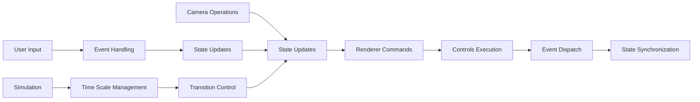

# CameraManager

High-level camera controller that manages camera state through core-state integration and coordinates with the renderer's Controls subsystem. Provides smooth object focusing, camera positioning, FOV management, and simulation integration for immersive 3D space exploration.

## 🎯 Purpose

The `CameraManager` serves as the central high-level manager for all camera operations in the Teskooano Three.js scene. It handles object focusing with smooth transitions, camera positioning and targeting, Field of View (FOV) management, and integration with the simulation system. The manager uses interface-based design to avoid circular dependencies and delegates state management to the core-state system for consistency and per-panel support.

## 🏗️ Architecture

The CameraManager follows a high-level orchestration pattern with interface-based renderer integration and centralized state management.



## 🚀 Core Features

### 1. High-Level Camera Operations

- **Object Focusing**: Smooth camera transitions to focus on celestial objects with velocity prediction
- **Camera Positioning**: Programmatic camera positioning and targeting with logarithmic distance calculation
- **FOV Management**: Dynamic Field of View adjustment with renderer synchronization
- **View Reset**: Reset camera to default position and target with smooth transitions
- **Camera Pointing**: Point camera towards specific target positions without changing location

### 2. State Management Integration

- **Core-State Integration**: Delegates state management to CameraStore for consistency
- **Per-Panel Support**: Each engine panel has its own camera state instance
- **Observable State**: Provides BehaviorSubject stream for reactive updates
- **State Synchronization**: Keeps camera state synchronized across components

### 3. Simulation Integration

- **Transition Pausing**: Temporarily adjusts simulation time scale during transitions
- **Velocity Prediction**: Predicts object position over transition time to reduce snapping
- **Smooth Following**: Maintains smooth camera following during object movement
- **Time Scale Management**: Intelligent time scale adjustment for optimal UX

### 4. Interface-Based Design

- **Renderer Abstraction**: Uses ICameraRenderer interface to avoid circular dependencies
- **Flexible Integration**: Works with any renderer implementing the interface
- **Dependency Injection**: Accepts renderer instance through setDependencies
- **Type Safety**: Consistent CameraState interface across all packages

## 🔧 Key Methods

### `setDependencies(options: CameraManagerOptions)`

**Purpose**: Sets dependencies required by the CameraManager and initializes its state based on provided options.

```typescript
setDependencies(options: CameraManagerOptions): void
```

**Parameters**:

- `options` - Configuration options including renderer instance and initial settings

**Process**:

1. **Cleanup**: Cleans up any existing renderer and associated resources
2. **Renderer Setup**: Sets renderer instance and panel ID
3. **State Initialization**: Initializes camera store with provided or default values
4. **Event Listeners**: Adds document-level event listeners for camera events
5. **Position Sync**: Synchronizes camera position with controls

### `followObject(objectId: string | null, distance?: number)`

**Purpose**: Moves and points the camera to focus on a specific celestial object with smooth transitions.

```typescript
followObject(objectId: string | null, distance?: number): void
```

**Parameters**:

- `objectId` - The unique ID of the object to focus on, or null to clear focus
- `distance` - Optional distance multiplier for camera positioning

**Process**:

1. **State Update**: Updates focused object ID in camera store
2. **Distance Calculation**: Calculates logarithmic viewing distance based on object radius
3. **Velocity Prediction**: Predicts object position over transition time
4. **Simulation Pause**: Temporarily adjusts simulation time scale
5. **Transition Execution**: Initiates smooth camera transition with following
6. **Event Dispatch**: Dispatches events for state synchronization

### `getCameraState$(): BehaviorSubject<CameraState>`

**Purpose**: Provides observable access to the camera's state through core-state integration.

```typescript
getCameraState$(): BehaviorSubject<CameraState>
```

**Returns**: `BehaviorSubject<CameraState>` - Observable stream of camera state

**Process**:

1. **Store Access**: Accesses the camera store's BehaviorSubject
2. **State Stream**: Returns the observable state stream
3. **Reactive Updates**: Provides reactive updates for UI components

### `setFov(fov: number)`

**Purpose**: Sets the camera's vertical Field of View (FOV) and synchronizes with renderer.

```typescript
setFov(fov: number): void
```

**Parameters**:

- `fov` - The desired field of view in degrees

**Process**:

1. **Validation**: Validates FOV value and current state
2. **State Update**: Updates FOV in camera store
3. **Renderer Sync**: Synchronizes FOV with scene manager
4. **State Consistency**: Ensures state consistency across components

## 🔄 Data Flow

The CameraManager follows a systematic data flow for managing camera operations:



### Processing Pipeline

1. **Camera Operations**: High-level operations like followObject or setFov
2. **State Updates**: Updates to CameraStore via core-state
3. **Renderer Commands**: Commands sent to renderer via ICameraRenderer interface
4. **Controls Execution**: Low-level controls execution by ControlsManager
5. **Event Dispatch**: Events dispatched for state synchronization
6. **State Synchronization**: Final state updates and callback execution

## 📊 Technical Specifications

### Interface Definitions

```typescript
interface CameraManagerOptions {
  renderer: ICameraRenderer;
  panelId: string;
  initialFov?: number;
  initialCameraPosition?: OSVector3;
  initialCameraTarget?: OSVector3;
  initialFocusedObjectId?: string | null;
  onFocusChangeCallback?: (focusedObjectId: string | null) => void;
}

interface CameraState {
  position: OSVector3;
  target: OSVector3;
  fov: number;
  selectedObject: string | null;
  focusedObjectId: string | null;
}
```

### Event System

```typescript
// Camera transition completion event
interface CameraTransitionCompleteEvent extends CustomEvent {
  detail: {
    position: THREE.Vector3;
    target: THREE.Vector3;
    focusedObjectId: string | null;
  };
}

// User camera manipulation event
interface UserCameraManipulationEvent extends CustomEvent {
  detail: {
    position: THREE.Vector3;
    target: THREE.Vector3;
  };
}
```

## 💡 Usage Examples

### Basic Camera Setup

```typescript
import { CameraManager } from "@teskooano/renderer-threejs-camera";

// Create camera manager
const cameraManager = new CameraManager();

// Set up dependencies
cameraManager.setDependencies({
  renderer: rendererInstance,
  panelId: "panel-123",
  initialFov: 75,
  onFocusChangeCallback: (objectId) => {
    console.log(`Focused on: ${objectId}`);
  },
});

// Get camera state updates
const cameraState$ = cameraManager.getCameraState$();
cameraState$.subscribe((state) => {
  console.log(`Camera position: ${state.position}`);
  console.log(`Focused object: ${state.focusedObjectId}`);
});
```

### Object Focusing with Smooth Transitions

```typescript
// Focus on a celestial object with smooth transition
cameraManager.followObject("earth");

// Focus with custom distance
cameraManager.followObject("mars", 2.0);

// Clear focus and reset to default view
cameraManager.clearFocus();
```

### Advanced Integration

```typescript
// Initialize camera position after renderer setup
cameraManager.initializeCameraPosition();

// Handle focus changes with UI updates
cameraManager.setDependencies({
  renderer: rendererInstance,
  panelId: "panel-123",
  onFocusChangeCallback: (focusedObjectId) => {
    if (focusedObjectId) {
      updateObjectInfoPanel(focusedObjectId);
    } else {
      clearObjectInfoPanel();
    }
  },
});

// Clean up when done
cameraManager.destroy();
```

## ⚡ Performance Considerations

### Efficiency

- **Interface-Based Design**: Minimal overhead from renderer abstraction
- **State Delegation**: Efficient state management through core-state
- **Event-Driven Updates**: Reactive updates without polling
- **Transition Optimization**: Intelligent time scale management during transitions

### Quality Metrics

- **Smooth Transitions**: High-quality camera movements with velocity prediction
- **Responsive UI**: Maintains 60 FPS during camera operations
- **State Consistency**: Reliable state synchronization across components
- **Memory Efficiency**: Proper cleanup and resource management

### Performance Monitoring

- **Transition Performance**: Tracks camera transition smoothness
- **State Update Performance**: Monitors state synchronization performance
- **Memory Usage**: Tracks camera manager memory consumption
- **Event Processing**: Monitors event handling performance

## 🔌 Integration Points

### Core State Integration

- **CameraStore**: Uses core-state CameraStore for state management
- **Per-Panel State**: Each panel has its own camera state instance
- **State Synchronization**: Keeps state synchronized across components
- **Observable Streams**: Provides reactive state updates

### Renderer Integration

- **ICameraRenderer Interface**: Works with any compatible renderer
- **ControlsManager**: Integrates with low-level camera controls
- **SceneManager**: Coordinates with scene management
- **ObjectManager**: Accesses renderable objects for focusing

### Simulation Integration

- **Time Scale Management**: Adjusts simulation speed during transitions
- **Velocity Prediction**: Predicts object movement for smooth following
- **Transition Pausing**: Prevents fast-moving objects from moving too far
- **State Coordination**: Coordinates with simulation state

## 🐛 Debug Features

### Validation

- **Renderer Validation**: Ensures renderer implements required interface
- **State Validation**: Validates camera state consistency
- **Parameter Validation**: Validates method parameters and options
- **Dependency Validation**: Ensures all dependencies are properly set

### Monitoring

- **State Monitoring**: Tracks camera state changes and updates
- **Transition Monitoring**: Monitors camera transition performance
- **Event Monitoring**: Tracks event handling and processing
- **Memory Monitoring**: Monitors resource usage and cleanup

### Debugging Tools

- **State Inspection**: Access to current camera state for debugging
- **Event Logging**: Comprehensive event logging for troubleshooting
- **Transition Debugging**: Debug information for camera transitions
- **Performance Metrics**: Performance monitoring and optimization tools

## 🔮 Future Enhancements

### Optimization Opportunities

- **Performance Optimization**: Further transition and state update optimizations
- **Memory Optimization**: Advanced memory management and cleanup strategies
- **Code Optimization**: Additional algorithmic improvements for camera operations
- **Architecture Optimization**: Enhanced modular architecture and interface design

### Potential Improvements

- **Advanced Transitions**: More sophisticated camera transition algorithms
- **Dynamic FOV**: Automatic FOV adjustment based on object size and distance
- **Multi-Camera Support**: Support for multiple camera instances and views
- **Advanced Following**: Enhanced object following with predictive algorithms

## 📚 Related Documentation

- [[@teskooano/core-state]] - State management and CameraStore
- [[@teskooano/core-math]] - Vector math operations
- [[@teskooano/data-types]] - Interface definitions and types
- [[@teskooano/renderer-threejs-controls]] - Low-level camera controls
- [[@teskooano/renderer-threejs-helpers]] - Camera utility functions
