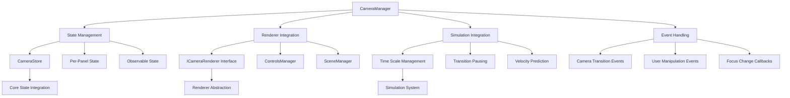
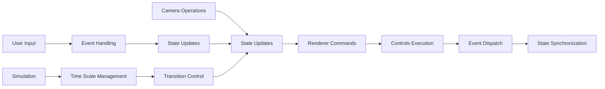

# Three.js Camera (`@teskooano/renderer-threejs-camera`)

High-level camera management system that provides object focusing, smooth transitions, state management, and integration with the simulation system for immersive 3D space exploration.

## 🎯 Purpose

The `@teskooano/renderer-threejs-camera` package provides comprehensive camera management functionality for the Teskooano Three.js scene. It handles high-level camera operations including object focusing with smooth transitions, camera positioning and targeting, Field of View (FOV) management, and integration with the simulation system. The package uses interface-based design to avoid circular dependencies and delegates state management to the core-state system for consistency and per-panel support.

## 🏗️ Architecture

The camera system follows a high-level orchestration pattern with interface-based renderer integration and centralized state management.



## 🚀 Core Features

### 1. High-Level Camera Operations

- **Object Focusing**: Smooth camera transitions to focus on celestial objects
- **Camera Positioning**: Programmatic camera positioning and targeting
- **FOV Management**: Dynamic Field of View adjustment
- **View Reset**: Reset camera to default position and target
- **Camera Pointing**: Point camera towards specific target positions

### 2. State Management Integration

- **Core-State Integration**: Delegates state management to CameraStore
- **Per-Panel Support**: Each engine panel has its own camera state instance
- **Observable State**: Provides BehaviorSubject stream for reactive updates
- **State Synchronization**: Keeps camera state synchronized across components

### 3. Simulation Integration

- **Transition Pausing**: Temporarily adjusts simulation time scale during transitions
- **Velocity Prediction**: Predicts object position over transition time to reduce snapping
- **Smooth Following**: Maintains smooth camera following during object movement
- **Time Scale Management**: Intelligent time scale adjustment for optimal UX

### 4. Interface-Based Design

- **Renderer Abstraction**: Uses ICameraRenderer interface to avoid circular dependencies
- **Flexible Integration**: Works with any renderer implementing the interface
- **Dependency Injection**: Accepts renderer instance through setDependencies
- **Type Safety**: Consistent CameraState interface across all packages

## 🔧 Key Components

### `CameraManager`

**Purpose**: Central high-level manager for all camera operations and state management.

**Key Responsibilities:**

- High-level camera operations (focus, position, FOV)
- State delegation to core-state CameraStore
- Simulation integration and transition management
- Event handling and focus change callbacks
- Renderer abstraction through ICameraRenderer interface

## 🔄 Data Flow

The camera system follows a systematic data flow for managing camera operations:



### Processing Pipeline

1. **Camera Operations**: High-level operations like followObject or setFov
2. **State Updates**: Updates to CameraStore via core-state
3. **Renderer Commands**: Commands sent to renderer via ICameraRenderer interface
4. **Controls Execution**: Low-level controls execution by ControlsManager
5. **Event Dispatch**: Events dispatched for state synchronization
6. **State Synchronization**: Final state updates and callback execution

## 📊 Technical Specifications

### Interface Definitions

```typescript
interface ICameraRenderer {
  camera: THREE.PerspectiveCamera;
  interactionOrchestrator: {
    getControlsManager(): ControlsManager;
  };
  renderingOrchestrator: {
    sceneManager: SceneManager;
    objectManager: ObjectManager;
    orbitManager: OrbitManager;
  };
}

interface CameraManagerOptions {
  renderer: ICameraRenderer;
  panelId: string;
  initialFov?: number;
  initialCameraPosition?: OSVector3;
  initialCameraTarget?: OSVector3;
  initialFocusedObjectId?: string | null;
  onFocusChangeCallback?: (focusedObjectId: string | null) => void;
}

interface CameraState {
  position: OSVector3;
  target: OSVector3;
  fov: number;
  selectedObject: string | null;
  focusedObjectId: string | null;
}
```

### Configuration Constants

```typescript
const CAMERA_OFFSET = new OSVector3(0.8, 0.4, 1.0).normalize();
const DEFAULT_CAMERA_POSITION = new OSVector3(200, 200, 200);
const DEFAULT_CAMERA_TARGET = new OSVector3(0, 0, 0);
const DEFAULT_CAMERA_DISTANCE = 1;
const DEFAULT_FOV = 75;
```

## 💡 Usage Examples

### Basic Camera Setup

```typescript
import { CameraManager } from "@teskooano/renderer-threejs-camera";
import type { ICameraRenderer } from "@teskooano/data-types";

// Create camera manager
const cameraManager = new CameraManager();

// Set up dependencies
cameraManager.setDependencies({
  renderer: rendererInstance, // Must implement ICameraRenderer
  panelId: "panel-123",
  initialFov: 75,
  onFocusChangeCallback: (objectId) => {
    console.log(`Focused on: ${objectId}`);
  },
});

// Get camera state updates
const cameraState$ = cameraManager.getCameraState$();
cameraState$.subscribe((state) => {
  console.log(`Camera position: ${state.position}`);
  console.log(`Focused object: ${state.focusedObjectId}`);
});
```

### Object Focusing with Smooth Transitions

```typescript
// Focus on a celestial object with smooth transition
cameraManager.followObject("earth");

// Focus with custom distance
cameraManager.followObject("mars", 2.0);

// Clear focus and reset to default view
cameraManager.clearFocus();
```

### Camera Positioning and FOV

```typescript
// Point camera at specific position
const targetPosition = new THREE.Vector3(100, 50, 200);
cameraManager.pointCameraAt(targetPosition);

// Set Field of View
cameraManager.setFov(90);

// Reset camera to default view
cameraManager.resetCameraView();
```

### Advanced Integration

```typescript
// Initialize camera position after renderer setup
cameraManager.initializeCameraPosition();

// Handle focus changes
cameraManager.setDependencies({
  renderer: rendererInstance,
  panelId: "panel-123",
  onFocusChangeCallback: (focusedObjectId) => {
    if (focusedObjectId) {
      // Update UI to show focused object
      updateObjectInfoPanel(focusedObjectId);
    } else {
      // Clear object info panel
      clearObjectInfoPanel();
    }
  },
});

// Clean up when done
cameraManager.destroy();
```

## ⚡ Performance Considerations

### Efficiency

- **Interface-Based Design**: Minimal overhead from renderer abstraction
- **State Delegation**: Efficient state management through core-state
- **Event-Driven Updates**: Reactive updates without polling
- **Transition Optimization**: Intelligent time scale management during transitions

### Quality Metrics

- **Smooth Transitions**: High-quality camera movements with velocity prediction
- **Responsive UI**: Maintains 60 FPS during camera operations
- **State Consistency**: Reliable state synchronization across components
- **Memory Efficiency**: Proper cleanup and resource management

### Performance Monitoring

- **Transition Performance**: Tracks camera transition smoothness
- **State Update Performance**: Monitors state synchronization performance
- **Memory Usage**: Tracks camera manager memory consumption
- **Event Processing**: Monitors event handling performance

## 🔌 Integration Points

### Core State Integration

- **CameraStore**: Uses core-state CameraStore for state management
- **Per-Panel State**: Each panel has its own camera state instance
- **State Synchronization**: Keeps state synchronized across components
- **Observable Streams**: Provides reactive state updates

### Renderer Integration

- **ICameraRenderer Interface**: Works with any compatible renderer
- **ControlsManager**: Integrates with low-level camera controls
- **SceneManager**: Coordinates with scene management
- **ObjectManager**: Accesses renderable objects for focusing

### Simulation Integration

- **Time Scale Management**: Adjusts simulation speed during transitions
- **Velocity Prediction**: Predicts object movement for smooth following
- **Transition Pausing**: Prevents fast-moving objects from moving too far
- **State Coordination**: Coordinates with simulation state

## 🐛 Debug Features

### Validation

- **Renderer Validation**: Ensures renderer implements required interface
- **State Validation**: Validates camera state consistency
- **Parameter Validation**: Validates method parameters and options
- **Dependency Validation**: Ensures all dependencies are properly set

### Monitoring

- **State Monitoring**: Tracks camera state changes and updates
- **Transition Monitoring**: Monitors camera transition performance
- **Event Monitoring**: Tracks event handling and processing
- **Memory Monitoring**: Monitors resource usage and cleanup

### Debugging Tools

- **State Inspection**: Access to current camera state for debugging
- **Event Logging**: Comprehensive event logging for troubleshooting
- **Transition Debugging**: Debug information for camera transitions
- **Performance Metrics**: Performance monitoring and optimization tools

## 🔮 Future Enhancements

### Optimization Opportunities

- **Performance Optimization**: Further transition and state update optimizations
- **Memory Optimization**: Advanced memory management and cleanup strategies
- **Code Optimization**: Additional algorithmic improvements for camera operations
- **Architecture Optimization**: Enhanced modular architecture and interface design

### Potential Improvements

- **Advanced Transitions**: More sophisticated camera transition algorithms
- **Dynamic FOV**: Automatic FOV adjustment based on object size and distance
- **Multi-Camera Support**: Support for multiple camera instances and views
- **Advanced Following**: Enhanced object following with predictive algorithms

## Dependencies

### Core Dependencies

- **@teskooano/core-state**: State management and CameraStore integration
- **@teskooano/core-math**: Vector math operations with OSVector3
- **@teskooano/data-types**: Interface definitions and type safety
- **@teskooano/renderer-threejs**: Renderer integration and controls
- **@teskooano/renderer-threejs-helpers**: Camera utility functions
- **@teskooano/notifications**: Transition progress notifications
- **three**: Three.js rendering engine and 3D graphics
- **rxjs**: Reactive programming with Observable streams

### Development Dependencies

- **typescript**: Type safety and modern JavaScript features
- **vitest**: Testing framework with browser support
- **@vitest/browser**: Browser testing capabilities
- **@playwright/test**: End-to-end testing
- **eslint**: Code quality and consistency

## 📚 Documentation Structure

### Core Components

- [[CameraManager]] - Central camera management and orchestration

### Constants

- **CAMERA_OFFSET**: Default camera position offset for object focusing
- **DEFAULT_CAMERA_POSITION**: Default camera position
- **DEFAULT_CAMERA_TARGET**: Default camera target point
- **DEFAULT_CAMERA_DISTANCE**: Default distance multiplier
- **DEFAULT_FOV**: Default Field of View in degrees

## 🔄 Quick Navigation

### By Component Type

- **Manager Classes**: [[CameraManager]]

### By Architecture Pattern

- **Interface Pattern**: ICameraRenderer for renderer abstraction
- **State Management**: Core-state integration for centralized state
- **Event-Driven**: Event-based communication with controls system

## 🚀 Getting Started

1. Start with [[CameraManager]] to understand the main camera management system
2. Review the ICameraRenderer interface for renderer integration
3. Check out the core-state integration for state management
4. Explore the simulation integration for advanced features

## 📚 Related Documentation

- [[@teskooano/core-state]] - State management and CameraStore
- [[@teskooano/core-math]] - Vector math operations
- [[@teskooano/data-types]] - Interface definitions and types
- [[@teskooano/renderer-threejs-controls]] - Low-level camera controls
- [[@teskooano/renderer-threejs-helpers]] - Camera utility functions
