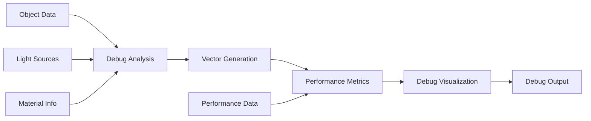

---
aliases:
  [CelestialRendererDebugHelper, debug-helper, celestial-debug, renderer-debug]
tags:
  [
    renderer,
    threejs,
    celestial,
    debug,
    helper,
    debugging,
    development,
    diagnostics,
  ]
type: Class
package: "@teskooano/renderer-threejs-celestial"
name: CelestialRendererDebugHelper
dependencies: ["@teskooano/data-types", "three"]
classes: ["THREE.Vector3", "THREE.Color", "THREE.Material"]
functions: []
constants: []
types: ["RenderableCelestialObject", "LightSourcesMap", "MaterialDebugData"]
status: active
---

# CelestialRendererDebugHelper

Comprehensive debugging support for celestial renderers, providing detailed diagnostics, performance monitoring, and development tools for troubleshooting rendering issues.

## 🎯 Purpose

The `CelestialRendererDebugHelper` provides comprehensive debugging support for celestial renderers:

- **Debug Diagnostics**: Detailed diagnostics for rendering issues
- **Performance Monitoring**: Performance monitoring and analysis
- **Material Debugging**: Material and shader debugging support
- **Lighting Debugging**: Lighting system debugging and visualization
- **Development Tools**: Development and troubleshooting tools

## 🏗️ Architecture

### Debug State Management

Maintains comprehensive debug state including:

- **Debug Vectors**: Debug vectors for visualization
- **Performance Metrics**: Performance monitoring data
- **Material Information**: Material and shader information
- **Lighting Data**: Lighting system debugging data

### Debug Visualization

Provides debug visualization capabilities:

- **Vector Visualization**: Debug vector visualization
- **Performance Overlays**: Performance metric overlays
- **Material Inspection**: Material property inspection
- **Lighting Visualization**: Lighting system visualization

## 🔧 Core Methods

### Debug Vector Management

```typescript
// Update debug vectors
updateDebugVectors(
  object: RenderableCelestialObject,
  lightSources?: LightSourcesMap
): void;

// Clear debug vectors
clearDebugVectors(): void;
```

### Orbital Debug Data

```typescript
// Update orbital debug data
updateOrbitalDebugData(object: RenderableCelestialObject): void;
```

### Physics Debug Data

```typescript
// Update physics debug data
updatePhysicsDebugData(object: RenderableCelestialObject): void;
```

### Material Debug Data

```typescript
// Update material debug data
updateMaterialDebugData(materialInfo: MaterialDebugData): void;
```

### Lighting Debug Data

```typescript
// Update lighting debug data
updateLightingDebugData(
  object: RenderableCelestialObject,
  lightSources?: LightSourcesMap
): void;
```

### Comprehensive Debug Updates

```typescript
// Update all debug data
updateAllDebugData(
  object: RenderableCelestialObject,
  lightSources?: LightSourcesMap
): void;
```

### Debug State Management

```typescript
// Set debug enabled state
setDebugEnabled(enabled: boolean): void;

// Check if debug is enabled
isDebugEnabled(): boolean;
```

## 🔄 Data Flow

The CelestialRendererDebugHelper follows a systematic data flow:



### Processing Pipeline

1. **Object Data**: Input celestial object data
2. **Debug Analysis**: Analyze object for debugging information
3. **Vector Generation**: Generate debug vectors for visualization
4. **Performance Metrics**: Collect performance metrics
5. **Debug Visualization**: Create debug visualizations
6. **Debug Output**: Output debug information

## 📊 Technical Specifications

### Debug Vector Structure

```typescript
interface DebugVector {
  start: THREE.Vector3;
  end: THREE.Vector3;
  color: THREE.Color;
  name: string;
}
```

### Material Debug Data

```typescript
interface MaterialDebugData {
  materialId: string;
  materialType: string;
  uniforms: Record<string, any>;
  textures: Record<string, string>;
  properties: Record<string, any>;
}
```

### Debug State

```typescript
class CelestialRendererDebugHelper {
  private _debugEnabled: boolean = false;
  private _objectId: string;
  private debugVectors: DebugVector[] = [];
  private performanceMetrics: PerformanceMetrics = {};
  private materialInfo: MaterialDebugData[] = [];
  private lightingData: LightingDebugData = {};
}
```

## 💡 Usage Examples

### Basic Usage

```typescript
import { CelestialRendererDebugHelper } from "@teskooano/renderer-threejs-celestial";

// Create debug helper for celestial object
const debugHelper = new CelestialRendererDebugHelper("celestial-object-001");

// Enable debug mode
debugHelper.setDebugEnabled(true);

// Update debug data
debugHelper.updateAllDebugData(celestialObject, lightSources);

// Check debug status
if (debugHelper.isDebugEnabled()) {
  console.log("Debug mode is enabled");
}
```

### Advanced Usage

```typescript
// Create debug helper
const debugHelper = new CelestialRendererDebugHelper("star-001");

// Enable debug mode
debugHelper.setDebugEnabled(true);

// Update specific debug data
debugHelper.updateDebugVectors(celestialObject, lightSources);
debugHelper.updateOrbitalDebugData(celestialObject);
debugHelper.updatePhysicsDebugData(celestialObject);
debugHelper.updateLightingDebugData(celestialObject, lightSources);

// Update material debug data
const materialInfo: MaterialDebugData = {
  materialId: "star-material",
  materialType: "MeshStandardMaterial",
  uniforms: {
    color: { value: new THREE.Color(1, 1, 0.8) },
    intensity: { value: 1.0 },
  },
  textures: {
    map: "star-texture.jpg",
  },
  properties: {
    roughness: 0.8,
    metalness: 0.2,
  },
};

debugHelper.updateMaterialDebugData(materialInfo);

// Clear debug data
debugHelper.clearDebugVectors();
```

### Integration with BaseCelestialRenderer

```typescript
class MyCelestialRenderer extends BaseCelestialRenderer {
  private debugHelper: CelestialRendererDebugHelper;

  constructor(object: RenderableCelestialObject) {
    super(object);

    // Create debug helper
    this.debugHelper = new CelestialRendererDebugHelper(object.id);
  }

  update(
    object: RenderableCelestialObject,
    lightSources: LightSourcesMap,
  ): void {
    // Call parent update
    super.update(object, lightSources);

    // Update debug data if debug is enabled
    if (this.debugHelper.isDebugEnabled()) {
      this.debugHelper.updateAllDebugData(object, lightSources);
    }
  }

  // Debug methods
  enableDebug(): void {
    this.debugHelper.setDebugEnabled(true);
  }

  disableDebug(): void {
    this.debugHelper.setDebugEnabled(false);
  }

  getDebugVectors(): DebugVector[] {
    return this.debugHelper.debugVectors;
  }

  getPerformanceMetrics(): PerformanceMetrics {
    return this.debugHelper.performanceMetrics;
  }

  getMaterialInfo(): MaterialDebugData[] {
    return this.debugHelper.materialInfo;
  }

  dispose(): void {
    // Dispose debug helper
    this.debugHelper.dispose();

    // Call parent dispose
    super.dispose();
  }
}
```

## ⚡ Performance Considerations

### Efficiency

- **Conditional Updates**: Debug updates only when debug mode is enabled
- **Efficient Data Collection**: Efficient collection of debug data
- **Minimal Overhead**: Minimal performance overhead when debug is disabled
- **Memory Management**: Efficient memory management for debug data

### Quality Metrics

- **Debug Accuracy**: Accurate debug information and diagnostics
- **Performance Impact**: Minimal performance impact on rendering
- **Memory Usage**: Efficient memory usage for debug data
- **Debug Completeness**: Comprehensive debug information

### Performance Monitoring

- **Debug Overhead**: Monitor debug system performance impact
- **Memory Usage**: Track memory usage for debug data
- **Update Frequency**: Monitor debug update frequency
- **Debug Effectiveness**: Track debug system effectiveness

## 🔌 Integration Points

### Primary Integration

- **BaseCelestialRenderer**: Automatic debug support for all renderers
- **Debug Systems**: Integration with debug and development systems
- **Performance Monitoring**: Integration with performance monitoring

### Secondary Integration

- **Material System**: Integration with material and shader systems
- **Lighting System**: Integration with lighting systems
- **Physics System**: Integration with physics systems

## 🐛 Debug Features

### Validation

- **Debug Data Validation**: Validates debug data integrity
- **Performance Validation**: Validates performance monitoring data
- **Material Validation**: Validates material debug information
- **Lighting Validation**: Validates lighting debug data

### Monitoring

- **Debug Stats**: Tracks debug system statistics
- **Performance Stats**: Monitors debug performance impact
- **Memory Stats**: Monitors memory usage for debug data
- **Debug Effectiveness**: Tracks debug system effectiveness

### Debugging Tools

- **Debug Info**: Get detailed debug information
- **Performance Info**: Get performance monitoring information
- **Material Info**: Get material debug information
- **Lighting Info**: Get lighting debug information

## 🔮 Future Enhancements

### Optimization Opportunities

- **Debug Caching**: Cache debug data for better performance
- **Selective Debugging**: Selective debug data collection
- **Memory Optimization**: Optimize memory usage for debug data
- **Performance Profiling**: Enhanced performance monitoring

### Potential Improvements

- **Advanced Visualization**: More sophisticated debug visualizations
- **Interactive Debugging**: Interactive debug tools and interfaces
- **Debug Export**: Export debug data for analysis
- **Advanced Diagnostics**: More sophisticated diagnostic tools

## 📚 Architecture Patterns

- **Helper Pattern**: Specialized helper for debugging
- **State Pattern**: Debug state management
- **Observer Pattern**: Debug state change notifications
- **Integration Pattern**: Seamless integration with renderer systems

## 📚 Related Documentation

- [[BaseCelestialRenderer]] - Uses this helper for debugging support
- [[Debug Systems]] - Overall debug system architecture
- [[Performance Monitoring]] - Performance monitoring and analysis
- [[Development Tools]] - Development and troubleshooting tools

---

_The CelestialRendererDebugHelper provides comprehensive debugging support with detailed diagnostics, performance monitoring, and development tools for troubleshooting rendering issues and optimizing performance._
