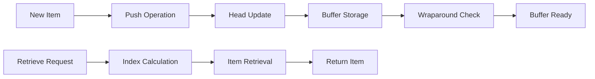

# CircularBuffer

Memory-efficient circular buffer implementation for storing position history and orbital data in celestial renderers, providing constant-time access and automatic memory management.

## 🎯 Purpose

The `CircularBuffer` provides efficient data storage for celestial renderers:

- **Memory Efficiency**: Prevents memory leaks by using fixed-size circular buffer
- **Constant-time Access**: O(1) access time for recent data
- **Automatic Wraparound**: Automatic wraparound when buffer is full
- **Position History**: Optimized for storing position history and orbital data
- **Performance Optimization**: Minimal memory allocations and efficient operations

## 🏗️ Architecture

### Circular Buffer Implementation

Uses a fixed-size array with head and tail pointers to implement efficient circular buffer:

- **Fixed Size**: Pre-allocated buffer size prevents memory growth
- **Head/Tail Pointers**: Efficient insertion and retrieval
- **Automatic Wraparound**: Seamless wraparound when buffer is full
- **Type Safety**: Generic implementation for different data types

### Memory Management

Implements efficient memory management:

- **Pre-allocation**: Buffer pre-allocated to prevent runtime allocations
- **No Garbage Collection**: Minimal garbage collection impact
- **Memory Bounds**: Fixed memory usage regardless of data size

## 🔧 Core Methods

### Buffer Operations

```typescript
// Add item to buffer
push(item: T): void;

// Get item at index
get(index: number): T | undefined;

// Get all items in buffer
getAll(): T[];

// Get items in reverse order (most recent first)
getAllReverse(): T[];

// Get items within range
getRange(start: number, count: number): T[];

// Clear buffer
clear(): void;
```

### Buffer Information

```typescript
// Get buffer size
getSize(): number;

// Get current count
getCount(): number;

// Check if buffer is full
isFull(): boolean;

// Check if buffer is empty
isEmpty(): boolean;

// Get head index
getHeadIndex(): number;

// Get tail index
getTailIndex(): number;
```

### Buffer Statistics

```typescript
// Get buffer statistics
getStats(): {
  size: number;
  count: number;
  headIndex: number;
  tailIndex: number;
  isFull: boolean;
  isEmpty: boolean;
};
```

## 🔄 Data Flow

The CircularBuffer follows a systematic data flow:



### Processing Pipeline

1. **New Item**: New item to be stored
2. **Push Operation**: Add item to buffer
3. **Head Update**: Update head pointer
4. **Buffer Storage**: Store item in buffer
5. **Wraparound Check**: Check if wraparound is needed
6. **Buffer Ready**: Buffer ready for next operation

## 📊 Technical Specifications

### Buffer Structure

```typescript
class CircularBuffer<T> {
  private buffer: T[];
  private head: number = 0;
  private tail: number = 0;
  private count: number = 0;
  private readonly size: number;
}
```

### Push Operation

```typescript
push(item: T): void {
  this.buffer[this.head] = item;
  this.head = (this.head + 1) % this.size;

  if (this.count < this.size) {
    this.count++;
  } else {
    this.tail = (this.tail + 1) % this.size;
  }
}
```

### Get Operation

```typescript
get(index: number): T | undefined {
  if (index < 0 || index >= this.count) {
    return undefined;
  }

  const actualIndex = (this.tail + index) % this.size;
  return this.buffer[actualIndex];
}
```

### Range Retrieval

```typescript
getRange(start: number, count: number): T[] {
  const result: T[] = [];
  const end = Math.min(start + count, this.count);

  for (let i = start; i < end; i++) {
    const item = this.get(i);
    if (item !== undefined) {
      result.push(item);
    }
  }

  return result;
}
```

## 💡 Usage Examples

### Basic Usage

```typescript
import { CircularBuffer } from "@teskooano/renderer-threejs-celestial";

// Create circular buffer for position history
const positionBuffer = new CircularBuffer<TimePoint>(1000);

// Add position data
positionBuffer.push({
  position: new THREE.Vector3(1000, 0, 0),
  velocity: new THREE.Vector3(0, 100, 0),
  timestamp: Date.now(),
});

// Get recent position
const recentPosition = positionBuffer.get(0);
console.log("Recent position:", recentPosition);

// Get all positions
const allPositions = positionBuffer.getAll();
console.log("All positions:", allPositions.length);

// Get buffer statistics
const stats = positionBuffer.getStats();
console.log("Buffer stats:", stats);
```

### Advanced Usage

```typescript
// Create buffer with custom size
const buffer = new CircularBuffer<string>(100);

// Add multiple items
for (let i = 0; i < 150; i++) {
  buffer.push(`Item ${i}`);
}

// Check buffer status
console.log("Buffer size:", buffer.getSize());
console.log("Buffer count:", buffer.getCount());
console.log("Buffer full:", buffer.isFull());

// Get items in reverse order (most recent first)
const recentItems = buffer.getAllReverse();
console.log("Recent items:", recentItems.slice(0, 5));

// Get specific range
const rangeItems = buffer.getRange(0, 10);
console.log("Range items:", rangeItems);

// Get specific item
const item = buffer.get(50);
console.log("Item at index 50:", item);

// Clear buffer
buffer.clear();
console.log("Buffer cleared, count:", buffer.getCount());
```

### Integration with PositionHistoryManager

```typescript
class PositionHistoryManager {
  private positionHistory: CircularBuffer<TimePoint>;

  constructor(objectId: string, config: Partial<OrbitalConfig> = {}) {
    this.positionHistory = new CircularBuffer<TimePoint>(
      config.maxHistoryPoints || 1000,
    );
  }

  addPositionSample(object: RenderableCelestialObject, time: number): void {
    const timePoint: TimePoint = {
      position: object.position.clone(),
      velocity: object.velocity.clone(),
      timestamp: time,
    };

    this.positionHistory.push(timePoint);
  }

  getPositionHistory(maxPoints: number = 0): OSVector3[] {
    const count =
      maxPoints > 0
        ? Math.min(maxPoints, this.positionHistory.getCount())
        : this.positionHistory.getCount();
    const timePoints = this.positionHistory.getRange(0, count);

    return timePoints.map((tp) => tp.position);
  }

  getPositionHistoryWithTimestamps(maxPoints: number = 0): TimePoint[] {
    const count =
      maxPoints > 0
        ? Math.min(maxPoints, this.positionHistory.getCount())
        : this.positionHistory.getCount();
    return this.positionHistory.getRange(0, count);
  }

  getMemoryStats(): {
    historySize: number;
    maxHistoryPoints: number;
    memoryUsage: number;
  } {
    const stats = this.positionHistory.getStats();
    return {
      historySize: stats.count,
      maxHistoryPoints: stats.size,
      memoryUsage: stats.count * 24, // Approximate bytes per TimePoint
    };
  }
}
```

## ⚡ Performance Considerations

### Efficiency

- **Constant-time Operations**: O(1) push and get operations
- **Memory Efficiency**: Fixed memory usage regardless of data size
- **No Garbage Collection**: Minimal garbage collection impact
- **Pre-allocation**: Pre-allocated buffer prevents runtime allocations

### Quality Metrics

- **Memory Safety**: Prevents memory leaks through fixed-size buffer
- **Performance**: Minimal performance impact on rendering
- **Reliability**: Robust buffer operations with bounds checking
- **Scalability**: Efficient handling of large amounts of data

### Performance Monitoring

- **Buffer Usage**: Monitor buffer usage and efficiency
- **Memory Usage**: Track memory usage for buffer operations
- **Operation Performance**: Monitor push and get operation performance
- **Wraparound Frequency**: Track wraparound frequency

## 🔌 Integration Points

### Primary Integration

- **PositionHistoryManager**: Core data structure for position history
- **BaseCelestialRenderer**: Integration with orbital data management
- **Orbital Systems**: Integration with orbital data systems

### Secondary Integration

- **Memory Management**: Integration with memory management systems
- **Performance Monitoring**: Integration with performance monitoring
- **Data Management**: Integration with data management systems

## 🐛 Debug Features

### Validation

- **Bounds Validation**: Validates buffer bounds and indices
- **Data Validation**: Validates data integrity
- **State Validation**: Validates buffer state consistency
- **Operation Validation**: Validates buffer operations

### Monitoring

- **Buffer Stats**: Tracks buffer statistics and usage
- **Memory Stats**: Monitors memory usage for buffer operations
- **Performance Stats**: Monitors buffer operation performance
- **Usage Stats**: Tracks buffer usage patterns

### Debugging Tools

- **Buffer Info**: Get detailed buffer information
- **Memory Info**: Get memory usage information
- **Performance Info**: Get performance statistics
- **State Info**: Get buffer state information

## 🔮 Future Enhancements

### Optimization Opportunities

- **Memory Pooling**: Reuse buffer instances to reduce allocations
- **Advanced Indexing**: More sophisticated indexing for better performance
- **Compression**: Compress data for better memory usage
- **Performance Profiling**: Enhanced performance monitoring

### Potential Improvements

- **Multi-threaded Operations**: Parallel buffer operations for better performance
- **Advanced Data Types**: Support for more complex data types
- **Dynamic Sizing**: Dynamic buffer sizing based on usage patterns
- **Advanced Validation**: More sophisticated validation and error handling

## 📚 Architecture Patterns

- **Data Structure Pattern**: Efficient data structure implementation
- **Memory Management Pattern**: Efficient memory management
- **Performance Pattern**: Performance-optimized operations
- **Integration Pattern**: Seamless integration with data management systems

## 📚 Related Documentation

- [[PositionHistoryManager]] - Uses this buffer for position history storage
- [[BaseCelestialRenderer]] - Integration with orbital data management
- [[Orbital Systems]] - Integration with orbital data systems
- [[Memory Management]] - Memory management strategies

---

_The CircularBuffer provides efficient, memory-safe data storage with constant-time operations, automatic memory management, and seamless integration with position history and orbital data systems._
