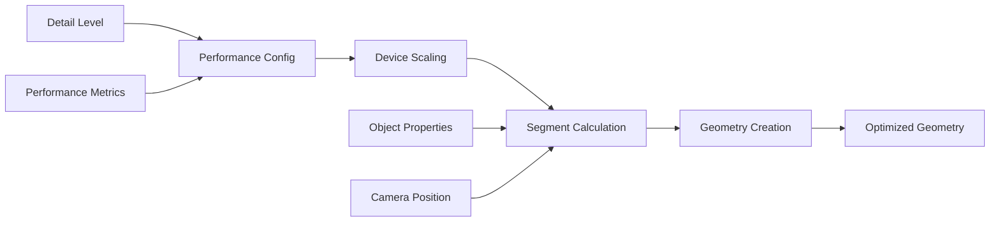

---
aliases:
  [
    GeometryUtilities,
    geometry-utilities,
    geometry-optimization,
    performance-geometry,
  ]
tags:
  [
    renderer,
    threejs,
    celestial,
    utilities,
    geometry,
    performance,
    optimization,
    device-detection,
  ]
type: Class
package: "@teskooano/renderer-threejs-celestial"
name: GeometryUtilities
dependencies:
  ["@teskooano/data-types", "@teskooano/renderer-threejs-lod", "three"]
classes:
  [
    "THREE.SphereGeometry",
    "THREE.PlaneGeometry",
    "THREE.RingGeometry",
    "THREE.Box3",
    "THREE.Sphere",
  ]
functions: []
constants: []
types:
  [
    "RenderableCelestialObject",
    "DetailLevel",
    "DeviceTier",
    "PerformanceConfig",
  ]
status: active
---

# GeometryUtilities

Performance-optimized geometry utilities for celestial renderers, providing device-specific optimization, adaptive scaling, and efficient geometry creation.

## 🎯 Purpose

The `GeometryUtilities` provides comprehensive geometry optimization for celestial renderers:

- **Performance Optimization**: Device-specific geometry optimization
- **Adaptive Scaling**: Dynamic geometry scaling based on performance
- **Efficient Creation**: Optimized geometry creation with minimal overhead
- **Device Detection**: Integration with device capability detection
- **Quality Management**: Balance between quality and performance

## 🏗️ Architecture

### Static Utility Class

Provides static methods for geometry optimization and creation, ensuring consistent performance across all renderers.

### Performance Configuration

Integrates with performance monitoring to provide real-time geometry optimization based on current performance metrics.

### Device-Specific Optimization

Implements device-specific scaling factors to optimize geometry complexity for different hardware configurations.

## 🔧 Core Methods

### Performance Configuration

```typescript
// Update performance configuration
static updatePerformanceConfig(config: Partial<PerformanceConfig>): void;

// Get current performance configuration
static getPerformanceConfig(): PerformanceConfig;
```

### Segment Optimization

```typescript
// Get optimized segments for detail level
static getSegmentsForDetailLevel(
  detailLevel?: DetailLevel | string,
  defaultSegments: number = 32,
  object?: RenderableCelestialObject,
  camera?: THREE.PerspectiveCamera
): number;

// Get optimized high detail segments
static getOptimizedHighDetailSegments(
  detailLevel?: DetailLevel | string,
  defaultSegments: number = 128,
  object?: RenderableCelestialObject,
  camera?: THREE.PerspectiveCamera
): number;

// Get optimized ring segments
static getOptimizedRingSegments(
  detailLevel?: DetailLevel | string,
  defaultSegments: number = 128,
  object?: RenderableCelestialObject,
  camera?: THREE.PerspectiveCamera
): number;

// Get optimized star segments
static getOptimizedStarSegments(
  detailLevel?: DetailLevel | string,
  defaultSegments: number = 32,
  object?: RenderableCelestialObject,
  camera?: THREE.PerspectiveCamera
): number;

// Get optimized atmosphere segments
static getOptimizedAtmosphereSegments(
  detailLevel?: DetailLevel | string,
  defaultSegments: number = 48,
  object?: RenderableCelestialObject,
  camera?: THREE.PerspectiveCamera
): number;
```

### Position and Distance Utilities

```typescript
// Get world position of object
static getWorldPosition(object: RenderableCelestialObject): THREE.Vector3;

// Get distance between objects
static getDistanceBetweenObjects(
  object1: RenderableCelestialObject,
  object2: RenderableCelestialObject
): number;

// Get squared distance between objects
static getSquaredDistanceBetweenObjects(
  object1: RenderableCelestialObject,
  object2: RenderableCelestialObject
): number;
```

### Geometry Creation

```typescript
// Create optimized sphere geometry
static createSphereGeometry(
  radius: number,
  detailLevel?: DetailLevel | string
): THREE.SphereGeometry;

// Create optimized plane geometry
static createPlaneGeometry(
  width: number,
  height: number,
  detailLevel?: DetailLevel | string
): THREE.PlaneGeometry;

// Create optimized ring geometry
static createRingGeometry(
  innerRadius: number,
  outerRadius: number,
  detailLevel?: DetailLevel | string
): THREE.RingGeometry;
```

### Scaling and Bounding

```typescript
// Get scaled radius for detail level
static getScaledRadius(
  baseRadius: number,
  detailLevel?: DetailLevel | string
): number;

// Create bounding box for object
static createBoundingBox(
  object: RenderableCelestialObject,
  padding: number = 0
): THREE.Box3;

// Create bounding sphere for object
static createBoundingSphere(
  object: RenderableCelestialObject,
  padding: number = 0
): THREE.Sphere;

// Check if object is in view frustum
static isObjectInViewFrustum(
  object: RenderableCelestialObject,
  camera: THREE.PerspectiveCamera,
  padding: number = 0
): boolean;

// Get apparent angular size of object
static getApparentAngularSize(
  object: RenderableCelestialObject,
  camera: THREE.PerspectiveCamera
): number;
```

## 🔄 Data Flow

The GeometryUtilities follows a systematic data flow:



### Processing Pipeline

1. **Input**: Detail level, object properties, and camera position
2. **Performance Check**: Check current performance configuration
3. **Device Scaling**: Apply device-specific scaling factors
4. **Segment Calculation**: Calculate optimized segment count
5. **Geometry Creation**: Create optimized geometry
6. **Output**: Return optimized geometry with appropriate detail

## 📊 Technical Specifications

### Performance Configuration

```typescript
interface PerformanceConfig {
  targetFPS?: number;
  currentFPS?: number;
  enablePerformanceOptimization?: boolean;
  performanceReductionMultiplier?: number;
  minimumSegments?: number;
  deviceTier?: DeviceTier;
  enableAdaptiveScaling?: boolean;
  distanceReductionFactor?: number;
}
```

### Device Scaling Factors

```typescript
private static getDeviceSegmentMultiplier(): number {
  switch (this.performanceConfig.deviceTier) {
    case 'low':
      return 0.5; // Reduce segments for low-end devices
    case 'medium':
      return 0.75; // Moderate scaling for medium devices
    case 'high':
      return 1.0; // Full segments for high-end devices
    default:
      return 1.0;
  }
}
```

### Adaptive Scaling Algorithm

```typescript
private static getAdaptiveScalingFactor(
  object?: RenderableCelestialObject,
  camera?: THREE.PerspectiveCamera
): number {
  if (!object || !camera) return 1.0;

  const distance = camera.position.distanceTo(object.position);
  const objectRadius = object.radius || 1.0;
  const angularSize = (objectRadius * 2) / distance;

  // Reduce segments for distant objects
  if (angularSize < 0.01) return 0.5;
  if (angularSize < 0.1) return 0.75;
  return 1.0;
}
```

## 💡 Usage Examples

### Basic Usage

```typescript
import { GeometryUtilities } from "@teskooano/renderer-threejs-celestial";

// Get optimized segments for detail level
const segments = GeometryUtilities.getSegmentsForDetailLevel("high", 64);
console.log("Optimized segments:", segments);

// Create optimized sphere geometry
const sphereGeometry = GeometryUtilities.createSphereGeometry(
  1000, // radius
  "medium", // detail level
);

// Create optimized ring geometry
const ringGeometry = GeometryUtilities.createRingGeometry(
  1000, // inner radius
  2000, // outer radius
  "high", // detail level
);
```

### Advanced Usage

```typescript
// Update performance configuration
GeometryUtilities.updatePerformanceConfig({
  targetFPS: 60,
  currentFPS: 45,
  enablePerformanceOptimization: true,
  deviceTier: "medium",
  enableAdaptiveScaling: true,
});

// Get optimized segments with object and camera context
const segments = GeometryUtilities.getOptimizedHighDetailSegments(
  "high",
  128,
  celestialObject,
  camera,
);

// Get distance between objects
const distance = GeometryUtilities.getDistanceBetweenObjects(object1, object2);

// Check if object is in view frustum
const inView = GeometryUtilities.isObjectInViewFrustum(celestialObject, camera);

// Get apparent angular size
const angularSize = GeometryUtilities.getApparentAngularSize(
  celestialObject,
  camera,
);
```

### Integration with BaseCelestialRenderer

```typescript
class MyCelestialRenderer extends BaseCelestialRenderer {
  constructor(object: RenderableCelestialObject) {
    super(object);

    // Use geometry utilities for optimized geometry creation
    this.createOptimizedGeometry();
  }

  private createOptimizedGeometry(): void {
    // Create optimized sphere geometry
    const sphereGeometry = GeometryUtilities.createSphereGeometry(
      this.object.radius,
      "high",
    );

    // Create optimized ring geometry if object has rings
    if (this.object.properties.rings) {
      const ringGeometry = GeometryUtilities.createRingGeometry(
        this.object.properties.rings.innerRadius,
        this.object.properties.rings.outerRadius,
        "medium",
      );
    }
  }

  update(object: RenderableCelestialObject, camera: THREE.Camera): void {
    // Call parent update
    super.update(object, camera);

    // Update geometry based on camera distance
    this.updateGeometryOptimization(camera);
  }

  private updateGeometryOptimization(camera: THREE.PerspectiveCamera): void {
    // Get optimized segments based on current performance
    const segments = GeometryUtilities.getOptimizedHighDetailSegments(
      "high",
      128,
      this.object,
      camera,
    );

    // Update geometry if needed
    if (segments !== this.currentSegments) {
      this.updateGeometry(segments);
      this.currentSegments = segments;
    }
  }
}
```

## ⚡ Performance Considerations

### Efficiency

- **Static Methods**: No instance overhead for utility functions
- **Cached Calculations**: Performance calculations cached for efficiency
- **Device Optimization**: Device-specific optimization for optimal performance
- **Adaptive Scaling**: Dynamic scaling based on performance metrics

### Quality Metrics

- **Performance Balance**: Optimal balance between quality and performance
- **Device Adaptation**: Automatic adaptation to device capabilities
- **Smooth Scaling**: Smooth transitions between detail levels
- **Memory Efficiency**: Efficient geometry creation and management

### Performance Monitoring

- **Segment Count**: Track optimized segment counts
- **Performance Impact**: Monitor performance impact of geometry optimization
- **Device Scaling**: Monitor device-specific scaling effectiveness
- **Memory Usage**: Track geometry memory usage

## 🔌 Integration Points

### Primary Integration

- **BaseCelestialRenderer**: Automatic geometry optimization for all renderers
- **Performance Monitoring**: Integration with performance monitoring systems
- **Device Detection**: Integration with device capability detection

### Secondary Integration

- **Three.js Geometry**: Direct integration with Three.js geometry system
- **Camera System**: Integration with camera management for view frustum culling
- **State Management**: Integration with state management for performance config

## 🐛 Debug Features

### Validation

- **Geometry Validation**: Validates geometry creation parameters
- **Performance Validation**: Validates performance configuration
- **Device Validation**: Validates device tier settings
- **Segment Validation**: Validates segment count calculations

### Monitoring

- **Performance Stats**: Tracks performance optimization statistics
- **Geometry Stats**: Monitors geometry creation statistics
- **Device Scaling**: Monitors device-specific scaling
- **Memory Usage**: Tracks geometry memory usage

### Debugging Tools

- **Performance Info**: Get detailed performance information
- **Geometry Stats**: Get geometry creation statistics
- **Device Info**: Get device capability information
- **Optimization Stats**: Get optimization effectiveness statistics

## 🔮 Future Enhancements

### Optimization Opportunities

- **Predictive Optimization**: Predict geometry needs for better performance
- **Dynamic LOD**: Real-time LOD adjustment based on performance
- **Memory Pooling**: Reuse geometry objects to reduce allocations
- **Advanced Scaling**: More sophisticated scaling algorithms

### Potential Improvements

- **Multi-threaded Creation**: Parallel geometry creation for better performance
- **Advanced Culling**: More sophisticated view frustum culling
- **Geometry Compression**: Compress geometry data for better memory usage
- **Performance Profiling**: Enhanced performance monitoring and profiling

## 📚 Architecture Patterns

- **Utility Pattern**: Static utility methods for common operations
- **Strategy Pattern**: Device-specific optimization strategies
- **Performance Pattern**: Performance-based optimization
- **Factory Pattern**: Geometry creation and optimization

## 📚 Related Documentation

- [[BaseCelestialRenderer]] - Uses these utilities for geometry optimization
- [[Performance Optimization]] - Performance optimization strategies
- [[Device Detection]] - Device capability detection
- [[LODManager]] - Level of Detail management

---

_The GeometryUtilities provides comprehensive geometry optimization with device-specific scaling, adaptive performance optimization, and efficient geometry creation for optimal rendering performance across all hardware configurations._
