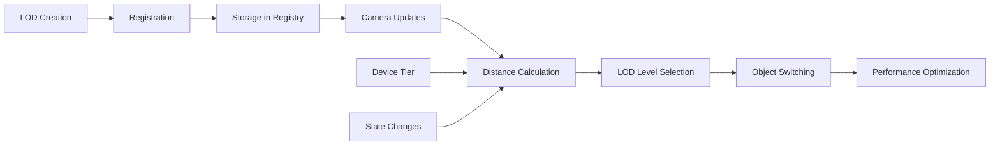

# LODManager

Centralized Level of Detail (LOD) management for celestial renderers, providing automatic LOD switching, performance optimization, and device-specific scaling.

## 🎯 Purpose

The `LODManager` provides comprehensive LOD management for celestial renderers:

- **LOD Management**: Centralized management of Level of Detail objects
- **Performance Optimization**: Automatic LOD switching based on camera distance
- **Device Adaptation**: Device-specific LOD scaling for optimal performance
- **State Integration**: Integration with global state management
- **Resource Management**: Automatic cleanup and disposal of LOD objects

## 🏗️ Architecture

### State Integration

Extends `StateSubscriptionMixin` to integrate with global state management for device tier and performance optimization settings.

### LOD Registry

Uses a Map-based registry to track all LOD objects associated with celestial objects.

### Performance Scaling

Implements device-specific scaling factors to optimize performance across different hardware configurations.

## 🔧 Core Methods

### LOD Creation and Registration

```typescript
// Create and register LOD object
createAndRegisterLOD(
  object: RenderableCelestialObject,
  levels: LODLevel[]
): THREE.LOD;

// Register existing LOD object
registerLOD(objectId: string, lod: THREE.LOD): void;
```

### LOD Retrieval

```typescript
// Get LOD by object ID
getLOD(objectId: string): THREE.LOD | undefined;

// Get LOD for celestial object
getLODForObject(object: RenderableCelestialObject): THREE.LOD | undefined;
```

### LOD Updates

```typescript
// Update LOD for specific object
updateLOD(objectId: string, camera: THREE.PerspectiveCamera): boolean;

// Update LOD for celestial object
updateObjectLOD(
  object: RenderableCelestialObject,
  camera: THREE.PerspectiveCamera
): boolean;

// Update all LODs
update(camera: THREE.PerspectiveCamera): void;
```

### LOD Calculations

```typescript
// Calculate LOD level based on distance
calculateLODLevel(distance: number, objectRadius: number): number;

// Get current LOD level for object
getCurrentLODLevel(
  object: RenderableCelestialObject,
  camera: THREE.PerspectiveCamera
): number | null;

// Get current LOD level index
getCurrentLODLevelIndex(objectId: string): number | undefined;
```

### Resource Management

```typescript
// Remove LOD object
removeLOD(objectId: string): boolean;

// Remove object from manager
remove(objectId: string): void;

// Check if LOD exists
hasLOD(objectId: string): boolean;

// Get LOD count
getLODCount(): number;

// Get all LOD IDs
getLODIds(): string[];

// Dispose all LODs
dispose(): void;
```

## 🔄 Data Flow

The LODManager follows a systematic data flow:



### Processing Pipeline

1. **Creation**: LOD objects created with multiple detail levels
2. **Registration**: LOD objects registered with unique IDs
3. **Camera Updates**: Camera position updates trigger LOD calculations
4. **Distance Calculation**: Distance from camera to object calculated
5. **LOD Selection**: Appropriate LOD level selected based on distance
6. **Object Switching**: Three.js LOD system switches to appropriate level
7. **Performance Optimization**: Device-specific scaling applied

## 📊 Technical Specifications

### LOD Level Interface

```typescript
interface LODLevel {
  object: THREE.Object3D;
  distance: number;
  name?: string; // Optional name for the LOD level
}
```

### Device Tier Scaling

```typescript
private getLODScaleFactor(): number {
  switch (this.currentProfile) {
    case 'low':
      return 0.5; // Reduce LOD distances for low-end devices
    case 'medium':
      return 0.75; // Moderate scaling for medium devices
    case 'high':
      return 1.0; // Full LOD distances for high-end devices
    default:
      return 1.0;
  }
}
```

### Performance Configuration

```typescript
interface PerformanceConfig {
  targetFPS?: number;
  currentFPS?: number;
  enablePerformanceOptimization?: boolean;
  performanceReductionMultiplier?: number;
  minimumSegments?: number;
  deviceTier?: DeviceTier;
}
```

## 💡 Usage Examples

### Basic Usage

```typescript
import { LODManager } from "@teskooano/renderer-threejs-celestial";

// Create LOD manager
const lodManager = new LODManager();

// Create LOD levels
const lodLevels = [
  { distance: 0, object: highDetailMesh, name: "high" },
  { distance: 1000, object: mediumDetailMesh, name: "medium" },
  { distance: 10000, object: lowDetailMesh, name: "low" },
];

// Create and register LOD
const lod = lodManager.createAndRegisterLOD(celestialObject, lodLevels);

// Update LOD based on camera
lodManager.updateLOD(celestialObject.id, camera);

// Get current LOD level
const currentLevel = lodManager.getCurrentLODLevel(celestialObject, camera);
console.log("Current LOD level:", currentLevel);
```

### Advanced Usage

```typescript
// Check if LOD exists
if (lodManager.hasLOD(objectId)) {
  const lod = lodManager.getLOD(objectId);
  // Use LOD object
}

// Get LOD statistics
const lodCount = lodManager.getLODCount();
const lodIds = lodManager.getLODIds();
console.log(`Managing ${lodCount} LOD objects:`, lodIds);

// Calculate LOD level manually
const distance = camera.position.distanceTo(object.position);
const lodLevel = lodManager.calculateLODLevel(distance, object.radius);
console.log("Calculated LOD level:", lodLevel);

// Remove LOD
const removed = lodManager.removeLOD(objectId);
if (removed) {
  console.log("LOD removed successfully");
}
```

### Integration with BaseCelestialRenderer

```typescript
class MyCelestialRenderer extends BaseCelestialRenderer {
  constructor(object: RenderableCelestialObject) {
    super(object);

    // LOD manager is automatically available
    this.createLODLevels(object);
  }

  private createLODLevels(object: RenderableCelestialObject): void {
    const lodLevels = [
      { distance: 0, object: this.createHighDetailMesh(object) },
      { distance: 1000, object: this.createMediumDetailMesh(object) },
      { distance: 10000, object: this.createLowDetailMesh(object) },
    ];

    // Register with LOD manager
    this.lodManager.createAndRegisterLOD(object, lodLevels);
  }

  update(object: RenderableCelestialObject, camera: THREE.Camera): void {
    // LOD updates are handled automatically by the base class
    super.update(object, camera);
  }
}
```

## ⚡ Performance Considerations

### Efficiency

- **Automatic Switching**: Three.js LOD system handles automatic level switching
- **Distance-based Calculation**: Efficient distance calculations for LOD selection
- **Device Scaling**: Device-specific scaling for optimal performance
- **State Integration**: Efficient state subscription and updates

### Quality Metrics

- **Smooth Transitions**: Seamless LOD level transitions
- **Performance Optimization**: Automatic performance-based scaling
- **Device Adaptation**: Optimal performance across different hardware
- **Memory Management**: Efficient LOD object management

### Performance Monitoring

- **LOD Count**: Track number of managed LOD objects
- **Switch Frequency**: Monitor LOD level switching frequency
- **Performance Impact**: Measure LOD system performance impact
- **Device Scaling**: Monitor device-specific scaling effectiveness

## 🔌 Integration Points

### Primary Integration

- **BaseCelestialRenderer**: Automatic LOD management for all renderers
- **Three.js LOD**: Direct integration with Three.js LOD system
- **State Management**: Integration with global state management

### Secondary Integration

- **Performance Monitoring**: Integration with performance monitoring systems
- **Device Detection**: Integration with device capability detection
- **Camera System**: Integration with camera management system

## 🐛 Debug Features

### Validation

- **LOD Existence**: Validates LOD object existence before operations
- **Level Validation**: Ensures LOD levels are properly configured
- **Distance Validation**: Validates distance calculations
- **State Validation**: Validates state integration

### Monitoring

- **LOD Statistics**: Tracks LOD object statistics
- **Performance Metrics**: Monitors LOD system performance
- **Switch Tracking**: Tracks LOD level switching
- **Device Scaling**: Monitors device-specific scaling

### Debugging Tools

- **LOD Listing**: List all managed LOD objects
- **Level Information**: Get detailed LOD level information
- **Performance Stats**: Get performance statistics
- **State Information**: Get current state information

## 🔮 Future Enhancements

### Optimization Opportunities

- **Predictive LOD**: Predict LOD needs based on camera movement
- **Dynamic Scaling**: Real-time LOD distance adjustment
- **Memory Optimization**: Optimize LOD object memory usage
- **Performance Profiling**: Enhanced performance monitoring

### Potential Improvements

- **Adaptive LOD**: Adaptive LOD based on object importance
- **Multi-threaded Updates**: Parallel LOD updates for better performance
- **Advanced Scaling**: More sophisticated device scaling algorithms
- **LOD Caching**: Cache LOD calculations for better performance

## 📚 Architecture Patterns

- **Manager Pattern**: Centralized LOD management
- **State Pattern**: Integration with state management
- **Strategy Pattern**: Device-specific LOD strategies
- **Observer Pattern**: State subscription and updates

## 📚 Related Documentation

- [[BaseCelestialRenderer]] - Uses this manager for LOD management
- [[CelestialRenderer Interface]] - Defines LOD management contract
- [[Performance Optimization]] - LOD performance considerations
- [[Device Detection]] - Device capability detection

---

_The LODManager provides comprehensive Level of Detail management with automatic switching, device-specific optimization, and seamless integration with the Three.js LOD system for optimal performance across all hardware configurations._
