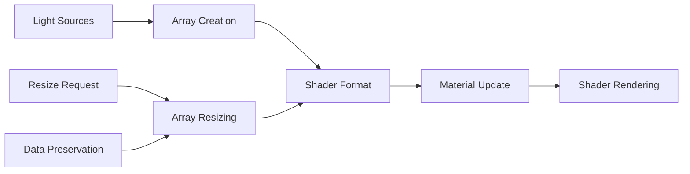

# LightArrayUtils

Utility class for managing light source arrays in shaders, providing efficient light array creation, resizing, and shader format conversion.

## 🎯 Purpose

The `LightArrayUtils` provides comprehensive light array management for celestial renderers:

- **Light Array Creation**: Efficient creation of light source arrays for shaders
- **Dynamic Resizing**: Dynamic resizing of light arrays while preserving data
- **Shader Format Conversion**: Conversion of light data to shader-compatible format
- **Memory Management**: Efficient memory management for light arrays
- **Performance Optimization**: Optimized light array operations for shaders

## 🏗️ Architecture

### Static Utility Class

Provides static methods for light array management, ensuring consistent light handling across all renderers.

### Shader Integration

Direct integration with Three.js shader materials for seamless light array management.

### Memory Efficiency

Implements efficient memory management for light arrays with minimal allocations.

## 🔧 Core Methods

### Light Array Creation

```typescript
// Create initial light source array
static createLightSourceArray(size: number = 4): Array<{
  position: THREE.Vector3;
  color: THREE.Color;
  intensity: number;
}>;

// Create shadow caster array
static createShadowCasterArray(size: number = 4): Array<{
  position: THREE.Vector3;
  radius: number;
}>;
```

### Light Array Resizing

```typescript
// Resize light source array
static resizeLightArray(
  material: THREE.ShaderMaterial,
  newSize: number,
  currentArray: Array<{
    position: THREE.Vector3;
    color: THREE.Color;
    intensity: number;
  }>
): Array<{
  position: THREE.Vector3;
  color: THREE.Color;
  intensity: number;
}>;

// Resize shadow caster array
static resizeShadowCasterArray(
  material: THREE.ShaderMaterial,
  newSize: number,
  currentArray: Array<{
    position: THREE.Vector3;
    radius: number;
  }>
): Array<{
  position: THREE.Vector3;
  radius: number;
}>;
```

### Shader Format Conversion

```typescript
// Convert light sources to shader format
static toShaderFormat(lightSources: LightSourcesMap): Array<{
  position: THREE.Vector3;
  color: THREE.Color;
  intensity: number;
}>;
```

## 🔄 Data Flow

The LightArrayUtils follows a systematic data flow:



### Processing Pipeline

1. **Light Sources**: Input light source data
2. **Array Creation**: Create light source arrays
3. **Shader Format**: Convert to shader-compatible format
4. **Material Update**: Update shader material uniforms
5. **Shader Rendering**: Render with updated light data

## 📊 Technical Specifications

### Light Source Array Structure

```typescript
interface LightSourceArray {
  position: THREE.Vector3;
  color: THREE.Color;
  intensity: number;
}
```

### Shadow Caster Array Structure

```typescript
interface ShadowCasterArray {
  position: THREE.Vector3;
  radius: number;
}
```

### Shader Uniform Updates

```typescript
static resizeLightArray(material: THREE.ShaderMaterial, newSize: number, currentArray: LightSourceArray[]): LightSourceArray[] {
  const newArray = new Array(newSize);

  // Preserve existing data
  for (let i = 0; i < Math.min(newSize, currentArray.length); i++) {
    newArray[i] = currentArray[i];
  }

  // Fill remaining slots with default values
  for (let i = currentArray.length; i < newSize; i++) {
    newArray[i] = {
      position: new THREE.Vector3(0, 0, 0),
      color: new THREE.Color(0, 0, 0),
      intensity: 0
    };
  }

  // Update shader uniforms
  material.uniforms.lightCount.value = newSize;
  material.uniforms.lightPositions.value = newArray.map(light => light.position);
  material.uniforms.lightColors.value = newArray.map(light => light.color);
  material.uniforms.lightIntensities.value = newArray.map(light => light.intensity);

  return newArray;
}
```

## 💡 Usage Examples

### Basic Usage

```typescript
import { LightArrayUtils } from "@teskooano/renderer-threejs-celestial";

// Create initial light source array
const lightArray = LightArrayUtils.createLightSourceArray(8);
console.log("Created light array with", lightArray.length, "slots");

// Create shadow caster array
const shadowArray = LightArrayUtils.createShadowCasterArray(4);
console.log("Created shadow array with", shadowArray.length, "slots");

// Convert light sources to shader format
const lightSources = new Map();
lightSources.set("star1", {
  position: new THREE.Vector3(0, 0, 0),
  color: new THREE.Color(1, 1, 0.8),
  intensity: 1.0,
});

const shaderFormat = LightArrayUtils.toShaderFormat(lightSources);
console.log("Shader format lights:", shaderFormat);
```

### Advanced Usage

```typescript
// Resize light array while preserving data
const material = new THREE.ShaderMaterial({
  uniforms: {
    lightCount: { value: 4 },
    lightPositions: { value: [] },
    lightColors: { value: [] },
    lightIntensities: { value: [] },
  },
});

// Create initial array
let lightArray = LightArrayUtils.createLightSourceArray(4);

// Populate with data
lightArray[0] = {
  position: new THREE.Vector3(1000, 0, 0),
  color: new THREE.Color(1, 1, 0.8),
  intensity: 1.0,
};

// Resize to larger array
lightArray = LightArrayUtils.resizeLightArray(material, 8, lightArray);

// Verify data preservation
console.log("First light preserved:", lightArray[0]);
console.log("New array size:", lightArray.length);

// Resize shadow caster array
let shadowArray = LightArrayUtils.createShadowCasterArray(2);
shadowArray[0] = {
  position: new THREE.Vector3(500, 0, 0),
  radius: 100,
};

shadowArray = LightArrayUtils.resizeShadowCasterArray(material, 6, shadowArray);
console.log("Shadow array resized to:", shadowArray.length);
```

### Integration with BaseCelestialRenderer

```typescript
class MyCelestialRenderer extends BaseCelestialRenderer {
  private lightArray: Array<{
    position: THREE.Vector3;
    color: THREE.Color;
    intensity: number;
  }> = [];
  private shadowArray: Array<{ position: THREE.Vector3; radius: number }> = [];

  constructor(object: RenderableCelestialObject) {
    super(object);

    // Initialize light arrays
    this.initializeLightArrays();
  }

  private initializeLightArrays(): void {
    // Create initial light arrays
    this.lightArray = LightArrayUtils.createLightSourceArray(4);
    this.shadowArray = LightArrayUtils.createShadowCasterArray(4);

    // Update shader material
    this.updateShaderUniforms();
  }

  update(
    object: RenderableCelestialObject,
    lightSources: LightSourcesMap,
  ): void {
    // Call parent update
    super.update(object, lightSources);

    // Update light arrays
    this.updateLightArrays(lightSources);
  }

  private updateLightArrays(lightSources: LightSourcesMap): void {
    const lightCount = lightSources.size;

    // Resize arrays if needed
    if (lightCount > this.lightArray.length) {
      this.lightArray = LightArrayUtils.resizeLightArray(
        this.material,
        lightCount,
        this.lightArray,
      );
    }

    // Update light data
    const shaderFormat = LightArrayUtils.toShaderFormat(lightSources);
    for (let i = 0; i < shaderFormat.length; i++) {
      this.lightArray[i] = shaderFormat[i];
    }

    // Update shader uniforms
    this.updateShaderUniforms();
  }

  private updateShaderUniforms(): void {
    if (this.material && this.material.uniforms) {
      this.material.uniforms.lightCount.value = this.lightArray.length;
      this.material.uniforms.lightPositions.value = this.lightArray.map(
        (light) => light.position,
      );
      this.material.uniforms.lightColors.value = this.lightArray.map(
        (light) => light.color,
      );
      this.material.uniforms.lightIntensities.value = this.lightArray.map(
        (light) => light.intensity,
      );
    }
  }
}
```

## ⚡ Performance Considerations

### Efficiency

- **Static Methods**: No instance overhead for utility functions
- **Memory Management**: Efficient memory allocation and deallocation
- **Data Preservation**: Efficient data preservation during resizing
- **Shader Updates**: Optimized shader uniform updates

### Quality Metrics

- **Data Integrity**: Ensures data integrity during array operations
- **Performance**: Minimal performance impact on rendering
- **Memory Usage**: Efficient memory usage for light arrays
- **Shader Compatibility**: Seamless integration with shader systems

### Performance Monitoring

- **Array Operations**: Monitor array creation and resizing performance
- **Memory Usage**: Track memory usage for light arrays
- **Shader Updates**: Monitor shader uniform update performance
- **Light Count**: Track number of lights being managed

## 🔌 Integration Points

### Primary Integration

- **BaseCelestialRenderer**: Automatic light array management for all renderers
- **Shader Materials**: Direct integration with Three.js shader materials
- **Lighting System**: Integration with lighting management systems

### Secondary Integration

- **Light Sources**: Integration with light source management
- **Shadow Casters**: Integration with shadow caster management
- **Performance Monitoring**: Integration with performance monitoring systems

## 🐛 Debug Features

### Validation

- **Array Validation**: Validates light array operations
- **Data Validation**: Validates light data integrity
- **Shader Validation**: Validates shader uniform updates
- **Memory Validation**: Validates memory management operations

### Monitoring

- **Array Stats**: Tracks light array statistics
- **Memory Stats**: Monitors memory usage for light arrays
- **Performance Stats**: Monitors performance of array operations
- **Shader Stats**: Tracks shader uniform update statistics

### Debugging Tools

- **Array Info**: Get detailed light array information
- **Memory Info**: Get memory usage information
- **Performance Info**: Get performance statistics
- **Shader Info**: Get shader uniform information

## 🔮 Future Enhancements

### Optimization Opportunities

- **Array Pooling**: Reuse light arrays to reduce allocations
- **Lazy Updates**: Update shader uniforms only when needed
- **Memory Compression**: Compress light data for better memory usage
- **Performance Profiling**: Enhanced performance monitoring

### Potential Improvements

- **Dynamic Sizing**: More sophisticated dynamic sizing algorithms
- **Advanced Formatting**: More advanced shader format conversion
- **Multi-threaded Operations**: Parallel light array operations
- **Advanced Validation**: More sophisticated validation and error handling

## 📚 Architecture Patterns

- **Utility Pattern**: Static utility methods for common operations
- **Factory Pattern**: Light array creation and management
- **Memory Management Pattern**: Efficient memory management
- **Integration Pattern**: Seamless integration with shader systems

## 📚 Related Documentation

- [[BaseCelestialRenderer]] - Uses these utilities for light array management
- [[CelestialLightingManager]] - Integration with lighting management
- [[LightingCalculator]] - Integration with lighting calculations
- [[Shader System]] - Shader integration and management

---

_The LightArrayUtils provides comprehensive light array management with efficient creation, resizing, and shader format conversion for optimal performance and seamless integration with shader systems._
