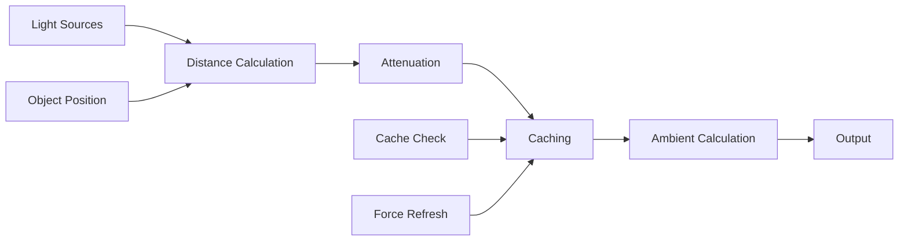

---
aliases:
  [
    LightingCalculator,
    lighting-calculator,
    light-calculations,
    lighting-optimization,
  ]
tags:
  [
    renderer,
    threejs,
    celestial,
    calculator,
    lighting,
    calculations,
    optimization,
    caching,
  ]
type: Class
package: "@teskooano/renderer-threejs-celestial"
name: LightingCalculator
dependencies: ["@teskooano/data-types", "three"]
classes: ["THREE.Vector3", "THREE.Color"]
functions: []
constants: []
types:
  [
    "LightSourceData",
    "LightSourcesMap",
    "LightingConfig",
    "RenderableCelestialObject",
  ]
status: active
---

# LightingCalculator

Instance-based lighting calculations for celestial renderers, providing efficient light source management, distance attenuation, and ambient lighting calculations with intelligent caching.

## 🎯 Purpose

The `LightingCalculator` provides comprehensive lighting calculations for celestial renderers:

- **Instance-based Calculations**: Each calculator instance is associated with a specific celestial object
- **Distance Attenuation**: Physically-based light falloff calculations
- **Ambient Lighting**: Dynamic ambient light based on nearby stars
- **Intelligent Caching**: Efficient caching of lighting calculations
- **Performance Optimization**: Optimized calculations for real-time rendering

## 🏗️ Architecture

### Instance-based Design

Each calculator instance is associated with a specific celestial object and provides:

- **Object-specific Calculations**: Calculations tailored to the object's position and properties
- **Caching System**: Intelligent caching of calculation results
- **State Management**: Tracks object state and updates calculations accordingly

### Caching System

Implements intelligent caching to avoid redundant calculations:

- **Attenuated Light Sources**: Cached distance-attenuated light data
- **Ambient Light**: Cached ambient light calculations
- **Closest Light Source**: Cached closest light source data
- **Cache Invalidation**: Automatic cache clearing on object updates

## 🔧 Core Methods

### Object Management

```typescript
// Update object reference
updateObject(object: RenderableCelestialObject): void;

// Update all objects reference
updateAllObjects(allObjects: Record<string, RenderableCelestialObject>): void;
```

### Light Source Calculations

```typescript
// Apply distance attenuation to light sources
applyDistanceAttenuation(
  lightSources: LightSourcesMap,
  config: LightingConfig = {},
  forceRefresh: boolean = false
): LightSourcesMap;

// Find closest light source
findClosestLightSource(
  lightSources: LightSourcesMap,
  forceRefresh: boolean = false
): LightSourceData | null;

// Find primary light source
findPrimaryLightSource(
  lightSources: LightSourcesMap,
  forceRefresh: boolean = false
): LightSourceData | null;
```

### Ambient Lighting

```typescript
// Calculate dynamic ambient lighting
calculateDynamicAmbientLight(
  lightSources: LightSourcesMap,
  forceRefresh: boolean = false
): number;

// Calculate light intensity at distance
calculateLightIntensityAtDistance(
  lightSource: LightSourceData,
  distance: number,
  falloffFactor: number = LightingCalculator.DEFAULT_FALLOFF_FACTOR
): number;
```

### Cache Management

```typescript
// Get cache statistics
getCacheStats(): {
  cached: boolean;
  lastUpdate: number;
  hasAttenuatedCache: boolean;
  hasAmbientCache: boolean;
  hasClosestCache: boolean;
};

// Dispose calculator
dispose(): void;
```

## 🔄 Data Flow

The LightingCalculator follows a systematic data flow:



### Processing Pipeline

1. **Light Sources**: Input light source data
2. **Distance Calculation**: Calculate distances from object to light sources
3. **Attenuation**: Apply distance-based attenuation
4. **Caching**: Cache results for future use
5. **Ambient Calculation**: Calculate ambient lighting contribution
6. **Output**: Return processed light data

## 📊 Technical Specifications

### Light Source Data Structure

```typescript
interface LightSourceData {
  position: THREE.Vector3;
  color: THREE.Color;
  intensity?: number;
}
```

### Lighting Configuration

```typescript
interface LightingConfig {
  falloffFactor?: number;
  modifyInPlace?: boolean;
}
```

### Distance Attenuation Formula

```typescript
applyDistanceAttenuation(lightSources: LightSourcesMap, config: LightingConfig = {}, forceRefresh: boolean = false): LightSourcesMap {
  // Return cached result if valid
  if (!forceRefresh && this.cacheValid && this.attenuatedLightSourcesCache) {
    return this.attenuatedLightSourcesCache;
  }

  const { falloffFactor = 0.00000001, modifyInPlace = true } = config;
  const resultSources = modifyInPlace ? lightSources : new Map(lightSources);

  resultSources.forEach((lightData) => {
    const distanceSq = this.object.position.distanceToSquared(lightData.position);
    const attenuation = 1.0 / (1.0 + distanceSq * falloffFactor);
    lightData.intensity = (lightData.intensity ?? 1.0) * attenuation;
  });

  // Update cache
  this.attenuatedLightSourcesCache = resultSources;
  this.cacheValid = true;

  return resultSources;
}
```

### Ambient Lighting Calculation

```typescript
calculateDynamicAmbientLight(lightSources: LightSourcesMap, forceRefresh: boolean = false): number {
  if (!forceRefresh && this.cacheValid && this.ambientLightCache !== null) {
    return this.ambientLightCache;
  }

  let totalAmbient = 0;

  for (const [starId, lightData] of lightSources.entries()) {
    const distance = this.object.position.distanceTo(lightData.position);
    const distanceSq = distance * distance;

    // Get luminosity from star properties or light intensity
    let luminosity = lightData.intensity ?? 1.0;
    if (this.allObjects && this.allObjects[starId]) {
      const starObject = this.allObjects[starId];
      if (starObject.type === CelestialType.STAR && starObject.properties) {
        const starProps = starObject.properties as any;
        luminosity = starProps.systemLighting?.starLightIntensity ?? lightData.intensity ?? 1.0;
      }
    }

    // Calculate ambient falloff (stronger than direct light falloff)
    const ambientFalloff = 1.0 / (1.0 + distanceSq * 0.000000001);
    const ambientContribution = 0.5 * luminosity * ambientFalloff;
    totalAmbient += ambientContribution;
  }

  // Clamp between minimum and maximum
  const result = Math.max(0.05, Math.min(totalAmbient, 0.5));

  this.ambientLightCache = result;
  this.cacheValid = true;

  return result;
}
```

## 💡 Usage Examples

### Basic Usage

```typescript
import { LightingCalculator } from "@teskooano/renderer-threejs-celestial";

// Create lighting calculator for celestial object
const lightingCalculator = new LightingCalculator(celestialObject);

// Update with all objects
lightingCalculator.updateAllObjects(allObjects);

// Apply distance attenuation
const attenuatedLights = lightingCalculator.applyDistanceAttenuation(
  lightSources,
  {
    falloffFactor: 0.00000001,
    modifyInPlace: false,
  },
);

// Find closest light source
const closestLight = lightingCalculator.findClosestLightSource(lightSources);

// Calculate ambient lighting
const ambientIntensity =
  lightingCalculator.calculateDynamicAmbientLight(lightSources);

console.log("Ambient intensity:", ambientIntensity);
```

### Advanced Usage

```typescript
// Create calculator with object
const calculator = new LightingCalculator(celestialObject);

// Update object reference
calculator.updateObject(updatedObject);

// Update all objects reference
calculator.updateAllObjects(allObjects);

// Apply attenuation with custom configuration
const attenuatedLights = calculator.applyDistanceAttenuation(lightSources, {
  falloffFactor: 0.00000005, // Custom falloff factor
  modifyInPlace: true, // Modify original map
});

// Find primary light source
const primaryLight = calculator.findPrimaryLightSource(lightSources);

// Calculate light intensity at specific distance
const intensity = calculator.calculateLightIntensityAtDistance(
  primaryLight,
  1000, // distance
  0.00000001, // falloff factor
);

// Get cache statistics
const cacheStats = calculator.getCacheStats();
console.log("Cache stats:", cacheStats);

// Force refresh calculations
const freshLights = calculator.applyDistanceAttenuation(lightSources, {}, true);
const freshAmbient = calculator.calculateDynamicAmbientLight(
  lightSources,
  true,
);
```

### Integration with BaseCelestialRenderer

```typescript
class MyCelestialRenderer extends BaseCelestialRenderer {
  private lightingCalculator: LightingCalculator;

  constructor(object: RenderableCelestialObject) {
    super(object);

    // Create lighting calculator
    this.lightingCalculator = new LightingCalculator(object);
  }

  update(
    object: RenderableCelestialObject,
    lightSources: LightSourcesMap,
    allObjects: Record<string, RenderableCelestialObject>,
  ): void {
    // Call parent update
    super.update(object, lightSources, allObjects);

    // Update lighting calculator
    this.lightingCalculator.updateObject(object);
    this.lightingCalculator.updateAllObjects(allObjects);

    // Apply lighting calculations
    this.applyLighting(lightSources);
  }

  private applyLighting(lightSources: LightSourcesMap): void {
    // Apply distance attenuation
    const attenuatedLights =
      this.lightingCalculator.applyDistanceAttenuation(lightSources);

    // Find closest light source
    const closestLight =
      this.lightingCalculator.findClosestLightSource(lightSources);

    // Calculate ambient lighting
    const ambientIntensity =
      this.lightingCalculator.calculateDynamicAmbientLight(lightSources);

    // Apply to material
    if (this.material && this.material.uniforms) {
      this.material.uniforms.ambientIntensity.value = ambientIntensity;
      this.material.uniforms.closestLightPosition.value =
        closestLight?.position || new THREE.Vector3(0, 0, 0);
      this.material.uniforms.closestLightColor.value =
        closestLight?.color || new THREE.Color(0, 0, 0);
      this.material.uniforms.closestLightIntensity.value =
        closestLight?.intensity || 0;
    }
  }

  dispose(): void {
    // Dispose lighting calculator
    this.lightingCalculator.dispose();

    // Call parent dispose
    super.dispose();
  }
}
```

## ⚡ Performance Considerations

### Efficiency

- **Instance-based Design**: Object-specific calculations for optimal performance
- **Intelligent Caching**: Avoids redundant calculations through caching
- **Squared Distance**: Uses squared distance for efficiency
- **Early Returns**: Returns cached results when possible

### Quality Metrics

- **Accuracy**: Accurate lighting calculations for realistic rendering
- **Performance**: Minimal performance impact on rendering
- **Memory Usage**: Efficient memory usage with caching
- **Consistency**: Consistent lighting calculations across frames

### Performance Monitoring

- **Cache Hit Rate**: Monitor cache effectiveness
- **Calculation Time**: Track lighting calculation performance
- **Memory Usage**: Monitor memory usage for caching
- **Light Count**: Track number of lights being processed

## 🔌 Integration Points

### Primary Integration

- **BaseCelestialRenderer**: Automatic lighting calculations for all renderers
- **CelestialLightingManager**: Integration with lighting management
- **Shader Materials**: Integration with shader materials for lighting

### Secondary Integration

- **Light Sources**: Integration with light source management
- **State Management**: Integration with state management systems
- **Performance Monitoring**: Integration with performance monitoring

## 🐛 Debug Features

### Validation

- **Light Validation**: Validates light source data
- **Distance Validation**: Validates distance calculations
- **Cache Validation**: Validates cache integrity
- **Configuration Validation**: Validates lighting configuration

### Monitoring

- **Cache Stats**: Tracks cache statistics and effectiveness
- **Calculation Stats**: Monitors lighting calculation performance
- **Memory Stats**: Monitors memory usage for caching
- **Light Stats**: Tracks light source processing statistics

### Debugging Tools

- **Cache Info**: Get detailed cache information
- **Calculation Info**: Get calculation performance information
- **Memory Info**: Get memory usage information
- **Light Info**: Get light source processing information

## 🔮 Future Enhancements

### Optimization Opportunities

- **Advanced Caching**: More sophisticated caching strategies
- **Predictive Calculations**: Predict lighting needs for better performance
- **Memory Optimization**: Optimize memory usage for caching
- **Performance Profiling**: Enhanced performance monitoring

### Potential Improvements

- **Multi-threaded Calculations**: Parallel lighting calculations for better performance
- **Advanced Attenuation**: More sophisticated attenuation models
- **Dynamic Ambient**: More dynamic ambient lighting calculations
- **Advanced Validation**: More sophisticated validation and error handling

## 📚 Architecture Patterns

- **Calculator Pattern**: Specialized calculation logic
- **Caching Pattern**: Intelligent result caching
- **Instance Pattern**: Object-specific calculations
- **Performance Pattern**: Performance-optimized calculations

## 📚 Related Documentation

- [[BaseCelestialRenderer]] - Uses this calculator for lighting calculations
- [[CelestialLightingManager]] - Integration with lighting management
- [[LightArrayUtils]] - Integration with light array management
- [[Lighting System]] - Overall lighting system architecture

---

_The LightingCalculator provides comprehensive, performance-optimized lighting calculations with intelligent caching, distance attenuation, and ambient lighting for realistic celestial rendering._
