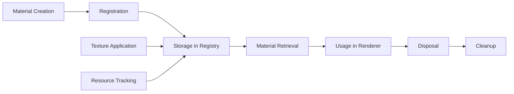

# MaterialManager

Centralized material lifecycle management for celestial renderers, providing automatic tracking, disposal, and texture management.

## 🎯 Purpose

The `MaterialManager` provides comprehensive material management for celestial renderers:

- **Lifecycle Management**: Automatic tracking and disposal of materials and textures
- **Resource Tracking**: Centralized registry of all materials used by a renderer
- **Memory Safety**: Prevents memory leaks through proper cleanup
- **Texture Management**: Handles texture application and disposal
- **Performance Optimization**: Efficient material retrieval and management

## 🏗️ Architecture

### Centralized Registry

Uses a Map-based registry to track all materials and textures associated with a renderer instance.

### Automatic Disposal

Implements comprehensive disposal logic that handles both individual materials and arrays of materials.

## 🔧 Core Methods

### Material Registration

```typescript
// Register a single material
registerMaterial(id: string, material: THREE.Material): void;

// Register multiple materials
registerMaterials(id: string, materials: THREE.Material[]): void;
```

### Material Retrieval

```typescript
// Get material by ID
getMaterial(id: string): THREE.Material | THREE.Material[] | undefined;

// Check if material exists
hasMaterial(id: string): boolean;

// Get all material IDs
getMaterialIds(): string[];
```

### Texture Management

```typescript
// Apply texture to material
applyTexture(
  material: THREE.Material,
  textureKey: string,
  texture: THREE.Texture | null
): void;
```

### Resource Management

```typescript
// Remove specific material
removeMaterial(id: string): boolean;

// Get material count
getMaterialCount(): number;

// Dispose all materials
dispose(): void;
```

## 🔄 Data Flow

The MaterialManager follows a systematic data flow:



### Processing Pipeline

1. **Registration**: Materials are registered with unique IDs
2. **Storage**: Materials stored in internal registry
3. **Retrieval**: Materials accessed by ID when needed
4. **Usage**: Materials used by renderer for rendering
5. **Disposal**: Automatic cleanup when renderer is disposed

## 📊 Technical Specifications

### Material Registry

```typescript
class MaterialManager {
  public materials: Map<string, THREE.Material | THREE.Material[]>;
}
```

### Material Disposal Logic

```typescript
private disposeMaterial(material: THREE.Material | THREE.Material[]): void {
  if (Array.isArray(material)) {
    material.forEach(mat => this.disposeSingleMaterial(mat));
  } else {
    this.disposeSingleMaterial(material);
  }
}

private disposeSingleMaterial(material: THREE.Material): void {
  // Dispose textures
  Object.values(material).forEach(value => {
    if (value && typeof value === 'object' && 'dispose' in value) {
      (value as any).dispose();
    }
  });

  // Dispose material
  material.dispose();
}
```

## 💡 Usage Examples

### Basic Usage

```typescript
import { MaterialManager } from "@teskooano/renderer-threejs-celestial";

// Create material manager
const materialManager = new MaterialManager();

// Register materials
const planetMaterial = new THREE.MeshStandardMaterial({ color: 0x00ff00 });
materialManager.registerMaterial("planet", planetMaterial);

// Register multiple materials
const starMaterials = [
  new THREE.MeshBasicMaterial({ color: 0xffff00 }),
  new THREE.MeshBasicMaterial({ color: 0xff0000 }),
];
materialManager.registerMaterials("star", starMaterials);

// Retrieve materials
const planetMat = materialManager.getMaterial("planet");
const starMats = materialManager.getMaterial("star");

// Apply texture
const texture = new THREE.TextureLoader().load("planet-texture.jpg");
materialManager.applyTexture(planetMaterial, "map", texture);

// Cleanup
materialManager.dispose();
```

### Advanced Usage

```typescript
// Check material existence
if (materialManager.hasMaterial("planet")) {
  const material = materialManager.getMaterial("planet");
  // Use material
}

// Get all registered materials
const materialIds = materialManager.getMaterialIds();
console.log("Registered materials:", materialIds);

// Remove specific material
const removed = materialManager.removeMaterial("old-material");
if (removed) {
  console.log("Material removed successfully");
}

// Get material count
const count = materialManager.getMaterialCount();
console.log(`Managing ${count} materials`);
```

### Integration with BaseCelestialRenderer

```typescript
class MyCelestialRenderer extends BaseCelestialRenderer {
  constructor(object: RenderableCelestialObject) {
    super(object);

    // Materials are automatically managed by the base class
    this.registerMaterial("body", this.createBodyMaterial());
    this.registerMaterial("atmosphere", this.createAtmosphereMaterial());
  }

  private createBodyMaterial(): THREE.Material {
    const material = new THREE.MeshStandardMaterial({
      color: 0x00ff00,
      roughness: 0.8,
      metalness: 0.2,
    });
    return material;
  }

  // Materials are automatically disposed when renderer is disposed
}
```

## ⚡ Performance Considerations

### Efficiency

- **Map-based Storage**: O(1) lookup time for material retrieval
- **Lazy Disposal**: Materials only disposed when explicitly requested
- **Memory Management**: Automatic cleanup prevents memory leaks
- **Texture Optimization**: Efficient texture application and disposal

### Quality Metrics

- **Reliability**: Robust error handling for material operations
- **Consistency**: Uniform material management across all renderers
- **Scalability**: Efficient handling of large numbers of materials
- **Memory Safety**: Comprehensive disposal prevents memory leaks

### Performance Monitoring

- **Material Count**: Track number of managed materials
- **Memory Usage**: Monitor material memory consumption
- **Disposal Time**: Measure cleanup performance
- **Registration Overhead**: Track material registration costs

## 🔌 Integration Points

### Primary Integration

- **BaseCelestialRenderer**: Automatic material management for all renderers
- **Three.js Materials**: Direct integration with Three.js material system
- **Texture System**: Seamless texture application and management

### Secondary Integration

- **Resource Management**: Integrates with overall resource management system
- **Debug Systems**: Provides material information for debugging
- **Performance Monitoring**: Tracks material usage for optimization

## 🐛 Debug Features

### Validation

- **Material Existence**: Validates material IDs before operations
- **Type Safety**: Ensures proper material types
- **Resource Tracking**: Monitors material lifecycle
- **Error Handling**: Graceful handling of invalid operations

### Monitoring

- **Material Count**: Tracks number of managed materials
- **Memory Usage**: Monitors material memory consumption
- **Registration Logging**: Logs material registration events
- **Disposal Tracking**: Tracks material disposal operations

### Debugging Tools

- **Material Listing**: List all registered materials
- **Memory Stats**: Get memory usage statistics
- **Validation Checks**: Verify material integrity
- **Performance Metrics**: Monitor material management performance

## 🔮 Future Enhancements

### Optimization Opportunities

- **Material Pooling**: Reuse materials to reduce allocations
- **Lazy Loading**: Load materials only when needed
- **Compression**: Optimize material data storage
- **Caching**: Cache frequently used materials

### Potential Improvements

- **Material Sharing**: Share materials between similar objects
- **Dynamic Loading**: Load materials from external sources
- **Advanced Disposal**: More sophisticated cleanup strategies
- **Performance Profiling**: Enhanced performance monitoring

## 📚 Architecture Patterns

- **Manager Pattern**: Centralized management of materials
- **Resource Management Pattern**: Automatic lifecycle management
- **Registry Pattern**: Centralized material storage and retrieval
- **Observer Pattern**: Integration with resource management systems

## 📚 Related Documentation

- [[BaseCelestialRenderer]] - Uses this manager for material management
- [[CelestialRenderer Interface]] - Defines material management contract
- [[Resource Management]] - Overall resource management strategy
- [[Performance Optimization]] - Material performance considerations

---

_The MaterialManager provides robust, efficient material lifecycle management with comprehensive resource tracking and automatic cleanup for optimal performance and memory safety._
