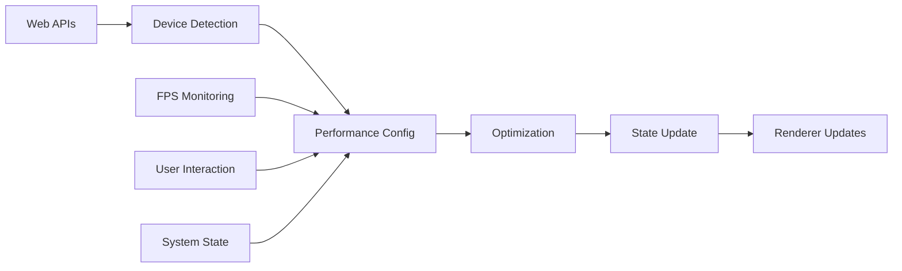

---
aliases:
  [
    PerformanceMonitor,
    performance-monitor,
    device-monitoring,
    performance-tracking,
  ]
tags:
  [
    renderer,
    threejs,
    celestial,
    monitor,
    performance,
    device,
    optimization,
    web-apis,
  ]
type: Class
package: "@teskooano/renderer-threejs-celestial"
name: PerformanceMonitor
dependencies: ["@teskooano/web-apis", "@teskooano/renderer-threejs-lod"]
classes: ["PerformanceMonitor"]
functions: []
constants: []
types: ["DeviceTier", "PerformanceConfig"]
status: active
---

# PerformanceMonitor

Comprehensive performance monitoring and device capability detection for celestial renderers, providing real-time performance tracking, device tier detection, and automatic optimization.

## 🎯 Purpose

The `PerformanceMonitor` provides comprehensive performance monitoring for celestial renderers:

- **Performance Tracking**: Real-time FPS monitoring and performance metrics
- **Device Detection**: Automatic device tier detection based on capabilities
- **Web API Integration**: Integration with battery, memory, and idle detection APIs
- **Automatic Optimization**: Automatic performance optimization based on device state
- **State Management**: Integration with global state management for performance config

## 🚀 Core Features

### 1. Performance Tracking

- **Real-time Monitoring**: Real-time FPS monitoring and performance metrics
- **Device Detection**: Automatic device tier detection based on capabilities
- **Performance Analytics**: Comprehensive performance analysis and reporting

### 2. Web API Integration

- **Battery API**: Monitor battery level and charging status
- **Memory API**: Track device memory usage
- **Idle Detection API**: Detect user idle state for optimization

### 3. Automatic Optimization

- **Device-based Optimization**: Automatic performance optimization based on device state
- **State Management**: Integration with global state management for performance config
- **Dynamic Scaling**: Dynamic performance scaling based on device capabilities

## 🏗️ Architecture

### Singleton Pattern

Implements singleton pattern to ensure single instance across the application for consistent performance monitoring.

### Web API Integration

Integrates with modern Web APIs including:

- **Battery API**: Monitor battery level and charging status
- **Memory API**: Track device memory usage
- **Idle Detection API**: Detect user idle state for optimization

### Performance Configuration

Provides centralized performance configuration management with automatic updates based on device state.

## 🔧 Core Methods

### Performance Monitoring

```typescript
// Get current FPS
getCurrentFPS(): number;

// Set target FPS
setTargetFPS(targetFPS: number): void;

// Set performance optimization
setPerformanceOptimization(enabled: boolean): void;

// Set device tier
setDeviceTier(tier: DeviceTier): void;
```

### Performance Statistics

```typescript
// Get comprehensive performance statistics
getPerformanceStats(): {
  currentFPS: number;
  targetFPS: number;
  isOptimizationEnabled: boolean;
  performanceConfig: PerformanceConfig;
  deviceMemoryGB: number | null;
  batteryLevel: number;
  isCharging: boolean;
  isIdle: boolean;
  isIdleDetectionSupported: boolean;
};
```

### Device Detection

```typescript
// Detect device tier based on capabilities
detectDeviceTier(): DeviceTier;

// Auto-configure performance settings
autoConfigure(): void;
```

### Lifecycle Management

```typescript
// Reinitialize monitor
reinitialize(): void;

// Start monitoring
startMonitoring(): void;

// Stop monitoring
stopMonitoring(): void;

// Dispose monitor
dispose(): void;
```

## 🔄 Data Flow

The PerformanceMonitor follows a systematic data flow:



### Processing Pipeline

1. **Web API Monitoring**: Monitor battery, memory, and idle state
2. **Device Detection**: Detect device tier based on capabilities
3. **Performance Configuration**: Update performance configuration
4. **Optimization**: Apply performance optimizations
5. **State Update**: Update global state with performance config
6. **Renderer Updates**: Notify renderers of performance changes

## 📊 Technical Specifications

### Performance Configuration

```typescript
interface PerformanceConfig {
  targetFPS?: number;
  currentFPS?: number;
  enablePerformanceOptimization?: boolean;
  performanceReductionMultiplier?: number;
  minimumSegments?: number;
  deviceTier?: DeviceTier;
  enableAdaptiveScaling?: boolean;
  distanceReductionFactor?: number;
}
```

### Device Tier Detection

```typescript
detectDeviceTier(): DeviceTier {
  // Check WebGL capabilities
  const canvas = document.createElement('canvas');
  const gl = canvas.getContext('webgl2') || canvas.getContext('webgl');

  if (!gl) return 'low';

  // Check device memory
  const memoryGB = this.deviceMemoryGB;
  if (memoryGB && memoryGB < 4) return 'low';
  if (memoryGB && memoryGB < 8) return 'medium';

  // Check battery level
  if (this.batteryLevel < 0.2 && !this.isCharging) return 'low';

  // Check WebGL capabilities
  const maxTextureSize = gl.getParameter(gl.MAX_TEXTURE_SIZE);
  const maxVertexAttribs = gl.getParameter(gl.MAX_VERTEX_ATTRIBS);

  if (maxTextureSize < 4096 || maxVertexAttribs < 16) return 'low';
  if (maxTextureSize < 8192 || maxVertexAttribs < 32) return 'medium';

  return 'high';
}
```

### Web API Integration

```typescript
private initializeWebAPIMonitoring(): void {
  // Battery API
  if ('getBattery' in navigator) {
    navigator.getBattery().then(battery => {
      this.batteryLevel = battery.level;
      this.isCharging = battery.charging;

      battery.addEventListener('levelchange', () => {
        this.batteryLevel = battery.level;
        this.updatePerformanceBasedOnDeviceState();
      });

      battery.addEventListener('chargingchange', () => {
        this.isCharging = battery.charging;
        this.updatePerformanceBasedOnDeviceState();
      });
    });
  }

  // Memory API
  if ('memory' in performance) {
    this.deviceMemoryGB = (performance as any).memory.usedJSHeapSize / (1024 * 1024 * 1024);
  }

  // Idle Detection API
  if ('requestIdleCallback' in window) {
    this.isIdleDetectionSupported = true;
    // Monitor idle state
  }
}
```

## 💡 Usage Examples

### Basic Usage

```typescript
import { PerformanceMonitor } from "@teskooano/renderer-threejs-celestial";

// Get singleton instance
const performanceMonitor = PerformanceMonitor.getInstance();

// Get current performance stats
const stats = performanceMonitor.getPerformanceStats();
console.log("Performance stats:", stats);

// Set target FPS
performanceMonitor.setTargetFPS(60);

// Enable performance optimization
performanceMonitor.setPerformanceOptimization(true);
```

### Advanced Usage

```typescript
// Auto-configure performance settings
performanceMonitor.autoConfigure();

// Detect device tier
const deviceTier = performanceMonitor.detectDeviceTier();
console.log("Device tier:", deviceTier);

// Update performance configuration
performanceMonitor.updatePerformanceConfig({
  targetFPS: 60,
  enablePerformanceOptimization: true,
  deviceTier: "medium",
  enableAdaptiveScaling: true,
});

// Monitor performance changes
const stats = performanceMonitor.getPerformanceStats();
if (stats.currentFPS < stats.targetFPS * 0.8) {
  console.log("Performance below target, enabling optimizations");
  performanceMonitor.setPerformanceOptimization(true);
}
```

### Integration with BaseCelestialRenderer

```typescript
class MyCelestialRenderer extends BaseCelestialRenderer {
  constructor(object: RenderableCelestialObject) {
    super(object);

    // Performance monitor is automatically available
    this.setupPerformanceOptimization();
  }

  private setupPerformanceOptimization(): void {
    // Get performance monitor
    const performanceMonitor = PerformanceMonitor.getInstance();

    // Get current performance config
    const config = performanceMonitor.getPerformanceConfig();

    // Apply performance optimizations
    if (config.deviceTier === "low") {
      this.enableLowEndOptimizations();
    } else if (config.deviceTier === "medium") {
      this.enableMediumEndOptimizations();
    }
  }

  update(object: RenderableCelestialObject, camera: THREE.Camera): void {
    // Call parent update
    super.update(object, camera);

    // Check performance and adjust if needed
    this.checkPerformanceAndAdjust();
  }

  private checkPerformanceAndAdjust(): void {
    const performanceMonitor = PerformanceMonitor.getInstance();
    const stats = performanceMonitor.getPerformanceStats();

    // Adjust quality based on performance
    if (stats.currentFPS < stats.targetFPS * 0.8) {
      this.reduceQuality();
    } else if (stats.currentFPS > stats.targetFPS * 1.1) {
      this.increaseQuality();
    }
  }
}
```

## ⚡ Performance Considerations

### Efficiency

- **Singleton Pattern**: Single instance reduces memory overhead
- **Cached Monitoring**: Performance data cached for efficiency
- **Web API Integration**: Efficient integration with Web APIs
- **State Management**: Efficient state updates and notifications

### Quality Metrics

- **Accuracy**: Accurate performance monitoring and device detection
- **Reliability**: Robust performance tracking across different devices
- **Consistency**: Consistent performance optimization across renderers
- **Responsiveness**: Responsive performance adjustments

### Performance Monitoring

- **FPS Tracking**: Real-time FPS monitoring
- **Device State**: Monitor device state changes
- **Optimization Effectiveness**: Track optimization effectiveness
- **Memory Usage**: Monitor memory usage and optimization

## 🔌 Integration Points

### Primary Integration

- **BaseCelestialRenderer**: Automatic performance monitoring for all renderers
- **GeometryUtilities**: Integration with geometry optimization
- **LODManager**: Integration with LOD management
- **State Management**: Integration with global state management

### Secondary Integration

- **Web APIs**: Integration with battery, memory, and idle detection APIs
- **Device Detection**: Integration with device capability detection
- **Performance Optimization**: Integration with performance optimization systems

## 🐛 Debug Features

### Validation

- **Performance Validation**: Validates performance monitoring data
- **Device Validation**: Validates device tier detection
- **Web API Validation**: Validates Web API integration
- **State Validation**: Validates state management integration

### Monitoring

- **Performance Stats**: Tracks performance monitoring statistics
- **Device Stats**: Monitors device detection statistics
- **Web API Stats**: Monitors Web API integration statistics
- **Optimization Stats**: Tracks optimization effectiveness

### Debugging Tools

- **Performance Info**: Get detailed performance information
- **Device Info**: Get device capability information
- **Web API Info**: Get Web API integration information
- **State Info**: Get state management information

## 🔮 Future Enhancements

### Optimization Opportunities

- **Predictive Optimization**: Predict performance needs for better optimization
- **Advanced Monitoring**: More sophisticated performance monitoring
- **Web API Enhancement**: Enhanced Web API integration
- **Memory Optimization**: Optimize memory usage and monitoring

### Potential Improvements

- **Multi-threaded Monitoring**: Parallel performance monitoring for better performance
- **Advanced Device Detection**: More sophisticated device detection algorithms
- **Performance Profiling**: Enhanced performance profiling and analysis
- **Optimization Strategies**: More sophisticated optimization strategies

## 📚 Architecture Patterns

- **Singleton Pattern**: Single instance for consistent monitoring
- **Observer Pattern**: State change notifications
- **Strategy Pattern**: Device-specific optimization strategies
- **Monitor Pattern**: Performance monitoring and optimization

## 📚 Related Documentation

- [[BaseCelestialRenderer]] - Uses this monitor for performance optimization
- [[GeometryUtilities]] - Integration with geometry optimization
- [[LODManager]] - Integration with LOD management
- [[Performance Optimization]] - Performance optimization strategies

---

_The PerformanceMonitor provides comprehensive performance monitoring and device capability detection with real-time tracking, automatic optimization, and seamless integration with Web APIs for optimal performance across all devices._
