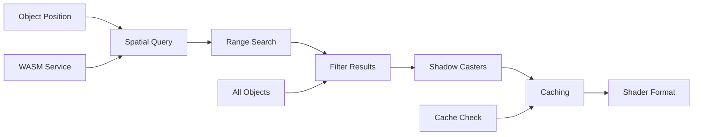

---
aliases:
  [ShadowCasterUtils, shadow-caster-utils, shadow-detection, shadow-management]
tags:
  [renderer, threejs, celestial, utilities, shadow, caster, detection, spatial]
type: Class
package: "@teskooano/renderer-threejs-celestial"
name: ShadowCasterUtils
dependencies: ["@teskooano/data-types", "@teskooano/core-physics", "three"]
classes: ["WasmSpatialService", "THREE.Vector3"]
functions: ["findBodiesInRange"]
constants: ["AU_METERS", "METERS_TO_SCENE_UNITS"]
types: ["ShadowCasterData", "RenderableCelestialObject", "CelestialType"]
status: active
---

# ShadowCasterUtils

Utility class for shadow caster detection and management in celestial renderers, providing efficient shadow caster identification using WASM spatial service and intelligent caching.

## 🎯 Purpose

The `ShadowCasterUtils` provides comprehensive shadow caster management for celestial renderers:

- **Shadow Caster Detection**: Automatic identification of objects that can cast shadows
- **Spatial Optimization**: Uses WASM spatial service for efficient spatial queries
- **Intelligent Caching**: Caches shadow caster detection results for performance
- **Ring System Support**: Specialized shadow caster detection for ring systems
- **Performance Optimization**: Optimized shadow caster detection for real-time rendering

## 🏗️ Architecture

### Instance-based Design

Each utility instance is associated with a specific celestial object and provides:

- **Object-specific Detection**: Shadow caster detection tailored to the object's position and properties
- **Spatial Service Integration**: Integration with WASM spatial service for efficient queries
- **Caching System**: Intelligent caching of detection results

### Spatial Service Integration

Uses the WASM spatial service for efficient spatial queries:

- **Range Queries**: Efficient range-based queries for nearby objects
- **Spatial Indexing**: Optimized spatial indexing for fast lookups
- **Physics Integration**: Integration with physics engine data

## 🔧 Core Methods

### Object Management

```typescript
// Update object reference
updateObject(object: RenderableCelestialObject): void;

// Update all objects reference
updateAllObjects(allObjects: Record<string, RenderableCelestialObject>): void;
```

### Shadow Caster Detection

```typescript
// Find shadow casters for this object
findShadowCasters(forceRefresh: boolean = false): ShadowCasterData[];

// Find shadow casters for ring systems
findRingShadowCasters(forceRefresh: boolean = false): ShadowCasterData[];
```

### Shader Format Conversion

```typescript
// Convert shadow casters to shader format
static toShaderFormat(shadowCasters: ShadowCasterData[]): Array<{
  position: THREE.Vector3;
  radius: number;
}>;
```

### Cache Management

```typescript
// Get cache statistics
getCacheStats(): {
  cached: boolean;
  lastUpdate: number;
  cacheSize: number;
};

// Dispose utility
dispose(): void;
```

## 🔄 Data Flow

The ShadowCasterUtils follows a systematic data flow:



### Processing Pipeline

1. **Object Position**: Get object position for spatial queries
2. **Spatial Query**: Query WASM spatial service for nearby objects
3. **Range Search**: Search for objects within shadow casting range
4. **Filter Results**: Filter results based on object types and relationships
5. **Shadow Casters**: Identify objects that can cast shadows
6. **Caching**: Cache results for future use
7. **Shader Format**: Convert to shader-compatible format

## 📊 Technical Specifications

### Shadow Caster Data Structure

```typescript
interface ShadowCasterData {
  position: THREE.Vector3;
  radius: number;
}
```

### Shadow Caster Detection Logic

```typescript
findShadowCasters(forceRefresh: boolean = false): ShadowCasterData[] {
  if (!forceRefresh && this.cacheValid && this.shadowCasterCache.length > 0) {
    return this.shadowCasterCache;
  }

  const shadowCasters: ShadowCasterData[] = [];

  // If object is a planet-like body, its moons are shadow casters
  if (this.object.type === CelestialType.PLANET ||
      this.object.type === CelestialType.DWARF_PLANET ||
      this.object.type === CelestialType.GAS_GIANT) {

    const searchDistance = 0.1 * AU_METERS; // 0.1 AU in meters
    const positionInMeters = new THREE.Vector3(
      this.object.position.x / METERS_TO_SCENE_UNITS,
      this.object.position.y / METERS_TO_SCENE_UNITS,
      this.object.position.z / METERS_TO_SCENE_UNITS
    );

    const nearbyBodies = this.spatialService.findBodiesInRange(positionInMeters, searchDistance);

    // Filter for moons of this object
    for (const bodyId of nearbyBodies) {
      const moon = this.allObjects[bodyId];
      if (moon && moon.type === CelestialType.MOON && moon.parentId === this.object.id) {
        shadowCasters.push({
          position: moon.position.clone(),
          radius: moon.radius ?? 0,
        });
      }
    }
  }
  // Universal rule: any object can be shadowed by its parent, unless parent is a star
  else if (this.object.parentId) {
    const parentBody = this.allObjects[this.object.parentId];
    if (parentBody && parentBody.type !== CelestialType.STAR) {
      shadowCasters.push({
        position: parentBody.position.clone(),
        radius: parentBody.radius ?? 0,
      });
    }
  }

  this.shadowCasterCache = shadowCasters;
  this.cacheValid = true;

  return shadowCasters;
}
```

### Ring Shadow Caster Detection

```typescript
findRingShadowCasters(forceRefresh: boolean = false): ShadowCasterData[] {
  if (!forceRefresh && this.cacheValid && this.ringShadowCasterCache.length > 0) {
    return this.ringShadowCasterCache;
  }

  const shadowCasters: ShadowCasterData[] = [];

  // For ring systems, find objects that can cast shadows on the rings
  if (this.object.properties.rings && this.object.properties.rings.length > 0) {
    const searchDistance = 0.05 * AU_METERS; // 0.05 AU in meters
    const positionInMeters = new THREE.Vector3(
      this.object.position.x / METERS_TO_SCENE_UNITS,
      this.object.position.y / METERS_TO_SCENE_UNITS,
      this.object.position.z / METERS_TO_SCENE_UNITS
    );

    const nearbyBodies = this.spatialService.findBodiesInRange(positionInMeters, searchDistance);

    // Filter for objects that can cast shadows on rings
    for (const bodyId of nearbyBodies) {
      const body = this.allObjects[bodyId];
      if (body && body.id !== this.object.id && body.radius > 0) {
        shadowCasters.push({
          position: body.position.clone(),
          radius: body.radius,
        });
      }
    }
  }

  this.ringShadowCasterCache = shadowCasters;
  this.cacheValid = true;

  return shadowCasters;
}
```

## 💡 Usage Examples

### Basic Usage

```typescript
import { ShadowCasterUtils } from "@teskooano/renderer-threejs-celestial";

// Create shadow caster utility for celestial object
const shadowCasterUtils = new ShadowCasterUtils(celestialObject);

// Update with all objects
shadowCasterUtils.updateAllObjects(allObjects);

// Find shadow casters
const shadowCasters = shadowCasterUtils.findShadowCasters();
console.log("Found shadow casters:", shadowCasters.length);

// Find ring shadow casters
const ringShadowCasters = shadowCasterUtils.findRingShadowCasters();
console.log("Found ring shadow casters:", ringShadowCasters.length);

// Convert to shader format
const shaderFormat = ShadowCasterUtils.toShaderFormat(shadowCasters);
console.log("Shader format shadow casters:", shaderFormat);
```

### Advanced Usage

```typescript
// Create utility with object
const shadowUtils = new ShadowCasterUtils(celestialObject);

// Update object reference
shadowUtils.updateObject(updatedObject);

// Update all objects reference
shadowUtils.updateAllObjects(allObjects);

// Find shadow casters with force refresh
const freshShadowCasters = shadowUtils.findShadowCasters(true);

// Find ring shadow casters with force refresh
const freshRingShadowCasters = shadowUtils.findRingShadowCasters(true);

// Get cache statistics
const cacheStats = shadowUtils.getCacheStats();
console.log("Cache stats:", cacheStats);

// Convert to shader format
const shaderFormat = ShadowCasterUtils.toShaderFormat(freshShadowCasters);

// Process shadow casters
shadowCasters.forEach((caster, index) => {
  console.log(`Shadow caster ${index}:`, {
    position: caster.position,
    radius: caster.radius,
  });
});
```

### Integration with BaseCelestialRenderer

```typescript
class MyCelestialRenderer extends BaseCelestialRenderer {
  private shadowCasterUtils: ShadowCasterUtils;

  constructor(object: RenderableCelestialObject) {
    super(object);

    // Create shadow caster utility
    this.shadowCasterUtils = new ShadowCasterUtils(object);
  }

  update(
    object: RenderableCelestialObject,
    allObjects: Record<string, RenderableCelestialObject>,
  ): void {
    // Call parent update
    super.update(object, allObjects);

    // Update shadow caster utility
    this.shadowCasterUtils.updateObject(object);
    this.shadowCasterUtils.updateAllObjects(allObjects);

    // Update shadow casters
    this.updateShadowCasters();
  }

  private updateShadowCasters(): void {
    // Find shadow casters
    const shadowCasters = this.shadowCasterUtils.findShadowCasters();

    // Find ring shadow casters if object has rings
    let ringShadowCasters: ShadowCasterData[] = [];
    if (
      this.object.properties.rings &&
      this.object.properties.rings.length > 0
    ) {
      ringShadowCasters = this.shadowCasterUtils.findRingShadowCasters();
    }

    // Convert to shader format
    const shaderFormat = ShadowCasterUtils.toShaderFormat(shadowCasters);
    const ringShaderFormat =
      ShadowCasterUtils.toShaderFormat(ringShadowCasters);

    // Apply to material
    if (this.material && this.material.uniforms) {
      this.material.uniforms.shadowCasterCount.value = shaderFormat.length;
      this.material.uniforms.shadowCasterPositions.value = shaderFormat.map(
        (caster) => caster.position,
      );
      this.material.uniforms.shadowCasterRadii.value = shaderFormat.map(
        (caster) => caster.radius,
      );

      if (ringShaderFormat.length > 0) {
        this.material.uniforms.ringShadowCasterCount.value =
          ringShaderFormat.length;
        this.material.uniforms.ringShadowCasterPositions.value =
          ringShaderFormat.map((caster) => caster.position);
        this.material.uniforms.ringShadowCasterRadii.value =
          ringShaderFormat.map((caster) => caster.radius);
      }
    }
  }

  dispose(): void {
    // Dispose shadow caster utility
    this.shadowCasterUtils.dispose();

    // Call parent dispose
    super.dispose();
  }
}
```

## ⚡ Performance Considerations

### Efficiency

- **Spatial Optimization**: Uses WASM spatial service for efficient queries
- **Intelligent Caching**: Caches detection results to avoid redundant calculations
- **Range-based Queries**: Efficient range-based spatial queries
- **Filtered Results**: Filters results to only relevant objects

### Quality Metrics

- **Accuracy**: Accurate shadow caster detection for realistic shadows
- **Performance**: Minimal performance impact on rendering
- **Memory Usage**: Efficient memory usage with caching
- **Spatial Efficiency**: Efficient spatial queries and filtering

### Performance Monitoring

- **Cache Hit Rate**: Monitor cache effectiveness
- **Spatial Query Time**: Track spatial query performance
- **Memory Usage**: Monitor memory usage for caching
- **Shadow Caster Count**: Track number of shadow casters being processed

## 🔌 Integration Points

### Primary Integration

- **BaseCelestialRenderer**: Automatic shadow caster detection for all renderers
- **WasmSpatialService**: Integration with WASM spatial service
- **Shader Materials**: Integration with shader materials for shadow rendering

### Secondary Integration

- **Physics Engine**: Integration with physics engine data
- **State Management**: Integration with state management systems
- **Performance Monitoring**: Integration with performance monitoring

## 🐛 Debug Features

### Validation

- **Shadow Caster Validation**: Validates shadow caster detection results
- **Spatial Query Validation**: Validates spatial query results
- **Cache Validation**: Validates cache integrity
- **Data Validation**: Validates shadow caster data

### Monitoring

- **Cache Stats**: Tracks cache statistics and effectiveness
- **Spatial Query Stats**: Monitors spatial query performance
- **Memory Stats**: Monitors memory usage for caching
- **Shadow Caster Stats**: Tracks shadow caster detection statistics

### Debugging Tools

- **Cache Info**: Get detailed cache information
- **Spatial Query Info**: Get spatial query performance information
- **Memory Info**: Get memory usage information
- **Shadow Caster Info**: Get shadow caster detection information

## 🔮 Future Enhancements

### Optimization Opportunities

- **Advanced Caching**: More sophisticated caching strategies
- **Predictive Detection**: Predict shadow caster needs for better performance
- **Memory Optimization**: Optimize memory usage for caching
- **Spatial Optimization**: More sophisticated spatial query optimization

### Potential Improvements

- **Multi-threaded Detection**: Parallel shadow caster detection for better performance
- **Advanced Filtering**: More sophisticated shadow caster filtering
- **Dynamic Range**: Dynamic range adjustment based on object size
- **Advanced Validation**: More sophisticated validation and error handling

## 📚 Architecture Patterns

- **Utility Pattern**: Specialized utility for shadow caster detection
- **Caching Pattern**: Intelligent result caching
- **Spatial Pattern**: Spatial query optimization
- **Integration Pattern**: Seamless integration with spatial services

## 📚 Related Documentation

- [[BaseCelestialRenderer]] - Uses these utilities for shadow caster detection
- [[CelestialLightingManager]] - Integration with lighting management
- [[WasmSpatialService]] - WASM spatial service integration
- [[Shadow System]] - Overall shadow system architecture

---

_The ShadowCasterUtils provides comprehensive shadow caster detection and management with efficient spatial queries, intelligent caching, and seamless integration with WASM spatial services for realistic shadow rendering._
