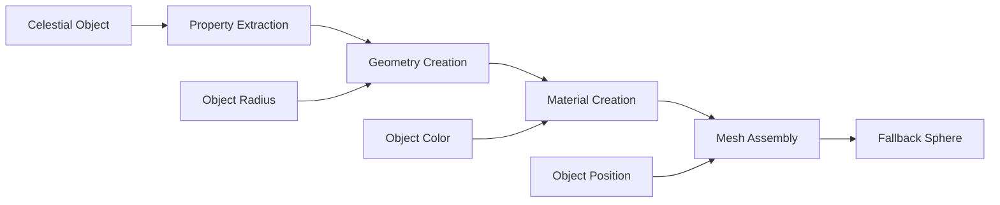

---
aliases:
  [
    createFallbackSphere,
    fallback-sphere,
    emergency-rendering,
    fallback-renderer,
  ]
tags:
  [
    renderer,
    threejs,
    celestial,
    function,
    fallback,
    emergency,
    sphere,
    rendering,
  ]
type: Function
package: "@teskooano/renderer-threejs-celestial"
name: createFallbackSphere
dependencies: ["@teskooano/data-types", "three"]
classes: ["THREE.Mesh", "THREE.SphereGeometry", "THREE.MeshBasicMaterial"]
functions: ["createFallbackSphere"]
constants: []
types: ["RenderableCelestialObject"]
status: active
---

# createFallbackSphere

Emergency fallback rendering function for celestial objects, providing a simple sphere mesh when normal rendering fails or is unavailable.

## 🎯 Purpose

The `createFallbackSphere` function provides emergency fallback rendering for celestial objects:

- **Emergency Rendering**: Provides basic rendering when normal renderers fail
- **Simple Geometry**: Uses basic sphere geometry for universal compatibility
- **Minimal Dependencies**: Minimal dependencies for maximum reliability
- **Error Recovery**: Enables error recovery and graceful degradation
- **Development Support**: Useful for development and testing scenarios

## 🏗️ Architecture

### Simple Function Design

Provides a simple, standalone function with minimal dependencies:

- **No Complex Logic**: Simple sphere creation without complex rendering logic
- **Universal Compatibility**: Works with any celestial object type
- **Minimal Overhead**: Minimal performance overhead
- **Error Safety**: Safe to use in error conditions

### Fallback Strategy

Implements a fallback strategy for rendering failures:

- **Basic Geometry**: Uses basic sphere geometry
- **Simple Material**: Uses basic material without complex shaders
- **Object Properties**: Uses object properties for basic appearance
- **Graceful Degradation**: Provides visual feedback even when rendering fails

## 🔧 Core Methods

### Fallback Sphere Creation

```typescript
// Create fallback sphere for celestial object
function createFallbackSphere(object: RenderableCelestialObject): THREE.Mesh;
```

## 🔄 Data Flow

The createFallbackSphere follows a simple data flow:



### Processing Pipeline

1. **Celestial Object**: Input celestial object data
2. **Property Extraction**: Extract basic properties (radius, color, position)
3. **Geometry Creation**: Create basic sphere geometry
4. **Material Creation**: Create basic material with object color
5. **Mesh Assembly**: Assemble mesh with geometry and material
6. **Fallback Sphere**: Return fallback sphere mesh

## 📊 Technical Specifications

### Function Signature

```typescript
function createFallbackSphere(object: RenderableCelestialObject): THREE.Mesh;
```

### Implementation Details

```typescript
export function createFallbackSphere(
  object: RenderableCelestialObject,
): THREE.Mesh {
  // Create basic sphere geometry
  const geometry = new THREE.SphereGeometry(
    object.radius || 1, // Use object radius or default to 1
    32, // Default segments
    32, // Default segments
  );

  // Create basic material with object color
  const material = new THREE.MeshBasicMaterial({
    color: object.color || 0xffffff, // Use object color or default to white
    wireframe: false, // Solid sphere
  });

  // Create mesh
  const mesh = new THREE.Mesh(geometry, material);

  // Set position from object
  mesh.position.copy(object.position);

  // Set name for identification
  mesh.name = `fallback-${object.id}`;

  return mesh;
}
```

### Object Property Usage

- **Radius**: Uses `object.radius` for sphere size
- **Color**: Uses `object.color` for material color
- **Position**: Uses `object.position` for mesh position
- **ID**: Uses `object.id` for mesh naming

## 💡 Usage Examples

### Basic Usage

```typescript
import { createFallbackSphere } from "@teskooano/renderer-threejs-celestial";

// Create fallback sphere for celestial object
const fallbackSphere = createFallbackSphere(celestialObject);

// Add to scene
scene.add(fallbackSphere);

console.log("Fallback sphere created:", fallbackSphere.name);
```

### Error Recovery Usage

```typescript
class MyCelestialRenderer extends BaseCelestialRenderer {
  private fallbackMesh: THREE.Mesh | null = null;

  constructor(object: RenderableCelestialObject) {
    super(object);

    try {
      // Try to create normal renderer
      this.createNormalRenderer();
    } catch (error) {
      console.error("Failed to create normal renderer:", error);

      // Create fallback sphere
      this.fallbackMesh = createFallbackSphere(object);
      this.addFallbackToScene();
    }
  }

  private createNormalRenderer(): void {
    // Normal renderer creation logic
    // This might fail for various reasons
  }

  private addFallbackToScene(): void {
    if (this.fallbackMesh) {
      // Add fallback mesh to scene
      this.scene.add(this.fallbackMesh);
      console.log("Using fallback sphere for", this.object.id);
    }
  }

  update(object: RenderableCelestialObject): void {
    if (this.fallbackMesh) {
      // Update fallback mesh position
      this.fallbackMesh.position.copy(object.position);
    } else {
      // Normal update logic
      super.update(object);
    }
  }

  dispose(): void {
    if (this.fallbackMesh) {
      this.scene.remove(this.fallbackMesh);
      this.fallbackMesh.geometry.dispose();
      this.fallbackMesh.material.dispose();
    }

    super.dispose();
  }
}
```

### Development and Testing Usage

```typescript
// Use fallback sphere for development
function createDevelopmentScene(): void {
  const celestialObjects = getCelestialObjects();

  celestialObjects.forEach((object) => {
    // Create fallback sphere for quick development
    const fallbackSphere = createFallbackSphere(object);
    scene.add(fallbackSphere);

    // Add basic interaction
    fallbackSphere.userData = {
      objectId: object.id,
      objectType: object.type,
      isFallback: true,
    };
  });
}

// Use fallback sphere for testing
function createTestScene(): void {
  const testObject: RenderableCelestialObject = {
    id: "test-object",
    type: CelestialType.PLANET,
    radius: 1000,
    color: 0x00ff00,
    position: new THREE.Vector3(0, 0, 0),
    velocity: new THREE.Vector3(0, 0, 0),
  };

  const testSphere = createFallbackSphere(testObject);
  scene.add(testSphere);

  console.log("Test fallback sphere created");
}
```

## ⚡ Performance Considerations

### Efficiency

- **Simple Geometry**: Basic sphere geometry with minimal complexity
- **Basic Material**: Simple material without complex shaders
- **Minimal Overhead**: Minimal performance overhead
- **Fast Creation**: Fast creation and disposal

### Quality Metrics

- **Reliability**: Reliable fallback rendering
- **Compatibility**: Universal compatibility with all object types
- **Performance**: Minimal performance impact
- **Visual Clarity**: Clear visual representation

### Performance Monitoring

- **Creation Time**: Monitor fallback sphere creation time
- **Memory Usage**: Track memory usage for fallback spheres
- **Rendering Performance**: Monitor rendering performance
- **Fallback Usage**: Track fallback sphere usage frequency

## 🔌 Integration Points

### Primary Integration

- **BaseCelestialRenderer**: Integration with renderer error handling
- **Scene Management**: Integration with scene management systems
- **Error Handling**: Integration with error handling systems

### Secondary Integration

- **Development Tools**: Integration with development and testing tools
- **Debug Systems**: Integration with debug systems
- **Performance Monitoring**: Integration with performance monitoring

## 🐛 Debug Features

### Validation

- **Object Validation**: Validates celestial object data
- **Property Validation**: Validates object properties
- **Geometry Validation**: Validates geometry creation
- **Material Validation**: Validates material creation

### Monitoring

- **Fallback Usage**: Tracks fallback sphere usage
- **Creation Stats**: Monitors fallback sphere creation statistics
- **Performance Stats**: Monitors fallback sphere performance
- **Error Stats**: Tracks fallback sphere usage due to errors

### Debugging Tools

- **Fallback Info**: Get fallback sphere information
- **Creation Info**: Get creation process information
- **Performance Info**: Get performance statistics
- **Error Info**: Get error-related information

## 🔮 Future Enhancements

### Optimization Opportunities

- **Geometry Optimization**: Optimize fallback sphere geometry
- **Material Optimization**: Optimize fallback sphere material
- **Memory Optimization**: Optimize memory usage for fallback spheres
- **Performance Optimization**: Optimize fallback sphere performance

### Potential Improvements

- **Advanced Fallback**: More sophisticated fallback rendering
- **Customizable Fallback**: Customizable fallback sphere appearance
- **Fallback Animation**: Animated fallback spheres
- **Fallback Interaction**: Interactive fallback spheres

## 📚 Architecture Patterns

- **Fallback Pattern**: Fallback strategy for error recovery
- **Factory Pattern**: Simple factory for fallback objects
- **Error Recovery Pattern**: Error recovery and graceful degradation
- **Development Pattern**: Development and testing support

## 📚 Related Documentation

- [[BaseCelestialRenderer]] - Integration with renderer error handling
- [[Error Handling]] - Error handling and recovery strategies
- [[Development Tools]] - Development and testing tools
- [[Fallback Systems]] - Fallback system architecture

---

_The createFallbackSphere function provides reliable emergency fallback rendering with simple sphere geometry, basic materials, and minimal dependencies for maximum compatibility and error recovery._
