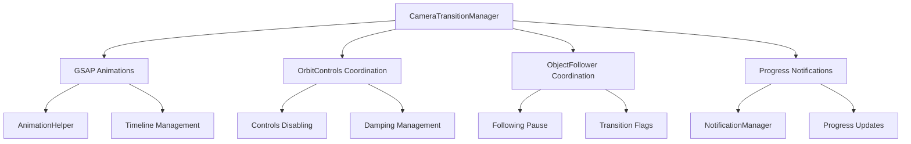

# CameraTransitionManager

GSAP-driven camera transition system that provides smooth, animated camera movements with intelligent duration calculation, progress notifications, and coordination with other control systems.

## 🎯 Purpose

The `CameraTransitionManager` handles all programmatic camera transitions in the Teskooano Three.js scene. It provides smooth, GSAP-powered animations for camera movements while coordinating with OrbitControls and ObjectFollower to prevent conflicts. The system includes intelligent duration calculation, real-time progress notifications, and comprehensive event handling.

## 🏗️ Architecture

The CameraTransitionManager coordinates with multiple systems for smooth transitions:



## 🚀 Core Features

### 1. GSAP Animation System

- **Smooth Transitions**: High-quality GSAP-powered camera animations
- **Animation Helper Integration**: Uses AnimationHelper for consistent animation management
- **Timeline Management**: Sophisticated timeline management for complex transitions
- **Animation Cancellation**: Proper animation cancellation and cleanup

### 2. Multi-Stage Transitions

- **Single-Stage Transitions**: Direct position and target transitions
- **Two-Stage Transitions**: Align-then-travel transitions for optimal UX
- **Target-Only Transitions**: Look-at-only movements without position changes
- **Transition Coordination**: Prevents conflicts between different transition types

### 3. Intelligent Duration Calculation

- **Distance-Based Duration**: Duration calculated based on travel distance
- **Power Curve Model**: Non-linear duration calculation using power curves
- **Min/Max Clamping**: Duration clamped between minimum and maximum values
- **AU-Based Calculation**: Distance calculations in Astronomical Units for realism

### 4. Progress Notification System

- **Real-Time Updates**: Live progress updates during transitions
- **Speed and ETA**: Real-time speed and estimated time of arrival
- **Distance Tracking**: Remaining distance tracking in AU
- **Notification Management**: Integration with notification system

### 5. System Coordination

- **OrbitControls Coordination**: Temporarily disables controls during transitions
- **ObjectFollower Coordination**: Prevents following conflicts during transitions
- **Damping Management**: Manages damping settings during transitions
- **State Synchronization**: Maintains consistent state across all systems

## 🔧 Key Methods

### `transitionTo(position, target, options)`

Initiates a smooth, single-stage camera transition to a new position and target.

**Process:**

1. **Transition Setup**: Calls beginTransition() to prepare systems
2. **Duration Calculation**: Calculates transition duration based on distance
3. **Notification Creation**: Creates progress notification with target information
4. **Animation Execution**: Executes GSAP animation with progress updates
5. **Completion Handling**: Calls endTransition() when animation completes

**Usage:**

```typescript
transitionManager.transitionTo(
  new OSVector3(200, 100, 300),
  new OSVector3(0, 0, 0),
  { focusedObjectId: "earth" },
);
```

### `transitionToWithLookAtFirst(position, target, options)`

Executes a two-stage transition: first aligns camera to face target, then moves to position.

**Process:**

1. **Stage 1 Setup**: Prepares for alignment stage (10% of total duration)
2. **Alignment Animation**: Animates camera to face target without moving
3. **Stage 2 Setup**: Prepares for movement stage (90% of total duration)
4. **Movement Animation**: Moves camera to final position while maintaining look-at
5. **Progress Updates**: Provides detailed progress updates with speed and ETA

**Usage:**

```typescript
transitionManager.transitionToWithLookAtFirst(
  new OSVector3(500, 200, 400),
  new OSVector3(0, 0, 0),
  { focusedObjectId: "mars" },
);
```

### `transitionTargetTo(target, options)`

Smoothly transitions only the camera's target point while maintaining position.

**Process:**

1. **Target Validation**: Validates target position
2. **Duration Calculation**: Calculates duration based on target change
3. **Animation Execution**: Executes look-at-only animation
4. **Completion Handling**: Handles transition completion

**Usage:**

```typescript
transitionManager.transitionTargetTo(new OSVector3(100, 50, 200), {
  focusedObjectId: "moon",
});
```

### `calculateTransitionDuration(startPos, endPos)`

Calculates intelligent transition duration based on distance using a power curve model.

**Process:**

1. **Distance Calculation**: Calculates 3D distance between positions
2. **AU Conversion**: Converts distance to Astronomical Units
3. **Power Curve**: Applies power curve: `BASE * (distanceAU ^ exponent)`
4. **Clamping**: Clamps result between minimum and maximum duration

**Formula:**

```typescript
duration = clamp(
  MIN_DURATION,
  MAX_DURATION,
  BASE_DURATION * (distanceAU ^ 0.3),
);
```

**Usage:**

```typescript
const duration = transitionManager.calculateTransitionDuration(
  startPos,
  endPos,
);
```

## 📊 Technical Specifications

### Interface Definitions

```typescript
class CameraTransitionManager {
  private camera: PerspectiveCamera;
  private orbitControlsHandler: OrbitControlsHandler;
  private objectFollower: ObjectFollower;
  private isAnimating: boolean;
  private activeAnimation: any;
  private activeTransitionNotificationId: string | null;
}
```

### Event Types

```typescript
interface TransitionCompleteEvent {
  position: Vector3;
  target: Vector3;
  type: "target-only" | "position-and-target";
  focusedObjectId?: string | null;
}
```

### Duration Calculation Parameters

```typescript
const BASE_DURATION_FACTOR = 3.0; // Base duration for 1 AU trip
const DISTANCE_EXPONENT = 0.3; // Power curve exponent
const MIN_DURATION_S = 1.0; // Minimum duration in seconds
const MAX_DURATION_S = 10.0; // Maximum duration in seconds
```

## 💡 Usage Examples

### Basic Transition

```typescript
import { CameraTransitionManager } from "@teskooano/renderer-threejs-controls";

// Create transition manager
const transitionManager = new CameraTransitionManager(
  camera,
  orbitControlsHandler,
  objectFollower,
);

// Simple position and target transition
transitionManager.transitionTo(
  new OSVector3(100, 50, 100),
  new OSVector3(0, 0, 0),
);
```

### Two-Stage Transition with Progress

```typescript
// Two-stage transition with detailed progress updates
transitionManager.transitionToWithLookAtFirst(
  new OSVector3(500, 200, 400),
  new OSVector3(0, 0, 0),
  { focusedObjectId: "jupiter" },
);

// Listen for completion
document.addEventListener("CAMERA_TRANSITION_COMPLETE", (event) => {
  console.log("Transition completed:", event.detail);
});
```

### Target-Only Transition

```typescript
// Look-at-only transition
transitionManager.transitionTargetTo(new OSVector3(0, 0, 0), {
  focusedObjectId: "sun",
});
```

### Transition Cancellation

```typescript
// Cancel ongoing transition
transitionManager.cancelTransition();

// Check if currently animating
const isAnimating = transitionManager.getIsAnimating();
```

## ⚡ Performance Considerations

### Efficiency

- **GSAP Optimization**: Efficient GSAP animation management
- **Resource Pooling**: Reusable vectors and objects to minimize allocations
- **Animation Management**: Smart animation lifecycle management
- **Notification Optimization**: Efficient progress notification updates

### Quality Metrics

- **Smooth Animations**: High-quality, smooth camera transitions
- **Intelligent Duration**: Realistic duration calculation based on distance
- **Progress Accuracy**: Accurate progress tracking and notifications
- **System Coordination**: Seamless coordination with other control systems

### Performance Monitoring

- **Animation Performance**: Tracks GSAP animation performance
- **Duration Accuracy**: Monitors duration calculation accuracy
- **Progress Updates**: Tracks progress notification performance
- **System Coordination**: Monitors coordination with other systems

## 🔌 Integration Points

### Primary Integration

- **GSAP**: Animation library for smooth transitions
- **AnimationHelper**: Helper utilities for animation management
- **NotificationManager**: Progress notification system
- **OrbitControls**: Controls coordination during transitions

### Secondary Integration

- **ObjectFollower**: Following coordination during transitions
- **Core State**: State access for object information
- **Core Math**: OSVector3 for precise calculations
- **Data Types**: Event type definitions

## 🐛 Debug Features

### Validation

- **Parameter Validation**: Validates transition parameters and positions
- **State Validation**: Validates transition state consistency
- **Animation Validation**: Validates GSAP animation setup
- **Notification Validation**: Validates notification system integration

### Monitoring

- **Animation Monitoring**: Tracks animation performance and timing
- **Progress Monitoring**: Monitors progress update accuracy
- **Duration Monitoring**: Tracks duration calculation accuracy
- **System Monitoring**: Monitors coordination with other systems

### Debugging Tools

- **Animation Inspection**: Access to active animation state
- **Progress Logging**: Detailed progress logging for debugging
- **Duration Logging**: Duration calculation logging
- **State Inspection**: Transition state inspection tools

## 🔮 Future Enhancements

### Optimization Opportunities

- **Animation Optimization**: Further GSAP animation optimizations
- **Memory Optimization**: Advanced memory management and cleanup strategies
- **Code Optimization**: Additional algorithmic improvements for duration calculation
- **Architecture Optimization**: Enhanced transition coordination and management

### Potential Improvements

- **Advanced Animations**: More sophisticated animation curves and easing
- **Multi-Camera Support**: Support for multiple camera transitions
- **Advanced Progress**: More detailed progress information and analytics
- **Custom Easing**: Custom easing functions for different transition types

## 📚 Architecture Patterns

- **Manager Pattern**: Manages complex transition operations
- **Animation Pattern**: GSAP-based animation management
- **Notification Pattern**: Progress notification system integration
- **Coordination Pattern**: Coordinates with multiple control systems
- **Resource Management Pattern**: Proper lifecycle management of animations

## 📚 Related Documentation

- [[ControlsManager]] - Main orchestrator that uses CameraTransitionManager
- [[OrbitControlsHandler]] - Coordinates with orbit controls
- [[ObjectFollower]] - Coordinates with object following
- [[AnimationHelper]] - GSAP animation helper utilities
- [[threejs-controls]] - Package overview and architecture
