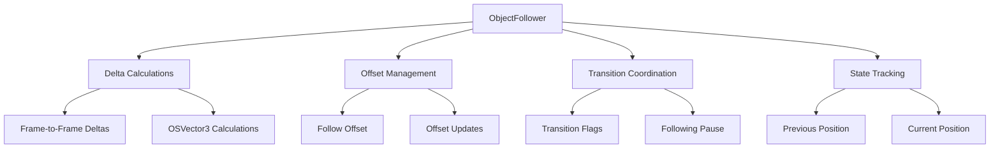

# ObjectFollower

Camera following system that maintains a relative offset to a moving `THREE.Object3D` using delta-based calculations for precise tracking while preserving user control capabilities.

## 🎯 Purpose

The `ObjectFollower` manages camera following behavior for moving objects in the Teskooano Three.js scene. It uses delta-based calculations to maintain precise camera positioning relative to a target object while allowing users to maintain orbit control around the followed object. The system coordinates with transitions and user interactions to provide seamless following behavior.

## 🏗️ Architecture

The ObjectFollower uses delta-based calculations for precise object tracking:



## 🚀 Core Features

### 1. Delta-Based Following

- **Frame-to-Frame Deltas**: Calculates object movement between frames
- **Precise Tracking**: Maintains exact relative positioning to moving objects
- **OSVector3 Integration**: Uses OSVector3 for precise mathematical calculations
- **Performance Optimization**: Efficient delta calculations with minimal allocations

### 2. Offset Management

- **Relative Positioning**: Maintains camera offset relative to followed object
- **Offset Updates**: Updates offset after user manual interaction
- **Offset Synchronization**: Synchronizes offset after programmatic transitions
- **Dynamic Offset**: Supports dynamic offset changes during following

### 3. Transition Coordination

- **Transition Flags**: Prevents conflicts during programmatic transitions
- **Following Pause**: Temporarily pauses following during transitions
- **State Synchronization**: Synchronizes state after transition completion
- **Conflict Prevention**: Prevents double updates during transitions

### 4. User Interaction Support

- **Manual Override**: Allows user manipulation while maintaining follow behavior
- **Offset Recalculation**: Recalculates offset after user interaction
- **Smooth Transitions**: Smooth transitions between following and manual control
- **State Preservation**: Preserves following state during user interaction

## 🔧 Key Methods

### `startFollowing(object, offset)`

Sets a target object for the camera to follow with specified offset.

**Process:**

1. **Object Validation**: Validates the target object
2. **Offset Setup**: Sets the follow offset from the object's center
3. **Position Initialization**: Initializes previous position for delta calculations
4. **State Update**: Updates following state and coordinates

**Usage:**

```typescript
objectFollower.startFollowing(targetObject, new Vector3(10, 5, 15));
```

### `update()`

Updates camera position to maintain follow offset using delta-based calculations.

**Process:**

1. **Following Check**: Checks if currently following and not transitioning
2. **Position Retrieval**: Gets current world position of followed object
3. **Delta Calculation**: Calculates movement delta since last frame
4. **Camera Update**: Applies delta to camera position and controls target
5. **State Update**: Updates previous position for next frame

**Usage:**

```typescript
// Called every frame in render loop
objectFollower.update();
```

### `updateFollowOffset()`

Recalculates follow offset based on current camera and target positions.

**Process:**

1. **Position Retrieval**: Gets current world position of followed object
2. **Offset Calculation**: Calculates new offset from camera to object
3. **Offset Update**: Updates stored follow offset
4. **State Synchronization**: Synchronizes offset with current state

**Usage:**

```typescript
// Called after user manual interaction
objectFollower.updateFollowOffset();
```

### `syncPositionsAfterTransition()`

Synchronizes camera and target positions after a programmatic transition.

**Process:**

1. **Position Retrieval**: Gets current world position of followed object
2. **Desired Position**: Calculates desired camera position with offset
3. **Position Update**: Updates camera position and controls target
4. **State Synchronization**: Synchronizes all positions and states

**Usage:**

```typescript
// Called after transition completion
objectFollower.syncPositionsAfterTransition();
```

## 📊 Technical Specifications

### Interface Definitions

```typescript
class ObjectFollower {
  private camera: PerspectiveCamera;
  private orbitControlsHandler: OrbitControlsHandler;
  private followingTargetObject: Object3D | null;
  private followOffset: Vector3;
  private tempTargetPosition: Vector3;
  private previousFollowTargetPos: Vector3;
  private tempOSVector: OSVector3;
  public isFollowingTransitioning: boolean;
}
```

### Delta Calculation Process

```typescript
// Frame-to-frame delta calculation
const currentPosition = OSVector3.fromThreeJS(object.getWorldPosition());
const previousPosition = OSVector3.fromThreeJS(this.previousFollowTargetPos);
const delta = currentPosition.clone().sub(previousPosition);

// Apply delta to camera and controls
camera.position.add(delta.toThreeJS());
controls.target.add(delta.toThreeJS());
```

## 💡 Usage Examples

### Basic Following Setup

```typescript
import { ObjectFollower } from "@teskooano/renderer-threejs-controls";
import * as THREE from "three";

// Create follower
const objectFollower = new ObjectFollower(camera, orbitControlsHandler);

// Start following an object
const targetObject = scene.getObjectByName("earth");
objectFollower.startFollowing(targetObject, new Vector3(10, 5, 15));

// Update in render loop
function animate() {
  requestAnimationFrame(animate);
  objectFollower.update();
  renderer.render(scene, camera);
}
```

### Following with User Interaction

```typescript
// Start following
objectFollower.startFollowing(targetObject, new Vector3(20, 10, 30));

// User can still orbit around the object
// After user interaction, update the offset
objectFollower.updateFollowOffset();

// Check following status
const isFollowing = objectFollower.isFollowing();
const offset = objectFollower.getFollowOffset();
```

### Transition Coordination

```typescript
// During transitions, following is automatically paused
// After transition completion, sync positions
objectFollower.syncPositionsAfterTransition();

// Stop following
objectFollower.stopFollowing();
```

### Advanced Following

```typescript
// Get followed object position
const worldPosition = objectFollower.getFollowedObjectWorldPosition();

// Update offset dynamically
const newOffset = new Vector3(15, 8, 25);
objectFollower.startFollowing(targetObject, newOffset);

// Check if currently following
if (objectFollower.isFollowing()) {
  console.log(
    "Currently following:",
    objectFollower.getFollowedObjectWorldPosition(),
  );
}
```

## ⚡ Performance Considerations

### Efficiency

- **Delta Calculations**: Efficient frame-to-frame delta calculations
- **OSVector3 Optimization**: Optimized vector calculations with OSVector3
- **Memory Management**: Minimal allocations with reusable vectors
- **State Tracking**: Efficient state tracking and updates

### Quality Metrics

- **Precise Tracking**: Accurate object tracking with minimal lag
- **Smooth Following**: Smooth camera movement during object motion
- **User Responsiveness**: Responsive user interaction while following
- **Transition Smoothness**: Smooth transitions between following and manual control

### Performance Monitoring

- **Delta Performance**: Tracks delta calculation performance
- **Update Performance**: Monitors update cycle performance
- **Memory Usage**: Tracks memory usage and allocations
- **State Synchronization**: Monitors state synchronization performance

## 🔌 Integration Points

### Primary Integration

- **Three.js**: Direct integration with Three.js camera and Object3D
- **OrbitControls**: Integration with OrbitControls for target management
- **Core Math**: OSVector3 integration for precise calculations
- **Camera System**: Integration with Three.js camera system

### Secondary Integration

- **ControlsManager**: Integration with main controls orchestrator
- **CameraTransitionManager**: Coordination with transition system
- **State Management**: Integration with state management systems
- **Event System**: Integration with event system for state changes

## 🐛 Debug Features

### Validation

- **Object Validation**: Validates followed object and its properties
- **Offset Validation**: Validates follow offset calculations
- **State Validation**: Validates following state consistency
- **Position Validation**: Validates position calculations and updates

### Monitoring

- **Following Monitoring**: Tracks following behavior and performance
- **Delta Monitoring**: Monitors delta calculation accuracy
- **Offset Monitoring**: Tracks offset management and updates
- **State Monitoring**: Monitors state synchronization and updates

### Debugging Tools

- **State Inspection**: Access to following state for debugging
- **Position Logging**: Detailed position logging for debugging
- **Delta Logging**: Delta calculation logging
- **Offset Inspection**: Offset state inspection tools

## 🔮 Future Enhancements

### Optimization Opportunities

- **Performance Optimization**: Further delta calculation optimizations
- **Memory Optimization**: Advanced memory management and cleanup strategies
- **Code Optimization**: Additional algorithmic improvements for following calculations
- **Architecture Optimization**: Enhanced following coordination and management

### Potential Improvements

- **Advanced Following**: More sophisticated following algorithms and behaviors
- **Multi-Object Following**: Support for following multiple objects
- **Predictive Following**: Predictive following with object trajectory prediction
- **Custom Following**: Custom following behaviors and offset calculations

## 📚 Architecture Patterns

- **Following Pattern**: Delta-based object following system
- **State Management Pattern**: Manages following state and synchronization
- **Coordination Pattern**: Coordinates with transitions and user interactions
- **Resource Management Pattern**: Proper lifecycle management of following resources

## 📚 Related Documentation

- [[ControlsManager]] - Main orchestrator that uses ObjectFollower
- [[OrbitControlsHandler]] - Coordinates with orbit controls
- [[CameraTransitionManager]] - Coordinates with transition system
- [[threejs-controls]] - Package overview and architecture
