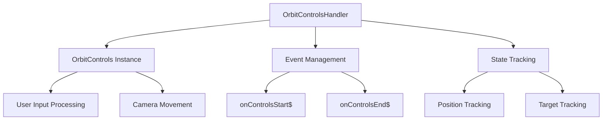

# OrbitControlsHandler

Lifecycle and event wrapper for Three.js `OrbitControls` that provides comprehensive event handling, state management, and configuration for camera orbit controls.

## 🎯 Purpose

The `OrbitControlsHandler` manages the lifecycle and events of a Three.js `OrbitControls` instance, providing a clean interface for camera orbit control functionality. It encapsulates setup, event handling, and state changes while emitting observable events for integration with the broader control system.

## 🏗️ Architecture

The OrbitControlsHandler wraps Three.js OrbitControls with event management:



## 🚀 Core Features

### 1. OrbitControls Management

- **Lifecycle Management**: Handles OrbitControls creation, configuration, and disposal
- **Event Wrapping**: Wraps Three.js events with RxJS observables
- **State Tracking**: Tracks camera position and target changes
- **Configuration**: Manages OrbitControls settings and parameters

### 2. Event System

- **Start Events**: Emits when user begins camera manipulation
- **End Events**: Emits when user finishes camera manipulation with position/target snapshots
- **Observable Streams**: Provides RxJS observables for reactive programming
- **Event Cleanup**: Proper event listener cleanup and disposal

### 3. Dynamic Configuration

- **Min Distance Updates**: Dynamic minimum distance updates for different object types
- **Damping Control**: Configurable damping settings for smooth movement
- **Performance Optimization**: Optimized settings for smooth 60 FPS interactions
- **Debug Logging**: Comprehensive logging for configuration changes

### 4. State Synchronization

- **Position Snapshots**: Captures camera position at interaction end
- **Target Snapshots**: Captures camera target at interaction end
- **State Events**: Emits state change events for application synchronization
- **Event Coordination**: Coordinates with other control handlers

## 🔧 Key Methods

### `update(delta)`

Updates the OrbitControls instance with proper timing and state management.

**Process:**

1. **Enabled Check**: Checks if controls are enabled before updating
2. **Delta Application**: Applies time delta for smooth damping
3. **State Update**: Updates internal state tracking
4. **Event Processing**: Processes any pending events

**Usage:**

```typescript
orbitControlsHandler.update(deltaTime);
```

### `setEnabled(enabled)`

Enables or disables the OrbitControls instance.

**Process:**

1. **State Update**: Updates the enabled state
2. **Event Coordination**: Coordinates with other handlers
3. **State Synchronization**: Synchronizes state across the system
4. **Event Dispatch**: Dispatches appropriate state change events

**Usage:**

```typescript
orbitControlsHandler.setEnabled(false); // Disable controls
orbitControlsHandler.setEnabled(true); // Enable controls
```

### `updateMinDistance(minDistance)`

Updates the minimum distance for orbit controls based on focused object type.

**Process:**

1. **Distance Validation**: Validates the new minimum distance
2. **State Update**: Updates the OrbitControls minimum distance
3. **Debug Logging**: Logs the change for debugging purposes
4. **Event Coordination**: Coordinates with other handlers if needed

**Usage:**

```typescript
orbitControlsHandler.updateMinDistance(0.001); // For close objects
orbitControlsHandler.updateMinDistance(0.1); // For distant objects
```

## 📊 Technical Specifications

### Interface Definitions

```typescript
class OrbitControlsHandler {
  public readonly controls: OrbitControls;
  public readonly onControlsStart$ = new Subject<void>();
  public readonly onControlsEnd$ = new Subject<ControlsChangeEvent>();
}
```

### Event Types

```typescript
interface ControlsChangeEvent {
  position: Vector3;
  target: Vector3;
}
```

### Configuration

```typescript
// Default OrbitControls configuration
{
  enableDamping: true,
  dampingFactor: 0.5,
  screenSpacePanning: false,
  minDistance: 0.0001,
  maxDistance: 1e6,
  maxPolarAngle: Math.PI,
  enableZoom: true,
  zoomSpeed: 1.0,
  enableRotate: true,
  rotateSpeed: 1.0,
  enablePan: true,
  panSpeed: 1.0
}
```

## 💡 Usage Examples

### Basic Setup

```typescript
import { OrbitControlsHandler } from "@teskooano/renderer-threejs-controls";
import * as THREE from "three";

// Create camera and container
const camera = new THREE.PerspectiveCamera(75, 800 / 600, 0.1, 100000);
const container = document.getElementById("renderer-container");

// Create handler
const orbitControlsHandler = new OrbitControlsHandler(camera, container);

// Update in render loop
function animate() {
  requestAnimationFrame(animate);
  orbitControlsHandler.update(deltaTime);
  renderer.render(scene, camera);
}
```

### Event Handling

```typescript
// Listen for control start events
orbitControlsHandler.onControlsStart$.subscribe(() => {
  console.log("User started camera manipulation");
});

// Listen for control end events
orbitControlsHandler.onControlsEnd$.subscribe((event) => {
  console.log(
    "User finished camera manipulation:",
    event.position,
    event.target,
  );
});
```

### Dynamic Configuration

```typescript
// Update minimum distance for different object types
orbitControlsHandler.updateMinDistance(0.001); // For satellites
orbitControlsHandler.updateMinDistance(0.1); // For planets
orbitControlsHandler.updateMinDistance(1.0); // For stars

// Enable/disable controls
orbitControlsHandler.setEnabled(false); // Disable during transitions
orbitControlsHandler.setEnabled(true); // Re-enable after transitions
```

## ⚡ Performance Considerations

### Efficiency

- **Event Optimization**: Efficient event handling with minimal overhead
- **State Tracking**: Optimized state tracking with minimal allocations
- **Update Optimization**: Efficient update cycles with proper timing
- **Memory Management**: Proper cleanup and disposal of resources

### Quality Metrics

- **Smooth Interactions**: 60 FPS user interactions with proper damping
- **Responsive Events**: Fast event processing and emission
- **State Consistency**: Reliable state tracking and synchronization
- **Memory Safety**: Proper resource cleanup and disposal

### Performance Monitoring

- **Event Performance**: Tracks event processing performance
- **Update Performance**: Monitors update cycle performance
- **Memory Usage**: Tracks memory usage and cleanup
- **State Synchronization**: Monitors state synchronization performance

## 🔌 Integration Points

### Primary Integration

- **Three.js**: Direct integration with Three.js OrbitControls
- **RxJS**: Observable event system for reactive programming
- **Camera System**: Integration with Three.js camera system
- **Event System**: Custom event system for application communication

### Secondary Integration

- **ControlsManager**: Integration with main controls orchestrator
- **State Management**: Integration with state management systems
- **Debug Systems**: Integration with debugging and logging systems
- **Performance Monitoring**: Integration with performance monitoring

## 🐛 Debug Features

### Validation

- **Input Validation**: Validates camera and container parameters
- **State Validation**: Validates control state consistency
- **Event Validation**: Validates event emission and handling
- **Configuration Validation**: Validates OrbitControls configuration

### Monitoring

- **Event Monitoring**: Tracks event emission and processing
- **State Monitoring**: Monitors control state changes
- **Performance Monitoring**: Tracks update and event performance
- **Memory Monitoring**: Monitors resource usage and cleanup

### Debugging Tools

- **Debug Logging**: Comprehensive logging for configuration changes
- **State Inspection**: Access to control state for debugging
- **Event Logging**: Detailed event logging for troubleshooting
- **Performance Metrics**: Performance monitoring and optimization tools

## 🔮 Future Enhancements

### Optimization Opportunities

- **Performance Optimization**: Further event and update optimizations
- **Memory Optimization**: Advanced memory management and cleanup strategies
- **Code Optimization**: Additional algorithmic improvements for event handling
- **Architecture Optimization**: Enhanced event system and state management

### Potential Improvements

- **Advanced Events**: More granular event types and data
- **Custom Controls**: Support for custom control types and behaviors
- **Enhanced Configuration**: More sophisticated configuration options
- **Advanced State Management**: Enhanced state tracking and synchronization

## 📚 Architecture Patterns

- **Wrapper Pattern**: Wraps Three.js OrbitControls with enhanced functionality
- **Event-Driven Pattern**: Event-based communication with RxJS observables
- **State Management Pattern**: Manages control state and synchronization
- **Resource Management Pattern**: Proper lifecycle management of resources

## 📚 Related Documentation

- [[ControlsManager]] - Main orchestrator that uses OrbitControlsHandler
- [[CameraTransitionManager]] - Coordinates with transitions
- [[ObjectFollower]] - Coordinates with object following
- [[threejs-controls]] - Package overview and architecture
